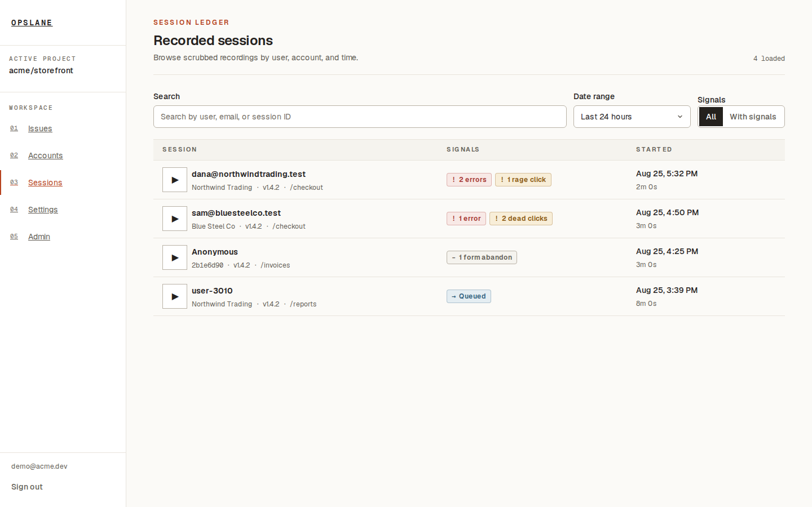
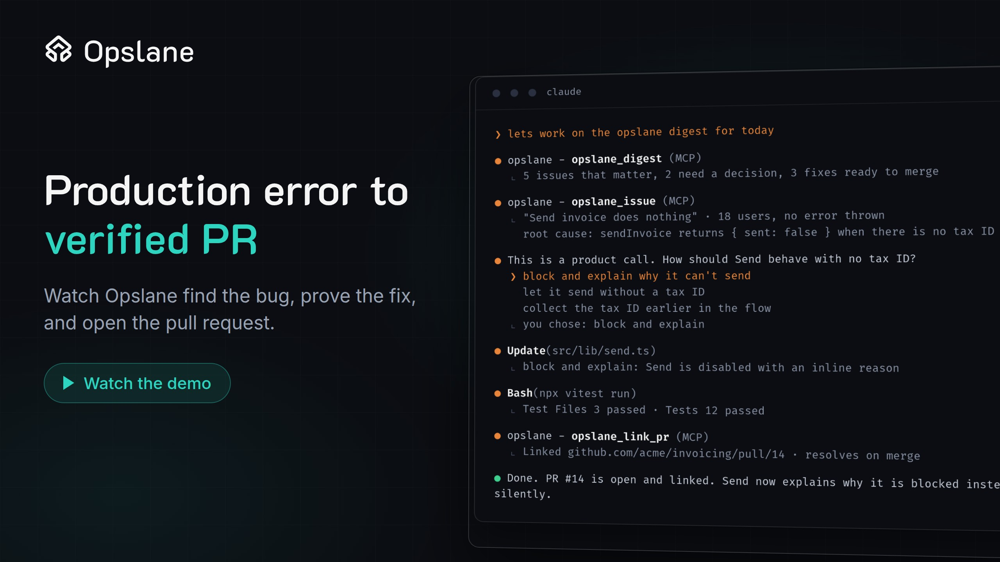
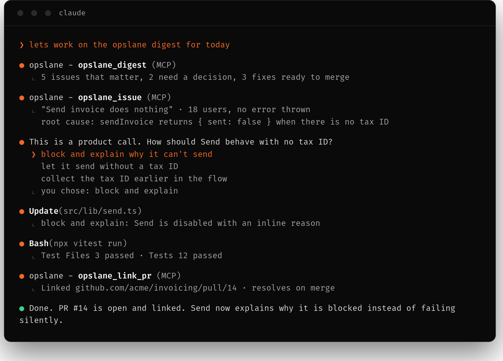
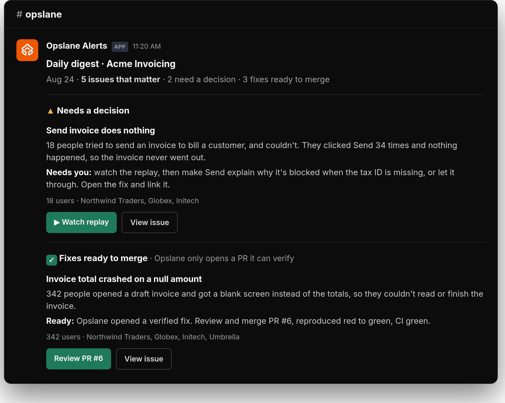
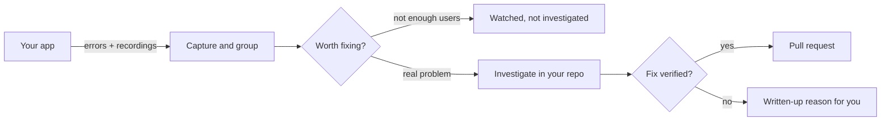

<p align="center">
  <picture>
    <source media="(prefers-color-scheme: dark)" srcset="docs/assets/readme/logo-dark.png">
    
  </picture>
</p>

<p align="center">
  <strong>Fix bugs that your users run into.</strong>
</p>

<p align="center">
  <a href="https://github.com/opslane/opslane/actions/workflows/ci.yml"></a>
  <a href="LICENSE"></a>
  <a href="https://discord.gg/uWcEKv2bXt"></a>
</p>

<p align="center">
  <a href="docs">Docs</a> ·
  <a href="docs/quickstart/self-host.md">Self-host quickstart</a> ·
  <a href="docs/install.md">Install the SDK</a> ·
  <a href="https://discord.gg/uWcEKv2bXt">Discord</a> ·
  <a href="https://github.com/opslane/opslane/issues">Issue tracker</a>
</p>

---

Opslane finds user-facing bugs and investigates them. It only opens a PR if it can verify the fix.

It records every session. That means it sees the errors, and it also sees the bugs that never throw an exception: the button that does nothing, the form people give up on, the dropdown that closes before anyone can pick from it. Each one is ranked by how many users hit it. The ones that matter get investigated. Some of those fixes become PRs. Some need your attention, so you can drive the resolution.



<p align="center"><sub>Session recordings catch what never hits the console: rage clicks, dead clicks, abandoned forms.</sub></p>

<a href="https://youtu.be/ccuOTYQMeYg"></a>

<p align="center"><sub><a href="https://youtu.be/ccuOTYQMeYg">▶ Watch the demo</a>: a production error becomes a verified pull request.</sub></p>

## See it work



<p align="center"><sub>Read the digest, make the product call, fix it, link the PR. All from the terminal.</sub></p>

## Principles

- **Agent-first.** I never want to open an error dashboard again. Opslane ships an MCP server, so your coding agent pulls the digest, reads the investigation, and fixes the bug from the terminal.
- **It learns your product.** From your code, and from watching people use it. Better context, better investigations.
- **One Docker Compose file.** Postgres and MinIO. That's the whole stack.



<p align="center"><sub>The daily Slack digest: what broke, what's ready to merge, what needs a decision. Images show demo data.</sub></p>

## How it works

Opslane has four parts:

| Component | What it does |
| --- | --- |
| Browser SDK | Captures errors and session recordings in the user's browser, with input masking on by default |
| Ingestion service | Receives what the SDK sends, groups errors, ranks them by how many users they hit |
| Worker | Investigates issues, writes and verifies a fix in a sandbox, and opens the pull request |
| Dashboard | Web app for browsing issues, watching replays, and changing project settings |

An error travels through those parts like this:

1. **Capture.** The SDK sends errors and session recordings to the ingestion service. Two lines to install.
2. **Group.** Opslane maps minified stack traces back to real file names using your source maps, and groups every occurrence of the same bug into one issue.
3. **Qualify.** Opslane checks how many users hit the bug and how recently, then reads your repo to decide whether it's a real product problem. Only bugs that pass both checks get investigated.
4. **Investigate.** The worker clones your repo and reads the code until it finds the cause.
5. **Verify.** The fix runs in a sandbox with your build and tests. Everything that passed before has to pass again, and a second model reviews the change.
6. **Deliver.** A verified fix becomes a pull request. Anything else comes with the reason and the call you need to make. A daily Slack digest covers what broke, what got fixed, and what needs you.


```mermaid
flowchart LR
    A[Your app] -->|errors + recordings| B[Capture and group]
    B --> Q{Worth fixing?}
    Q -->|not enough users| W[Watched, not investigated]
    Q -->|real problem| D[Investigate in your repo]
    D --> V{Fix verified?}
    V -->|yes| PR[Pull request]
    V -->|no| HR[Written-up reason for you]
```

Opslane calls three outside services: Anthropic to investigate, E2B to run the sandbox, and GitHub for clones and pull requests. Everything else runs on your own stack: Postgres for state and the job queue, and S3-compatible storage for session recordings (MinIO in the bundled setup). Today it supports JavaScript apps end to end.

## Run it locally

Prerequisites: Docker with Compose v2 and free host ports 8082, 5434, and 9012. No accounts or API keys needed for this first run.

```bash
git clone https://github.com/opslane/opslane.git
cd opslane
docker compose up -d --wait
curl http://localhost:8082/health
```

This starts Postgres, MinIO, the ingestion API (which serves the dashboard at <http://localhost:8082>), and the worker. Migrations run automatically.

Seed a test project and send it an error:

```bash
docker compose exec -T postgres psql -U opslane -d opslane < scripts/seed-e2e.sql
curl -X POST http://localhost:8082/api/v1/events \
  -H 'Content-Type: application/json' \
  -H 'X-API-Key: opslane_pk_mzxw6ytboi3damrrgi3tknzxgq_ABCDEFGHIJKLMNOPQRSTUVWXYZabcdefghijklmnopq' \
  -d '{"timestamp":"2026-01-01T00:00:00Z","error":{"type":"ReferenceError","message":"demo is not defined","stack":"ReferenceError: demo is not defined\n  at app.js:1:1"},"breadcrumbs":[],"context":{"url":"https://example.com","user_agent":"smoke test"},"sdk_version":"0.0.1"}'
```

The `opslane_pk_...` value is the test project's seeded public ingest key; real deployments create their own. Give the worker a few seconds, then check the result (re-run if the row hasn't appeared yet):

```bash
docker compose exec -T postgres psql -U opslane -d opslane \
  -c "SELECT status, reason_code, reason_message FROM error_groups ORDER BY created_at DESC LIMIT 1;"
```

```text
 status | reason_code | reason_message
--------+-------------+----------------
 new    |             |
```

Opslane captured the event, mapped the stack trace back to your source files, and grouped it into a new issue. It watches the issue but won't investigate a one-off that hasn't reached enough users yet. To see the full investigate-and-fix path, you need an issue real users are hitting, plus a few credentials:

- **Dashboard sign-in:** a GitHub App, or WorkOS for cloud deployments.
- **Investigation:** `ANTHROPIC_API_KEY`.
- **Sandbox verification:** `E2B_API_KEY`.
- **Pull requests:** GitHub credentials with access to the target repository.

Exact permissions and environment variables are in the [self-host quickstart](docs/quickstart/self-host.md). SDK setup is in the [install guide](docs/install.md); replay privacy defaults in [replay privacy and masking](docs/guides/replay-privacy.md).

## Documentation

- [Self-host quickstart](docs/quickstart/self-host.md): the local run and the full error-to-PR path, in detail
- [Install guide](docs/install.md): add the SDK to your app
- [Guides](docs/guides): React, Vue, vanilla JS, source maps, GitHub App, Slack notifications, replay privacy
- [How Opslane works](docs/how-it-works.md): the path from a browser error to a verified fix pull request
- [Trust and data flow](docs/architecture/trust.md): what each integration receives and what leaves your infrastructure
- [Reference](docs/reference): SDK options, HTTP routes, environment variables, reason codes, checked against source by [`scripts/check-docs-drift.mjs`](scripts/check-docs-drift.mjs) in CI

## Community

Join the [Opslane Discord](https://discord.gg/uWcEKv2bXt) to ask questions, share what you're seeing in production, or follow development.

## License

Opslane is [AGPL-3.0](LICENSE). The browser and Python SDKs and the shared types are MIT, so you can ship them in your own app.

## Contributing

Opslane is pre-1.0: the [`POST /api/v1/events` wire contract](docs/contracts/events.md) is stable and backward-compatible, but other interfaces may still change.

Bug reports and feature requests are welcome on the [issue tracker](https://github.com/opslane/opslane/issues). For development setup, codebase conventions, and the verification bar for changes, see [AGENTS.md](AGENTS.md).
