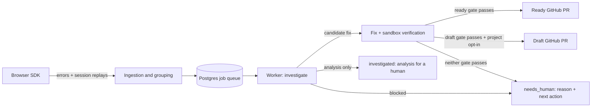

<!-- PLACEHOLDER: hero banner image (dark/light variants). Suggested: logo + tagline "Watches your users, fixes your app." -->

# Opslane

Every error tracker has the same output: an alert. Opslane's output is a pull request.

Opslane watches your app's browser errors, investigates them against your repository, verifies the fix in a sandbox, and opens the PR. When it can't fix something, it tells you why it stopped instead of paging you. Sentry tells you what broke; Opslane has already fixed it.

**Scope today:** browser JavaScript errors and GitHub repositories, end to end. The services run on your infrastructure; the fix pipeline calls three external services: Anthropic for investigation, E2B for sandboxed verification, and GitHub for clones and PRs. A Python SDK (alpha) captures and triages server-side errors, with its fix pipeline off by default.

## See it work

### Error to pull request

<!-- PLACEHOLDER: full product tour — video or GIF. One uninterrupted path: browser error → grouped incident → investigation evidence → pull request. -->

### A merged production fix

<!-- PLACEHOLDER: screenshot of a real merged Opslane PR (e.g. #1232) — title, root-cause explanation, evidence section, diff. Scrub anything private; link the PR here. -->

In two weeks on one production app (July to August 2026), Opslane captured 7,415 events, suppressed the 78% that were browser noise, and opened one pull request: a fix for a crash users had hit 614 times. A human reviewed and merged it.

## What each outcome means

Every investigation ends in one of four visible outcomes:

- **A ready-for-review PR.** Three things held: the fix built, the build and test commands Opslane detected (or the project configured) ran in a fresh sandbox, and no test that passed on the baseline fails with the fix applied. The PR records which commands ran and their results.
- **A draft PR.** The fix passed Opslane's reviewing model but lacks that executed proof. Drafts are clearly labeled and only open if the project opts in.
- **An `investigated` analysis.** Opslane found the likely cause but did not attempt a change; the analysis waits for a human to read and, if they choose, trigger the fix.
- **A `needs_human` incident.** Opslane stopped, with a reason code and a suggested next action. In our review of the 125 incidents it declined on that same production app, we agreed with the routing on 114.

The exact gates, their limits, and what they do not guarantee: [precision](docs/architecture/precision.md).

## How it works


```mermaid
flowchart LR
    A[Browser SDK] -->|errors + session replays| B[Ingestion and grouping]
    B --> C[(Postgres job queue)]
    C --> D[Worker: investigate]
    D -->|candidate fix| E[Fix + sandbox verification]
    D -->|analysis only| I[investigated: analysis for a human]
    D -->|blocked| H[needs_human: reason + next action]
    E -->|ready gate passes| F[Ready GitHub PR]
    E -->|draft gate passes + project opt-in| G[Draft GitHub PR]
    E -->|neither gate passes| H
```

| Component | What it does | Where |
| --- | --- | --- |
| Browser SDK | Captures errors and session replays, with input masking on by default | [`packages/sdk`](packages/sdk) |
| Ingestion API | Go service that receives events, groups errors, and serves the dashboard | [`packages/ingestion`](packages/ingestion) |
| Worker | Investigates error groups and proposes changes; for candidate fixes, runs the build and tests in an [E2B](https://e2b.dev) sandbox, records the results, and opens the PR | [`packages/worker`](packages/worker) |
| Dashboard | Vue app for incidents, replays, and project settings | [`packages/dashboard`](packages/dashboard) |
| CLI | Lists and inspects projects and incidents from the command line | [`cli`](cli) |
| Python SDK (alpha) | Captures server-side Python errors, with a Flask integration | [`packages/sdk-python`](packages/sdk-python) |

Postgres is both the system of record and the job queue. There is no Redis or external queue to run.

## Run it locally

The smoke test needs no accounts and no API keys. It proves events are ingested, grouped, and always driven to an explicit final status. It does not run the AI investigation or open a PR. Prerequisites: Docker with Compose.

```bash
git clone https://github.com/opslane/opslane-oss.git
cd opslane-oss
docker compose up -d --wait
curl http://localhost:8082/health
```

This starts Postgres, MinIO, the ingestion API (which serves the dashboard at <http://localhost:8082>), and the worker. Migrations run automatically.

Seed a test project and send it an error:

```bash
docker compose exec -T postgres psql -U opslane -d opslane < scripts/seed-e2e.sql
curl -X POST http://localhost:8082/api/v1/events \
  -H 'Content-Type: application/json' \
  -H 'X-API-Key: opslane_pk_mzxw6ytboi3damrrgi3tknzxgq_ABCDEFGHIJKLMNOPQRSTUVWXYZabcdefghijklmnopq' \
  -d '{"timestamp":"2026-01-01T00:00:00Z","error":{"type":"ReferenceError","message":"demo is not defined","stack":"ReferenceError: demo is not defined\n  at app.js:1:1"},"breadcrumbs":[],"context":{"url":"https://example.com","user_agent":"smoke test"},"sdk_version":"0.0.1"}'
```

The `opslane_pk_...` value is the test project's seeded public ingest key; real deployments mint their own. Give the worker a few seconds to claim the job, then check the result (re-run if the row hasn't appeared yet):

```bash
docker compose exec -T postgres psql -U opslane -d opslane \
  -c "SELECT status, reason_code, reason_message FROM error_groups ORDER BY created_at DESC LIMIT 1;"
```

```text
   status    |   reason_code   |                  reason_message
-------------+-----------------+---------------------------------------------------
 needs_human | missing_llm_key | ANTHROPIC_API_KEY environment variable is not set
```

The worker has no AI credentials, so it stopped and said why. With the required integrations configured, processing ends in one of the four outcomes above instead.

Additional paths need external-service configuration:

- **Dashboard sign-in:** a GitHub App, or WorkOS for cloud deployments.
- **Investigation:** `ANTHROPIC_API_KEY`.
- **Sandbox verification:** `E2B_API_KEY`.
- **Pull requests:** GitHub credentials with access to the target repository.

Exact permissions and environment variables are in the [self-host quickstart](docs/quickstart/self-host.md). SDK setup is in the [install guide](docs/install.md); replay privacy defaults in [replay privacy and masking](docs/guides/replay-privacy.md).

## What Opslane is not

- **Not an APM or metrics backend.** Opslane ingests application errors and the session context around them: breadcrumbs, network timing, and optional replays. It does not do latency percentiles, distributed tracing, or infrastructure monitoring.
- **Not autopilot.** Opslane opens pull requests but never merges them. Review and merge stay with the repository owner.
- **Not a dashboard to babysit.** Conclusions ship as PRs and incidents; the dashboard exists for replays and settings, not triage duty.
- **Pre-1.0.** The [`POST /api/v1/events` wire contract](docs/contracts/events.md) is append-only and backward-compatible. Other interfaces may still change before 1.0.

## What leaves your host

With no external integrations configured, no captured data (errors, replays, or repository source) leaves your deployment. Each integration you enable adds its own destination:

- **GitHub:** authentication, repository access, clones, pull requests.
- **Anthropic:** investigation context and selected source.
- **E2B:** repository contents and commands for sandbox verification.
- **WorkOS** (optional): cloud authentication.
- **Slack** (optional): notifications.
- **Langfuse** (optional): traces.

The full data-flow and trust model, including what each destination receives: [trust and security](docs/architecture/trust.md).

## Documentation

- [Self-host quickstart](docs/quickstart/self-host.md): the smoke test and the full error-to-PR path, in detail
- [Install guide](docs/install.md): add the SDK to your app
- [Guides](docs/guides): React, Vue, vanilla JS, source maps, GitHub App, Slack notifications, replay privacy
- [Architecture](docs/architecture/overview.md): components, trust boundaries, life of an error
- [Reference](docs/reference): SDK options, HTTP routes, environment variables, reason codes, checked against source by [`scripts/check-docs-drift.mjs`](scripts/check-docs-drift.mjs) in CI

## Repository layout

```text
packages/
  ingestion/    Go ingestion API, grouping, storage, dashboard server
  worker/       Investigation, verification, and PR pipeline
  agent-core/   Provider-neutral agent loop
  dashboard/    Vue dashboard
  sdk/          Browser SDK, framework integrations, Vite source-map plugin
  sdk-python/   Python SDK (alpha)
shared/         Shared TypeScript contracts
cli/            Opslane CLI
docs/           Documentation (published by docs-site/)
```

## Licensing

| Code | License |
| --- | --- |
| Server, worker, agent core ([`packages/agent-core`](packages/agent-core)), dashboard, CLI ([`cli`](cli/LICENSE)), docs site, and tests | [AGPL-3.0-only](LICENSE) |
| Browser SDK ([`packages/sdk`](packages/sdk/LICENSE)), Python SDK ([`packages/sdk-python`](packages/sdk-python/LICENSE)), and shared types ([`shared`](shared/LICENSE)) | MIT |

In short: the SDKs and shared contracts are MIT; the ingestion service, worker, agent core, dashboard, CLI, docs site, and tests are AGPL-3.0-only.

## Contributing

Bug reports and feature requests are welcome on the [issue tracker](https://github.com/opslane/opslane-oss/issues). For development setup, codebase conventions, and the verification bar for changes, see [AGENTS.md](AGENTS.md).
