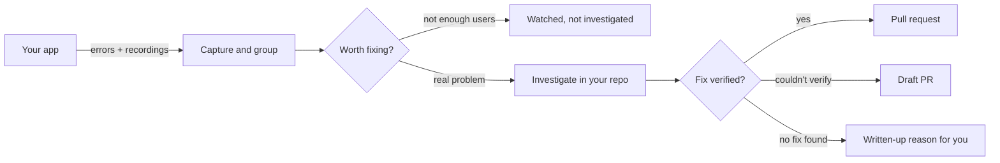

<!-- PLACEHOLDER: hero banner image (dark/light variants). Suggested: logo + tagline "Watches your users, fixes your app." -->

# Opslane

**Finds the bugs that impact real users. Opens a PR when it's sure.**

Your error tracker logs thousands of alerts, and you can't tell which ones actually hurt users. The worst ones don't even throw an exception: a dead button, a form nobody can submit. You only hear about those when a customer complains.

Opslane learns your product from your code and real user sessions, ranks issues by how many users hit them, and investigates the ones that matter. When it can verify a fix, it opens a pull request. When it can't, it hands you the investigation and the decision to make.

You review a pull request instead of triaging a dashboard, and the bug is gone before the next customer hits it.

[Docs](docs) · [Self-host quickstart](docs/quickstart/self-host.md) · [Install the SDK](docs/install.md) · [Issue tracker](https://github.com/opslane/opslane-oss/issues)

## See it work

### Error to pull request

<!-- PLACEHOLDER: full product tour — video or GIF. One uninterrupted path: error → grouped issue → investigation evidence → pull request. -->

### A merged production fix

<!-- PLACEHOLDER: screenshot of a real merged Opslane PR (e.g. #1232) — title, root-cause explanation, evidence section, diff. Scrub anything private; link the PR here. -->

Over two weeks spanning July and August 2026, one production app sent Opslane 7,415 events. Opslane opened one pull request: a fix for a crash users had hit 614 times. A human reviewed and merged it.

## What it does

- **Know which bugs hit users.** The same crash from 500 people is one issue ranked by impact, not 500 alerts to sort through. One Slack digest a day, and nothing when nothing needs you.
- **Catch bugs that never throw an error.** Dead buttons and abandoned forms show up in the session recordings, even when the console is clean.
- **The fix is a pull request.** Opslane investigates in your repo and opens a PR only after it checks its own work: your tests pass before and after, the build passes, and a second model reviews the diff. You review and merge; Opslane never merges its own PRs.
- **Work from your coding agent.** The bugs worth fixing, and the evidence behind each one, land in the coding agent you already use. No dashboard to open.
- **See what the user saw.** When session recording is on, each issue links to the recording behind it: the clicks, pages, and requests that led up to it.

## How it works

Opslane has four parts:

| Component | What it does |
| --- | --- |
| Browser SDK | Captures errors and session recordings in the user's browser, with input masking on by default |
| Ingestion service | Receives what the SDK sends, groups errors so one bug is one issue, ranks them by user impact, and serves the dashboard |
| Worker | Investigates issues, writes and verifies a fix in a sandbox, and opens the pull request |
| Dashboard | Web app for browsing issues, watching replays, and changing project settings |

An error travels through those parts like this:

1. **Capture.** The SDK sends errors and session recordings to the ingestion service (two lines to install). Everything is stored, but nothing is triaged yet, so one error firing once doesn't turn into an alert.
2. **Group.** Opslane uses your source maps to turn the minified stack trace back into real file names, then groups errors by where they happen in your code. The same bug is one issue, even after a redeploy, and if it comes back after a fix it's marked as returned. Noise from browser extensions and other sites is dropped.
3. **Qualify.** Before investigating, Opslane checks how many users hit the bug and how recently, then reads your repo to decide whether it's a real product problem. Only bugs that pass both checks get investigated.
4. **Investigate.** The worker clones your repo and reads the code until it finds the cause. If it can't point to the exact files, it stops instead of guessing.
5. **Verify.** The fix goes into a sandbox where your build and tests run. Everything that passed before has to pass again, and a second model reviews the change.
6. **Deliver.** A fix that passes becomes a pull request. One Opslane couldn't verify becomes a draft, if you allow drafts. When there's no fix, you get the reason and the call to make. A daily Slack digest covers what broke, what got fixed, and what needs you.


```mermaid
flowchart LR
    A[Your app] -->|errors + recordings| B[Capture and group]
    B --> Q{Worth fixing?}
    Q -->|not enough users| W[Watched, not investigated]
    Q -->|real problem| D[Investigate in your repo]
    D --> V{Fix verified?}
    V -->|yes| PR[Pull request]
    V -->|couldn't verify| DR[Draft PR]
    V -->|no fix found| HR[Written-up reason for you]
```

Opslane calls three outside services: Anthropic to investigate, E2B to run the sandbox, and GitHub for clones and pull requests. Everything else runs on your own stack: Postgres for state and the job queue, and S3-compatible storage for session recordings (MinIO in the bundled setup). There's no Redis or separate queue to run. JavaScript apps are supported end to end today.

## Run it locally

Prerequisites: Docker with Compose v2 and free host ports 8082, 5434, and 9012. No accounts or API keys needed for this first run.

```bash
git clone https://github.com/opslane/opslane-oss.git
cd opslane-oss
docker compose up -d --wait
curl http://localhost:8082/health
```

This starts Postgres, MinIO, the ingestion API (which serves the dashboard at <http://localhost:8082>), and the worker. Migrations run automatically.

Seed a test project and send it an error:

```bash
docker compose exec -T postgres psql -U opslane -d opslane < scripts/seed-e2e.sql
curl -X POST http://localhost:8082/api/v1/events \
  -H 'Content-Type: application/json' \
  -H 'X-API-Key: opslane_pk_mzxw6ytboi3damrrgi3tknzxgq_ABCDEFGHIJKLMNOPQRSTUVWXYZabcdefghijklmnopq' \
  -d '{"timestamp":"2026-01-01T00:00:00Z","error":{"type":"ReferenceError","message":"demo is not defined","stack":"ReferenceError: demo is not defined\n  at app.js:1:1"},"breadcrumbs":[],"context":{"url":"https://example.com","user_agent":"smoke test"},"sdk_version":"0.0.1"}'
```

The `opslane_pk_...` value is the test project's seeded public ingest key; real deployments mint their own. Give the worker a few seconds, then check the result (re-run if the row hasn't appeared yet):

```bash
docker compose exec -T postgres psql -U opslane -d opslane \
  -c "SELECT status, reason_code, reason_message FROM error_groups ORDER BY created_at DESC LIMIT 1;"
```

```text
   status    |   reason_code   |                  reason_message
-------------+-----------------+---------------------------------------------------
 needs_human | missing_llm_key | ANTHROPIC_API_KEY environment variable is not set
```

The worker stopped because it has no AI credentials, and it said so. To go further:

- **Dashboard sign-in:** a GitHub App, or WorkOS for cloud deployments.
- **Investigation:** `ANTHROPIC_API_KEY`.
- **Sandbox verification:** `E2B_API_KEY`.
- **Pull requests:** GitHub credentials with access to the target repository.

Exact permissions and environment variables are in the [self-host quickstart](docs/quickstart/self-host.md). SDK setup is in the [install guide](docs/install.md); replay privacy defaults in [replay privacy and masking](docs/guides/replay-privacy.md).

## Documentation

- [Self-host quickstart](docs/quickstart/self-host.md): the local run and the full error-to-PR path, in detail
- [Install guide](docs/install.md): add the SDK to your app
- [Guides](docs/guides): React, Vue, vanilla JS, source maps, GitHub App, Slack notifications, replay privacy
- [Architecture](docs/architecture/overview.md): components, trust boundaries, life of an error
- [Trust and data flow](docs/architecture/trust.md): what each integration receives and what leaves your infrastructure
- [Reference](docs/reference): SDK options, HTTP routes, environment variables, reason codes, checked against source by [`scripts/check-docs-drift.mjs`](scripts/check-docs-drift.mjs) in CI

## License

Opslane is [AGPL-3.0](LICENSE). The browser and Python SDKs and the shared types are MIT, so you can ship them in your own app.

## Contributing

Opslane is pre-1.0: the [`POST /api/v1/events` wire contract](docs/contracts/events.md) is stable and backward-compatible, but other interfaces may still change.

Bug reports and feature requests are welcome on the [issue tracker](https://github.com/opslane/opslane-oss/issues). For development setup, codebase conventions, and the verification bar for changes, see [AGENTS.md](AGENTS.md).
