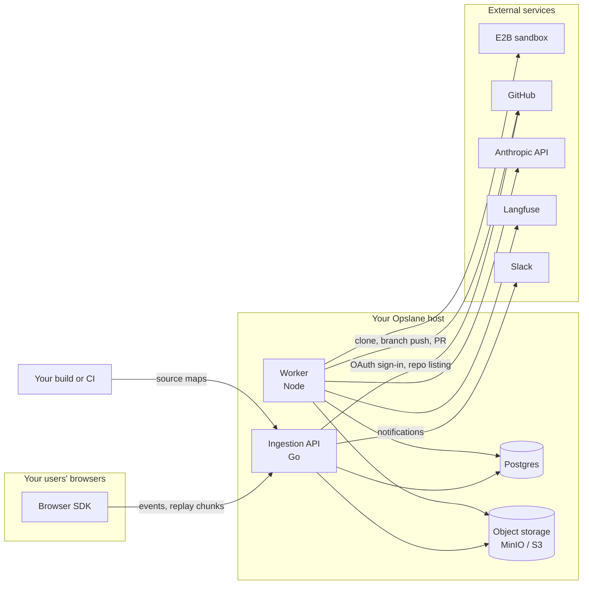

---
covers:
  - packages/ingestion/**
  - packages/worker/**
  - packages/sdk/**
  - packages/dashboard/**
description: The components, the trust boundaries, and why there is no queue to operate.
---

# Architecture overview

Opslane's runtime has a small set of components and three distinct trust boundaries.

## Components

| Component | Runtime | Role |
| --- | --- | --- |
| **Browser SDK** (`packages/sdk`) | Your users' browsers | Captures errors, breadcrumbs, network timings, and default-on session recordings; masks in the browser before upload, with a server-side scrub gate before reads. MIT licensed; it runs in *your* product. |
| **Ingestion API** (`packages/ingestion`) | Go service | Receives events, drops known noise, and buckets them provisionally while a worker resolves the stack. Serves the dashboard and the read/write API. Stable issues, ranking, investigation, digests, and notifications happen after identity settles. |
| **Worker** (`packages/worker`) | Node service | Claims jobs from Postgres, analyzes sessions, investigates and adjudicates with Claude, writes daily digests, classifies routes, writes candidate fixes, verifies them in an E2B sandbox, and opens GitHub PRs. |
| **Dashboard** (`packages/dashboard`) | Vue SPA, served by ingestion | Issues, replays, project and GitHub settings. |
| **Postgres** | Database | System of record, job queue, and verification ledger. Jobs use row locking and lease-based ownership. There is no Redis or external queue. |
| **Object storage** | MinIO (local) or any S3-compatible store | Replay payloads and screenshots. |

## Trust boundaries

1. **Browser to ingestion.** Project ingest keys authenticate uploads. These public keys ship inside the browser bundle. Browser calls are origin-gated and project rate limits apply. Scrubbing starts in the SDK and continues on the server ([masking](trust.md#browser-data-and-masking)).
2. **Host to external services.** The worker reaches Anthropic for model work, E2B for fix verification, GitHub for repository operations, and Langfuse when tracing is configured. Ingestion reaches GitHub during App setup, Slack for configured notifications, and the configured identity provider during sign-in. Egress rules must allow the services you enable. Without their credentials, errors can still be captured and assigned to issues, but model investigation and delivery do not run.
3. **Worker to sandbox.** Candidate fixes execute in an isolated E2B sandbox, not on your Opslane host. Repository code is cloned into the sandbox, and worker secrets are removed from the environment the agent can observe.

## Read next

- [Life of an error](life-of-an-error.md): the pipeline stage by stage
- [Precision](precision.md): what "verified" guarantees and what it does not
- [Trust](trust.md): permissions, data flow, token handling, retention
