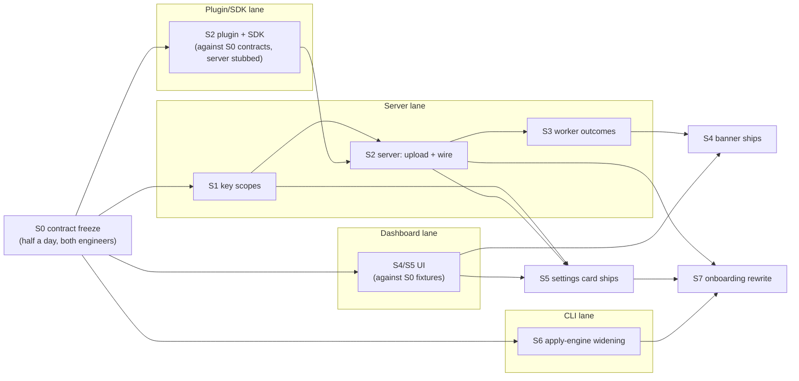

# Keys, source maps, and onboarding: engineering design

**Date:** 2026-07-29 · **Status:** S0 contracts frozen; implementation design remains under review · **Author:** Abhishek Ray (with Claude)
**Mockups:** [dashboard (banner + settings card)](https://claude.ai/code/artifact/07d6c51f-ed32-4c25-9e19-a18fb3aff435) · [onboarding terminal flow](https://claude.ai/code/artifact/8af74eda-f06c-4922-8794-684c15ab73f3)
**Frozen S0 appendix:** [exact routes, fields, schemas, limits, and fixtures](./2026-07-29-keys-sourcemaps-s0-contracts.md)
**Reviews folded in:** three internal review agents (frontend, backend, EM) and one Codex consult (30 findings). Where a review changed a decision, the section says so.

## Glossary

- **Source map**: a file a build tool writes that translates scrambled production code back to the original source. Without it, a production stack trace is unreadable.
- **Debug ID**: a fingerprint stamped into a JavaScript file and its source map at build time, so the server can match one to the other exactly.
- **pk / sk**: the two key types this design introduces. `opslane_pk_` is public and ships inside the customer's app. `opslane_sk_` is secret and lives only in CI.
- **Symbolication**: turning a scrambled stack trace back into file names and line numbers using source maps.

## 1. Problem

The fix agent investigates scrambled stack traces, and nothing tells anyone.

Evidence, from the code as it stands on `main`:

- The worker fetches source maps only when an event carries a `release` (`packages/worker/src/index.ts:365`). The SDK defaults `release` to `''` (`packages/sdk/src/config.ts:88`). Onboarding never sets it. So the fetch never runs.
- The Vite plugin that uploads maps exists and is published (`@opslane/sdk/vite-plugin`) but `opslane onboard` never wires it. Where it *is* wired by hand, it is worse than inert: on a real internal app it deletes all 248 generated maps from the build output (`vite-plugin/index.ts:52`) and then skips the upload for want of a release, so neither side keeps a copy (§5.2.1).
- Nothing records symbolication outcomes. `error_events.stack_trace_resolved` is read in three places and written by zero (`packages/worker/src/index.ts:399`).
- The key embedded in every customer's browser bundle also authenticates `POST /api/v1/sourcemaps` (`packages/ingestion/handler/routes.go:92`). Anyone who reads the key out of a bundle can upload maps, including poisoned maps that would mislead the fix agent. BugSnag had this exact bug and took from 2023 to late 2025 to ship a separate upload key.

The result: accurate fixes, the product's core promise, degrade silently for every CLI-onboarded app, and the one write a public key should never have is open.

## 2. Goals and non-goals

**Goals**

1. The public key can only send data. The secret key can only upload source maps. Nothing else accepts either.
2. Source maps match stack frames exactly, with no release strings for customers to keep in sync.
3. When symbolication fails, the product says so, says why, and says how to fix it, on the issue page.
4. Onboarding sets this up with the least customer work we can verify, and never claims anything on screen it has not observed.

**Non-goals**

- **Automatic environment creation.** Environment becomes an optional event label. A label matching a pre-created project environment routes there; an unknown or missing label falls back to the project's default environment and is retained only for diagnostics. Creating environment rows from public input is deferred because it is an unbounded-row spam vector (backend review M1).
- **Prompt-injection hardening of the fix agent.** Event text flows into the agent prompt today (`packages/worker/src/investigate.ts:280`), and `sourcesContent` in uploaded maps adds a second untrusted surface (Codex 7). Tracked as its own issue.
- **Bundlers other than Vite.** Next.js and webpack users are told plainly it is unsupported, not shown a Vite snippet. Vite is the first adapter, not the only one; the debug-ID core is bundler-neutral.
- **Per-build health table, live upload pulse, key Reveal.** Cut by internal review; reasons in §9.

## 3. User requirements

| # | Requirement | Verified by |
|---|---|---|
| R1 | A key extracted from a browser bundle cannot read any data or upload source maps | Route test: pk on `/sourcemaps` and on every read endpoint returns 401/403, including the `AuthenticateSessionOrSDK` paths (`routes.go:128`, `auth.go:214`) |
| R2 | A stack frame with a debug ID resolves to the right source line with no release configured | Live smoke: build fixture app, upload maps, send event, assert resolved frame |
| R3 | An unresolved issue shows a banner naming one of two causes (plugin not wired / upload missing) | Dashboard test per status enum value + live smoke of each |
| R4 | Concurrent identical uploads are reused, while mismatched or conflicting content cannot replace a map | API tests: claimed-ID mismatch → `409 debug_id_mismatch`; identical full digest → `200` reuse; same project/debug ID with a different full digest → `409 debug_id_conflict`. Proven with a real 12.13 MB map (§5.2.1) |
| R5 | After maps arrive late, the next occurrence of an error resolves and its issue page clears | Live smoke: send event (no maps) → banner shows → upload maps → send same error again → banner gone, frames resolved |
| R6 | Onboarding ends with a real error watched arriving and (if accepted) source maps proven by a local build | Existing self-test machinery + preflight step calling `POST /projects/{id}/sourcemaps/verify` and asserting a real file and line come back |
| R7 | The secret key never exists in plaintext on the customer's disk | Onboarding test: sk minted in memory, piped to platform CLI, passed to test build as child-process env only |
| R8 | A missing or rejected key never fails the customer's build. A *rejected* key is visible within one build cycle (server records the rejected attempt). A *missing* key is visible on the next error event or the stale warning | Plugin test (exit 0 + error log with deep link); server test for the rejected-attempt record; dashboard tests for both warnings |

## 4. System overview

```mermaid
sequenceDiagram
    participant CI as Customer CI (Vite build)
    participant P as Vite plugin
    participant S as Ingestion (Go)
    participant B as Browser app
    participant W as Worker
    P->>P: canonicalize + hash each map → debug ID<br/>stamp //# debugId, tag .map
    P->>S: manifest → map PUTs → completion (sk)
    S->>S: verify sk scope; store bytes by (project, full SHA-256)<br/>index maps by (project, debug ID)
    B->>S: POST /events (pk) — debug_meta maps file URLs to debug IDs
    S->>W: job
    W->>S: fetch maps by frame debug IDs
    W->>W: symbolicate, record per-event status<br/>(resolved | partial | no_debug_ids | map_not_found | invalid_map | resolution_failed)
    W->>W: agent prompt states resolution status
    S-->>B: dashboard: issue banner + settings card read the status
```

Two credentials, one content-addressed join (the debug ID), one status enum that powers every screen.

## 5. Component design

### 5.1 Keys: one table, two scopes

New table `project_api_keys(id, key_id, project_id, scope, token_prefix, secret_hash, label, created_at, revoked_at, last_used_at, last_rejected_at, last_rejected_reason)`, with `scope in ('ingest','sourcemaps')` and a DB constraint tying scope to the stored prefix. Keys have three parts:

```text
opslane_pk_<key_id>_<token>
opslane_sk_<key_id>_<secret>
```

`key_id` is a random 128-bit identifier encoded as 26 lowercase base32 characters. It identifies the individual credential, not the project, and is stored in plaintext. The token/secret is 256 random bits encoded as 43 base64url characters; only its SHA-256 hash is stored (reuse `hashKey`, `queries.go:356`). The sk is shown once. One table means create/verify/revoke logic exists once, and one negative test (pk at `/sourcemaps` → rejected) guards the scope boundary. The prefixes are self-describing and scannable by secret-detection tools.

On authentication, the server parses the scope and `key_id`, looks up that credential, and compares the supplied token/secret hash in constant time. A known `key_id` with a wrong secret or a revoked key records a collapsed `last_rejected_at` plus `invalid_secret | revoked`; the attempted value is never stored or logged. An unknown `key_id` returns a generic 401 and is not attributed to any project. This makes the rejected-upload warning truthful without embedding a public or guessable project ID.

Review decisions folded in:

- **Creation and revocation are independent.** Creating a new sk never changes an existing key. Normal rotation is: create the replacement, update every build system, confirm the old key's `last_used_at` has stopped moving, then explicitly revoke the old key by `key_id`. Revocation is immediate and irreversible; the row remains for audit. A suspected compromise skips the overlap and revokes immediately.
- **There is no arbitrary active-key limit.** A project can have as many active credentials as its build topology requires. Abuse is controlled with creation and request rate limits, not a product-level key-count cap that can block a legitimate rotation.
- **Revocation is always explicit.** No key is revoked because another key was created, because it is old or inactive, or by a background cleanup job. Only an authenticated revocation request naming the exact `key_id`—or explicit deletion of its parent project—can invalidate it. Contract tests create two active keys, prove both still authenticate, revoke one, and prove the other is unaffected.
- **Project-scoped, not environment-scoped** (rejecting Codex 3's env-bound counterproposal): per-env keys fight build-scoped maps, and Sentry ships this model at scale. Mitigations instead: env labels validated against pre-created rows (`env_resolver.go`), per-key rate limits, `projects.default_environment_id` as a real FK (Codex 5).
- **Auth matrix** (Codex 1): **pk** → `/events`, `/replays/*`, `/sessions/*`. **sk** → batch upload routes only, write-only (§5.6). **session** → every read, every settings write, and `POST /projects/{id}/sourcemaps/verify`. **poll token** → the existing agent poll route, whose response carries onboarding self-test state. **none** → agent setup, auth/OAuth protocol routes, webhook (HMAC-authenticated), and health. Only three routes change: `/event-count`, `/incidents`, `/incidents/{id}` accept `AuthenticateSessionOrSDK` today (`routes.go:128,134,135`) and move to session-only; `AuthenticateSessionOrSDK` is then deleted.
- Touch points: four mint sites (`queries.go:314`, `:3249`, `handler/onboarding.go:77`, `db/agent_provision.go:257`), `Settings.vue`, and `/sourcemaps` leaves the CORS SDK list (`routes.go:258`).
- **Future multi-project CI token:** v1 `opslane_sk_` remains bound to one project and therefore needs no separate project variable. If monorepos later need one credential across projects, add a distinct organization-scoped `opslane_ci_<key_id>_<secret>` credential. That token must send `project_id` in the upload manifest; the server authenticates the organization token, verifies `sourcemaps:write`, and checks access to the named project. Adding optional `project_id` to the manifest is backward-compatible: it is omitted for project-scoped sk keys and required for organization-scoped CI keys. Existing sk permissions never broaden.

### 5.2 Debug IDs and upload

- **ID** (spike-validated, §5.2.1): `debug_id = format_uuid( sha256( RFC8785(map minus root "debugId") )[0:128] )`. The hash covers **the map only**, not the JS. RFC 8785 defines the exact cross-language canonical JSON bytes; the 16 hash bytes are formatted directly as lowercase `8-4-4-4-12` groups without rewriting UUID version or variant bits. PostgreSQL stores those raw bits in `uuid` columns and the S2 migration test round-trips a non-RFC-variant golden value. An earlier draft hashed JS plus map; the spike killed it because the upload carries only the `.map` (`sourcemap.go:43`) and stamping the ID changes the JS, making a JS-inclusive hash circular.
- **Stamping**: `//# debugId=<id>` comment (Sentry's proposed spec convention), `debugId` in the map, plus a snippet registering the ID in a `globalThis` registry keyed by `new Error().stack`.
- **Runtime join**: at capture time the SDK extracts each registry entry's file URL from its stack string, builds a file-URL → debug-ID map, and attaches the ID to each outgoing frame. Survives cache-busted filenames because the registry is built in the page load that throws.
- **Wire**: `debug_meta.images` is a new optional side-list on `POST /api/v1/events`, with one `type + code_file + debug_id` entry per stack file; optional `commit_sha` carries build provenance. Neither replaces the raw stack. Append-only fixtures are frozen as `v2.1.0-minimal.json` and `v2.1.0-full.json`; `docs/contracts/events.md` changes in the same PR. The server reads `release` forever as display metadata only. Exact validation is in the [S0 appendix](./2026-07-29-keys-sourcemaps-s0-contracts.md#5-event-debug_meta-wire-contract).
- **Batched upload**: manifest → files → completion receipt, one batch per build. `POST /sourcemaps/batches` declares every debug ID and byte size; the server rejects the manifest before accepting bytes if it exceeds **100 MiB per map, 500 maps, or 1 GiB total**. Accepted manifests receive a batch ID; each file is then `PUT` separately and retryable alone; `POST …/complete` verifies everything promised arrived and returns the receipt. Batch creation, file requests, concurrency, and bytes have separate abuse limits, so a legitimate 500-file build fits while one-byte request floods do not. Incomplete batches expire after 1 hour and their orphan files are deleted. The per-map limit matches PostHog's public CLI; the total sits below Sentry's 4 GiB assembled-artifact ceiling while leaving over 30× headroom above the 29.6 MiB real-app spike.
- **Upload before deletion; never emit maps**: the plugin removes generated maps from the emitted bundle so they can never reach the customer's CDN, then uploads them during the same build. Large temporary spill files are AES-256-GCM encrypted with a per-build key held only in memory and live outside the repository and Vite `outDir`. A completion receipt deletes them; final failure also best-effort deletes them, and a crash can leave only unreadable ciphertext. The next build regenerates maps rather than trusting a cross-process recovery cache. This preserves the explicit upload-before-delete decision without making a green deploy publish private source. The current plugin removes maps in `generateBundle` but defers upload to `closeBundle`; the real-app spike proved that this can finish with all maps destroyed and none stored.

  The spike (§5.2.1) turned this from a judgement call into arithmetic. A real internal app emits **248 chunks, 29.6 MB of maps per build, largest single map 12.13 MB**. Against today's one-request-per-map path and its 20/min limiter (`ingest_limits.go:16`), that build needs over twelve minutes and loses most of its maps silently, because the plugin warns and continues (`vite-plugin/index.ts:91`).
- **Storage and concurrent builds**: incomplete bytes use `sourcemaps/v1/projects/{project}/batches/{batch}/{debug_id}.map`. Completion takes one lease on the batch, then copies verified canonical bytes to `sourcemaps/v1/projects/{project}/maps/{content_sha256}.map`. Two builds may copy the same unchanged vendor map concurrently; equal full digests mean byte-identical writes, so both batches reuse one project artifact and return success. One final Postgres transaction links every manifest row and marks the whole batch complete. The worker resolves only through those completed-batch links (`worker/src/index.ts:380`); an object copied before a crash remains invisible.
- **Immutable**: `(project_id, debug_id)` is the database identity, while the permanent object key includes the server-computed full SHA-256. A claimed 128-bit ID that does not match the uploaded canonical map returns `debug_id_mismatch`; the same project/debug ID plus the same full digest is successful reuse; the same project/debug ID plus a different full digest returns `debug_id_conflict` without overwriting the winner. There is no per-map promotion state, lease, generation, or client-visible promotion race.
- **Provenance**: the batch and event carry the detected commit SHA. The worker checks out that revision only when they match, the completed batch contains every debug ID used by the event, and the commit exists in the configured repository (Codex 10).
- **Probes**: onboarding's local test build is flagged `probe` and excluded from settings health (Codex 19).

#### 5.2.1 Spike results (2026-07-29)

Run against a real internal Vue 3 app (`asset-management-jira/vue3/client`, Vite 7, 248 chunks), plus a minimal Vite 6 fixture. Scripts are in the session scratchpad.

| Claim under test | Result |
|---|---|
| Vite builds are byte-reproducible | **248/248 maps byte-identical** across two clean builds |
| Deterministic IDs are stable build to build | **248/248 identical**, **0 collisions** |
| Hashing cost is negligible | **168 ms** for all 248 maps |
| `sourcesContent` is reliably present | **248/248**, covering 4,602 original sources |
| Stamping `debugId` doesn't shift the ID | Stable on the 12.13 MB entry map |
| A poisoned map is rejected | Recomputes to a different ID → 409 |
| Frames resolve to real source | 5 positions round-tripped in the largest chunk, all correct |
| JS-inclusive hashing is verifiable | **No** — upload carries only the `.map`, and stamping mutates the JS |

Two findings the spike produced that no amount of review had:

- **The failure is live in a real app right now.** Every build of that project prints `No release set — source maps were NOT uploaded`, and the current plugin *deletes all 248 maps from the build output* before skipping the upload (`vite-plugin/index.ts:52`). Neither we nor the customer ends up with a copy.
- **Map `sources` carry absolute local paths** (`../../../../Users/<name>/Projects/...`), leaking the build machine's home directory into files we store and render. Docs should recommend `sourcemapPathTransform`; the dashboard should render these paths trimmed.

### 5.3 Release and environment: labels, auto-detected

Release is optional display metadata and never participates in map or repository matching. Commit provenance is a separate optional `commit_sha`: the plugin detects it with a zero-input CI env-var ladder (`GITHUB_SHA`, `VERCEL_GIT_COMMIT_SHA`, `CF_PAGES_COMMIT_SHA`, …; Sentry's MIT-licensed ladder is the reference), then parses `.git` off disk (PostHog's approach, no git binary needed). The plugin injects it into the runtime registry and the SDK attaches it lazily at capture time, sidestepping the injection-timing trap Codex 17 caught. `VITE_OPSLANE_RELEASE` never needs to exist.

Environment is an optional label, validated against pre-created rows; unknown labels fall back to the project default and the submitted label is stored on the event (Codex 6).

### 5.4 Plugin DX

The snippet is `opslane()` with zero arguments. The plugin finds its own config: `OPSLANE_SK` from `process.env` first, then `loadEnv(mode, cfg.envDir, '')` (`process.env` is empty for dotenv values during `vite build`; `envDir` broke two real monorepos in the onboarding evals; process-env-first stops a stale `.env.local` shadowing a rotated CI secret). Endpoint from `OPSLANE_ENDPOINT`, cloud default.

Failure behavior, decided: **never fail the build.** A missing or rejected key prints an error-level log line with a deep link to the detected platform's secrets page, and exits 0. The product flags the breakage instead: a rejected key is a request the server sees, recorded and shown on the settings card within one build cycle; a missing key produces no request, so detection waits for the next error event carrying missing debug metadata/maps. There is no arbitrary age-based stale timer. Codex argued for failing on auth errors (15); rejected: we will not block a customer's deploy. Revisit trigger: the first real missed-warn incident.

Two exceptions to quiet: the leak guard (all textual outputs scanned for the sk value; a hit fails the build, since shipping the secret is worse than blocking a deploy) and nothing else. Plugin state resets per build.

### 5.5 Worker: symbolication and status

Symbolication centralizes into one module (the resolve block is duplicated at `index.ts:361` and `:744`; Codex 27). Per-frame debug-ID lookup replaces the release query and basename guessing; the 5-frame cap goes.

Status is per event: `resolved | partial | no_debug_ids | map_not_found | invalid_map | resolution_failed`, plus a nullable problem reason so a partially resolved stack still says what failed (`no_debug_ids | map_not_found | invalid_map | resolution_failed`). Issue-level status derives from the sample event. Writes respect the leased-update contract. The fix-agent prompt receives both fields so it stops treating scrambled symbols like real identifiers.

**Late-arriving maps are not re-resolved, deliberately.** Codex 13 asked for a re-resolution queue; we checked what it would buy. The group upsert sets `sample_event_id` to the newest event on every occurrence (`queries.go:585`), so an issue page always shows the latest event. Once maps arrive, the next occurrence of a live error resolves and the banner clears on its own, in minutes, with no queue, no caps, and no thundering herd from a routine upload. Errors that stopped recurring stay scrambled, which is exactly Sentry's behavior: their reprocessing is C/C++/Swift only, Early-Adopter gated, and double-bills quota, and their JavaScript guidance is simply to upload maps before events arrive. `invalid_map` is likewise terminal for that build, since a corrected map is a new debug ID old frames don't reference.

### 5.6 Source map custody

A source map is not metadata about source code. It is the source code, and with `sourcesContent` embedded it is a complete, readable copy. Opslane is asking every customer to hand us their private codebase, so custody rules are frozen here rather than left to implementation. Our own code is open source and carries no such risk; nothing in this section is about protecting us.

The scale of the downside is not hypothetical. Anthropic shipped Claude Code v2.1.88 to npm on 2026-03-30 with `.map` files included: ~2,000 TypeScript files and 512,000 lines exposed, a mirror at 84k GitHub stars within hours, pulled the same day. A packaging error, not a breach, which is the point. The failure mode needs no attacker.

**Isolation between customers is the first rule.** Canonical storage is keyed `sourcemaps/v1/projects/{project}/maps/{content_sha256}.map`; Postgres uniqueness is `(project_id, debug_id)`. Both include the project boundary. Two unrelated customers bundling the same dependency may produce the same digest, but they still receive separate objects beneath separate project prefixes. **Never deduplicate map storage across projects**, however tempting the content hash makes it. Existing project scoping (`checkProjectAccess`, `read_api.go:189`) covers the read paths.

**Nothing can download a map.** One narrow read exists and it returns no map content: `POST /projects/{id}/sourcemaps/verify` takes a completed batch, debug ID, generated line, and generated column and returns the resolved source path, line, column, and function name. Session-authenticated, project-bound, rate-limited, and audit-logged, it powers onboarding's preflight and a later "test my setup" button. Repeated calls could enumerate positions, so the protection is explicit authorization and no source text—not a claim that walking is impossible.

The sk is write-only: it opens a batch and PUTs files, and no endpoint lets it GET one. That key lives in a CI environment variable at every customer, the most-leaked credential class there is; leaked, it costs garbage uploads (bounded by the 409 rule) rather than the customer's source. No download endpoint exists for sessions or the dashboard either. The only reader is the worker, fetching bytes directly from storage inside our network. The dashboard renders resolved frames, never map files. Bucket private, no public or presigned GET URLs, TLS in transit, encryption at rest.

**Source must not leak sideways out of the system.** Map content and resolved source never enter logs, error responses, or metrics: a 500 that echoes its payload, or a debug line dumping map content, puts customer source into log aggregation where none of the rules above apply. Resolved source rendered in the dashboard is escaped like any untrusted text (existing dashboard convention). Source exists in two deliberate storage locations: full maps in object storage and `source_snippet` excerpts in `error_events.stack_trace_resolved`, capped at five lines and 8192 UTF-8 bytes per resolved frame. Project deletion removes the map prefix and deletes those cached excerpts with their error events; backups of both locations inherit the documented retention policy.

**Two data flows customers must be told about, not left to discover.** Resolved source reaches the fix agent's prompt, which means it reaches a model provider's API; that is the product working as intended, and it belongs in docs and onboarding. And the cross-tenant operator surface (`/admin/*`, `RequireAdmin`) exists for running the service: it must stay limited to job and volume metadata, never map content, and any staff path that could reach customer source needs to be explicit and logged.

Maps never reach the customer's own CDN: the plugin sets Vite `sourcemap: 'hidden'` (`//# sourceMappingURL` omitted), removes map assets before Rollup writes the deploy output, and keeps any temporary spill data encrypted with a per-build in-memory key. A receipt or final failure deletes the ciphertext best-effort; a crash cannot leave readable source. Retention in Opslane storage has no automatic expiry in v1; a policy is a named follow-up (Sentry expires unused maps after 90 days). Separately and minor, since our packages are public: a publish check that no `.map` ships with `@opslane/sdk` is cheap hygiene (`vite.config.ts:26` and the `files` whitelist already prevent it).

### 5.7 Dashboard

Two surfaces ([mockup](https://claude.ai/code/artifact/07d6c51f-ed32-4c25-9e19-a18fb3aff435)):

1. **Issue banner**: two states — no debug IDs on app frames ("your build isn't set up for source maps yet") vs IDs present but maps missing ("upload failing in CI — check OPSLANE_SK"). Copy counts app frames rather than asserting "plugin not wired"; third-party and stackless frames legitimately lack IDs (Codex 28).
2. **Settings card**: list sk credentials by label, key ID, creation time, status, and last use; create a new sk (shown once) or explicitly revoke one without affecting the others; show the zero-arg snippet and one observed status: no uploads / healthy / action required. There is no arbitrary age-based stale timer. Probe batches are excluded.

### 5.8 Onboarding

Full flow in the [terminal mockup](https://claude.ai/code/artifact/8af74eda-f06c-4922-8794-684c15ab73f3). The shipped machinery stays: model plans edits, host applies with snapshots and a hard writable-file set, one consent screen, nonce self-test watched arriving. Three new phases follow it:

- **Prove source maps (step 9).** Detect where production builds run, not where code is hosted; ask one question if ambiguous. Set keys via the platform's signed-in CLI (`vercel env add`, `gh secret set`, …) or deep-link to the exact settings page. GitHub Actions instructions include the workflow `env:` mapping (Codex 22); the no-CLI fallback shows the key once for manual paste (scrollback exposure accepted and named). The model edits `vite.config.ts` (third writable file, same model-writes-host-verifies pattern), then one local production build proves the pipe: maps upload (probe-flagged) and the server traces a scrambled frame back to a real file and line. Labeled "local preflight" (Codex 20). This phase gets its own consent naming every command and write (Codex 21).
- **Open the PR locally (step 10).** The CLI verifies each changed file equals its committed version plus exactly the recorded edits (pre-edit hashes), then with one y/n: commit via a temporary index with explicit pathspecs (never the staging area, never `.env.local`; Codex 23), branch `opslane/setup`, push with the user's own credentials, open the compare URL. The user is the PR's author. Files with the user's own edits mixed in: named, fall back to "commit yourself." This amends the never-touch-git decision doc as it pre-authorized.
- **Install the App (step 11).** Decoupled, sold on one thing: fix PRs. Declining degrades gracefully.

The legacy dashboard setup path (`SetupWizard.vue:100`, `setup-pr.ts:122`) still teaches the old one-key + release model; S7 removes or rewrites it (Codex 24).

## 6. Milestones and dependency graph

| Slice | Deliverable | Exit criterion |
|---|---|---|
| S0 | **Complete:** [frozen contract appendix](./2026-07-29-keys-sourcemaps-s0-contracts.md) covering auth, key lifecycle, event wire, batch protocol, hash vectors, storage/schema, status, verification, provenance, and acceptance fixtures | Both engineers can name every endpoint and field without inventing behavior |
| S1 | Key scopes live: migration, 4 mint sites, scope middleware, independent create/list/revoke lifecycle, `/sourcemaps` rejects pk, CORS drop, read paths session-only | R1 green, incl. `AuthenticateSessionOrSDK` routes |
| S2 | Debug IDs end-to-end: plugin hash/stamp/lazy-release, batched immutable upload, SDK frame attachment, wire fixture + contract doc | R2 + R4 green; live smoke; Firefox/Safari/lazy-chunk parsing covered |
| S3 | Worker: centralized symbolication, per-event status and bounded source excerpt cache, commit checkout, project-deletion coverage for cached excerpts | R5 green; all enum values visible in DB; deleting a project removes map bytes and cached source excerpts |
| S4 | Issue banner + agent-prompt status line | R3 green; live smoke of both states |
| S5 | Settings card | Card states verified against real upload/stale data |
| S6 | Apply-engine widening: third writable file, ship-phase consent, temp-index commit path | Sabotage tests: third-file rollback, dirty-file fallback, `.env.local` never committable |
| S7 | Onboarding rewrite per §5.8; legacy setup path removed | Full live run on a fixture monorepo; every screen claim maps to an observed fact |



How to read it: after S0, **four lanes run in parallel**. The server lane (S1 → S2's server half → S3) is the critical path. The plugin/SDK half of S2, the dashboard UI for S4/S5, and the CLI's S6 all start immediately after S0 against the frozen contracts, using fixtures or stubs; each *ships* only when its server dependency lands. S7 is last by design and needs S2, S5, and S6.

Minimum funded set: **S0-S4** (S2 without S1 would ship fingerprints while the public key can still upload maps; Codex 26). One caveat: R8's visible warning for a missing key on a quiet app lives on the S5 card; until S5 ships that case is log-visible only. Accepted, since S5 is one card and follows immediately.

## 7. Testing and validation

- **CI:** route-scope matrix (every route × every credential), key constraints, plugin units (hash determinism, env precedence, leak scan, state reset), worker status enums, wire-fixture compatibility, dashboard states.
- **Live:** the AGENTS.md pipeline smoke extended: build `test-fixtures/vue-app` with the plugin, batch-upload, send an event, confirm resolved frames and status in the real DB, view banner and card. Browser-matrix parsing runs against captured real-browser stacks.
- **Onboarding:** the eval corpus (excalidraw, hoppscotch) plus sabotage tests for every new guarantee: break the guard, watch the test fail, revert.

## 8. Risks and mitigations

| Risk | Mitigation |
|---|---|
| Prompt injection via event text or `sourcesContent` | **Not solved here.** Separate issue; blast radius bounded by internal-only usage |
| Warn-only CI hides a broken key | Accepted (user decision), bounded by R8's two warning paths. Revisit on first missed-warn incident |
| Local preflight green ≠ production green | Labeled "local preflight"; probes excluded from health; the settings card is production truth |
| Issue grouping fragments across builds (grouping runs pre-symbolication) | Known, unaddressed in v1 (Codex 30). Candidate follow-up: post-symbolication merge |
| A leaked sk uploads garbage maps | Immutability (409 on conflict), immediate per-key revocation, and per-key rate limits. It cannot read: the sk is write-only (§5.6) |
| Customer source leaks across tenants or sideways into logs | Storage and uniqueness keyed by project, never by content hash alone; no download endpoint exists; source barred from logs, errors, and metrics (§5.6) |
| `vite.config.ts` edit breaks exotic configs | Model edit + host verification + the test build as the final gate: no uploads → roll back. Host-generated edit for common shapes later (Codex 29) |

## 9. Alternatives considered

- **Environment-bound ingest keys** (Codex): cleaner label integrity, but reintroduces per-env key management and fights build-scoped maps; Sentry accepts the spoofable label at scale.
- **Release-string matching** (status quo): the manual sync is exactly what left the current path dead, and it fails silently.
- **Random per-build chunk IDs** (PostHog): retried uploads duplicate rows; deterministic hashing gives idempotence, which R4 needs anyway.
- **Two key tables**: duplicated CRUD for zero security gain.
- **Server-side setup PR** (replay the plan on a clean clone): designed, then dropped for the local commit path, which needs no upload endpoint, no replay engine, and makes the user the PR author. The replay design is recorded in the parked onboarding plan.
- **App-install-first finale** (Porter-style): rejected as coupling; the App is sold purely on fix PRs and every setup step works without it.
- **Failing CI on auth errors** (Codex): declined by decision; see §5.4.

## 10. The honest caveat

This design takes custody of every customer's private source code (§5.6), and that raises the stakes on the part it does not solve. The two places it deliberately stops short are connected: a public key means anyone can send events with any labels, and an agent that reads those events is injectable, now with source code in its context. The first is the industry's accepted trade; the second is not solved anywhere and is the most dangerous open item in the product. Shipping S1-S4 makes fixes better and failures visible; it does not make the agent safe against a hostile event author. That work has to happen before non-internal customers, and no part of this document substitutes for it.
