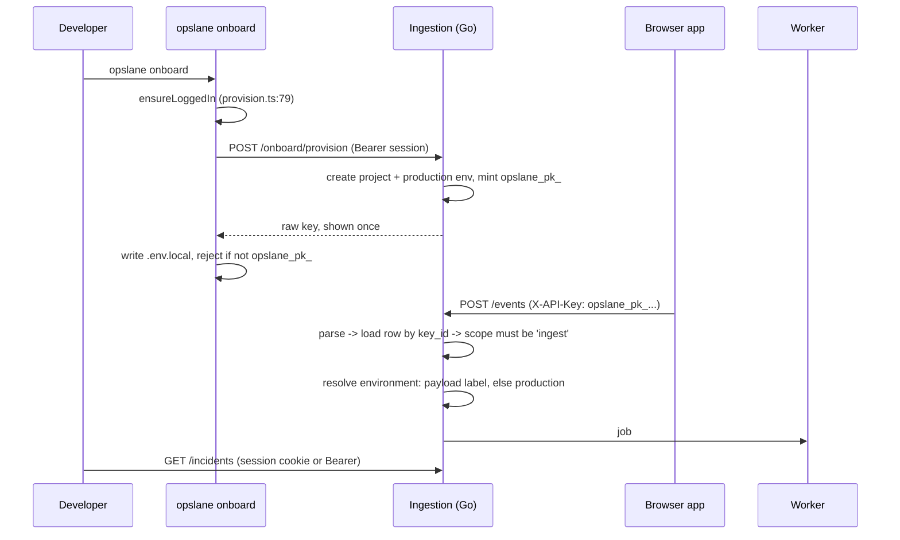

# S1: separate public ingest and secret source-map keys

**Date:** 2026-07-30 · **Status:** ready to implement · **Issue:** [#217](https://github.com/opslane/opslane-oss/issues/217)
**Contracts:** [S0 frozen appendix](./2026-07-29-keys-sourcemaps-s0-contracts.md) · [parent design](./2026-07-29-keys-sourcemaps-onboarding.md)
**Implementation plan:** [docs/plans/2026-07-30-s1-project-keys-implementation.md](../plans/2026-07-30-s1-project-keys-implementation.md)

## 1. Problem

The key that ships inside a customer's browser bundle can read their incident list and
upload source maps.

Three lines of `handler/routes.go` on `main`:

```go
routes.go:92   r.With(deps.AuthenticateSDK, ...).Post("/sourcemaps", deps.UploadSourceMap)
routes.go:128  r.With(deps.AuthenticateSessionOrSDK).Get("/projects/{projectID}/event-count", ...)
routes.go:134  r.With(deps.AuthenticateSessionOrSDK).Get("/projects/{projectID}/incidents", ...)
```

`AuthenticateSessionOrSDK` (`handler/auth.go:217`) is eleven lines that accept either
credential and prefer the key when both are present. It exists because the CLI needed to
read incidents and only had the ingest key.

The key is public by construction. It sits in the JavaScript bundle so the browser can send
events. Anyone who opens devtools can read it, then read that project's incidents, or
upload a source map that makes the fix agent investigate the wrong line. The published Vite
plugin already sends it to that upload route (`packages/sdk/vite-plugin/index.ts:81`).

A fourth line widens it: `routes.go:258` puts `/api/v1/sourcemaps` in the permissive-CORS
list, so a web page can drive the upload cross-origin.

There is nowhere in the system to say "this credential may only send events." The
permission is implied by which middleware someone attached to a route. Add a route, forget
the middleware, and nothing catches it.

## 2. Goals and non-goals

**Goals**

1. A key extracted from a browser bundle can send telemetry and nothing else.
2. Permission is stored in the database and checked in one place, not implied by routing.
3. `opslane onboard` keeps working end to end, with no new steps for the developer.

**Non-goals**, each with the reason:

- **Source-map upload.** S2 owns it. The `sourcemaps` scope exists as a value so S2 has
  somewhere to land, but nothing mints one and no route accepts one. Upload is already
  inert for honest clients on `main`: the worker fetches maps only when an event carries a
  `release` (`packages/worker/src/index.ts:365`) and the SDK defaults `release` to `''`
  (`packages/sdk/src/config.ts:88`). That is not a defence, since an attacker writes the
  payload and can set `release` themselves. The deferral rests on the route being removed,
  not on it being unused.
- **Key management surface.** No `opslane keys` commands, no create or list endpoints, no
  dashboard work. Onboarding is the only thing that mints a key. Revoke with `psql`.
- **Compatibility migration.** There is a migration; it creates the new table and drops
  the old one. What there is not is a path for existing keys. One app uses this today
  (stated by the author, not measured), and its SDK is being removed from that app until a
  new version publishes, so the database is recreated instead of carried forward. No
  backfill, no rollback. This is destructive and irreversible: existing key rows are lost
  on purpose. Anyone self-hosting from this open-source repo is outside that assumption and
  has to re-onboard.
- **Environment schema changes.** No `default_environment_id`, no composite foreign key. A
  column that would ship write-once and read-only, permanently equal to the project's
  `production` row, is not worth a migration.
- **Abuse by a valid public key.** A public key is public, so whoever holds it can flood
  events, forge errors, and poison the incident feed the fix agent reads. Existing controls
  are `rateLimitByProject` (`handler/ingest_limits.go:33`) and the origin allowlist. This
  slice changes neither. Quotas and per-key limits are a separate problem.

## 3. Requirements

| # | Requirement | Verified by |
|---|---|---|
| R1 | A public key cannot read customer data | `GET /projects/{id}/incidents` with `X-API-Key` returns 401. Route matrix covers all three former `AuthenticateSessionOrSDK` routes: `/event-count`, `/incidents`, `/incidents/{incidentID}` |
| R2 | A public key cannot upload source maps | `POST /api/v1/sourcemaps` returns 404. No other upload route is registered |
| R3 | A public key cannot become a secret key by editing its prefix | Auth compares the stored `scope` against the prefix and returns 401 on mismatch. Unit test with a forged prefix |
| R4 | The SDK refuses a secret key | `init()` with an `opslane_sk_` value does not initialize and logs. Unit test in `packages/sdk/__tests__` |
| R5 | `opslane onboard` works end to end | Live run against `test-fixtures/react-app`: key lands in `.env.local`, fixture error produces a row in `error_events` under the right project |
| R6 | Re-running onboard does not kill the deployed key | Live run: onboard twice, both keys return 200 on `POST /events` |
| R7 | No key reaches a log line | Redaction vectors for `opslane_pk_`, `opslane_sk_`, and `def_`. The `def_` case is a regression test for a leak that exists today (§5.2), not a new one |

## 4. System overview



Two credentials, one lookup, one scope check. Everything that reads data requires a
signed-in user.

The public key reaches exactly these seven routes and nothing else:

```text
POST /api/v1/events
POST /api/v1/replays/init
POST /api/v1/replays/{replayID}/complete
POST /api/v1/replays/{replayID}/fail
POST /api/v1/sessions/init
POST /api/v1/sessions/{sessionID}/chunks/{seq}
POST /api/v1/ingest/ping          (new in this slice)
```

The route matrix in §7 covers those seven plus the five session routes this slice touches,
which is where the "twelve credential-bearing routes" figure comes from.

## 5. Component design

### 5.1 The key: one table, scope as data

```sql
CREATE TABLE project_api_keys (
  key_id      TEXT NOT NULL UNIQUE CHECK (key_id ~ '^[a-z2-7]{26}$'),
  project_id  UUID NOT NULL REFERENCES projects(id) ON DELETE CASCADE,
  scope       TEXT NOT NULL CHECK (scope IN ('ingest', 'sourcemaps')),
  token_prefix TEXT NOT NULL CHECK (
    (scope = 'ingest'     AND token_prefix = 'opslane_pk') OR
    (scope = 'sourcemaps' AND token_prefix = 'opslane_sk')),
  secret_hash TEXT NOT NULL UNIQUE CHECK (secret_hash ~ '^[0-9a-f]{64}$'),
  label       TEXT NOT NULL,
  created_by_user_id UUID REFERENCES users(id) ON DELETE SET NULL,
  created_at  TIMESTAMPTZ NOT NULL DEFAULT now(),
  revoked_at  TIMESTAMPTZ,
  revoked_by_user_id UUID REFERENCES users(id) ON DELETE SET NULL
);
```

`revoked_at` exists and the auth path checks it, which is what the route matrix exercises
with a revoked key. What does not exist in v1 is a way to set it from the product. That is
a `psql` UPDATE until `opslane keys` ships.

**`secret_hash` is `sha256(secret)`, hex, unsalted.** The input is the 43-character
base64url substring, not the whole key. Unsalted is deliberate: the secret is 256 random
bits, so there is no dictionary or rainbow table to precompute against, and a per-row salt
would buy nothing while adding a column. Comparison is
`subtle.ConstantTimeCompare`. `key_id` is 16 CSPRNG bytes as base32; the secret is 32
CSPRNG bytes as base64url. Both come from `crypto/rand`.

**`allowed_origins` lives on `projects`, not here.** The new lookup joins it:
`SELECT k.project_id, k.scope, k.secret_hash, k.revoked_at, p.allowed_origins, p.org_id
FROM project_api_keys k JOIN projects p ON p.id = k.project_id WHERE k.key_id = $1`.
One join, on a primary key, replacing today's four.

**Why the key hangs off the project, not the environment.** Today it hangs off an
environment, so authenticating walks four tables (`db/queries.go:342`):

```sql
FROM environment_api_keys ak
JOIN environments e ON ak.environment_id = e.id
JOIN projects p     ON e.project_id = p.id
JOIN orgs o         ON p.org_id = o.id
```

That join chain buys nothing. The environment it produces is overridable by the event
payload (`handler/env_resolver.go:110`), so it was never a boundary. After this change the
key row names its project directly: one indexed lookup by `key_id`, no joins, on the
hottest query in the system. `ON DELETE CASCADE` also means deleting a project removes its
keys, which `environment_api_keys.environment_id` does not do today.

The visible prefix is a hint for humans and secret scanners; authorization reads `scope`.
`token_prefix` is a column with a CHECK so the two can never disagree in the database, and
a forged prefix is rejected at lookup rather than trusted.

`key_id` is stored in plaintext because it names one credential without being a secret.
The server loads a single row instead of scanning by hash, and a future settings card can
say "key `mzxw6y…` was rejected" without ever storing what somebody typed.

Dropped from the S0 schema because nothing reads them in v1: `last_used_at`,
`last_rejected_at`, `last_rejected_reason`. They arrive with the settings card in S5.
Writing `last_used_at` would also put a database write on the ingest path.

### 5.2 Parsing: the underscore trap

```go
parts := strings.SplitN(raw, "_", 4)   // part 4 is the ENTIRE remainder
```

base64url's alphabet contains `_`. For a 43-character secret, roughly 49% contain at least
one (`1 - (63/64)^43`). Splitting into a fixed number of parts would reject about half of
all minted keys, non-deterministically, and pass any test whose fixture happened to be
clean. The test vector for this is a secret containing `_`.

The same fact governs redaction. `masking/masking.go:44` is currently:

```go
`(?i)(sk_live_|sk_test_|AKIA|ghp_|gho_|def_)[A-Za-z0-9]+`
```

Two separate changes, and missing either one ships no redaction for the new keys. The
alternation needs the new prefixes, and the character class has to stop stopping at `_`:

```go
`(?i)(sk_live_|sk_test_|AKIA|ghp_|gho_|def_|opslane_pk_|opslane_sk_)[A-Za-z0-9_-]+`
```

The class widening also fixes a live bug. `def_` keys are `def_<uuid>`
(`db/queries.go:315`) and `[A-Za-z0-9]+` stops at the first `-`, so most of every existing
key is already in cleartext wherever one gets logged. That gets its own regression
vector.

### 5.3 Auth: one pass, not two middlewares

```go
d.ProjectKey("ingest")   // /events, /replays/*, /sessions/*, /ingest/ping
```

**Why one constructor rather than authenticate-then-check-scope.** A separate
`RequireKeyScope` fails open. A session principal sets no scope in context, so the rule
becomes "empty scope, allow." The middleware alone on a route with no authenticator would
then be an open route.

It also admits three states the compiler cannot catch: authentication without a scope
check, a scope check without authentication, and the two in the wrong order, since
`.With(...)` is positional and silent. One constructor makes those states unrepresentable.

Failure semantics, in order: malformed, unknown `key_id`, wrong secret, and revoked all
return `401 invalid_api_key` with no project named. A valid key on the wrong route family
returns `403 insufficient_scope`. A database error returns **500, never 401**.

**Why R1 says 401 and this says 403, and they are both right.** The three read routes have
no key authenticator at all after this change. An `X-API-Key` header there is not a
wrong-scope credential, it is an absent one, because session auth reads a cookie or a
Bearer token (`handler/auth.go:242`) and finds neither. Scope is never evaluated, so 401 is
the honest answer. 403 is reserved for a key that authenticated and then failed the scope
check, which can only happen on a route that takes keys.

That distinction has a client consequence worth naming. `packages/sdk/src/transport.ts:128`
retries a 401 forever (§5.6). Any future client that should treat a permission failure as
permanent has to branch on the `code` field, not the status.
`db/queries.go:349` wraps every error identically, so no-rows has to be told apart with
`errors.Is(err, pgx.ErrNoRows)`. Copying today's `handler/auth.go:198-202`, which funnels
everything to 401, would turn a database blip into a fleet-wide "your key is invalid."

**Two loose ends from §1, closed here.** `routes.go:258` puts `/api/v1/sourcemaps` in the
permissive-CORS list; `isSDKEndpoint` drops it and switches from `strings.HasPrefix` to a
boundary check (`path == p || strings.HasPrefix(path, p+"/")`) so `/api/v1/eventsX` stops
matching. `/ingest/ping` does not join that list, because permissive CORS would make a
credential probe readable from any page.

The published Vite plugin posts to the route this slice deletes
(`packages/sdk/vite-plugin/index.ts:81`). Left alone it would 404 on every customer build
and continue, having already removed the maps from the output. It throws a build error
naming S2 instead, and `docs/guides/source-maps.md` and `packages/sdk/README.md` say so.

**The lookup must still return `allowed_origins`.** Today `LookupAPIKey` selects it
(`db/queries.go:342`), auth puts it in context (`handler/auth.go:208`), and the origin
check reads it (`handler/ingest_limits.go:88`). An empty list means allow every origin
(`handler/auth.go:65-68`). Omitting that column from the new query would silently switch
origin enforcement off for every project.

### 5.4 Environment: a label, defaulting to production

The key no longer carries an environment, so something must supply one. Resolving the
project's `production` row by name through the cache at `handler/env_resolver.go:41` does
it. The payload-label path already calls that function; this is the same call with a
constant second argument, so there is no new steady-state query.

A payload `environment` label matching a pre-created row still wins. One line in the
migration makes labels work rather than be ignored:

```sql
ALTER TABLE projects ALTER COLUMN allow_payload_environment SET DEFAULT true;
UPDATE projects SET allow_payload_environment = true;
```

**Is turning that flag on safe, in a document about restricting a public credential?**
It has to be argued, not assumed, because the flag lets the browser payload influence
routing. Two properties bound it. A label only selects an environment row that already
exists in that same project (`db/queries.go:298-309` filters on `project_id`), so it cannot
create rows and cannot reach another tenant. An unknown or malformed label falls back to
`production` rather than rejecting the event. So the worst case is a caller putting its own
events in the wrong environment of its own project, which affects that project's
environment filter and any alerting keyed on it. That is the same exposure Sentry accepts
for the same reason, and it is why the parent design calls environment a label rather than
a boundary.

Flipping the default rather than removing the column is separately about cost: removing it
means editing every query that projects it (`db/queries.go:151,203,209,265,2912`) plus the
API and dashboard that expose it, and dropping it without that cleanup returns a 500 from
`opslane onboard` on the first request.

### 5.5 The SDK guard

```ts
if (!options.apiKey?.startsWith('opslane_pk_')) { /* refuse, log */ }
```

This slice creates two credentials that differ in a single character: `opslane_pk_` versus
`opslane_sk_`. Both are 81 characters long and identical in shape.
`cli/src/init.ts:195` writes whatever key it is handed into `.env.local` as
`VITE_OPSLANE_API_KEY`, and the SDK sends whatever it is given. Today there is one key, so
pasting the wrong one is impossible. Without this check, the change would introduce the
exact failure it exists to prevent.

One wrinkle: `init()` catches everything `loadConfig` throws and returns silently unless
`debug` is set (`packages/sdk/src/index.ts:24-30`). That fails closed, which is right, but
the developer sees nothing. This case logs unconditionally, because a secret key in a
browser bundle is worth a console line in production.

### 5.6 What happens to old keys

They stop working. `LookupProjectKey` recognises only the two new prefixes, and the
migration drops `environment_api_keys`.

The failure is not loud. `packages/sdk/src/transport.ts:128` treats a 401 exactly like a
network failure. The event goes back on the queue. Backoff opens at one second and doubles
to a thirty-second cap (`:24-25`), and the queue holds 100 events before dropping the
oldest (`:9`). So a browser with a dead key retries forever and shows the developer
nothing.

The server sees the failures as a steady stream of 401s, and
`opslane_key_auth_total{outcome}` counts them. Be honest about what that buys: an
unrecognised key cannot be attributed to a project, because there is no row to attribute it
to, so the counter says *something* is holding a dead key and not *which app*. It is a
tripwire, not a diagnosis.

No alert threshold ships with this slice, and nothing in §7 asserts the counter is emitted.
With one app the realistic detection is a person noticing an empty dashboard. That is
acceptable at one app and stops being acceptable at ten, which is the same threshold that
forces `opslane keys` (§10). Recovery is `opslane onboard` in that repo, then redeploy.

## 6. Milestones

There is one. The slice is a day of work and splitting it would ship a half-authenticated
router.

| Deliverable | Exit criterion |
|---|---|
| Scoped project keys, session-only reads, source-map route removed | The three checks in §7 pass by hand, and `go test ./...`, `pnpm -r build`, `pnpm test` are green |

S2 (#218) starts once this lands. It replaces nothing here; it adds routes that accept the
`sourcemaps` scope this slice defines.

## 7. Testing and validation

**In CI**

- Key parsing against the S0 §3.1 vectors, including a secret containing `_`. This one test
  catches the highest-severity bug in the slice.
- Route matrix: the twelve credential-bearing routes crossed with no credential, a valid
  public key, a revoked key, a malformed key, a wrong-project key, and a session, asserting
  exact status and `code`. Default expectation is DENY; a route opts in. Plus a structural
  assertion over `chi.Walk`, which does receive middleware in the pinned `chi/v5 v5.3.1`
  (`tree.go:839,872-875`), so every `/api/v1` route can be checked for an authenticator by
  comparing `reflect.ValueOf(mw).Pointer()`. This reads library internals, so a chi upgrade
  can turn it into a no-op that still passes. The behavioural matrix above it is the real
  guarantee; the structural check is a cheap extra that catches a forgotten middleware
  directly. Pin chi and re-read this test on any bump.
- Reprovision: onboard twice, both keys authenticate. This inverts
  `db/project_provisioning_test.go:66`, which asserts the opposite today.
- Redaction vector for both prefixes.
- Database down: close the pool, assert `POST /events` returns 500 and not 401.

**By hand, about ten minutes**

1. `opslane onboard` in a clean checkout of `test-fixtures/react-app`. `.env.local` matches
   `^opslane_pk_[a-z2-7]{26}_[A-Za-z0-9_-]{43}$`. Trigger the fixture error, find the row in
   `error_events` under the right project and environment.
2. With that key: `POST /api/v1/events` returns 202, `GET /projects/{id}/incidents` returns
   401, `POST /api/v1/sourcemaps` returns 404. Then the session from that onboard reads
   incidents and gets 200.
3. Re-run `opslane onboard`. The key from step 1 still returns 202.

Three of the doc's own safeguards are not in the hand check and are covered in CI only:
the origin allowlist, the auth metric, and the 403 scope path (which has no route to fire
on in v1 and is unit-tested at the middleware instead).

Step 1 proves errors arrive. It does not prove the alert and fix-PR tail, which is existing
behaviour this slice does not touch.

### Implementation evidence — 2026-07-30

The live check used a disposable PostgreSQL 16 database, all migrations applied twice,
and the real ingestion binary on `localhost:8083`. The existing retained Compose database
was not modified.

With a seeded public ingest key, the HTTP boundary returned:

```text
events:      202
incidents:   401
sourcemaps:  404
ping:        204
```

The incidents response was
`{"code":"invalid_api_key","error":"project API keys cannot access this route"}`. The same
route returned 200 with a signed user session.

The accepted event was stored under the key's project and its production environment:

```text
              project_id              |            environment_id            | error_type
--------------------------------------+--------------------------------------+-----------
 00000000-0000-0000-0000-000000000010 | 00000000-0000-0000-0000-000000000100 | Error
(1 row)
```

Calling the authenticated project-provisioning endpoint twice with the same idempotency
token returned 201 twice, the same project, and two distinct keys matching the
`opslane_pk_` contract. Both keys returned 204 from `/api/v1/ingest/ping`, and the first
still returned 202 from `/api/v1/events` after the second was minted:

```text
              project_id              | active_ingest_keys
--------------------------------------+-------------------
 794500ab-7ad5-455e-b8bd-0f7a6c755b0a |                 2
(1 row)
```

## 8. Risks

| Risk | What stops it |
|---|---|
| A route authenticates but skips the scope check | One-pass constructor makes the state unrepresentable; route matrix defaults to DENY |
| A secret key is *used* by the browser SDK | SDK and CLI both refuse anything not prefixed `opslane_pk_` (§5.5). This does not keep a secret out of a bundle: set `VITE_OPSLANE_SK` and Vite inlines it whether the SDK reads it or not. The guard turns silent use into a console error; keeping secrets out of bundles needs secret scanning, which is not in this slice |
| Origin enforcement silently switches off | `allowed_origins` named as required output of the new lookup (§5.3) |
| A forgotten app goes quiet after old keys stop working | `opslane_key_auth_total{outcome}` climbs; recovery is one onboard and a redeploy |
| Re-onboarding accumulates live keys | Bounded: an interrupted run resumes onto the same key via the 24-hour checkpoint at `provision.ts:145`. Only a deliberate re-onboard of a finished setup mints a spare. See §10 |
| Dropping columns breaks onboarding | Not dropping them. Default flipped instead (§5.4) |

## 9. Alternatives considered

- **Keep one key, add a permissions column.** Rejected: the key is public, so any permission
  it carries is a permission an attacker holds. Splitting the credential is the point.
- **Keep environment-scoped keys and add scope.** Rejected: per-environment keys mean
  per-environment rotation, and the environment on the key is overridable by the payload,
  so it never was a boundary.
- **A time-boxed `def_` compatibility path.** Chosen first, then dropped once it was clear
  one app uses this and its SDK is coming out anyway. It cost a second lookup path, a
  counter, a boot warning, expand-only migrations, and a removal issue, in exchange for
  zero-downtime nobody needs.
- **A third `read` scope so the CLI keeps reading without a browser.** Designed, then
  withdrawn. A project key has no user, no expiry, and no membership check, which is right
  for a value in a bundle and wrong for customer data. `opslane onboard` already holds a
  refreshable session (`cli/src/onboard/provision.ts:79`), so the problem it solved does not
  exist on the flow that matters.
- **`projects.default_environment_id` plus a composite foreign key.** Rejected: nothing in
  this slice sets it, so it ships write-once and read-only, permanently equal to the
  project's `production` row.
- **Registering the S2 batch routes as `501` placeholders** so the `sourcemaps` scope has
  something to test against. Rejected: a credential whose only successful outcome is a fake
  endpoint is maintenance cost. A unit test on the middleware covers the branch.

## 10. The honest caveat

Re-running an onboard that already **completed** mints a second key and leaves the first
active, with no way to tell from the product which one your deployed bundle holds.

That is narrower than it first looks, because the interrupted case already resumes.
`ensureProvisioned` (`cli/src/onboard/provision.ts:135`) checks for a checkpoint before it
provisions anything:

```text
:145  findPendingByRepo(apiUrl, repo, pendingDir)
:147  pollSessionOnce -> ask the server how far the session got
:157  RESUMABLE = {provisioned, key_ok, app_reporting, completed}
:161  reuse probe.apiKey / orgId / projectId, save credentials, return
:194  checkpoint found but not safely resumable -> throw, do not mint
:204  no checkpoint -> POST /onboard/provision, mint
```

The checkpoint is keyed on API origin plus repo, lives 24 hours (`cli/src/pending.ts:18`),
and is deleted after a successful resume (`:197`). Line 194 is the load-bearing one: a
checkpoint it cannot safely resume produces an error, not a silent duplicate.

So a crashed or abandoned run resumes onto the same key. Duplicates need a deliberate
re-onboard of a finished setup, more than 24 hours later. The project is the same either
way, since the server derives its idempotency token from the repo.

What this slice removes is worse than what it leaves. `db/queries.go:242-257` currently
revokes the previous key on every reprovision, which silently kills the key sitting in a
deployed bundle. Deleting that trades "a rerun breaks your app" for "a rerun leaves a
spare key."

Real deduplication would mean probing the stored credential in `agent-credentials.json`
after the checkpoint window closes, which needs a server endpoint that can say "this key is
still good" without handing back a secret it no longer has. `/api/v1/ingest/ping` is that
endpoint, and wiring onboard to it is a small follow-up rather than part of this slice.

With one app, a spare key is a row. With ten apps and no revoke in the product, it stops
being acceptable, and that is the same threshold that forces `opslane keys`.
