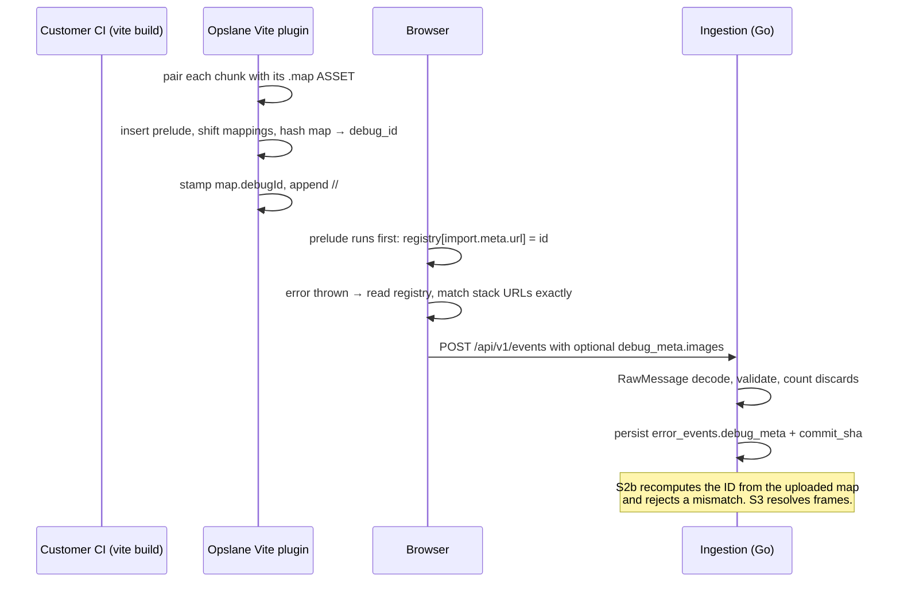

# S2a: carrying debug IDs from Vite builds into error events

**Date:** 2026-07-30 · **Status:** design complete, ready to implement · **Author:** Abhishek Ray (with Claude)
**Issue:** [#224](https://github.com/opslane/opslane-oss/issues/224) · **Blocked by:** #216, merged as `0c0dcfe`
**Implements:** [S0 frozen contracts](./2026-07-29-keys-sourcemaps-s0-contracts.md) §5, §6, §12
**Parent design:** [Keys, source maps, and onboarding](./2026-07-29-keys-sourcemaps-onboarding.md) §5.2, §5.3
**Implementation plan:** [`docs/plans/2026-07-30-s2a-debug-ids-implementation.md`](../plans/2026-07-30-s2a-debug-ids-implementation.md)

## 1. Problem

The fix agent reads scrambled minified identifiers on every CLI-onboarded app, and no
part of the system reports that this is happening.

The chain is short and every link is verifiable on `main`:

- The worker fetches source maps only when an event carries a `release`
  (`packages/worker/src/index.ts:365`).
- The browser SDK defaults `release` to `''` (`packages/sdk/src/config.ts:88`).
- `opslane onboard` never sets it.

So the fetch never runs. `error_events.stack_trace_resolved` is read in three places and
written by zero (`packages/worker/src/index.ts:399`), which is why nobody noticed.

The join key itself is the deeper problem. A release string is a value two systems must
agree on by hand: the build sets it, the running app sets it, and a mismatch produces
silence rather than an error. Replacing it with a fingerprint derived from the map means
the two sides cannot disagree, because neither one chose the value.

This slice builds that fingerprint and carries it from the build into the stored event.
It does not upload maps and does not resolve anything yet. Those are S2b and S3.

## 2. Goals and non-goals

**Goals**

1. Every chunk a Vite build produces carries a stable ID, and the same ID is written
   into its source map.
2. That ID reaches the stored error event without disturbing the raw stack string.
3. TypeScript and Go compute the same ID for the same bytes, provably, so the server
   can recompute and reject a mismatch in S2b.
4. When the mechanism fails in the field, a counter says so within a day, not in
   S3 weeks later.

**Non-goals**

- **Uploading or storing maps.** S2b. The plugin in this slice stamps and nothing else.
- **Symbolication and resolution status.** S3.
- **Publishing to npm.** The package stays at `2.0.1`. A stamp-only SDK on `latest`
  starts a support surface and delivers nothing.
- **Automatic capture inside Web Workers.** `packages/sdk/src/core.ts:178` installs
  handlers with `window.addEventListener`, which does not exist in a worker. Scoping
  this honestly is a goal; building it is not.
- **Bundlers other than Vite.** The core is bundler-neutral by construction, but Vite is
  the only adapter here.
- **Prompt-injection hardening.** `debug_meta` adds one more untrusted string to a
  surface that is already untrusted (parent design §8). Unchanged, and unsolved.

## 3. User requirements

| # | Requirement | Verified by |
|---|---|---|
| R1 | TypeScript and Go produce identical debug IDs for every frozen vector, and PostgreSQL stores all 128 bits unchanged | Both suites read one base64 vector file whose expected values come from a third-party JCS implementation; an integration test round-trips `158399f3-1dad-1386-35b2-98c34317d52e` through a `uuid` column and compares exact text |
| R2 | The plugin writes the same deterministic ID into a chunk and its matching map | Build `test-fixtures/vue-app` twice from two different working directories, diff every file byte for byte, compare per-chunk IDs, and resolve first, middle, and last generated positions through the retained map |
| R3 | The SDK attaches chunk URL and debug ID as optional `debug_meta.images` while preserving the raw stack | Playwright against production-built assets: throw from a built chunk, assert the posted `debug_meta` and a byte-identical `error.stack` |
| R4 | The event contract stays backward compatible and enforces the S0 field, count, and validation limits | Every frozen fixture from `v1.0.0` through `v2.0.1` still returns `202` with its stored columns asserted; new `v2.1.0` pair added; table tests for every S0 §5 rule driven through the HTTP handler |
| R5 | Runtime discovery has defined, tested behavior on Chrome, Firefox, WebKit, lazy chunks, workers, third-party frames, and unsupported frames. "Handles" includes attaching nothing, on purpose: a page-captured worker frame yields no image | chromium × firefox × webkit against a production build, covering eager chunk, lazy chunk throwing during module init, worker own-realm capture, page-captured worker frame, cross-origin asset host, third-party frame, unparseable frame |

## 4. System overview



Three components and one shared artifact: a hashing core compiled into both languages, a
build plugin, a capture path, and a vector file that keeps the two implementations
honest.

## 5. Component design

### 5.1 The hashing core

The algorithm is frozen by S0 §6: strict-parse the map, remove the root `debugId`
member, canonicalize per RFC 8785, SHA-256, take bytes 0..15 and format them as lowercase
`8-4-4-4-12` without rewriting UUID version or variant bits.

**Why canonicalize instead of hashing the raw bytes.** A raw digest is simpler and it
does not work here. The plugin writes `debugId` into the map after computing the ID, and
the server re-serializes the JSON it receives. Both mutate the bytes. Removing one named
member from a canonical form is what lets the ID survive its own stamp and a JSON round
trip. Rejecting a poisoned map is a side benefit, not the reason.

**Why the TypeScript side is not forty lines.** The obvious implementation, sort the keys
and call `JSON.stringify`, is wrong. Measured:

```
JS own-key order for ["10","2","a","A"]  →  ["2","10","a","A"]
sorted, then stringified                 →  {"2":…,"10":…,"A":…,"a":…}
RFC 8785 requires                        →  {"10":…,"2":…,"A":…,"a":…}
```

JavaScript hoists integer-like keys ahead of string keys in own-property order, so no
amount of sorting before `JSON.stringify` produces canonical bytes. Separately,
`JSON.parse` cannot detect duplicate keys at all: ECMA-262 builds the object with
`CreateDataProperty`, last write wins, and only then walks the surviving properties, so a
reviver never sees the shadowed member. Escape-equivalent keys such as `"a"` and
`"\u0061"` are invisible for the same reason.

So the implementation is a lexical pre-pass over the raw bytes (fatal UTF-8 decode, BOM,
trailing data, duplicate keys after unescaping, depth counting) followed by manual member
emission after a UTF-16 code-unit sort. Go uses `github.com/gowebpki/jcs` (Apache-2.0)
for canonical output with the same pre-pass via `json.Decoder` token streaming, because
ECMAScript number formatting is the one part worth taking a dependency for.

Two inputs are rejected rather than hashed, because the two languages cannot agree on
them: lone surrogates (Go's decoder substitutes U+FFFD, `JSON.stringify` re-emits
`\ud800`) and non-finite numbers (`1e400` parses to `Infinity` in JS and serializes as
`null`; Go returns a range error). S0 §6 already says "reject invalid UTF-8", which covers
the lone-surrogate case at the byte level but does not obviously reach an escaped
`\ud800`, and says nothing about non-finite numbers.

**These two rejections are an interpretation this slice proposes, not something S0 froze.**
Five of the seven rejection classes (`bom`, `duplicate_key`, `depth_exceeded`,
`trailing_data`, and the two above) are named here and only partly sourced to the frozen
text. The vector file is where the interpretation becomes binding, so it needs an S0
amendment recorded the way `docs/contracts/C4-amendments.md` records prior ones. Landing
the vectors without that amendment would mean two implementations agreeing on behavior no
contract authorizes.

**Hashing runs through `crypto.subtle`, not `node:crypto`.** `packages/sdk/vite.config.ts:14-27`
builds `index`, `react`, and `vite-plugin` as one browser-targeted library whose only
externals are framework packages, so a `node:crypto` import becomes a stub that throws
inside the customer's build. `crypto.subtle.digest` is a global in Node 18+ and every
target browser, at the cost of making `generateBundle` async. Verified on the repo's
Node 22.12.0: `typeof globalThis.crypto.subtle.digest === 'function'`.

**The parity harness.** One file, `test-fixtures/debug-id/vectors.json`, storing raw
input bytes as **base64** rather than JSON objects, because a JSON object cannot express a
duplicate key, a BOM, or invalid UTF-8, which are exactly the cases the algorithm must
reject. Each case is either a success (canonical bytes, SHA-256, debug ID) or a named
failure (`invalid_utf8`, `bom`, `duplicate_key`, `invalid_unicode`, `depth_exceeded`,
`non_finite_number`, `trailing_data`).

Expected values come from a pinned third-party JCS implementation validated against the
official RFC 8785 vectors. Generating them from either of our implementations would make
one suite tautological and would hide any bug the two happen to share.

### 5.2 The Vite plugin

Everything below was measured against Vite 6.4.3, 7.3.6, and 8.1.5 with a throwaway probe,
because the bundler behavior this depends on is unspecified public API.

Those three versions are not one engine. Vite 6 and 7 depend on Rollup (`^4.34.9` and
`^4.43.0`); Vite 8 depends on Rolldown (`~1.1.5`). The probe therefore measured two
independent bundler implementations and got the same answers from both, which is a
stronger result than three versions of one engine would have been. The risk that this
contract shifts under us is correspondingly lower, and the regression test covers both
engines.

| Question | Answer |
|---|---|
| Does `chunk.code` mutated in `generateBundle` reach disk? | Yes, all three majors |
| Is the content hash recomputed after that mutation? | **No** |
| Does a prelude without a `mappings` shift still resolve? | **No. It resolves to the wrong source line, silently** |
| Does prepending `;` to `mappings` restore correctness? | Yes |
| Does mutating `chunk.map` change the emitted `.map`? | **No. The `.map` asset's `source` string is authoritative** |
| Does the emitted map carry a root `file`? | Yes, the content-hashed JS filename |

Three of those six answers contradicted the first draft of this design.

**The `.map` asset is the artifact.** `chunk.map.toString()` equals
`bundle[key + '.map'].source` on entry, but only the asset is written to disk. Hashing
`chunk.map` while shipping the asset would guarantee that the server's recomputed ID never
matches, and the failure would first appear in S2b as an unexplained `409`.

**The registration snippet is a prelude, not a footer.** A footer never executes when the
module throws during evaluation, and a lazy chunk that throws on initialization is exactly
the case debug IDs exist for. Prepending shifts every generated line, which invalidates
the map, so the sequence per chunk is:

1. Parse `asset.source`, accepting `string` and `Uint8Array`.
2. Insert the prelude **after any directive prologue or shebang**. Prepending ahead of
   `'use strict';` demotes it to an ordinary expression and silently disables strict mode.
3. Prepend one `;` to `mappings` **per line inserted**, never a hard-coded one.
4. Compute `debug_id` and `content_sha256` from the corrected map. The 128-bit ID is
   the join key; the full 256-bit digest is what S2b compares when two builds claim the
   same ID, which is how `debug_id_conflict` is distinguished from idempotent reuse. This
   slice computes and discards it, so that S2b inherits one definition rather than two.
5. Substitute the real ID for a 36-character placeholder. Fixed width guarantees the
   prelude stays exactly one line whatever the ID turns out to be, so the line shift
   computed in step 3 stays correct without recomputing it after substitution.
6. Set root `debugId` on the map, which the hash excludes, and reserialize to
   `asset.source`.
7. Append `//# debugId=<id>`. Appending shifts nothing.

**Output format decides the prelude, and guessing wrong ships a dead app.** `import.meta`
is a syntax error in `iife`, `umd`, `cjs`, and `system`, which is what
`@vitejs/plugin-legacy` and `build.lib` emit. "The plugin never fails the build" does not
help: the build goes green and the app is dead on load.

| Format | Prelude key |
|---|---|
| `es` | `import.meta.url` |
| `iife`, `umd`, `cjs`, `system` | `document.currentScript && document.currentScript.src` |
| neither resolvable | skip the chunk and count it |

The prelude also ships verbatim. esbuild lowers code in `renderChunk`, which runs before
`generateBundle`, so the prelude is pinned to ES5 syntax and a test asserts it parses
under the lowest supported `build.target`.

**Why the commit SHA is not injected per chunk, when the debug ID is.** Since the content
hash is not recomputed, the filename covers the pre-mutation bytes. That is harmless only
while the mutation is a pure function of the chunk: identical source yields an identical
map, ID, prelude, and therefore identical final bytes, so `filename ↔ bytes` still holds.
A commit SHA is not a function of the source. The same code on a new commit would keep its
filename and change its bytes, and a CDN could serve a mixture of two builds under one
name. The SHA is injected instead through a `define`-style constant evaluated in
`transform`, before hashing, so the bundler accounts for it in the filename.

Plumbing, end to end: the plugin resolves the SHA at config time from an explicit
`commitSha` option, then an ordered env ladder (`OPSLANE_COMMIT_SHA`, `GITHUB_SHA`,
`VERCEL_GIT_COMMIT_SHA`, `CF_PAGES_COMMIT_SHA`, `CI_COMMIT_SHA`, `RENDER_GIT_COMMIT`,
`BITBUCKET_COMMIT`, `GIT_COMMIT`, `BUILD_SOURCEVERSION`), then `.git/HEAD` and the ref it
points at, read off disk with no `git` binary. It defines a constant the SDK reads at
capture time and sends as the top-level optional `commit_sha` field, which the migration's
CHECK constrains to 40 or 64 lowercase hex: 40 for SHA-1 repositories, 64 for SHA-256 ones,
which is why both are accepted. If nothing resolves, the constant is absent and the SDK
omits the field. Which rung won is always logged, because a Docker build that copies source
without `.git` is the likeliest misconfiguration in the slice and the earlier draft
specified no output for it at all.

The purity claim has two real exceptions and they are the reason the determinism test is
shaped the way it is. A map whose `sources` carry absolute paths is a function of the build
machine, not of the source, so two machines would produce one filename over two byte
strings, which is the same hazard used to disqualify the commit SHA. The parent design's
spike already found exactly that leak. Enforcement is therefore a test, not an assertion:
the determinism build runs from two different working directories and fails if any
`sources` entry is absolute or contains the build directory. The second exception is
benign but real: changing the plugin, and therefore the prelude text, changes the
emitted bytes under an unchanged filename. That is a deploy-time cache concern for one
release, not an ongoing invariant break, and it is the normal cost of any build-tool
upgrade.

Two further consequences to state now, before someone discovers them. Anything that precomputes an
integrity value (Subresource Integrity plugins, integrity manifests) will disagree with
the emitted bytes, which is a blank page for the customer and produces no Opslane error
because the page never runs. The plugin detects known SRI plugins and skips stamping, and
`stamp: false` is the manual escape hatch. Separately, the map's root `file` carries the
hashed filename and participates in the hash, so an unrelated filename change moves the
debug ID even when `mappings` are byte-identical.

**Behavior per `build.sourcemap` value.** Vite's build default is `false`
(`vite/dist/node/chunks/dep-*.js:46040`), so most projects have no map at all until the
plugin asks for one. Removing `.map` assets unconditionally would also break a customer
who deliberately set `true`, because their chunks still carry a `//# sourceMappingURL=`
comment that would then point at a missing file:

| `build.sourcemap` | Plugin behavior |
|---|---|
| unset (Vite default `false`) | request `'hidden'`, stamp, drop the `.map` assets. `'hidden'` means Vite omits `sourceMappingURL`, so nothing dangles |
| `'hidden'` | stamp, drop the `.map` assets |
| `true` | stamp, **leave the assets alone**, log once. The customer asked for shipped maps |
| `'inline'` | the map lives inside the JS, so there is no asset to drop. Skip stamping and log that inline maps publish source to the CDN, naming `'hidden'` as the fix |
| `false` and explicitly set | no map exists, so no ID is possible. Log once and exit |

The `sourcemaps` option overrides the drop: `'remove'` is the default and matches the
table, `'keep'` retains the assets. `'keep'` exists because R2 has to read the map it just
hashed, and because a customer hitting an unforeseen interaction needs a way to stop the
plugin touching their output without giving up stamping.

**Source maps are otherwise deleted from the bundle and written nowhere.** An earlier draft wrote
them to a temp directory so nothing was lost. That was wrong: S0 §7.4 freezes spill files
as AES-256-GCM ciphertext under a per-build in-memory key, deleted on receipt and
unreadable after the process exits. A plaintext temp file holding full `sourcesContent`,
with its path logged, is customer source code sitting in a CI log or a Docker image layer.
Implementing custody correctly is S2b's work, and half-implementing it is worse than not
starting. Writing nothing also dissolves the "never fail the build, never publish maps,
never lose maps" trilemma, and the parent design already states that the next build
regenerates maps rather than trusting a cross-process cache.

**Public API.** `opslane(options?)`, every field optional, so the parent design's frozen
zero-argument snippet is unchanged and S2b is additive instead of a signature change on a
minor release:

```ts
export interface OpslaneViteOptions {
  /** Explicit override. Detection is a convenience over this, never a replacement. */
  commitSha?: string;
  /** Escape hatch for SRI and integrity-manifest builds. */
  stamp?: boolean;
  logLevel?: 'silent' | 'warn' | 'debug';
  sourcemaps?: 'remove' | 'keep';
}
```

Exported as `opslaneVitePlugin` to match `opslaneVuePlugin`, with
`export { opslaneVitePlugin as opslane }`. The existing `opslaneSourceMapPlugin` keeps its
name, its options, and its upload behavior, and gains a `@deprecated` marker. Keeping the
signature while removing the behavior would be a breaking change wearing a compatible
version number.

Because both can appear in one config, the composition rule is explicit and tested: the
legacy plugin needs the `.map` assets that the new one drops, so with both present the new
plugin does not remove them and logs once. The three cases (legacy only, new only, both)
each get a test, and the guide carries the same matrix. Ordering relative to
`@sentry/vite-plugin` is documented for the same reason.

### 5.3 Runtime discovery and event assembly

**The registry is keyed by module URL, not by a stack string.** The parent design sketched
a registry keyed on `new Error().stack`, then parsed back out. Vite emits ES modules, so
`import.meta.url` gives the chunk's own URL from the engine's module record: no parsing,
and no dependence on `Error.stackTraceLimit`, a `prepareStackTrace` override, or engine
stack truncation. The stack technique remains implemented as the fallback for non-ESM
output, so R5's matrix still runs, but it no longer decides whether registration works at
all.

Engine shapes still have to be parsed to pull URLs out of the *error's* stack. Note that
`packages/worker/src/sourcemap.ts:29-48` handles V8 `at …` forms only and is not reusable
for browser-side capture; S3 needs the same widening.

**Two hazards in the existing capture path.** `core.ts:145-152` appends synthetic frames
from a fresh `new Error()` whenever the real stack has no user frames; those URLs point at
the Opslane SDK's own chunk, so naive extraction burns an image slot on a chunk that can
never resolve to customer code. And `buildPayload` runs before `scrubEvent`
(`transport.ts:61`), where `scrub.ts:73` rewrites `error.stack`, so a scrubbed frame URL
would no longer match the `code_file` the worker joins on in S3.

Remedies, both cheap: URL extraction stops at the `--- synthetic caller stack ---` marker
that `core.ts:150` already inserts, so synthetic frames never contribute images; and image
assembly moves after `scrubEvent`, with a test asserting that scrubbing never rewrites a
URL that matched.

**Workers, scoped to what is true.** A worker has its own `globalThis`, so the page SDK
can never read a worker chunk's registry. Inside a worker, only an explicit
`captureException` attaches images, because `core.ts:178` installs handlers with
`window.addEventListener`. A worker-origin frame captured by the page yields no image,
tested and counted. A wrong image is worse than none.

**Attachment order is fixed, because it is observable.** Validate each entry's shape,
collapse exact `(code_file, debug_id)` duplicates, discard every entry for any `code_file`
claiming two different IDs computed over the whole list, then take the first 64 in captured
stack order, then drop from the tail until the serialized size fits the byte budget.
Truncating before the ambiguity check would let a conflicting entry at index 65 escape it,
making stored metadata depend on submission order. The byte cap sits last for the same
reason: it is a second truncation, and running it earlier would reintroduce the bug the
ordering exists to prevent. The budget matters because 64 images at S0's 4096-byte
`code_file` ceiling is 256 KiB against the 60 KiB unload cap at `transport.ts:43`, and
`:207` always sends at least one event regardless of size.

Matching is exact, with no basename fallback, which is the S0 §5 rule. Exactness is what
makes a wrong attribution impossible and also what makes the mechanism brittle: a CDN
rewrite, a `?v=` suffix, or a service worker that alters the URL between the module record
and the stack frame produces zero matches rather than a wrong one. There is no repair
mechanism, by design. The cross-origin test covers the common case and the
zero-matched counter covers the rest, which is the entire reason that counter exists.

**One distinction makes field failure visible.** The SDK omits `debug_meta` when the
registry is empty, and sends `{"images": []}` when the registry had entries but none
matched the captured stack. S0 §5 treats omission and an empty array as semantically
equivalent, so this stays inside the frozen contract while letting the server tell "not
instrumented" from "instrumented and the join is broken." Without it both cases look
identical on the wire, and a broken URL join stays invisible until S3.

### 5.4 Ingestion

**Both fields decode as `json.RawMessage`.** `error_event.go:60-81` decodes the whole body
with one `json.Unmarshal` into a typed struct and returns `400` on any error. Adding
`CommitSHA string` or a typed `DebugMeta` means a payload carrying `"commit_sha": 123`
fails the top-level unmarshal and **rejects a real error event**, violating S0 §5's rule
that malformed optional metadata never rejects. The `json.RawMessage` pattern is already
applied to `Breadcrumbs`, `Context`, and `Runtime` at `error_event.go:67-70`.

**The migration is guarded.** `scripts/run-migrations.sh:11-14` replays every `.sql` on
every boot under `ON_ERROR_STOP=1`, and `db/migrations_test.go:170`
(`TestMigrations_AreIdempotent`) enforces it. An unguarded `ADD COLUMN` fails on the second
run and aborts every later migration.

```sql
SET lock_timeout = '3s';

ALTER TABLE error_events
  ADD COLUMN IF NOT EXISTS debug_meta JSONB NOT NULL DEFAULT '{"images":[]}'::jsonb;
ALTER TABLE error_events
  ADD COLUMN IF NOT EXISTS commit_sha TEXT;

ALTER TABLE error_events DROP CONSTRAINT IF EXISTS error_events_debug_meta_object;
ALTER TABLE error_events ADD CONSTRAINT error_events_debug_meta_object
  CHECK (jsonb_typeof(debug_meta) = 'object') NOT VALID;
ALTER TABLE error_events DROP CONSTRAINT IF EXISTS error_events_commit_sha_hex;
ALTER TABLE error_events ADD CONSTRAINT error_events_commit_sha_hex
  CHECK (commit_sha IS NULL OR commit_sha ~ '^(?:[0-9a-f]{40}|[0-9a-f]{64})$') NOT VALID;

ALTER TABLE error_events VALIDATE CONSTRAINT error_events_debug_meta_object;
ALTER TABLE error_events VALIDATE CONSTRAINT error_events_commit_sha_hex;
```

`lock_timeout` matters more than scan cost on this table. `ADD COLUMN` holds ACCESS
EXCLUSIVE only briefly, but a queued lock parks every subsequent read on `error_events`
behind one long-running transaction. When the timeout fires the migration run aborts under
`ON_ERROR_STOP=1` and the boot fails, which is loud and is the intended trade: a failed
boot that retries cleanly beats a stalled read path, and every statement is guarded so the
retry is safe.

One consequence of the frozen default looks like a bug and is not. §5.3
distinguishes an omitted `debug_meta` (not instrumented) from `{"images": []}`
(instrumented, join broken), but the column defaults to `'{"images":[]}'` and is
`NOT NULL`, so both land in the row identically. The distinction is consumed at ingest
time, where the counter is incremented, and is deliberately not preserved in storage. A
later question of the form "which stored events came from instrumented builds" cannot be
answered from this column, and would need the nullable variant S0 did not freeze.

**Metrics that answer two different questions.** Per-reason discard counters
(`malformed_container`, `malformed_images`, `non_object_image`, `bad_type`,
`bad_code_file`, `bad_debug_id`, `ambiguous_code_file`, `over_limit`, plus
`commit_sha_discarded`) measure malformed input. They do not measure whether the mechanism
works. For that: coverage is `events_with_debug_images_total` over a new platform-labeled
`events_javascript_total`, and `debug_meta_registry_present_zero_matched_total` fires on
the empty-array case from §5.3. `metrics.go:15-37` currently has only an unlabeled
`eventsIngestedTotal`, so the denominator has to be built.

### 5.5 Release posture

The package stays at **2.0.1**. An earlier plan bumped it to `2.1.0` with no changeset,
believing that holds the publish. It does not. From the pinned implementation at
`@changesets/cli@2.31.1/dist/changesets-cli.cjs.js:1113`:

```js
if (!publishedVersions.includes(localVersion)) {
  packagesToPublish.push(pkgInfo);
  logger.info(`${name} is being published because our local version (${localVersion}) has not been published on npm`);
```

`release-npm.yml:74` runs `pnpm changeset publish`, which ships any public local version
missing from npm regardless of how the version got there. The hand-bump would have pushed
a stamp-only SDK to `latest` with no Version Packages PR and no changelog entry, and S2b's
changeset would then have bumped from 2.1.0 and left the feature permanently unrecorded.

`wire-shape.test.ts:15-21` keys fixture filenames off the package version, so that coupling
is cut: the test reads a `WIRE_FIXTURE_VERSION` constant instead. The `v2.1.0` fixture pair
is authored now, since R4 requires it, and S2b adds one real changeset so the version bump,
changelog, and publish happen together.

## 6. Milestones

| # | Deliverable | Exit criterion |
|---|---|---|
| M0 | Rollup architecture proof across Vite 6, 7, and 8 | The emitted map recomputes to the ID embedded in the JS; first, middle, and last generated positions resolve correctly; no integrity manifest disagrees with the emitted bytes; an async `generateBundle` composes with other plugins' hooks. Written pass/fail rule beforehand: any version failing map-recomputes-to-ID switches the design to `renderChunk` plus magic-string and re-runs the same proof. That branch discards §5.2's seven-step sequence and the asset-authority finding, so it is a redesign of roughly a day, not an adjustment |
| M1 | Vectors and both canonicalizers | Both suites green over every success and rejection case, with expected values from the third-party oracle; the PostgreSQL vector round-trips exact text |
| M2 | Plugin rewrite | `test-fixtures/vue-app` builds twice from different working directories byte-identically; every `build.sourcemap` value and every output format has a passing case; no `.map` reaches the output |
| M3 | SDK capture path | Production-built Playwright run is green on chromium, firefox, and webkit across all seven frame shapes, with the raw stack byte-identical |
| M4 | Ingestion | Migration applies twice cleanly; every historical fixture returns `202` with stored columns asserted; every S0 §5 rule has a handler-level test |
| M5 | Docs, CLI check, and live smoke | `opslane doctor` reports stamped-chunk counts; the eight stale doc surfaces are updated; a real event carrying `debug_meta` is POSTed and read back from the database |

M0 gates everything. It can still change §5.2, which is why it is a milestone, not a task
inside one.

## 7. Testing and validation

**In CI.** Both canonicalizer suites over the shared vectors. Plugin unit tests covering
each `build.sourcemap` value, each output format, prologue and shebang preservation, ES5
parse under the lowest target, oversized-map skip, and never-throw. The two-directory
determinism build with real position resolution. The engine-shape matrix. Handler-level
validation tests including a conflict at index 65 and permuted-order equivalence. Migration
reapplication. Every frozen wire fixture replayed.

Both wire harnesses need extending, not just new fixture files.
`wire_compat_test.go:22-43` has no `debug_meta` or `commit_sha` fields and its assertions at
`:176` do not read them, so a new fixture alone would prove only that unknown fields still
return `202`, which was already true. And `wire-shape.test.ts` asserts deep equality against
real transport output, so it has to seed the registry and the commit constant, and the
authored fixture must use a `code_file` that appears in its `FIXTURE_STACK`.

**Needs a live run.** The browser matrix requires real engines against production-built
assets, not the existing harness: `browser-contract.test.ts:83-84` drives a Vite **dev**
server, and the plugin is `apply: 'build'`, so it never executes there. Firefox and WebKit
also have to be installed in CI, which today installs chromium only
(`.github/workflows/ci.yml:242`), and the suite must assert the browsers actually ran
rather than silently skipping. The full pipeline smoke follows `AGENTS.md`: apply
migrations, seed, rebuild ingestion, POST a real event, read the row back.

**Not applicable.** No eval suite. This slice touches no prompt, system instruction, or
tool definition.

## 8. Risks and mitigations

| Risk | What stops it |
|---|---|
| Rollup's `generateBundle` mutation contract is unspecified and could change | M0 proves it across three majors; the determinism test re-asserts it so a Vite upgrade fails CI instead of silently breaking stamping |
| A prelude without a mappings shift resolves to the wrong line | Measured, not assumed. Shift by lines actually inserted; positions are resolved through the real map, not by checking that `mappings` starts with `;` |
| Hashing `chunk.map` while shipping the `.map` asset | Measured. Every step operates on `asset.source` |
| `import.meta` in a non-ESM chunk kills the customer's app at load | Format-branched prelude with a case per format |
| An SRI or integrity manifest disagrees with the emitted bytes | Detection plus a `stamp: false` escape hatch; confirmed as an M0 exit criterion |
| Go and TypeScript diverge on an exotic escape or number | Raw-byte vectors including rejection cases, graded by a third implementation |
| Malformed metadata rejects a real error event | `json.RawMessage` decode, with tests driven through the HTTP handler rather than the validator |
| Migration breaks every boot after the first | Guarded statements, enforced by an existing idempotency test |
| Machine-dependent IDs from absolute paths in `sources` | Determinism build runs from two working directories and asserts no absolute path. The parent design's spike already found `sources` leaking the build machine's home directory |
| An event is dropped at unload because `debug_meta` is too large | 64 images at S0's 4096-byte ceiling is 256 KiB against `transport.ts:43`'s 60 KiB budget, so the SDK caps serialized size, not just entry count |
| **We build all of this and never learn whether it improves fixes** | **Not solved here.** See §10 |

## 9. Alternatives considered

- **Release-string matching** (status quo). The manual sync between build and runtime is
  precisely what left the current path dead, and it fails silently.
- **Hashing raw map bytes instead of canonical JSON.** Simpler, and it breaks: the plugin
  stamps the map after hashing and the server re-serializes on receipt.
- **Random per-build IDs** (PostHog's approach). Retried uploads duplicate rows.
  Deterministic hashing gives idempotence, which S2b's conflict rules need anyway.
- **Keying the registry on `new Error().stack`** (the parent design's sketch). Works, but
  it makes registration depend on engine-specific stack formats and on
  `Error.stackTraceLimit`, which any dependency can set to zero. Retained as the non-ESM
  fallback.
- **A registration footer instead of a prelude.** Avoids the mappings shift entirely, and
  never runs when a module throws during initialization, which is the case that matters
  most.
- **Consuming a debug ID stamped by `@sentry/vite-plugin`.** The best onboarding story
  available: a prospect already emitting debug IDs would need no build change at all. It is
  contract-incompatible as frozen, because S0 §6 requires the claimed ID to equal the
  server's recomputed hash, and Sentry's IDs are random UUIDs, so every upload would
  `409`. Recorded in `TODOS.md` with the contract change it would need.
- **Writing maps to a plaintext temp directory** so nothing is lost before S2b's upload
  exists. Contradicts S0 §7.4 and puts customer source in CI logs and image layers.
- **Bumping to 2.1.0 without a changeset** to stage the fixture version. Does not hold the
  publish; see §5.5.

## 10. The honest caveat

Nobody has measured whether symbolication improves fix quality, and this slice does not
measure it either.

The parent design asserts that scrambled stacks degrade fix accuracy. That is plausible and
it is untested. Every case in the eval corpus ships a pre-symbolicated dev-mode stack of the
form `at UserProfile (src/components/UserProfile.tsx:10:42)`, so the corpus only ever
exercises the already-resolved condition. The agent also receives the repository, the error
type, the message, and the breadcrumbs, and a model handed a repo checkout can often find
the file by search alone. If the real uplift is small, this eight-slice program is
misprioritized; if it is large, that number belongs at the top of the parent design. Both
review voices raised this independently, and the decision was to implement the frozen
contracts and track the measurement separately instead of blocking on it.

Two related reframes are also unexamined and filed as issues: the worker already clones and
builds the customer's repository in a sandbox, so it might generate maps itself and delete
most of the upload architecture; and `sourcesContent`, which S0 requires, is a duplicate
copy of source we already have access to, and it is the single requirement that creates the
custody risk the parent design's own closing section calls the most dangerous open item in
the product.

What this slice does deliver is measurable: after it ships, the coverage ratio and the
zero-matched counter say whether debug IDs are reaching events at all. That is the first
number this program has ever produced about itself.
