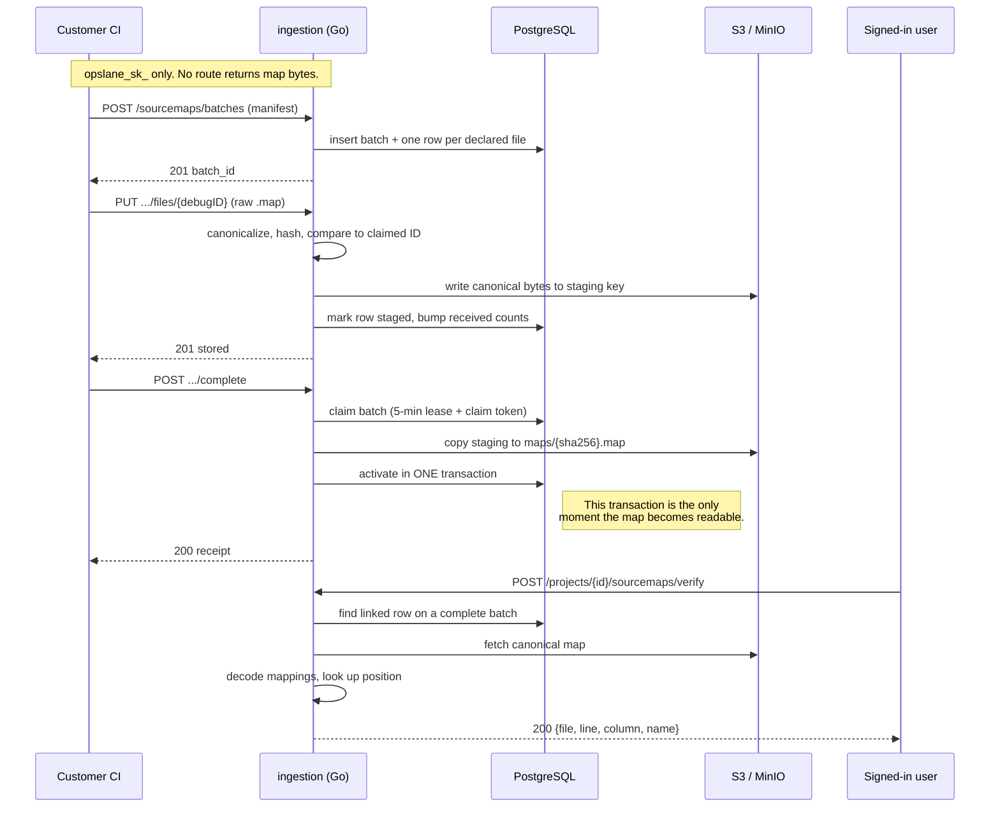

# S2b: securely upload and verify one source map

**Issue:** [#225](https://github.com/opslane/opslane-oss/issues/225)
**Status:** reviewed, ready to implement
**Date:** 2026-07-30
**Frozen contract:** [S0 contracts](./2026-07-29-keys-sourcemaps-s0-contracts.md) (#216)
**Implementation plan:** [2026-07-30-s2b-sourcemap-upload-verify.md](../plans/2026-07-30-s2b-sourcemap-upload-verify.md)

## Glossary

Read this first. The rest of the doc leans on these words.

**The things themselves**

| Term | What it means here |
|---|---|
| **Source map** | A file a build tool writes next to compressed JavaScript. It says "character 846 of line 1 in `index-BpTz.js` came from line 42 of `App.tsx`." With `sourcesContent` included, it also carries a full copy of the original code. |
| **`sourcesContent`** | The part of a source map holding the original code as plain text. This is why a map is not metadata about source. It is the source. |
| **Debug ID** | A fingerprint of one source map. We compute it by hashing the map's contents. The same map always produces the same ID, on any machine, in any language. |
| **Symbolication** | Turning a compressed stack trace back into real file names and line numbers, using a source map. |

**The two keys**

| Term | What it means here |
|---|---|
| **`opslane_pk_`** | The public key. It ships inside the customer's website, so anyone can read it. It may only send us errors. |
| **`opslane_sk_`** | The secret key. It lives in the customer's build system. It may only upload source maps. Nothing lets it read anything back. |

**How an upload works**

| Term | What it means here |
|---|---|
| **Batch** | One build's worth of maps, uploaded as a group. Declare what's coming, send each file, then say "done." Nothing is readable until the "done" step succeeds. |
| **Manifest** | The declaration that opens a batch: for each map, its debug ID, its filename, and its size. The server checks arrivals against it. |
| **Canonical** | One fixed way of writing a map's JSON, so the same map always produces the same bytes no matter how it was formatted. We store the canonical form, not what was sent. RFC 8785 is the rule we follow. |
| **Staging vs canonical storage** | Uploaded files land in a staging folder tied to one batch. Only the "done" step copies them to permanent storage. Nothing reads from staging. |
| **Idempotent** | Doing it twice gives the same result as doing it once. Uploading the same map again returns success and changes nothing. |
| **Lease and claim token** | A five-minute reservation on the "done" step, so two servers cannot finish the same batch at once. The claim token is the exact timestamp of that reservation. A request holding a stale token can no longer change anything. |
| **VLQ** | The compressed number format inside a map's `mappings` field. Decoding it is how you find which original line a position came from. |

## 1. Problem

When a browser error arrives from a production site, the stack trace names files that do not exist:

```
at n (assets/index-Dk3f8xBq.js:1:8402)
```

The fix agent cannot work with that. Worse, it actively works against itself. [#242](https://github.com/opslane/opslane-oss/issues/242) documents the exact mechanism: the scope reviewer at `packages/worker/src/harness/tool-middleware.ts:71` compares the files the agent edited against the files named in the stack. Since the only file named is a bundle the repository does not contain, every correct edit looks out of scope, and the agent is told:

> For each extra file, confirm it is necessary to fix the reported error. If any change is not directly required, revert it.

So the agent reverts the change that fixes the bug. This hits every app onboarded through the CLI today, because the worker only fetches maps when an event carries a `release`, the SDK defaults `release` to `''` (`packages/sdk/src/config.ts:88`), and onboarding never sets it.

To fix this we need maps. To get maps we need somewhere safe to put them.

**A correction to the issue's own framing.** #225 opens by saying the public browser key can upload source maps. That was true, and it is not true now. #217 deleted `POST /api/v1/sourcemaps`. I measured it: with `DASHBOARD_DIR` set the way `packages/ingestion/Dockerfile:28` sets it, that path returns `404`. The vulnerability described is already closed. What remains is that there is no upload path at all.

## 2. Goals and non-goals

**Goal:** one source map, uploaded by a write-only secret key, stored where only the server can reach it, and resolvable for exactly one position by a signed-in user.

Non-goals, each with its reason:

| Not doing | Why |
|---|---|
| The Vite plugin | It cannot stamp a debug ID without the TypeScript hasher, which belongs to [#224](https://github.com/opslane/opslane-oss/issues/224). Uploading a real 248-map build belongs to [#226](https://github.com/opslane/opslane-oss/issues/226). |
| Byte budgets, concurrency caps, cluster-wide limits | [#226](https://github.com/opslane/opslane-oss/issues/226). Per-request rate limits **are** in scope; see R7. |
| A background sweeper for abandoned batches | [#226](https://github.com/opslane/opslane-oss/issues/226). Online recovery inside the endpoint **is** in scope; see R8. |
| Durable project deletion with retry | [#229](https://github.com/opslane/opslane-oss/issues/229). This slice does best-effort deletion. Stated as an accepted risk in §8. |
| Worker symbolication | [#227](https://github.com/opslane/opslane-oss/issues/227). |
| Any way for a human to create an `opslane_sk_` | [#230](https://github.com/opslane/opslane-oss/issues/230) and [#238](https://github.com/opslane/opslane-oss/issues/238). **This slice ships an API nobody can call yet.** That is expected. Its consumers are #226 and #231. |

To say the last one plainly: at the end of this work, no customer can use any of it. Nothing here is demoable. It exists so that #226 and #231 have something to build against.

## 3. User requirements

R1 to R6 come from the issue. R7 and R8 were added during review and approved.

| # | Requirement | Verified by |
|---|---|---|
| R1 | An active secret key can create a batch, upload one map, and complete it. Public, revoked, malformed, and wrong-project keys are rejected. | Extend `handler/route_matrix_test.go`, adding four routes and a `wrong-project-sk` credential. |
| R2 | The server recomputes the fingerprint. Identical content is idempotent; a different map claiming the same ID is rejected. | Upload the same map twice, then conflicting bytes under that ID (digest seeded, since the real hash cannot collide). |
| R3 | Completed maps are stored separately per project, and incomplete uploads are invisible to resolution. | Two projects, same debug ID, same bytes. Then interrupt a third batch and confirm verify returns `404`. |
| R4 | The session-authenticated verify endpoint returns only path, line, column, and function. | Resolve a known position; assert the response contains none of the fixture's source text and no `mappings` key. |
| R5 | No key, session, dashboard route, admin route, or presigned URL can download a full map. | Walk every route with `chi.Walk`; assert no presigned URL is ever minted for a `sourcemaps/` key. |
| R6 | Deleting a project deletes its stored map without touching the same ID in another project. | Delete one of two isolated projects; inspect both the database and object storage. |
| **R7** | Each new route enforces the contract's request limit. | 20/min batch create, 600/min file PUT, 60/min complete, 30/min verify. Assert `429` carries `code: "rate_limited"`. |
| **R8** | A batch whose completion request dies can still be completed by a retry. | Kill a completion mid-flight; retry after the lease expires; assert it completes. |

## 4. System overview: one moment makes a map readable



There is one visibility point. A map is readable only after the final database transaction commits. A crash anywhere before that leaves objects in storage that nothing can find, because resolution reads through database rows, never through storage directly.

## 5. Component design: what we reuse, what we write

### 5.1 Fingerprinting: reuse, do not rebuild

The server must derive the map's fingerprint itself, or a caller could lie about which file it is uploading and poison what the fix agent reads.

That code already exists. #224 shipped `packages/ingestion/debugid/debugid.go` (385 lines): strict JSON scan, shape validation, RFC 8785 canonicalization via `github.com/gowebpki/jcs`, SHA-256, first 16 bytes formatted as a UUID.

```go
type Result struct {
	DebugID       string
	ContentSHA256 string
}

func Compute(input []byte) (Result, error)
```

**Why import it instead of writing our own:** two copies of a cross-language hash contract will drift, and drift here means the TypeScript plugin and the Go server disagree about what a map is called. So #225 branches off the #224 branch and adds one field:

```go
type Result struct {
	DebugID       string
	ContentSHA256 string
	Canonical     []byte  // NEW
	CanonicalSize int64   // NEW
}
```

Storage holds the canonical bytes, not the raw request. Two uploads of the same map with different whitespace produce byte-identical stored objects.

### 5.2 Position lookup: write it, do not import it

The verify endpoint needs to turn "line 1, column 846" into "App.tsx line 42." That code exists in TypeScript (`packages/worker/src/source-map.ts`) but the endpoint is Go.

The obvious move is `github.com/go-sourcemap/sourcemap`. I ran it against the TypeScript consumer and it is wrong. On the map `{"mappings":"AAAA;A"}`, where the second line's segment has one field and is therefore *unmapped* by the source-map v3 spec:

```
                      go-sourcemap v2.1.4       @jridgewell/trace-mapping
gen(line=1,col=0)     src/a.ts:1:0              src/a.ts:1:0        agree
gen(line=2,col=0)     src/a.ts:1:0  ok=true     source: null        DIVERGE
gen(line=2,col=3)     src/a.ts:1:0  ok=true     source: null        DIVERGE
```

The library defaults the missing source index to zero and reports success. The contract requires `422 position_not_mapped` there. An endpoint whose entire job is proving resolution works would sometimes return a confident pointer to the wrong file. For a debugging tool that is worse than an error.

**Decision: write a small decoder** in a new `packages/ingestion/sourcemapping` package, roughly 120 to 150 lines. Base64 VLQ decode, per-line segment tables, binary search by generated column, and one rule the rejected library gets wrong: *a segment with fewer than four fields is unmapped.* No new dependency, no license review, and it is tested against `@jridgewell/trace-mapping` output on shared vectors.

One more reason, verified: `go-sourcemap`'s `SourceContent()` returns the embedded original source. The library holds every customer source file in memory and hands it out in one call. Our decoder never retains `sourcesContent` at all, so R4 and R5 cannot be broken by a one-line mistake.

### 5.3 Completion: one transaction, one claim token

Two CI runs can call `complete` on the same batch at the same second. Without protection, both copy objects and both write rows, and the batch's file counts double.

The protocol:

1. `ClaimBatchCompletion` atomically moves the batch to `completing`, stamping `completion_claimed_at` and a five-minute lease from the same database `now()`. That timestamp is the request's **claim token**.
2. The request copies staging objects to their permanent keys.
3. `ActivateBatch` locks the batch and requires the exact claim token it was handed. A request whose claim was taken over changes zero rows and harms nothing.

Two things review corrected here:

**The lease must be reclaimable online.** As first drafted, `ClaimBatchCompletion` accepted only `pending` batches. If a completion request died, say from a pod restart or a dropped connection, the batch sat in `completing` forever. A retry could not claim it, and after `expires_at` the handler returned `410` before attempting recovery. That build's maps became unrecoverable. The fix is one extra condition in the same atomic statement: also accept a `completing` batch whose lease has expired. Because both paths stamp a fresh token from the same `now()`, successive tokens are at least one lease apart and cannot collide.

**Each transition is exactly one `UPDATE`.** The contract's coherence constraints look like this:

```sql
CHECK (
  (status = 'completing'
    AND completion_claimed_at IS NOT NULL
    AND completion_lease_expires_at IS NOT NULL)
  OR
  (status <> 'completing'
    AND completion_claimed_at IS NULL
    AND completion_lease_expires_at IS NULL)
)
```

PostgreSQL evaluates these per statement, not per transaction. So `UPDATE ... SET status='completing'` followed by `UPDATE ... SET completion_claimed_at=...` fails on the first statement. Every transition must carry all of its columns in a single statement.

### 5.4 Check ordering: two places the obvious order is wrong

The order the PUT handler runs its checks is fixed by contract §7.2 and is counter-intuitive in two places. Both were wrong in the first draft.

1. Batch exists in this project, else `404`.
2. Debug ID is declared in this batch, else `409 debug_id_not_declared`. **This precedes every lifecycle check.**
3. `expires_at` applies **only to `pending` batches.** A completed batch retried an hour later must return its receipt, not `410`. The first draft would have rejected a legitimate idempotent retry.
4. Length and type checks. `Content-Encoding` present is an explicit `415`; without that step a gzipped body falls through to `400 invalid_source_map` and misdirects the caller.
5. Canonicalize and hash.
6. **Lifecycle classification comes before identity mismatch.** On an already-complete batch, a body matching the stored digest is `200 already_present` and any other body is `409 batch_already_complete`. Only on a non-complete batch does a wrong fingerprint become `409 debug_id_mismatch`. The first draft returned `debug_id_mismatch` first, contradicting the contract.

### 5.5 Rate limits: three routes reuse, one needs a sibling

`rateLimitByProject` already exists (`handler/ingest_limits.go:32`) and guards six ingest routes. The three secret-key routes reuse it directly.

Verify cannot. It reads `ProjectIDFromCtx`, which only `ProjectKey` sets; verify is session-authenticated, so the value is empty and the middleware would return `401 "missing project context"`. It needs a sibling keyed on the URL's `{projectID}`, about fifteen lines.

The existing middleware also writes `429` with no `code` field (`ingest_limits.go:42`), which the contract requires. Fixing that improves the six existing routes too.

## 6. Milestones: what has to be true before each step

| # | Deliverable | Exit criterion |
|---|---|---|
| M1 | Migration 031 plus the `UNIQUE (id, project_id)` correction | `scripts/check-migration-reapply.sh` passes on a clean and a seeded database |
| M2 | `debugid.Compute` returns canonical bytes | All three frozen vectors match the canonical string byte for byte |
| M3 | `sourcemapping` decoder | Parity with `@jridgewell/trace-mapping` on shared vectors, including the unmapped-segment case |
| M4 | `db/sourcemaps.go` | Every state transition is a single `UPDATE`; a deliberately split transition fails its CHECK |
| M5 | Three upload routes | R1 and R2 green against disposable PostgreSQL and MinIO |
| M6 | Verify endpoint | R4 green; response scanned for source text |
| M7 | Isolation and deletion | R3 and R6 green |
| M8 | Live run | Real server, real key, real map, real `verify` call, with the actual HTTP responses and MinIO listing reported |

M5 gates on M1 to M4. M8 gates on everything.

## 7. Testing: what runs in CI and what needs a real server

Planned coverage at review time was 22 of roughly 60 code paths. The gap list is in the plan's eng section. The tests that matter most:

**Runs in CI:** the route matrix across seven credentials; migration replay; the three golden hash vectors; the decoder parity suite; manifest validation bounds; malformed maps (BOM, invalid UTF-8, duplicate keys, nesting past 64, indexed maps, `sourcesContent` length mismatch).

**Needs Postgres and MinIO:** idempotent re-upload; conflicting digest; two-project isolation; interrupted batch invisible to verify; abandoned `completing` lease reclaimed by retry; project deletion.

**Needs a live run:** M8. Per repo convention, report the actual responses, not a claim that it should work.

Three tests exist specifically because review found the defect they cover:

- The unmapped-segment vector, which is what caught `go-sourcemap`.
- A completed batch retried after `expires_at`, which must return its receipt rather than `410`.
- A fixture whose raw and canonical byte lengths deliberately differ, because four size fields share one valid range and no CHECK constraint can catch a swap between them.

## 8. Risks, and the one we have not solved

| Risk | Mitigation | Residual |
|---|---|---|
| Crash between object copy and activation | Activation is the only visibility point, so the orphan is unreadable; retry re-copies safely | An orphan object until project deletion. #226 collects. |
| Two completes race | Claim token; a stale claim changes zero rows | None known |
| Cross-project map reuse | Project UUID in every row and every object key | None |
| Verify leaks source | The decoder never retains `sourcesContent`; response asserted against fixture text | None known |
| Verify enumerates paths one position at a time | 30/min limit, session auth, batch binding, audit log | Enumeration is slowed, not impossible. The contract says so plainly. |
| Leaked secret key floods storage | Request limits at contract numbers | Byte volume is still unbounded until #226 |
| Multi-replica deployment | none in this slice | **Open:** `newRateLimiter` is in-memory per replica. On N replicas the effective cap is N times the stated number. #226 makes limits cluster-wide. |

### The honest caveat

**Project deletion is best-effort, and that is a real hole.** Deleting a project cascades its database rows and then calls `RemovePrefix` on its storage folder. If that storage call fails, nothing retries it and nothing records that it failed. The customer's source stays readable in object storage with no database row pointing at it and no evidence anywhere that it is still there.

The frozen contract explicitly says database cascades are not deletion of customer source. We are shipping something weaker than the contract on purpose, having judged production S3 reliable enough. #229 adds the tombstone row and the retrying sweeper that make this durable. Until #229 lands, "we deleted your source" is a claim this system cannot fully back.

## 9. Alternatives, and why each lost

**Generate maps in the worker instead of uploading them.** [#245](https://github.com/opslane/opslane-oss/issues/245) asks this, and if it works the entire pipeline is unnecessary. The spike found 248 of 248 maps byte-reproducible across two clean builds. But that proves same-machine determinism, not that a sandbox can reproduce a customer's CI artifact: the result also depends on the exact deployed commit, Node version, package manager, build mode, and build-time environment. The worker today shallow-clones the default branch, not the deployed commit (`worker/src/harness/sandbox-repo.ts`), and symbolication runs before the sandbox exists (`worker/src/index.ts:361`). Rejected as a *replacement*; it remains plausible as a future default, and it should be settled before #226 builds the plugin's custody machinery.

**Implement the whole frozen contract now,** including cluster-wide budgets, per-upload leases, the sweeper, and tombstones. Rejected: it duplicates #226's multi-replica test plan and builds throughput machinery before any traffic exists to throttle. The pieces that protect correctness were kept; the pieces that protect throughput were not.

**Copy the hash algorithm into this branch** so #225 merges in any order. Rejected as the exact DRY violation the frozen golden vectors exist to prevent.

**Use `go-sourcemap` and accept the divergence.** Rejected on measured evidence; see §5.2.

**Skip the verify endpoint.** It would sidestep the Go decoder problem entirely. Rejected: R4 is one of the six requirements, and #231's settings card depends on verify existing.

## Appendix: two contract defects found by running the code

**The migration cannot apply as written.** I applied real migrations `001` through `029` to a disposable PostgreSQL 16.14, then contract §8.1 verbatim:

```
ERROR: there is no unique constraint matching given keys
       for referenced table "project_api_keys"
```

`sourcemap_batches` declares `FOREIGN KEY (upload_key_db_id, project_id) REFERENCES project_api_keys(id, project_id)`. Contract §3.3 line 299 specifies `UNIQUE (id, project_id)` on that table. The shipped `028_project_api_keys.sql` omitted it. S1 diverged from the frozen contract and nothing caught it. Migration 031 opens by adding the constraint.

**The immutability trigger needs `CREATE OR REPLACE`.** The repository has zero triggers today, so this would be the first. `scripts/run-migrations.sh` has no ledger; it replays every `.sql` on every boot, and CI enforces that through `scripts/check-migration-reapply.sh`. A bare `CREATE TRIGGER` fails on the second boot. PostgreSQL 16 supports `CREATE OR REPLACE TRIGGER`.

Related: migration numbering is convention, not correctness. The runner globs and sorts lexically, so `031` runs after both `028` files and `029` regardless of whether #224 renumbers. A `030` gap must never be backfilled later, because fresh and upgraded databases would then apply files in different orders.
