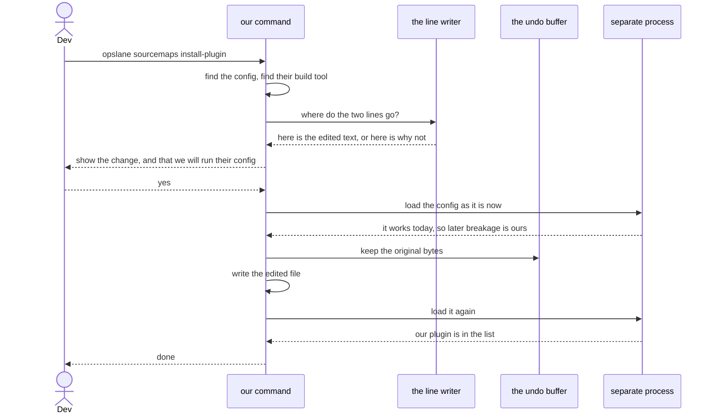

# Adding our plugin to a customer's build file, without breaking it

Engineering design · Slice S6a · 2026-07-30 · Abhishek Ray
Issue [#232](https://github.com/opslane/opslane-oss/issues/232) · Tracker [#222](https://github.com/opslane/opslane-oss/issues/222) · Status: ready to build
Changes two decisions in [the parent design](./2026-07-29-keys-sourcemaps-onboarding.md); see section 12.

## In short

To read a customer's crash reports properly, we need a small piece of our code
running inside their build. Getting it there means adding two lines to one file
they own. That file is theirs, it is in their repository, and if we get it wrong
their site stops building.

The original plan had an AI model write those two lines and the host check the
result afterwards. We measured that against 70 real config files. It works on 26
of every 100. The reason is not the model. It is that we asked the model to
describe *where* to put the line in terms of whole lines, and most real files put
the whole list on one line, so there is no line to point at.

Writing the two lines ourselves, in code, works on 91 of every 100. Section 6a
shows how to run beside the tools customers already use, tested against the real
Sentry plugin, which brings us to 63 of 70. The rest we refuse, and this document
is partly about making that refusal useful rather than a dead end.

One number in here is still not trustworthy, and section 13 says which.

## 1. The words you need

Seven terms do most of the work here.

| Term | What it means |
| --- | --- |
| build tool | The program that turns a developer's source code into files a browser can load. Vite is a common one. |
| config file | The file where a developer tells the build tool what to do. Usually `vite.config.ts`. We change exactly this file and nothing else. |
| plugin | A piece of code that plugs into someone's build and does extra work during it. Ours is called `opslane()`. |
| the plugin list | A list inside the config file. Every plugin the build runs is named there. Our two lines add ours to that list. |
| source map | A file that translates squashed production code back to the original. Without one, crash reports point at gibberish. Our plugin's job is to produce and send these. |
| syntax tree | What you get when a program reads code and turns it into a structure it can walk around, instead of treating it as plain text. It is how we find the plugin list reliably. |
| the setup command | The thing we are building: `opslane sourcemaps install-plugin`. |

**The change we make**, in full, so the rest of this is concrete:

```ts
import { opslane } from '@opslane/sdk/vite-plugin';   // line one

export default defineConfig({
  plugins: [
    react(),
    opslane(),                                        // line two
  ],
});
```

`opslane()` takes no settings. It reads what it needs from the environment.

## 2. The problem

The original plan describes two things, and both fail on real files.

**Where the 70 files came from.** Every config file on the author's machine, which
was 310. Then only the ones sitting next to a web page file, which is how you tell
a real app from a shared library, which left 154. Then only one copy of each, since
the same file appears in several checkouts, which left 70. They come from real
projects: excalidraw, hoppscotch, PostHog, rrweb, twenty, cal.com. It is one
person's machine, so treat the *proportions* as a good hint and the *mechanics* as
solid. Anyone can rerun it against a different set.

**Finding the spot.** The plan has a model say "put the line after the line that
reads `vue(),`". That only works if the spot is between two lines. Of those 70
files, **41 write the whole plugin list on a single line**, like
`plugins: [react(), vue()],`. There is no line to point at, because the spot is in
the middle of one. So the instruction cannot be given.

That caps the whole approach at 18 of 70 files. Writing the lines ourselves in
code puts them at an exact character position instead, which has no such limit,
and reaches 64 of 70.

**Checking it worked.** The plan runs the customer's full production build and
treats success as proof. But the parent design already promised our plugin will
*never* fail a build, whatever goes wrong. A missing key, a rejected key, a failed
upload: all of them log a line and carry on. So a successful build tells us
nothing about whether the plugin did its job, and it costs up to ten minutes to
learn that.

We then tried a cheaper check, and it was worse. It reads the config file but
never runs the plugin inside it. We tested this with a deliberately broken plugin:

| What we put in the config | Cheap check (`loadConfigFromFile`) | Real check (`resolveConfig`) |
| --- | --- | --- |
| A working plugin | passes | passes |
| A plugin that crashes on startup | **passes, wrongly** | fails, and says why |
| A plugin that does not exist | fails | fails |

The middle row is the important one. Our single test for "does the undo work?"
would have passed while proving nothing.

Why this matters now: this slice is the last thing the onboarding rewrite is
waiting on.

## 3. What this slice does and does not do

### Does

- Adds our two lines to a customer's config file, written by our own code.
- Reads the file back afterwards and asks the build tool to load it for real, to
  confirm the plugin is actually registered.
- Puts the file back exactly as it was, byte for byte, if anything goes wrong.
- Tells anyone we refuse exactly what to type instead.

### Does not

- **Set up keys or send any source map.** Separate slices ([#235](https://github.com/opslane/opslane-oss/issues/235),
  [#225](https://github.com/opslane/opslane-oss/issues/225)). Until those land we
  cannot prove source maps work end to end, and we say so on screen instead of
  implying otherwise.
- **Appear in the onboarding flow.** That flow is being rewritten, so anything we
  wire in now gets deleted. There is also a trap: onboarding decides it succeeded
  at `cli/src/onboard/core.ts:336`, and shuts down the customer's dev server four
  lines later. A step added in between would both inherit the verdict and fight
  the running dev server over the same cache folder.
- **Upgrade anyone off our older plugin.** Every internal install still runs it
  (`packages/sdk/vite-plugin/index.ts:18`). Needs its own decision. We refuse and
  explain.
- **Change anyone's existing setup.** We run beside Sentry's plugin (section 6a)
  but never remove it, reorder it, or touch its settings.
- **Handle configs assembled from several files or built by a function call.**
  5 of 70. There is no safe spot to insert into, only a rewrite.
- **Support any build tool other than Vite.**

## 4. What has to be true before we ship

| # | Must be true | How we prove it |
| --- | --- | --- |
| R1 | The two lines go in, and the plugin really is registered when the build runs | Test every config shape with exact expected text. Then load one for real and check our plugin is in the list the build tool ends up with |
| R2 | Any failure puts the file back exactly as it was | Compare the file before and after, byte for byte, including its permissions, once for every way this can fail |
| R3 | Running it twice does nothing the second time | Run every test case twice. The second run reports "already done" and the file does not change |
| R4 | We ask before giving up, and anyone we do refuse is told what to type instead | Where we found the list but could not place the line, check we offer a confirmable guess. For every real refusal, check nothing was written and the message names the file and a next step |
| R5 | A config that was already broken is not blamed on us, and we do not break it ourselves | Use a config that fails without a certain setting. With the setting present, we proceed. Without it, we stop and say the problem was already there |
| R6 | It works without a human watching | Run it with no terminal attached. It prints its plan and stops, having written nothing |
| R7 | No other tracked file changes | Check the repository reports exactly one changed file after success, and none after an undo |

## 5. How it fits together

Three pieces. One writes the two lines and is pure text in, text out, which is why
most of our tests need no real project at all. One saves and restores the original
bytes. The third runs the customer's config in a separate process, for reasons in
section 7.



We show the change before we run any of their code. An earlier draft ran their
config first, which meant executing their code before telling them we would.

## 6. Finding the right spot

We read the config into a syntax tree and walk to the plugin list. We handle the
config written as a plain object, wrapped in `defineConfig(...)`, returned from a
function, or stored in a variable in the same file. Anything else, we refuse and
name the reason.

Two details are worth writing down because both bit us.

**Where exactly the line goes.** We insert at the position just past the last
plugin in the list. The obvious way to find that position lands *before* the
comma that follows it, which splits `}),` into `})` and a stray `,`. Our first
attempt did exactly this and corrupted 18 of the 70 files. The build tool's own
data has a field that already points past the comma; use that one.

**When there is no plugin list at all.** We can add one. But if the config copies
in settings from somewhere else with `...base`, the list we add gets overwritten
by that copy. Every check we run afterwards still passes, the config still loads,
and our plugin is simply not there. A green run that did nothing is the worst
outcome in this design, so we refuse whenever the config copies settings in.

## 6a. Running next to someone else's plugin

Four of the 22 real projects already run Sentry's source-map plugin, and one of
them is ours: `~/Projects/asset-management-jira/vue3/client` runs Sentry's plugin
and our own predecessor side by side in production today. So this is not a
hypothetical cohort. It is how our earliest customers already work.

**They collide today, and our plugin is the one breaking things.** Our current
plugin takes the map files out of the build while they are still in memory, so
they are never written to disk. Sentry's plugin waits until the build has written
everything and then searches the output folder. It finds nothing.

We proved this with the real plugin from that project:

| Build | What a disk-reading plugin finds |
| --- | --- |
| Our current plugin present | **nothing** |
| Our current plugin absent | the map file |

That is enough to break a disk-reading uploader. It is **not** enough to conclude
Sentry is broken in that project, and an earlier draft of this section said so
anyway. There is no auth token in that config and none anywhere in the repo, and
Sentry skips uploading entirely without one. Two independent explanations, one
observed effect, and we cannot separate them from outside. Say the mechanism, not
the diagnosis.

**The fix is to use a different moment rather than fight for position.** A build
has three phases in a fixed order: assets exist in memory, assets are written to
disk, then the build finishes. Our plugin reads in the first phase and cleans up in
the third. Sentry works in the second, in between.

```
in memory   ->  we read the maps, and delete nothing
written     ->  Sentry reads them off disk, uploads, deletes them
finished    ->  we delete anything still there
```

| Arrangement | we get maps | they get maps | shipped to a browser |
| --- | --- | --- | --- |
| Ours listed first | yes | yes | none |
| Theirs listed first | yes | yes | none |
| Ours alone | yes | n/a | none |

This does not depend on us being first or last in anyone's plugin list, which is
what an earlier attempt got wrong. The order of the three phases is fixed by the
build tool, so no plugin arrangement can break it.

**The cost, stated plainly.** The map files now exist on disk for a short window
during the build, where before they never existed at all. If a build is killed in
that window, maps are left in the output folder, and if that folder is deployed
they reach browsers. The current design cannot leak that way. We are trading a
guarantee for the ability to work beside the tools our customers already run, and
that trade should be a conscious one.

**Confirmed against the real plugin.** The results above use stand-ins. We then
ran the real `@sentry/vite-plugin` and watched what it handed to its uploader.
It stages files in a temporary folder before sending them, so that folder is a
direct answer to "did it get the maps?"

| Build | Sentry staged a script | Sentry staged **a map** | we got the map | left on disk |
| --- | --- | --- | --- | --- |
| No plugin of ours | yes | **yes** | n/a | 1 |
| Our current plugin | yes | **no** | n/a | 0 |
| The proposed design | yes | **yes** | yes | 0 |

The middle row is the collision, seen directly rather than inferred: Sentry sends
a script file with no map, which cannot be used to read a stack trace. The bottom
row is the fix, and it stages exactly what Sentry gets when we are not there at all.

The run was fully isolated. Sentry's uploader was replaced with a stand-in that
reports what it was given and sends nothing, so no credential was used and no
request left the machine.

**Still not covered, and why we are not covering it.** Whether the upload itself
lands in a Sentry project needs a real account, and is M1. A reviewer also raised
three build shapes we have not tried. We counted how often they occur in the 70
real configs before deciding:

| Shape | In the corpus |
| --- | --- |
| Configs that attach their own output plugins | 0 of 70 |
| Builds producing several outputs at once | 0 of 70 |
| Builds with a separate worker step | 1 of 70 |

None of these is worth a fixture for v1. Note that zero out of seventy means
"below what this sample can see", not "never": the true rate could still be a few
percent.

**So make the dangerous case safe instead of testing for it.** The three shapes
differ in what happens when we get them wrong. Missing an output plugin or a
second output means we fail to collect a map, which is visible and recoverable.
Missing a worker build could leave a source map in the deployed folder, which is
a source leak and silent.

The cleanup step therefore **sweeps the whole output directory, recursively, and
deletes every map file it finds**, rather than deleting the specific maps it
remembers collecting. A worker map we never knew about is still removed. That
turns the worst case for any unfamiliar build shape into "we did not upload
something we should have" rather than "we shipped the customer's source", and it
covers shapes nobody has thought of yet.

**We do not keep a list of other vendors' plugins, and we should not.** An
earlier build of this slice refused any project importing Sentry's, Datadog's,
PostHog's or Bugsnag's source-map plugin. That has been removed.

The phase argument above is not an argument about Sentry. It is an argument about
the order Vite runs its hooks in, which is the same for every plugin. Any
uploader that reads the output folder gets its window. A vendor list refuses
projects nobody has tried, on a guess, and goes stale the moment those tools
change. If a specific tool does break, that is a bug in our plugin, and the fix
belongs in the plugin.

This section was wrong twice before this run, in opposite directions, both times
because a stand-in was treated as the real thing. The rule that came out of it:
build the stand-in from the other party's code, and do not report a result until
something real has confirmed it.

**This makes S6a depend on S2a.** The change is in the plugin, not in this slice.
S6a stops refusing these projects only once the plugin behaves this way.

## 7. Checking our work

After writing the file we read it back from disk, never trusting what we think we
wrote. Then we ask the build tool to load the config the way a real build would.
That is the step that runs our plugin's setup code, so a broken plugin shows up
here instead of in production.

**We use the customer's build tool, not ours.** Our command-line tool does not
depend on Vite at all; asking it to import Vite fails outright. Bundling one would
also be wrong, because we would ship a different version than the customer runs.
So we find theirs and use it.

**We run it in a separate process.** Loading a config runs the customer's config
file and everything it imports. Our tool holds the customer's Opslane key and
login tokens. This codebase deliberately has no way to run arbitrary code: the
onboarding agent is denied a shell outright (`cli/src/onboard/policy.ts:82`) and
there is a written decision explaining why. Adding it back needs the same
treatment, not a footnote.

Be honest about what a separate process buys. It is not a sandbox. The child can
still read files and reach the network. What it gives us is something we can kill
after 60 seconds, and an environment we control. Real isolation would need
something we do not have, and that is listed as an open risk rather than claimed
as solved.

**We keep their environment, minus our own secrets.** An earlier draft emptied the
environment. That would break every config that reads a setting from it, and those
configs would then fail our "was it already broken?" check and get blamed on the
customer. It would also corrupt the one measurement this design depends on. So we
remove our own credentials and leave the rest.

### When it fails

Nothing is written for the first six. The rest put the file back.

| What happened | Nothing written |
| --- | --- |
| No config file found | yes |
| Several config files, we will not guess | yes |
| Their build tool is not installed | yes |
| Their build tool is too old | yes |
| Our SDK is not installed, or is too old for this plugin | yes |
| Their config already fails to load, before we touch it | yes |
| The edited file will not parse | file restored |
| The lines are not where we expected on re-read | file restored |
| It loads, but our plugin is not in the list | file restored |
| It fails to load after our change | file restored |
| Loading took longer than 60 seconds | file restored |
| The restore itself failed | reported loudly, never silent |

Each of these needs an entry in our machine-readable command contract and its
documentation. A test walks every source file looking for statuses that are not
declared (`cli/src/__tests__/contract-drift.test.ts:57`), so skipping this breaks
the build.

## 8. When we refuse

About one run in ten ends here, down from one in five now that we can run beside
other source-map plugins. Still worth treating as a main path, not an error page.

**We ask before we give up.** If we found the plugin list but could not place the
line safely, we do not refuse. We show the file with our best guess marked and let
the developer confirm it or move it:

```
apps/web/vite.config.ts

  12 |   plugins: [
  13 |     react(),
  14 |     mode === 'development' && componentTagger(),
> 15 |     opslane(),          <- we would add it here
  16 |   ].filter(Boolean),

Add it there?  [Y]es  [m]ove it  [n]o, show me the two lines
```

Confirming runs the same checks as the automatic path: we read the file back and
load the config for real. So a confirmed guess is exactly as verified as one we
placed ourselves. This costs almost nothing to build and needs no model.

**Only two situations have no spot to point at.** Both are files with no config to
edit in them at all: the config is exported from somewhere else, or assembled by a
function in another file. There we show the two lines and where to put them.

**Every refusal ends with a way to finish.** The two lines, then
`opslane sourcemaps install-plugin --check`, which loads the config and confirms
the plugin is really registered. Someone who does it by hand gets the same proof
as someone who let us do it.

**We never end on "no".** The last thing on screen is always the next action, and
for anyone who wants to stop, the honest note that Opslane still catches and
groups their errors. Only the file and line numbers stay unreadable. Being refused
here is not fatal to the product and nobody should have to guess that.

## 9. What we show before changing anything

One screen, before a single byte is written. It says which file changes, shows
the two lines, and says plainly that we are about to run their config file, which
means running their code.

It also carries the thing they are really agreeing to, which the first draft left
out entirely:

> Later, when you add your key in CI, your production source maps get uploaded to
> Opslane. A source map is a readable copy of your source code. The resolved
> source also reaches the AI model that writes your fix pull requests. Maps are
> stored per project, cannot be downloaded by anyone, and do not expire yet.

That paragraph needs a page to link to. The one it currently points at is about
session recording and does not mention source maps once. Writing the right page
is part of this slice, not a follow-up.

Two more things on the screen: a warning if the config already has uncommitted
changes, and a note if the config sets the source-map option itself, since our
plugin overrides it.

Without a terminal attached, the command prints all of this as data and stops
without writing anything. It only proceeds when told to explicitly. A tool passing
that flag is not a human reading a privacy notice, so the notice travels in the
output and our contract says the tool must show it first. That is a weak promise,
but a stated one beats a silent bypass.

## 10. Order of work

| # | Step | Done when |
| --- | --- | --- |
| M0 | Write down the two decisions that change the parent design, and rewrite the issue | Both merged, and the issue no longer describes the old approach |
| M1 | The line writer, its tests, and **the measurement in section 13** | Every config shape passes. The number this design is judged on exists |
| M2 | Move the save and restore code so both callers can use it | The existing onboarding tests still pass |
| M3 | The separate process, the consent screen, the command, the contract entries | Everything green, including the undo test |
| M4 | The pages section 9 needs | No message points at a page that does not exist or is wrong |
| M5 | One real run | Exactly one changed file, and our plugin present in the loaded config |

M0 comes before M3 on purpose. The decision about running customer code gets
written down before the code that does it lands.

M2's "existing tests still pass" is weaker than it sounds, since section 2 showed
a test can pass while proving nothing. The new byte-for-byte checks cover it.

## 11. What could go wrong

| Risk | What stops it |
| --- | --- |
| We break an unusual but valid config | Read back from disk, check the lines landed, load it for real. Any failure restores the exact bytes |
| A run reports success but did nothing | We refuse configs that copy settings in, and we check our plugin is in the final list rather than just in the file |
| The process dies halfway through writing | Write to a temporary file and swap it in, so a half-written config is never on disk |
| We get blamed for a config that was already broken | Load it once before we touch it, with their environment intact so we do not cause the failure ourselves |
| Two plugins fight over source maps | We read early and clean up late. Confirmed against the real Sentry plugin: it stages the same files it would without us (section 6a) |
| Someone narrows our file-reading code later and nobody notices | 20 real configs stored in the repository, with their expected outcomes |
| The plugin gets renamed before we ship | A test reads our SDK's source directly and fails the day the name changes |
| **We run the customer's code** | Partly open. Separate process, killable, our secrets removed, its output treated as untrusted. But it is not a sandbox. Accepted for a developer running a tool on their own machine, and written down as a decision |
| Maps exist briefly on disk, so a killed build could leave them in the output | Accepted trade for coexistence (section 6a). Cleanup runs in the last build phase, and a half-finished build should not be deployed anyway |
| **The coverage number is not trustworthy yet** | Open. See section 13 |

## 12. Other options we considered

**Let the model write the lines** (the original issue). Beaten on measurement, 26
against 91. Say clearly what that does and does not show. The model was not the
weak part: across three runs it gave the same answer every time and correctly
refused every file the instruction format cannot handle. What lost was the
instruction format, and we never tested a model against the better format,
because a model cannot count characters into a file it is only describing. **This
reverses a decision in the parent design.**

**Run the customer's production build as proof** (the original issue). The parent
design already promises our plugin never fails a build, so the failures this check
exists to catch are invisible to it. It also takes up to ten minutes and fails on
type errors the customer already had, since a common build script type-checks
first. **This also reverses the parent design.**

**The cheaper config check.** Rejected after testing: it never runs the plugin, so
our undo test would have passed while proving nothing.

**An existing library for editing config files** (`magicast`, already in our
dependency tree, and what Sentry's own setup tool uses). Rejected on measurement,
twice over. It handles 50 of 70 against our 64, because it cannot reach inside a
config written as a function, and 14 of our 70 files are written that way. It also
reprints the whole file, changing 15.4 lines on average against our 3.6. For a
tool whose consent screen shows a two-line change, a 13-line reformat is a product
problem. We already depend on the code needed to do it ourselves.

**Skip the config file entirely** and ship an `opslane build` command that loads
their config, adds our plugin in memory, and builds. Works on every file shape,
including all the ones we refuse, and needs no consent screen or undo at all. We
rejected it here because it changes the command the customer runs in CI rather
than a file they own, and it abandons this slice as scoped. It is the strongest
alternative left, and section 13 says when it wins.

## 13. The honest caveat

**The headline number is not what a customer experiences, and an earlier draft of
this document confused the two.** 91 out of 100 is how often our code can write
the lines correctly. We then refuse some of those on purpose:

| | out of 70 | |
| --- | --- | --- |
| Our code writes the lines correctly | 64 | 91% |
| minus the one already running our older plugin | −1 | |
| **Left after the refusals we choose to make** | **63** | **90%** |
| Refused, no spot we can find | 6 | 9% |
| of those, a shape the design covers but the prototype missed | 2 | |
| no safe in-file insertion possible | 4 | 6% |

Call that 90% "structurally eligible", not "working". Nothing in this table has
loaded a config, and by section 3 none of it sets a key or sends a map. It is the
share of projects where we can write the lines and have chosen to. It also assumes
S2a ships the plugin change in section 6a.

So 90, not 91. And there is a second deduction nobody has measured. Our test only
checked whether the file could be *edited* correctly. It never ran a single one.
Real configs fail to run all the time: a missing setting, a call out to git, a
dependency nobody installed. Every one of those is a refusal that appears nowhere
in the table above.

M1 measures that by loading all 70 before editing them. This is a gate, not a
note. **The rule, fixed now so it cannot be argued about afterwards: if fewer than
60 out of 100 survive that check, the `opslane build` command in section 12 is
the better design, and this one should be reconsidered rather than patched.**
Between 60 and 77, ship it, and keep that command on the list for when we support
build tools other than Vite. The author owns the measurement and it blocks M3.

### M1 measurement status

The runnable measurement is `cli/scripts/measure-config-coverage.mts`. Its input
is a JSON array of `{ "appDir": "/absolute/app", "configPath":
"vite.config.ts" }` records. It resolves every installed config through the same
forked child and credential denylist as the command, with a fresh `HOME` and
`USERPROFILE` for each run. The denominator for the gate is
`loaded + failedToLoad`; `notInstalled` is reported separately because those
entries cannot answer whether the config would load.

The 70-app corpus manifest is not checked into this repository, so no M1
percentage is claimed here yet. This remains an M3 release blocker rather than
silently substituting the repository's small fixture set for the measured
corpus. Run:

```bash
cd cli
pnpm build
pnpm exec tsx scripts/measure-config-coverage.mts /absolute/path/to/corpus.json
```

The second untrustworthy number is the competing-plugin one. Section 6a shows we
do not yet understand how our plugin and Sentry's interact, so 9 of the 16
refusals rest on an assumption we have already been wrong about once.
