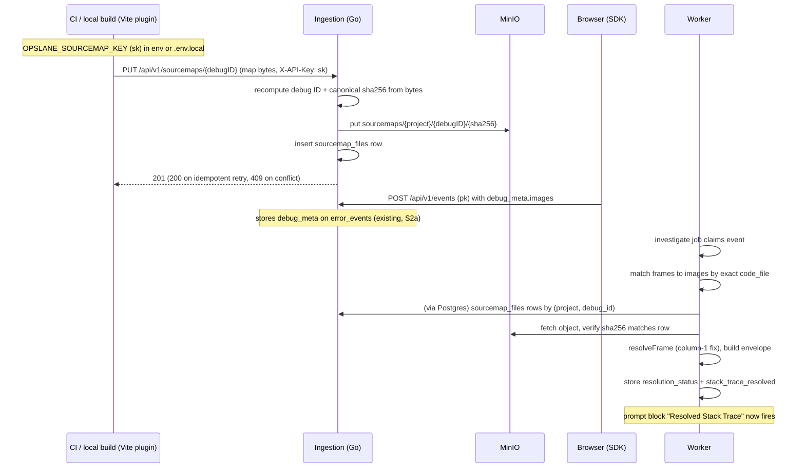

# Design: one stack trace resolves end to end

Status: proposed
Date: 2026-08-03
Author: Abhishek Ray (with Claude + Codex review)
Source of record for scope: `docs/plans/2026-08-03-v1-sourcemaps-simplification.md` (rev 5)
Task breakdown: `docs/superpowers/plans/2026-08-03-v1-sourcemaps-tracer-bullet.md`

## 1. Problem

No source map has ever been uploaded to Opslane, and the fix agent has never
resolved a single minified frame. This is despite three of the four needed
components being finished and merged:

- **Keys (S1, #243).** Two credential types exist with scope stored in the
  database and enforced by one middleware (`handler/project_keys.go:15`):
  `opslane_pk_`, the public key browsers use to send events (scope
  `ingest`), and `opslane_sk_`, the secret key for uploading source maps
  (scope `sourcemaps`, `db/project_keys.go:22`). "pk" and "sk" below refer
  to these. But nothing mints an sk (every
  `CreateProjectKey*` call site passes `ScopeIngest`), and no route accepts
  one.
- **Debug IDs (S2a, #249).** The Vite plugin stamps deterministic debug IDs
  into every chunk and map; the SDK sends `debug_meta.images`; ingestion
  sanitizes and stores it on `error_events.debug_meta`
  (`handler/error_event.go:76`, migration `028_event_debug_meta.sql`).
  Nothing reads that column back.
- **Frame resolution.** `packages/worker/src/source-map.ts` parses stacks and
  resolves positions with snippets. But its callers look maps up by
  `(project_id, release)` in a `source_maps` table (`worker/src/db.ts:1300`)
  that has no writer anywhere in the repo: the only inserter,
  `InsertSourceMap` (`db/queries.go:1447`), has zero callers. Resolution
  always returns null.

The upload endpoint that would connect them was deleted in S1 (the old
`POST /api/v1/sourcemaps` accepted the public browser key, a security hole),
and its planned replacement, the three-step batch protocol frozen in
`docs/design/2026-07-29-keys-sourcemaps-s0-contracts.md` §7-§8, was never
built. Thirteen open issues (S2b through S7c) describe the productionized
version of this pipeline; none of them ship the missing wire.

This slice ships the wire.

## 2. Goals / non-goals

**Goal.** A browser error from a real production Vite build reaches the fix
agent with original file, line, and source snippet, proven by one end-to-end
test that is also the definition of done.

**The one user outcome.** The investigation prompt's "Resolved Stack Trace
(source-mapped)" block (`worker/src/investigate.ts:281`, `agent-fix.ts:220`,
already written, never fired) lights up with real source.

**Non-goals, each deliberate:**

- **No onboarding or CLI changes.** Maintainer decision 2026-08-03: keys are
  minted manually for now; onboarding integration is a separate later track
  whose settled design (flag-gated rotation, `.env.local` delivery, guarded
  CLI sinks) is recorded in the plan so it is not re-litigated.
- **No batch upload protocol.** The frozen §7 design (manifest hashing,
  idempotency keys, probe batches, expiry sweepers) is superseded for v1 by
  a single idempotent PUT per map. See Alternatives.
- **No key-management UI/API, no upload-health surface, no dashboard
  warnings, no client-facing map read path (no API, session, or presigned
  URL returns map bytes; the worker reads object storage directly,
  server-side), no reprocessing of old events, no non-Vite build tools.**
- **No automatic deletion sweeper.** A database trigger records a tombstone;
  purge is a documented manual command.

## 3. Requirements

| # | Requirement | Verified by |
|---|---|---|
| R1 | Only an sk-scoped key can upload a map; a pk gets `403 insufficient_scope`; an sk cannot send events. | Route-matrix and handler tests; E2E negative floor. |
| R2 | One bad or malicious upload can never wedge a debug ID or overwrite an accepted map. | Server recomputes the debug ID from the bytes (`409 debug_id_mismatch` on disagreement); digest-addressed object keys make concurrent-conflict overwrite structurally impossible; unit tests for both. |
| R3 | No API returns map bytes or `sourcesContent`, and maps are project-isolated at rest and at resolution time. | No read route exists (route matrix); E2E: project B with the same `debug_meta` but no upload gets `map_not_found` while A resolves. |
| R4 | A leaked sk is bounded and revocable. | 60/min per-project limiter (worst case ~1.9 GiB/min per replica, documented); exact-`key_id` revocation SQL printed by `mint-key`; revoked-key test. |
| R5 | A real `vite build` uploads its maps and strips them from deployable output; upload failure never fails the customer build. | Plugin tests (429 pacing, failure warning); E2E asserts `sourcemap_files` rows plus zero `.map`/`sourceMappingURL` in output. |
| R6 | The investigated event durably records the outcome: `resolution_status` enum plus resolved frames in a pinned envelope. | Worker unit tests per status; E2E asserts `resolution_status = 'resolved'` and envelope fields (original file, line, snippet). |
| R7 | Resolution works with no release configured and no LLM key present. | Fixture builds with release omitted; resolution runs before the worker's `ANTHROPIC_API_KEY` check, so the E2E asserts it keylessly. |

## 4. System overview



Five stages land in order so no intermediate state is dead:
migrations + route → `cmd/mint-key` → plugin uploader (SDK 3.0.0) → worker
resolution → build-mode E2E.

## 5. Component design

### 5.1 Upload route (ingestion)

`PUT /api/v1/sourcemaps/{debugID}`, behind the existing
`ProjectKey(db.ScopeSourcemaps)` middleware. It is the first route to bind
that scope. The middleware already emits `401 invalid_api_key` /
`403 insufficient_scope` (`handler/project_keys.go:37`), so R1 costs one
route registration.

**Why the server recomputes the debug ID.** The debug ID is derived content:
`debugid.Compute` (`packages/ingestion/debugid/debugid.go:34`) canonicalizes
the map (RFC 8785, minus the `debugId` field) and hashes it; the ID is the
first 128 bits. Trusting the URL's ID would let one truncated upload occupy
the real chunk's ID forever, with no delete path in v1. Recomputing costs one
parse we need anyway for validation.

**Why digest-addressed object keys.** The object lives at
`sourcemaps/{projectID}/{debugID}/{content_sha256}`. Two concurrent first
uploads with different canonical content (attack or hash collision; honest
clients can't produce this, because the ID is recomputed) write *different*
objects; whichever row-insert wins references its own bytes, the loser's
object is an unreferenced orphan. Codex review round 2 showed every
fixed-key scheme we tried had a window where the loser's `PutObject`
clobbered the winner's bytes (`minio/client.go:90` overwrites in place).
Addressing by digest removes the window instead of shrinking it.

**Idempotency and healing.** Same `(project, debugID)` with equal digest →
`200` no-op, after a `StatObject` check that re-puts only when the object is
*missing* (crash between put and insert). A stat failure that is not
not-found is `503 storage_unavailable`, never a silent 200. The frozen
shared HTTP contract (§ error codes) assigns storage unavailability to 503.

**Limits.** `http.MaxBytesReader` at 32 MiB. That matches the plugin's
default `maxMapBytes`, comfortably covers real maps (typically single-digit
MiB), and bounds per-request server memory since the body is buffered for
hashing; the frozen 100 MiB limit assumed streaming the batch protocol
never got. Identity encoding only (`415` on any `Content-Encoding` header,
keeping the frozen §7.2 rule). 60 requests/min per project via a
wrapper that emits the frozen `429 rate_limited` + `Retry-After` shape (the
shared `rateLimitByProject` helper emits a code-less body, so it is wrapped,
not reused blind). 60/min bounds a leaked sk to ~1.9 GiB/min per replica.
Accepted, with revocation as the response.

**`sourcesContent` becomes optional.** Both validators currently reject a
map without it (`debugid.go:103`, `sdk/src/build/debug-id.ts:271`). Users
who set `sourcemapExcludeSources` would be locked out for no security
reason. Both implementations relax identically; a new golden vector without
`sourcesContent` is added to the generator (`test-fixtures/debug-id/
build-vectors.mjs`) so Go and TS cannot drift. The hash algorithm and
existing vectors are untouched. Such maps resolve without snippets;
`has_sources_content` is recorded on the row.

### 5.2 Key minting (`cmd/mint-key`)

A ~40-line Go command: `go run ./cmd/mint-key -project <uuid>` calls the
existing, tested `db.CreateProjectKey(..., ScopeSourcemaps, ...)`, prints
the raw key once plus its `key_id` and the exact-key revocation SQL:

```sql
UPDATE project_api_keys SET revoked_at = now() WHERE key_id = '<key_id>';
```

**Why manual.** The maintainer chose to split all onboarding work out of
this slice ("let's just get the keys + sourcemap upload working"). Minting
via the onboarding flow was designed (and its sharp edges found: the shared
`provisionProjectTx` helper would have leaked sk minting into
`POST /api/v1/projects`), then deliberately deferred with those findings
recorded. Exact-key revocation preserves frozen §3.2's lifecycle invariants
untouched; no blanket project-wide revoke exists.

The operator pastes the key into CI as `OPSLANE_SOURCEMAP_KEY`, and/or into
the repo's gitignored `.env.local`. Blast radius of a leak: uploads only.
The scope cannot read incidents or send events.

### 5.3 Plugin uploader (SDK, 3.0.0)

The plugin already holds every stamped map in memory at the end of its
post-order `generateBundle` hook. Upload bytes are recorded at stamp time
(the discard sweep at `vite-plugin/index.ts:199` deletes bundle entries, not
these copies) and uploaded in `closeBundle`.

- **Env resolution:** `process.env` first (CI), then the project's Vite env
  files via `loadEnv(config.mode, config.root, 'OPSLANE_')`, so a key pasted
  into `.env.local` drives local production builds with no shell exports.
  Non-`VITE_`-prefixed vars never reach browser code, so the sk cannot leak
  into the bundle.
- **Custody:** when maps ship to disk (`mapsWillShip()`, which covers both the
  `sourcemaps: 'keep'` option and a project's explicitly configured maps),
  the uploader re-reads the on-disk bytes and recomputes the debug ID
  immediately before upload, skipping mismatches: another plugin's later
  `writeBundle` can mutate files after our verification pass
  (`index.ts:213` documents exactly this). When maps never reach disk, the
  recorded in-memory bytes are the final bytes.
- **Pacing:** on `429` the uploader waits `Retry-After` (capped 120 s) and
  retries; one free retry on network error. A 248-map build at 60/min
  completes in ~4-5 minutes. Without pacing, review showed a real build
  would upload ~60 maps and silently lose the rest.
- **Never fails the build.** Upload failure is a warning naming the files;
  in keep mode the warning names which maps must not be deployed.
- **3.0.0** is set directly in `package.json` (the S6a codemod gates on the
  installed version: `OPSLANE_VITE_PLUGIN_MIN_VERSION = '3.0.0'`,
  `cli/src/codemods/vite-contract.ts:48`), with a `./build/debug-id` export
  subpath added so the worker can reuse `computeDebugId`.

### 5.4 Worker resolution

One shared resolver module replaces the duplicated, release-gated dead code
at both call sites (`worker/src/index.ts:365,695`).

- **Join rule, exact by design:** a frame resolves against the image whose
  `code_file` equals the frame's file URL exactly. The dead code's basename
  heuristic (`endsWith(m.filename.replace('.map',''))`) is deleted. A
  basename match against the wrong chunk's map yields plausible wrong
  source, which is worse for a fix agent than no source.
- **Ordering:** resolution runs before the worker's `ANTHROPIC_API_KEY`
  check and the repo clone in the investigate path. It depends only on
  Postgres and MinIO; relocating it means a keyless or clone-failing worker
  still records the outcome, and the E2E asserts resolution without an LLM
  key (R7).
- **Correctness fixes found in review:** browser stack columns are 1-based,
  `@jridgewell/trace-mapping` expects 0-based. The existing `resolveFrame`
  passes them through unadjusted (`source-map.ts:61`), an off-by-one on
  every frame. Fetched objects are digest-verified against the row's
  `content_sha256` before use.
- **Durable outcome:** `resolution_status` enum (`resolved | partial |
  no_debug_ids | map_not_found | invalid_map | resolution_failed`, migration
  `031`) plus resolved frames in a pinned envelope stored in the existing
  `stack_trace_resolved` column:

```json
{"version": 1, "frames": [{
  "original_file": "src/App.vue", "original_line": 12, "original_column": 4,
  "source_snippet": "…", "generated_file": "http://…/index-abc.js",
  "generated_line": 1, "generated_column": 100,
  "debug_id": "aaaaaaaa-…"
}]}
```

  `invalid_map` means a map was actually fetched and is unusable: either
  it fails the parse probe or its digest does not match the row (storage
  corruption). Missing storage config classifies as `resolution_failed`,
  never `invalid_map`.

**Expand/contract:** migration `031` only adds the column. The dead
`source_maps` table is dropped by a follow-up migration one release later,
because dropping it alongside the worker change would break an old worker binary
against a migrated database (compose applies migrations before service
restarts).

### 5.5 Deletion floor

No project DELETE endpoint exists (`handler/routes.go:116-119`; project
CRUD is GET/POST/PATCH), so deletion happens via manual SQL, where no
handler can run. A `BEFORE DELETE ON projects` trigger writes a tombstone
row (project ID + storage prefix) in migration `030`, so even a manual
delete records which prefix holds orphaned customer source. Purge is a
documented one-liner against that prefix; the automatic sweeper is deferred.

## 6. Milestones

| Stage | Deliverable | Exit criterion |
|---|---|---|
| 1 | Migrations 030/031 + upload route | Route matrix passes: sk uploads, pk 403s, no read path; idempotent retry returns 200; conflict 409s without object overwrite; disposable-DB double-apply is clean. |
| 2 | `cmd/mint-key` | Minted key passes `ParseProjectKey` with scope `sourcemaps`; printed revocation SQL makes `LookupProjectKey` reject it. |
| 3 | Plugin uploader + SDK 3.0.0 | Build of a fixture uploads exactly the stamped maps; 429-pacing test passes; env-absent build makes zero requests; a 500-ing server does not fail the build; `check:package` proves the new export subpath resolves. |
| 4 | Worker resolution | Unit tests pass for all six statuses, the column-base conversion, digest mismatch, and the exact-join rule; both call sites consume the shared resolver; worker package compiles with `getSourceMaps` gone. |
| 5 | Build-mode E2E | The acceptance test below passes against the compose stack. |

## 7. Testing & validation

**CI:** everything except stage 5. Go handler/db tests (with a map-backed
`objectStore` fake via the `Dependencies.SourcemapStore` seam, plus gated
integration tests against disposable Postgres/MinIO), SDK vitest (uploader
against an in-process HTTP server; debug-id golden vectors shared with Go),
worker vitest (resolver with injected `getMapRows`/`fetchMap`, a committed
real Vite-emitted map fixture).

**Live (the definition of done),** in `test-e2e/` against the compose stack,
using a new build-then-serve harness (`vite build` + `vite preview`) because
the existing dev-server harness never runs the plugin (`apply: 'build'`):

1. Build `test-fixtures/vue-app` with a seeded sk, release omitted.
2. Assert `sourcemap_files` rows created by this run, and zero `.map` files
   or `sourceMappingURL` references in output.
3. Throw one error in the served bundle with the pk.
4. Assert the event this run created reaches `resolution_status='resolved'`
   with envelope fields populated. No `ANTHROPIC_API_KEY` needed.
5. Negative floor: pk cannot upload; sk cannot send events; GET has no
   route; project B carrying the same `debug_meta` while A holds the map
   gets `map_not_found`, then resolves after B's own upload (the
   discriminating isolation proof: identical content in both projects
   would prove nothing).

All E2E polls are scoped `created_at > startedAt` with a scoped
`sourcemap_files` cleanup in `beforeAll`, because the seed uses fixed
project IDs and reruns would otherwise pass on stale data.

## 8. Risks & mitigations

- **Silent upload failure (accepted, the honest caveat).** If CI loses the
  key, maps stop and stacks stay minified; the build-log warning is the only
  signal, and green builds go unread. There is no health surface in v1.
  This is the slice's real unsolved problem. First signal:
  `resolution_status='map_not_found'` on an investigated event, which is
  also the data a future health page needs.
- **Leaked sk.** Bounded to uploads at ≤60/min; response is the printed
  exact-key revocation SQL plus a fresh mint. The sk sits in plaintext in
  the operator's `.env.local` (explicit DX decision; gitignored, cannot
  reach the bundle).
- **Per-file PUTs on big builds.** 248 maps ≈ 4-5 minutes of paced
  uploading in CI. Accepted for v1; the shelved batch protocol is the known
  fix if a design partner's build makes this hurt.
- **Late maps don't heal old events.** No reprocessing; the next occurrence
  resolves. Same position the S-series took.
- **Deleted projects retain source in storage** until the documented manual
  purge runs. The tombstone guarantees the prefix is never forgotten.

## 9. Alternatives considered

- **The frozen batch protocol (S2b/S2c).** Three-step create/upload/complete
  with RFC 8785 manifest hashes, probe flags, expiry sweepers. Rejected for
  v1: none of it exists, it defends against scale we don't have, and the
  single PUT keeps its two real properties (idempotency, atomic visibility
  per map) at a fraction of the surface. It remains the upgrade path.
- **Mint the sk in onboarding (original S1 follow-up).** Designed fully,
  then split out by maintainer decision to keep this slice shippable. The
  design notes (mint site fencing, rotation flag, sink guards) are recorded
  in the plan's "Deferred: onboarding track" so the work restarts warm.
- **Release-based map matching (the legacy schema).** Requires customers to
  configure a release string that onboarding never sets; the S-series
  already rejected it, and the dead `source_maps` table is the evidence.
- **Fixed object keys + row-first conflict checks.** Two review rounds of
  patching still left a concurrent-first-upload window where a loser could
  overwrite the winner's object. Digest-addressed keys eliminate the class.
- **gzip upload bodies.** The only client is our own plugin holding bytes in
  Node; encoding added a decompression-bomb surface and a hash-canonicality
  question for zero benefit. Frozen §7.2 agreed already.
- **`magicast`/model-driven Vite config editing, CDN-hosted maps, Sentry
  compatibility layers** are out of scope here; the S6a codemod work that
  ships config editing is merged and untouched by this slice.

## Review trail

Four adversarial review rounds ran against these documents (2 on the plan, 2
on the implementation plan) using Codex (gpt-5.6-sol) with repo access, plus
an earlier Claude-based pass. 40+ findings were applied; the significant
ones are called out inline above. Transcripts: session scratchpad,
`codex-plan-review-{1,2}.txt`, `codex-impl-review-{1,2}.txt`.
