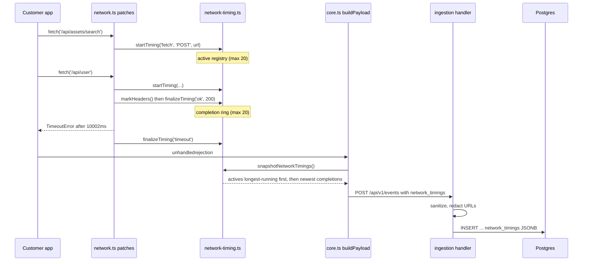

# Browser SDK network timing capture

Date: 2026-08-06
Status: designed, not implemented
Spec: `docs/superpowers/specs/2026-08-06-sdk-network-timing-design.md`
Plan: `docs/superpowers/plans/2026-08-06-sdk-network-timing.md`

## Problem

Opslane opened [PR #1297 on `conelike/asset-management-jira`][pr] to fix a
`TimeoutError: signal timed out`. The fix raised `FETCH_TIMEOUT` from 10000 to
30000 in three files, and the PR was closed unmerged.

The agent was not reasoning badly. It had a minified stack, breadcrumbs, and
nothing else. The PR body records `Visual replay analysis not available` and
`Signals not available`. The SDK reports what threw; it has never reported how
long anything took.

Concretely: `network.ts:96-107` writes a breadcrumb on fetch rejection carrying
method, URL, and the error message, but no elapsed time. So the payload did not
establish even that the request ran to its full deadline, let alone which of the
plausible causes applied. Given that input, changing the constant was the only
action the evidence supported.

There is timing in the system already. `telemetry.ts:7-8` emits `request_start`
and `request_end` with timestamps, but they ride inside the rrweb replay stream
(`shared/src/types.ts:353-357`) and reach the agent only when replay analysis
succeeds. On this error it did not. **Timing stored somewhere the error event
does not reach is equivalent to timing not stored**, and that is the specific
failure this design targets.

[pr]: https://github.com/conelike/asset-management-jira/pull/1297

## Goals and non-goals

**Goal.** Attach observed request timing to the error event, so a later slice can
put it in front of the investigation agent.

Non-goals, each of which scopes the work:

- **No `traceparent` propagation.** Adding a header to a cross-origin request
  forces a CORS preflight, so an SDK upgrade could start failing requests that
  worked the day before. For an error monitor that is the worst available failure
  mode. It also returns nothing unless the customer already runs backend tracing.
- **No continuous performance capture.** Timing leaves the browser only inside an
  error event. No new always-on upload path, no new storage volume.
- **No main-thread profiling.** Longtask observers and the JS Self-Profiling API
  answer "why did the UI freeze", a different question from the one PR #1297
  asked.
- **No worker or agent changes in this slice.** The column is written by
  ingestion and read by nothing. That split is deliberate; see Milestones.

## What this can and cannot establish

It can establish which request failed, how long it ran, whether response headers ever
arrived, and what else was in flight beside it.

It cannot establish whether the server received the request. Patch-point instrumentation
sees only what the browser sees, and once a timeout aborts a request the browser
cannot observe a later response. Sibling requests returning quickly is
circumstantial evidence for one slow endpoint, not proof. Service workers, cache
hits, CORS preflights, client-side cancellation, connection-pool contention, and
per-request payload size all remain live alternatives.

So the payoff is bounded: enough to rule out an unsupported timeout-constant
change and to raise a more precise `needs_human` incident. Not enough to prove a
backend fault.

## Requirements

| | Requirement | Verified by |
| --- | --- | --- |
| R1 | Every fetch and XHR that completes or fails records its elapsed time | `network-timing.test.ts`, `network.test.ts` |
| R2 | A request still running when the error fires is recorded with elapsed-so-far | `network-timing.test.ts` in-flight case |
| R3 | A timeout is classified from the rejection, not inferred from duration | `network.test.ts` `TimeoutError` case |
| R4 | A long-running request survives a burst of shorter ones | `network-timing.test.ts` "20 later completions" case |
| R5 | Timing reaches Postgres intact through ingestion | `queries_test.go`, `wire_compat_test.go` |
| R6 | Malformed timing never fails an event | `network_timings_internal_test.go`, per-field cases |
| R7 | URLs are redacted server-side regardless of what the client sent | `masking_test.go`, live smoke asserting `token=leak` is absent |
| R8 | A real browser produces this on a real timeout | `browser-contract.test.ts` against a hanging server |

Everything above R8 can pass while the feature does nothing in a browser, which
is why R8 exists.

## System overview



## Component design

### The timing store (`packages/sdk/src/network-timing.ts`, new)

Its own module rather than growing `network.ts` (218 lines): retention policy is
a different responsibility from patching globals, and both the fetch and XHR
patches consume the same seam.

```ts
export interface NetworkTiming {
  transport: 'fetch' | 'xhr';
  method: string;
  url: string;
  started_at_ms: number;
  duration_ms: number;
  ttfb_ms?: number;
  outcome: 'ok' | 'http_error' | 'timeout' | 'abort' | 'network_error' | 'in_flight';
  status?: number;
}
```

Two collections rather than one buffer, because a single FIFO ring evicts the
record the feature exists to capture. A request open for 30 seconds becomes the oldest entry
while shorter requests start and finish around it, so twenty subsequent requests
drop it before its timeout ever fires. Instead: an active registry plus a ring of
recent completions, with the snapshot taking actives first, ordered
longest-running first.

At capacity the store refuses the new request rather than evicting an existing
one. The obvious version, evicting the newest and inserting the newer, always keeps
the arrival that just displaced its predecessor. That inverts the policy. Refusing
keeps the oldest twenty, which are the long-running requests being diagnosed.
This one was caught in review after shipping into the plan with a passing test;
the test asserted only length and the first element.

Handles are never reissued, including across `clearNetworkTimings()`.
`unpatchFetch` cannot cancel a request already awaiting (`network.ts:70`) or
detach listeners already registered, so a callback from before `destroy()` can
fire after re-init. Were handles to restart at zero, that stale callback would
finalize an unrelated new request holding the reused handle.

Elapsed values come from `performance.now()` while `started_at_ms` comes from
`Date.now()`. `Date.now()` can jump backwards on NTP correction or when a laptop wakes from
sleep, producing negative or inflated durations on exactly the long-running
requests that matter. `started_at_ms` still needs to be an absolute timestamp so
it correlates with breadcrumbs. Existing telemetry uses `Date.now()` for both;
this does not change that, only declines to copy it.

### Two timing milestones, one of them comparable

`fetch()` resolves when response **headers** arrive. XHR `loadend` fires after the
transfer completes. Recording one number from both compares unlike things, and the
concurrency comparison is the main signal this feature produces.

- `ttfb_ms` is time to response headers, and **it is the field that compares
  across transports.** Fetch: promise resolution. XHR: `readystatechange` at
  `readyState === 2`. Absent when the request ended before any headers arrived.
- `duration_ms` is start to terminal event. Transport-dependent by construction,
  which is why `transport` is on the wire.

This recovers diagnostic power that dropping Resource Timing cost. `ttfb_ms`
absent on a `timeout` means no headers ever arrived. Present means the server
responded and the body stalled.

**Known limitation:** for fetch, `duration_ms` never includes the body phase. A
response whose headers arrive in 200ms and whose body hangs for 10s records as
`ok` with `duration_ms: 200`, and a later `response.json()` abort is invisible.
Instrumenting it means wrapping `response.body`, which risks altering stream
semantics in customer code.

### Outcome classification

Fetch reads `name` structurally rather than through `instanceof Error`. In real
browsers `AbortSignal.timeout` rejects with a `DOMException`, and that does
inherit from `Error`. Verified: `new DOMException('x','TimeoutError') instanceof
Error` is `true`. Polyfilled or cross-realm reasons need not, though, and
misclassifying a timeout as `network_error` loses the one field this feature
exists to record.

A resolved fetch whose `response.type` is `opaque` or `opaqueredirect` reports
`status: 0` with `ok === false`. Classifying on `ok` would report a working
cross-origin request as an HTTP error, and `0` is not a storable status, so it is
recorded as `ok` with `status` omitted.

XHR has four mutually exclusive terminal events that `loadend` alone cannot
distinguish, so each gets a listener and the first wins. `loadend` still
registers as a fallback, so a request reaching it with no terminal event is
recorded rather than leaking as permanently in-flight. Listeners bind once per
XHR object, because an XHR can be reused and `once: true` removes only the
listener that actually fired.

### Ingestion (`packages/ingestion`)

Follows the `debug_meta` precedent exactly (`error_event.go:304`,
`028_event_debug_meta.sql`): a JSONB column defaulting to `'[]'`, per-entry
validation, discards counted by reason, and **no malformed input ever fails an
event**.

The server redacts URLs independently of the SDK. The official SDK scrubs them,
but ingestion accepts payloads from arbitrary and older clients, so shape
validation alone would persist whatever arrived. `masking.RedactURL`
(`masking.go:100`) already exists but deliberately preserves non-sensitive query
parameters, leaving it weaker than the SDK's `scrubUrl`. So a stricter
`masking.RedactRequestURL` goes in that same package.

The caps are duplicated on both sides rather than trusted once. If the
SDK's rule is looser than the sanitizer's, the SDK emits entries the server
silently drops, and the failure is invisible. Every pair is pinned:

| Limit | SDK | Ingestion |
| --- | --- | --- |
| Entry count | 20 | 20 |
| URL | 2048 UTF-8 bytes | 2048 UTF-8 bytes |
| Method | upper, 16 bytes, RFC 7230 token | upper, same token set |
| Elapsed | clamped to 600000 | rejected above 600000 |
| Status | omitted unless 100–599 | rejected outside 100–599 |
| Empty URL | never recorded | rejected |

The URL row is subtler than it looks: a UTF-16 `.length` cap in TypeScript
against a byte-length check in Go lets a Unicode URL pass one and fail the other.

## Milestones

**M1, capture and storage (this slice).** SDK store, both patches, payload
attachment, teardown, wire fixtures, ingestion migration and sanitizer, contract
docs.

*Exit:* the `v4.1.0` fixture pair replays through
`TestWireFixtures_AcceptedAndStored` with `network_timings` round-tripping. The
live smoke stores a timed-out entry and proves `token=leak` was stripped. The
browser contract test captures a real timeout and **executes rather than
skips**.

**M2, agent consumption (separate PR).** `db.ts` select, `pipeline.ts`
threading, a prompt section with its own truncation budget, rendered as a table
sorted by duration descending so the outlier is the first line.

*Exit:* the assembled prompt provably contains the failing request's duration.

M2 is gated on M1 landing, not on a date. The split is deliberate: **M1 changes
no diagnosis behavior**, and the PR description has to say so or it reads as a fix
for PR #1297.

The likely payoff at M2 is narrower than better fixes. Given siblings returning in
200ms while one hangs at 10s, the right verdict for that error class is
`unfixable_infra`: an incident naming the slow endpoint rather than a PR raising
a constant. That reason code already exists with a remediation string. It remains
a confidence-weighted inference, not something the data proves.

## Testing and validation

In CI, deterministically: SDK unit tests for retention, classification, caps, and
teardown. Go tests for each malformed sanitizer shape and for
`RedactRequestURL`. Wire fixtures replayed by both `wire-shape.test.ts` and
`wire_compat_test.go`.

In CI, in a browser: `browser-contract.test.ts` drives Playwright against a second
HTTP server that accepts connections and never responds, so `AbortSignal.timeout`
is the only thing that ends the request. It must report passed, not skipped.

Live and by hand: the pipeline smoke from the root `AGENTS.md`: migrate, seed,
rebuild, POST an event, assert the stored row.

Two ways this reports success without having run, both explicitly guarded in the
plan:

- `pnpm --filter @opslane/sdk test -- <name>` does not filter. pnpm forwards
  the `--`, vitest reads it as a separator, and the whole suite runs. Verified by
  running it: 36 files, 311 tests, for a one-file filter.
- `go test ./... | grep -c SKIP` prints `0` while DB tests are skipping, because
  `go test` suppresses per-test skip lines without `-v`. The skip check also has
  to run *after* Postgres is up, or it measures nothing.

Separately, `src/__tests__/debug-id-browser.test.ts` already fails on a clean
checkout at the base commit. It is not a regression from this work.

## Risks

| Risk | Blast radius | What stops it |
| --- | --- | --- |
| SDK throws into a customer app | Their app breaks, our fault | Every new call site wrapped in `try {} catch {}`, matching every sibling in `network.ts` |
| Unbounded memory in a long-lived SPA | Browser tab degrades | Hard cap of 20 per collection, enforced on insert |
| A URL leaks a credential | Persisted secret | `scrubUrl` client-side, `RedactRequestURL` server-side, independently |
| SDK emits what ingestion drops | Silent data loss, looks like it works | Caps pinned pairwise in the table above, with the test that proves it |
| Event grows past the 1 MiB read limit | Event rejected outright | SDK enforces the same caps ingestion does, so oversized values never leave the browser (`error_event.go:51`) |
| **Timing lands and still doesn't help** | Wasted slice | **Unmitigated.** M2 has to actually render it into the prompt, and its value there is an inference, not a proof |

The last row has no mitigation because there isn't one. This slice buys
evidence, not conclusions.

## Alternatives considered

**PerformanceObserver on `resource` entries, instead of patch points.** Rejected.
For cross-origin requests without `Timing-Allow-Origin`, `PerformanceResourceTiming`
zeroes `domainLookupStart`, `connectStart`, `secureConnectionStart`,
`requestStart`, and `responseStart` ([MDN][mdn]). Those are precisely the fields that would
separate a slow server from a connection that never established, and precisely
the requests Opslane sees are cross-origin. The phase breakdown Sentry advertises
via `enableHTTPTimings` is mostly zeros for B2B SaaS traffic. Available later as a
merge on top of the patch-point spine.

**Enriching the existing breadcrumbs instead of a new field.** Cheaper, since
`Breadcrumb.data` is already `Record<string, unknown>`, so no wire-contract
change is needed. Rejected because it inherits both existing traps: the agent prompt
truncates breadcrumbs at 1000 chars, and breadcrumbs evict after 30s
(`breadcrumbs.ts:5`), so a 30s timeout loses its own start record. It also does
not extend to aggregate rollups.

**Continuous capture with queryable storage.** Strictly better diagnosis:
"this endpoint's p95 went 800ms to 12s at commit X" is an answer rather than
an inference. Rejected for now as a new ingest path, new storage, and a new cost
profile. The wire shape is designed so it can be added without a contract break.

**Client-side URL templating** (`/api/assets/:id`). Rejected: templating rules
baked into a released SDK cannot be corrected, since customers upgrade on their
own schedule, while server-side templating can be fixed on any deploy.

**How the comparable tools do it.** Sentry patches fetch and XHR into
`http.client` spans on a pageload transaction. PostHog wraps them into session
replay blobs, which its own docs say are not queryable. Highlight uses
OpenTelemetry browser auto-instrumentation feeding a traces product.

All three put timing somewhere separate from the error. That is correct for
their consumer, a human who can open the error and click across to the
performance view. Opslane's consumer is an agent with one prompt and no ability
to pivot. That difference is why this design puts timing on the error event, and
it is why PostHog's "in the replay blob, not queryable" describes our current
state rather than our target.

[mdn]: https://developer.mozilla.org/en-US/docs/Web/API/PerformanceResourceTiming
