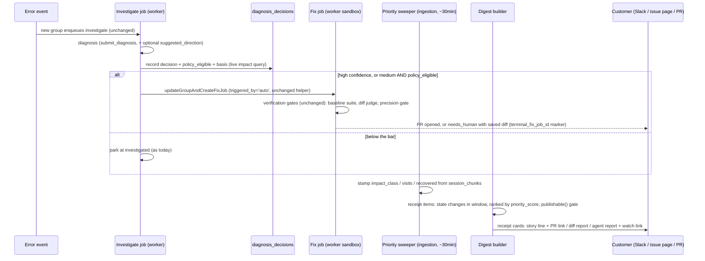

# Actionable Receipts: every customer-visible issue ships with something to act on

**Status:** superseded on program-level decisions by `docs/design/2026-08-10-unified-actionable-program.md` (v2, consolidated); this doc remains the detailed spec for Stream A, read through that page's decisions (confidence routing removed, judge added, `suggested_direction` dropped, gate moved to the readiness projection) · **Author:** Claude (session 2026-08-10, with Abhishek) · **Execution plan:** `docs/superpowers/plans/2026-08-10-actionable-receipts-v1.md` (to be re-cut) · **Reviewed:** 2 Codex iterations against the live repo (session `019fed7c`)

## 1. Problem

Opslane's promise is: error in, verified fix PR out, or an incident a human can act on. Measured against prod on Aug 10: of 163 open error groups (~118 affected users), 9 reached a PR and those 9 touched 2 users. That is a ~7% conversion by issue count and ~2% by user impact. The other 154 groups dead-ended in ways the customer either never sees or can do nothing with.

The daily digest makes the failure visible. The Aug 10 digest showed three Vue crashes with root causes truncated mid-sentence, no links, no buttons, and a "106 older issues still awaiting your review" footer. All three crashes had full file-level diagnoses stored in `error_groups.root_cause`, replay chunks covering the crash window, and (for two of them) source-mapped stacks. None of that reached the customer.

Three mechanical causes, each verified in code and prod:

1. **The fix waits for a click nobody knows to make.** Auto-fix requires a high-confidence diagnosis (`agent-fix.ts:429`). Medium-confidence diagnoses park at `investigated` with no notification (issue #257). The three digest crashes are all in this parking lot. When a fix attempt does run and exhausts its budget, the finished diff is discarded (`extractDiff` runs only on success, `agent-fix.ts:878`; issue #73).
2. **Impact is never computed.** Session recordings can show whether users were blocked (the schippers recordings show crash loops ending within seconds) but nothing reads them for this. The digest ranks by `users x occurrences` (`digest/build.go:218`), which put the customer's #1-priority issue at rank 74 and five capped unfixables in the top six.
3. **Copy is assembled, not computed.** The digest truncates `root_cause` at a fixed length, links nothing, and has no rule that an item must carry an action.

## 2. Goals and non-goals

**Goals**

- G1: Every item on a customer surface (digest, issue page, PR) carries at least one action: a fix PR link, a saved-diff failure report, a copyable agent report from a validated diagnosis, or a watchable recording.
- G2: The fix attempt runs before the digest goes out, for diagnoses that are substantive and issues that have impact. The digest ships receipts, not requests.
- G3: Impact ("blocked / degraded / invisible") is computed from session recordings by a mechanical query. No customer-facing sentence asserts a fact that is not backed by a stored field or query.

**Non-goals (load-bearing)**

- No friction-pipeline repairs. #316 (placeholder verdicts) is a prerequisite for friction receipt cards and is tracked separately; the publishing gate keeps invalid friction items off customer surfaces meanwhile.
- No queue re-ordering or reach-scaled budgets. Prod showed 2 priority inversions in 30 days; not worth the lease-contract risk.
- No new trigger value on fix jobs. `triggered_by` stays `'auto' | 'human' | null` (`db.ts:173`); policy attempts are `'auto'` jobs authorized by a recorded decision.
- No invented plain-language titles. The stored technical title stays until a real title source exists; the plain-language layer is the computed story line.
- No weakening of the fix pipeline's verification gates (baseline suite, diff judge, precision gate at `agent-fix.ts:1151`). This design changes when they run, never what they check.

## 3. User requirements

| # | Requirement | Verified by |
|---|---|---|
| R1 | A failed fix attempt that produced edits keeps its diff, visible as `candidate_diff` | Worker test at the `runAgentFix` boundary + persistence test on `updateGroupStatus` (`index.ts:1274`); live smoke |
| R2 | A medium-confidence `code_fix` diagnosis on an issue meeting the impact bar queues a fix job with no human click | `fix-policy.test.ts` (7 cases); live smoke: `investigate → fix` chain with no click |
| R3 | Automated fix authorization never bypasses `diagnosis_decisions`; the human bypass is untouched | Existing authorization tests stay green; new test: medium accepted only when its own decision row says `policy_eligible` |
| R4 | Impact class per issue is computed from recordings; unknown is represented honestly (all-NULL) | Go tests seeded with the schippers session shapes; `EXPLAIN (ANALYZE, BUFFERS)` on 100k events |
| R5 | Digest items are receipts: PR link, failed-attempt-with-diff, failed-attempt-without-diff, or report-ready; items with no action are held back and counted | Golden Slack-block tests per receipt state; gate test: placeholder-cause item never renders |
| R6 | Digest ranks by `priority_score`, the consumer the priority design doc promised | Build test seeded with the rank-1-vs-74 shape from prod |
| R7 | Issue page and PR body read impact-first, with the story line server-rendered from one template source | Go DTO test, dashboard component test, PR-body snapshots |
| R8 | Old outbox digest payloads still render after the payload change | Test unmarshals a captured v1 payload JSON string and renders via the legacy path |

## 4. System overview

Nothing new is built to think; the changes move existing machinery earlier and wire its outputs to surfaces. One new decision rule (worker), one new computation (ingestion sweeper), one payload restructure (digest), two reorders (issue page, PR body).

## 5. Component design

### 5a. Saved diffs on failure (worker)

`AgentFixResult` already has a `diff` field that `pipeline.ts:138` maps into `candidate_diff`. Today it is populated only on success. The change: on `budget_exhausted` / `tests_failed` exits that follow agent edits, run `extractDiff` before sandbox teardown and return it in the same field. Persistence needs no new path; `updateGroupStatus` at `index.ts:1274` already carries `candidate_diff`.

Why this way: the alternative (a new result field plus a new persistence branch) duplicates a contract that already exists. Failure classes that never produce edits (clone failure, missing key, authorization refusal) stay diff-less, and the digest renders them with the honest "failed before producing a change" receipt instead of pretending.

### 5b. Policy-widened authorization (worker): the riskiest decision

The rule today: automated fix jobs are authorized only by a high-confidence `code_fix` decision; human-triggered jobs bypass the decision check entirely (`agent-fix.ts:429`). The first draft of this design made policy jobs a second bypass. Codex review killed that, correctly: a bypass is an unaudited path, and one filler verdict reaching `awaiting_approval` (#316) already showed what unaudited paths do.

The human bypass survives the same argument because a click is its own audit trail: a named person chose the attempt, the job records `triggered_by='human'` and their optional guidance, and accountability sits with them. Policy has no person attached, so it must leave its justification in data; that is what `policy_eligible` and `policy_basis` on the decision row are for.

The design that survived review:

- At investigation completion, on a medium-confidence `code_fix` for an error-kind group, run a live impact query (project-scoped; anonymous sessions counted with the sweeper's `bool_and(end_user_id IS NULL)` semantics) and record the result **on the decision row**: `policy_eligible boolean`, `policy_basis jsonb` (`{"v":1,"identified_users":N,"recent_anon_sessions":N}`). Bar: at least 1 identified user or 3 recent anonymous sessions.
- Authorization loads the decision for the job's own `source_id` (newly exposed on `ClaimedJob`; today the newest group decision is loaded, `db.ts:92`, which lets a requeued old job be authorized by a newer decision). Accept `code_fix AND (high OR (medium AND policy_eligible))`. NULL `source_id` (legacy in-flight jobs) falls back to newest-for-group, pinned by a test.
- Reused pending fix jobs are re-pointed at the new decision (today `COALESCE` preserves stale linkage, `db.ts:1905`).
- Terminal adoption: `needs_human` currently stores no fix-job identity, and job completion happens in the poller (`poller.ts:130`), outside the handler, so a lease loss between the group write and completion would re-run the whole attempt. New column `error_groups.terminal_fix_job_id`, written in the same UPDATE as the terminal status; the adoption branch treats a match like the existing `pr_created` adoption.

Why the live query instead of `priority_inputs`: the sweeper stamps every ~30 minutes and investigation completes ~71 seconds after the first event; a new group has no stamp when the decision is made.

Cost ceiling: at current volume (175 investigations/30 days, 25 medium-confidence parked in the current book), policy attempts add at most a few sandbox runs per day, each bounded by the existing fix budget.

### 5c. Impact from recordings (ingestion sweeper)

Four nullable columns on `error_groups`: `impact_class ('blocked'|'degraded'|'invisible')`, `impact_visits`, `impact_visits_recovered`, `impact_computed_at`. Stamped by the priority sweeper on its existing cadence and advisory lock (`sweeper.go:221` area), in an explicit transaction (the sweeper has none today), with the rollup in a temp table so the stamp pass and the stale-clear pass read the same data.

A visit is a distinct session among the group's events (30-day window, its own named constant, not the priority or retention window) that has scrubbed chunks with non-NULL bounds. Recovered means last recorded activity at least 60 seconds after that session's last crash of this group. The thresholds come from the spike that motivated this: the schippers crash-loop sessions ended 0.1 to 16.5 seconds after their last crash, and the one recovered session continued 17 minutes; a 60-second line separates those cleanly. Unknown (never computed, or no qualifying sessions) is all four columns NULL; there is deliberately no way to distinguish "no recordings" from "unusable recordings" in v1, and the copy says "recording impact unavailable" for exactly that reason.

Why the sweeper and not ingest-time: impact changes as sessions close and chunks scrub, which happens minutes after events arrive; a periodic stamp is the correct freshness class, and the sweeper already owns "recompute group-level facts on a cadence."

### 5d. Digest receipts (ingestion)

The digest payload is three collections today (`TopNewIssues`, `PRsOpened`, `NeedsHuman`, `notify/event.go:27`) and `buildTopNewIssues` excludes groups that transitioned in the window, so receipt cards cannot be a field addition. The payload gains `SchemaVersion` and `ReceiptItems`; the Slack formatter branches on version so captured old outbox rows still render (R8).

Receipt items are groups whose receipt state changed in the digest window, ranked by `priority_score`, capped at 10 (Slack block budget). Each carries the fields the card needs, including `occurrence_count` (the story line needs it), a 300-char sanitized `root_cause` excerpt (outbox rows must not store full untrusted text), and `has_usable_diagnosis` from a join to `diagnosis_decisions`, because prose length does not validate a diagnosis; a hand-written or legacy `root_cause` must not pass the gate on its own. The legacy collections stay populated during the transition, so the payload carries both shapes until the formatter cutover is proven. A newly investigated medium-confidence group that parked below the impact bar appears once, as an "Investigation report ready" receipt (its state changed), then moves into the needs-decision triage count rather than repeating daily. On a day with no state changes the digest still sends the triage line ("N fix PRs awaiting review, M issues need a decision, nothing else needs you today"), an empty card list, and the held-back footer, so a quiet day is stated rather than silent.

The publishing gate is the enforcement of G1: usable diagnosis, non-placeholder cause, and at least one action, or the item is counted in "held back" and never rendered. Held-back counts only surfaced-eligible states (`needs_human`, `investigated`, `insight`); in-flight work is not "pending internal review."

Story copy is generated by a new `narrative` package (neutral home; `digest` imports `notify`, so templates in `digest` would cycle) and reused verbatim by the issue-page API, which is how the one-source-of-copy rule survives two surfaces.

### 5e. Surface reorders (dashboard, PR body)

Issue page: DTO adds impact fields, the server-rendered `story`, and a recordings list (per-session crash counts computed before the chunk-coverage join, coverage via `EXISTS`, so counts never multiply). Section order becomes: impact badge and title, what happened, recordings, why it crashed, the fix receipt, with forensic detail in the right rail. PR body: `getErrorGroup` (`db.ts:1155`) selects the impact fields and `suggested_mitigation`, `pipeline.ts` threads them, and `buildPRBody` (`pr.ts:388`) reorders to impact-first with verification rendered as check lines. The mocks from this session are the acceptance spec for both.

### 5f. Fix direction from the investigator (worker)

The old two-step investigation emitted `suggested_mitigation`; the single-tool rewrite dropped the field while the column, API exposure, and dashboard rendering all survived. One optional schema field (`suggested_direction`, clamped to 600 chars, threaded through `shared/src/diagnosis.ts`, `parseAdjudication` at `diagnose-schema.ts:216`, and the persisted-payload parser at `diagnosis-schema.ts:12`) restores production of it. The prompt invites the field with "skip it rather than guess."

## 6. Milestones

| M | Deliverable | Exit criterion |
|---|---|---|
| M1 | Worker: saved diffs + fix-direction field + policy authorization (plan tasks A1-A3) | Live smoke: medium-confidence fixture runs `investigate → fix` with no click and terminates `pr_created`, or `needs_human` with `candidate_diff` when edits existed; existing authorization tests green |
| M2 | Ingestion: impact columns + sweeper stamp + session pointers (B1-B2) | Go tests green with zero skips; seeded schippers shapes produce `degraded`/`blocked`/NULL exactly; `EXPLAIN` on 100k events shows no unbounded scan |
| M3 | Digest receipts (C1-C2) | Golden block tests per receipt state; captured v1 payload renders; one full digest rendered from prod-shaped seed and eyeballed before enabling (outward-facing gate) |
| M4 | Issue page + PR body (D1-D2) | Component and snapshot tests per state, including unknown impact |
| M5 | Grouping splinter (E1) | Diagnosis test names the differing fingerprint component; the two `bum` fixtures collapse; unrelated errors do not |

M1 and M2 are independent and can run in parallel. M3 gates on both. M4 gates on M2. M5 is independent.

## 7. Testing and validation

- **CI:** everything above except the live smoke and the digest eyeball: worker Vitest (result contracts, policy gate, adoption), Go tests (sweeper SQL against seeded shapes, coverage predicate edge cases including the 1ms-overlap chunk, payload version fallback from raw captured JSON).
- **Live (per repo AGENTS.md):** the pipeline smoke with the port-triple env block; confirm `go test ./...` reports zero skips; render one real digest before the Slack destination is switched over.
- **Prod readback (post-M3):** re-run the session's spike queries and confirm the digest's top item matches the priority ranking and every rendered item carries an action.

## 8. Risks and mitigations

- **Policy attempts open bad PRs.** Mitigated by unchanged verification gates: an attempt that fails them terminates as `needs_human` with a saved diff, not a PR. Residual risk: more medium-confidence attempts means more sandbox spend; bounded by the existing per-run budget and current volume.
- **Authorization refactor touches high-confidence jobs.** Source-linked decision loading changes behavior for all automated jobs. Mitigated by the NULL-source fallback and a test pinning legacy behavior; still the highest-blast-radius change in the design.
- **Impact misclassification.** A "blocked" badge on a survivable issue erodes trust. Mitigated by excluding NULL-bounded chunks, the all-NULL unknown state, and copy that only renders stored numbers. Residual: the 60s recovery threshold is a judgment from five sessions of evidence; it should be revisited when volume grows.
- **Digest payload migration.** Old outbox rows are re-rendered on retry; a formatter that assumes the new shape breaks them. Mitigated by `SchemaVersion` branching and R8's raw-JSON test.
- **Unsolved:** a group parked below the impact bar is not re-evaluated when later events cross it (it waits for the existing requeue rules), and an unreviewed fix PR does not reappear in later digests. Both are deliberate v1 choices awaiting owner sign-off, flagged in the plan's review report.

## 9. Alternatives considered

- **Policy as a second authorization bypass (first draft).** Rejected in Codex review: bypasses are unaudited paths, and the persisted-decision route costs one migration and gives an audit trail (`policy_basis`) for every automated attempt.
- **A new `triggered_by='policy'` value.** Rejected: it forces a type, enqueue-API, and claim-row migration for a distinction the decision row already records.
- **Impact from `priority_inputs` at decision time.** Rejected: 30-minute staleness against a 71-second decision point; brand-new groups have no stamp.
- **Ranking the digest by a new impact score.** Rejected: `priority_score` exists, is reach-based, and the priority design doc explicitly named the digest as its second consumer; the divergence measured in prod (rank 1 vs 74) is the bug.
- **LLM-written digest copy.** Rejected flatly: the friction "placeholder" incident showed what unvalidated generated prose does on a customer surface; this design's copy is templates over stored numbers.
- **Doing nothing until volume grows.** Rejected: the current book already contains 25 medium-confidence diagnoses affecting ~22 users that customers have never been told about.

## 10. What this doc does not solve

Friction is the honest gap. The highest-priority items in the book by reach (dead-click incidents, scores 24/21/15) ship no receipts under this design because their investigation layer produces placeholder verdicts (#316). The publishing gate hides them rather than fixing them. If #316 lands first, friction items slot into the receipt model with no payload changes, but this design does not schedule that work.
