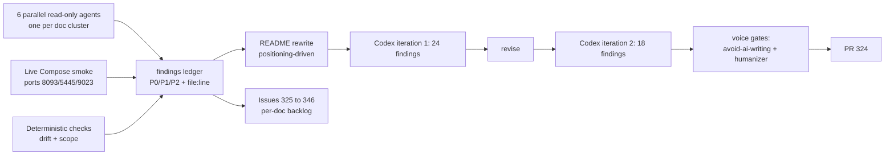

# Docs launch readiness: audit, README rewrite, and backlog

**Date:** 2026-08-12 · **Status:** PR #324 open with CI green; issues #325-#346 filed · **Audience:** the maintainer and anyone picking up a docs issue before launch.

This is a retrospective design doc: it records what was built, why it was built that way, and the verification evidence, so the remaining doc issues can be executed without re-deriving the method.

## Problem

The first command a launch visitor would copy from the README returned `401 Unauthorized`.

The docs were provably accurate on 2026-07-17: a baseline audit (`docs/audits/2026-07-17-public-docs-baseline.md`) verified all pages then published. In the four weeks after, ~25 merged PRs changed the product underneath the prose: structured project keys (#243), the endpoint-bearing source-map key hard cutover (#275), environment-as-SDK-label (#289), diagnosis-first investigation (#296), the C0/C1 receipts program (#317, #318). The deterministic reference pages stayed green because `scripts/check-docs-drift.mjs` re-verifies them on every `pnpm test`. The prose pages had no such protection, and by 2026-08-11 every class of prose claim had rotted somewhere:

- The README and self-host quickstart smoke test used `X-API-Key: e2e-test-key-plaintext`, a key `scripts/seed-e2e.sql` stopped creating at #243. Live result: 401.
- The GitHub App guide documented the wrong OAuth callback URL (`/auth/github/callback`; the server sends `/auth/callback`, `packages/ingestion/handler/github_oauth.go:99-103`), so new self-host sign-in could never work.
- The privacy pages made claims stronger than the code: "project deletion removes the map objects" (it writes a tombstone; no sweeper exists, migration `030_sourcemap_files.sql:16-38`) and "the complete browser-side masking list" (replay chunks carry unscrubbed request URLs and click selectors, `packages/sdk/src/network.ts:66-74`).
- The architecture pages described a "triage" pipeline stage deleted by #296 and a security-relevant webhook payload as "counts" when it carries customer account names (`packages/ingestion/notify/event.go:45-138`).

With a launch target roughly two weeks out, the README was also the wrong document even where it was accurate: written as a system summary rather than the argument the positioning doc (`positioning.md`, 2026-08-07) had already worked out against production data.

## Goals / non-goals

**Goals**

1. Find every wrong claim on the 20 public doc pages, with file:line evidence, before a stranger finds it.
2. Ship a launch-ready README built on the settled positioning, with every command proven against a live stack.
3. Turn the remaining findings into a backlog a contributor or agent can execute without re-auditing.

**Non-goals**

- Fixing all 20 pages now. The maintainer chose README-first, then one doc at a time with review; batch-fixing everything would have produced 20 unreviewed rewrites of trust-sensitive pages.
- Extending the drift checker to cover prose. Worth doing someday; out of scope here. Root causes are recorded where they were found: the prose-blind drift checker in #343, the one-way scope check in #345, and the stale `covers:` frontmatter that blinded docs-sync in #332 and #335.
- Producing launch media. The README carries three HTML-comment placeholders (hero, product tour, merged-PR screenshot); the assets are the maintainer's to record.
- Publishing the CLI. Decision recorded in #326: remove the agent quickstart instead.

## Requirements and proof

| # | Requirement | Verified by |
|---|---|---|
| R1 | Every command in the README runs as written against the shipped Compose file | Live execution 2026-08-11/12 with the worktree port overrides; the one delta from verbatim is the published port number, a parameterized default in `docker-compose.yml` (see Verification report) |
| R2 | Every checkable README claim is backed by code, or cut | Six-agent audit + two adversarial Codex reviews |
| R3 | No doc-machinery regression | `check-docs-drift.mjs`, `check-docs-scope.mjs`, full CI on PR #324, all green |
| R4 | Each remaining broken doc has an issue a stranger can execute | Issues #325-#346: findings with file:line evidence, a "verified correct, don't churn" list, and a definition of done |
| R5 | The README reads like the maintainer wrote it, not a model | avoid-ai-writing + humanizer gates: zero Tier-1 vocabulary, zero prose em dashes, mechanical scan in the verification report |

## How the audit worked

**Audit fan-out.** Six read-only agents, one per doc cluster (README+llms.txt; install+quickstarts; SDK guides; source-maps/GitHub/Slack guides; architecture; contracts+docs-site). Coverage boundary, stated exactly: every published prose page was audited (including the three published-but-unnavigable orphans), plus README and llms.txt; the four deterministic reference tables (routes, env vars, SDK options, reason codes) were trusted to the drift checker, and the one prose defect hiding on such a page (the stale `environment` description, #343) was caught anyway because a guide audit used it as ground truth and checked it first. Each got the same brief: verify every checkable claim against current code, report findings ranked P0 (burns a first-time user or makes a false trust claim) / P1 (wrong but survivable) / P2 (stale nit), and, deliberately, list claims verified still correct, so the fix pass doesn't churn accurate text. The audits also had the post-baseline PR list in their briefs, which is what let them find semantic drift (a described mechanism that was deleted) rather than only textual drift.

**Live smoke as ground truth.** A full Compose stack ran on offset ports (`INGESTION_PORT=8093`, `OPSLANE_POSTGRES_HOST_PORT=5445`, `OPSLANE_MINIO_HOST_PORT=9023`, per the AGENTS.md worktree scheme). Every command that ended up in the README was executed there, including the failure case: the documented-but-dead key was proven to 401 before the replacement was proven to 202. The smoke also caught a finding no static audit could: the self-host quickstart's expected output (`missing_github_token`) is no longer what happens. Diagnosis-first investigation (#296) misses `ANTHROPIC_API_KEY` first, so the real terminal row is `missing_llm_key`.

**Why agents plus selective live verification, not full mechanical re-verification.** Prose claims can't be drift-checked the way route tables can; the choice was between trusting careful reading anchored by executed spot-checks, or not shipping in time. The mitigation for audit error is the evidence rule: no finding was accepted without file:line evidence, and everything destined for the README's command blocks was executed, not read.

## The README design

Decisions, with the reasoning:

- **The argument comes from `positioning.md`, adapted in register, not content.** Hook: "Every error tracker has the same output: an alert. Opslane's output is a pull request." The positioning doc's rules were treated as constraints: never "proactive", let the nouns fight, do not soften the claim. Codex's first pass included five suggestions that would have softened positioning lines; all five were rejected on those grounds, and its second pass was told the rejections were settled. The distinction that made this workable: accuracy findings belong to the reviewer, register belongs to the maintainer.
- **Structure follows the trust-ordered reader-question spine** distilled from Meilisearch, Supabase, PostHog, and Sentry's READMEs plus two the maintainer picked (stably/orca, paperclipai/paperclip): what is it → is it real → how does it work → can I run it now → what's the catch → go deeper. Sentry is the counterexample that shaped the quickstart's priority: nine screenshot galleries, no install path.
- **Demo over stats.** None of the studied READMEs carries a numbers section; all carry visual proof. The production numbers (7,415 events → one PR for a crash hit 614 times) became a two-sentence caption under the PR-screenshot placeholder instead of a "proof" section.
- **"What each outcome means" defines all four terminal outcomes in one place** (ready PR, opt-in draft, `investigated`, `needs_human`). This exists because Codex iteration 2 caught my own v2 contradicting itself: "everything else becomes an incident" two sections away from an `investigated` outcome that isn't one.
- **"What Opslane is not"** (Paperclip's move) carries the honest scope: not an APM, not autopilot, not a dashboard to babysit, pre-1.0 except the frozen events wire contract.
- **Claim strength was tuned down to what the code enforces.** "The repository's own test suite ran" became "the build and test commands Opslane detected (or the project configured)" because monorepos get `TestPlan.kind: 'none'` (`packages/worker/src/harness/test-runner.ts:30`) and the suite is detected, not guaranteed. "A human reviews every one" became "Opslane opens pull requests but never merges them" because review policy is the repo owner's, not Opslane's.

## The backlog design

22 issues (#325-#346), roughly one per doc, because the maintainer directed doc-by-doc work with review. The mapping is not exactly one-to-one: react and vue share an issue (#329, shared findings, one fix pass), the SDK README rides with the sdk-options fix (#343), and four issues cover non-page surfaces: llms.txt (#344), the docs site (#345), the agent-quickstart removal (#326), and the missing CONTRIBUTING/SECURITY files (#346). Each issue carries: the findings with severity and file:line evidence; a verified-correct list (churn protection); a definition of done that includes the relevant checks; and a label from the repo's triage table: `ready-for-agent` where the fix is fully specified, `ready-for-human` where a policy call is needed (#342 contracts scope, #346 CONTRIBUTING/SECURITY). A tracking comment on epic #2 orders the eight P0-bearing pages first. Four issues record root causes, not just symptoms: stale `covers:` frontmatter blinding docs-sync (#332, #335), the prose-blind drift checker (#343), and the one-way scope check that made orphan pages invisible to CI (#345).

## Verification report

All commands run 2026-08-11/12 against branch `abhishekray07/docs-readme` at `c008410` (HEAD `8c29e79` + README commit), Compose project `opslane-docs-smoke`.

**Live smoke (R1)**

| Step | Command | Result |
|---|---|---|
| Boot | `docker compose up -d --wait` (Compose v5.3.1) | exit 0; one-shot `migrate`/`minio-setup` exited cleanly; all long-running services healthy |
| Health | `curl :8093/health` | `{"status":"ok","checks":{"database":{"status":"ok"},"minio":{"status":"ok"}}}` |
| Seed | `psql < scripts/seed-e2e.sql` | 3 inserts |
| Old documented key | `POST /api/v1/events` with `e2e-test-key-plaintext` | **401** (proves the P0) |
| Seeded key | same request with `opslane_pk_mzxw6…` | **202**, `{error_group_id, event_id, group_id}` |
| Terminal state | documented SELECT, ~20s later | `needs_human \| missing_llm_key \| ANTHROPIC_API_KEY environment variable is not set`, pasted into the README verbatim |

What the smoke does not prove: it never exercises the product's defining path (no investigation, no sandbox, no PR) because the stack deliberately has no AI or GitHub credentials. It was one run, on one machine, at one commit, using the worktree port overrides rather than the default 8082. It also verifies only the README's commands; the other pages' command blocks are covered by their issues, not by this run.

**Deterministic checks (R3).** `node scripts/check-docs-drift.mjs`: 76 routes, 80 env vars, 14 SDK options, 28 reason codes, 45 CLI agent status variants, 24 llms.txt paths consistent. `node scripts/check-docs-scope.mjs`: 24 published, 20 navigable (the 4-page gap is #345, pre-existing). Both green before and after the rewrite.

**CI on PR #324 (R3).** `ci-ok` pass. Docs-only classifier correctly skipped Go build/test, keyless smoke E2E, reliability lane, and image publish; JS build and test (4m27s), repo-wide checks (51s, includes the docs gates), secret scan, wire-fixture policy, CodeQL (4 languages), Compose validation, and the Cloudflare Pages docs deploy all passed.

**Adversarial review (R2).** Codex iteration 1: 24 findings; iteration 2 on the revision: 18. Roughly two-thirds were accepted in some form; the notable ones: the missing result-query command, `--wait`, the outcome-contract contradiction, overclaim reductions, per-integration egress enumeration, section reordering. Rejected with reasons: five positioning-softening suggestions (per `positioning.md`), the heredoc timestamp (static payload live-verified; simpler to paste), linking CONTRIBUTING/SECURITY files that don't exist (#346 instead). The `--wait` suggestion was itself live-verified before adoption rather than trusted.

**Voice gates (R5).** avoid-ai-writing then humanizer, both applied as edits. Final mechanical scan: zero Tier-1 AI vocabulary, zero em/en dashes outside HTML comments, three placeholders present.

**Audit yield (R2/R4).** Eight of the audited pages carried P0 findings; roughly 25 P1 and 30 P2 findings overall; four pages were clean enough to need no issue of their own.

## Risks and open items

- **The audit guards against false positives, not false negatives.** The evidence rule (no finding without file:line proof) and the Codex passes defend accepted findings; nothing measures what six readers missed. There was no cross-agent overlap, no sampled human re-audit, and no recall estimate: "find every wrong claim" is a goal, not a demonstrated property. The per-doc issues partially compensate (each invites re-verification against current code), and a second sweep near launch is the honest mitigation.
- **Prose will rot again, by the same mechanism.** Nothing added here re-verifies prose continuously; the drift checker still covers names and defaults only. The mitigations shipped are partial: root-cause issues (#343, #345), covers-frontmatter fixes in the guide issues, and this doc as the method record. A recurring re-audit (or the planned repo-local `docs-audit` skill) is the real fix, and it does not exist yet.
- **The production numbers in the README are not publicly auditable.** They come from the maintainer's prod verification of 2026-08-07 (recorded in `positioning.md`). Codex objected twice. Accepted risk, owner: maintainer. The merged-PR screenshot placeholder is the intended substantiation; if that asset doesn't materialize, the caption should be cut before launch.
- **Three placeholders ship dark.** HTML comments render as nothing, so an unfilled placeholder degrades to a missing section, not a broken page. Still, the "is it real" spine question stays unanswered until the assets land.
- **The audit was point-in-time at `8c29e79`.** Anything merged after (C-program work is moving fast) can invalidate findings in the open issues; each issue cites its evidence so staleness is checkable.

## Alternatives considered

- **Run the existing `docs-sync` skill.** It maps a branch's code diff to affected docs, and the branch was clean, so its input set was empty. The failure here was accumulated drift across many merged PRs, which diff-driven sync structurally can't see once the PRs are merged.
- **Install an ecosystem docs/README skill.** Surveyed (`create-readme` 16.9K installs, `crafting-effective-readmes` 4K, Diátaxis 557, ~10 others): all templates or frameworks, none encode claim-verification against code, which is the thing that actually failed here. Writing repo-local skills remains planned, informed by this work.
- **Fix all 20 pages in one pass.** Rejected by the maintainer mid-flight ("one doc at a time"), and correctly: the trust-sensitive pages (replay privacy, trust model, contracts) deserve individual review, and a 20-page docs PR is unreviewable.
- **Numbers-led "proof" section in the README.** Rejected after the exemplar study; see The README design.
- **Publish the CLI to unblock the agent quickstart.** Rejected by the maintainer for launch scope; the page is removed instead (#326).
