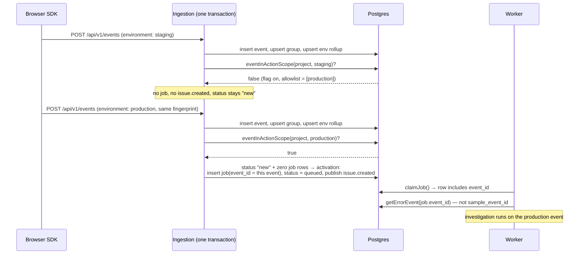

# Environment action scoping

Status: reviewed design (two Codex adversarial rounds); implementation plan at
[docs/superpowers/plans/2026-08-11-environment-scoping.md](../superpowers/plans/2026-08-11-environment-scoping.md)
Date: 2026-08-12
Prior art: [Environment labels with a project default](2026-08-05-environment-labels-project-default.md) established environment identity; this doc makes the pipeline act on it.

## In one paragraph

Every error event carries an `environment_id`, and nothing downstream reads it. A staging-only error gets the same LLM investigation, and potentially the same fix PR, as a production incident; the event a worker analyzes is whatever arrived last in any environment; one staging occurrence can reopen a resolved production issue. This design keeps grouping identity exactly as it is (`(project_id, fingerprint)`; environment never becomes identity) and makes environment a scoping dimension on *actions*. Jobs anchor to the event that triggered them. Customers choose which environments may trigger automation via a fails-closed allowlist. The dashboard opens on the project's default environment instead of mixing everything. It is Sentry's model (shared issue, environment-scoped alert rules), applied to a pipeline that spends real money per trigger.

## Problem

Ingestion tags every event and session with an `environment_id` and maintains per-environment rollups (`error_group_environments`, upserted at `packages/ingestion/db/queries.go:583`). Everything after that is environment-blind:

1. Investigations trigger unconditionally. A new error group enqueues a job with no environment check (`queries.go:657`). Investigations call an LLM and can open fix PRs; each trigger has a real dollar cost and an external side effect.
2. Evidence drifts under the worker. `error_groups.sample_event_id` is overwritten by every arriving event (`queries.go:558-566`). The worker fetches evidence through it (`packages/worker/src/index.ts:485-486`, `:1143-1144`), so the event it analyzes is whichever arrived last: any environment, and possibly not the event that created the job at all.
3. Any environment can reopen resolved work. The requeue path checks status (`resolved`, `needs_human`, `merged`; `queries.go:332-336`) and release order, never environment.
4. Priority runs on mixed totals. `occurrence_count` and `affected_users_count` sum across environments.
5. The dashboard feed opens unfiltered. `useEnvironmentFilter.ts:11-14` falls back to `''` (all environments). `projects.default_environment_id` exists and is populated, but nothing reads it at load.

Observed on the AMFJ project in production (2026-08-11): staging and production share one project key, so staging groups sit in the production feed: 87 production vs 7 staging groups over 14 days. Small blast radius there, but every one of those 7 groups was eligible to burn an investigation, and the wrong-evidence case in (2) is silent when it happens.

## Goals

- G1. A customer can restrict automatic investigation, fix, and requeue triggering to chosen environments, and the restriction fails closed.
- G2. An investigation analyzes the event that triggered it, not a pointer that other events mutate.
- G3. The dashboard opens on the project's default environment for users who never chose a filter.
- G4. Existing projects see zero behavior change until they opt in.

## Non-goals

- **Environment in grouping identity.** Environment labels are free-form customer strings with unbounded cardinality (a team running per-PR preview deploys can emit `preview-123`, `preview-124`, …). Splitting groups by environment would mint a group per label per bug and destroy the "hit staging yesterday, prod today" signal. Rejected in Alternatives.
- **Scoping notifications and digests.** `issue.created` keeps its current meaning (below); per-destination notification scoping is a follow-up.
- **Scoping data ingestion or retention.** Out-of-scope events still ingest, group, roll up, pin sessions, and age out on the existing retention schedule. Scope controls automation, not data.
- **A "pause all automation" switch.** Expressible today only as an enabled-but-empty allowlist; a first-class pause is a separate feature.
- **The friction pipeline.** It already encodes environment in its fingerprint (`friction:<environment_id>:<signal_fingerprint>`) and needs nothing.

## Requirements

| # | Requirement | Verified by |
|---|---|---|
| R1 | With scoping enabled and allowlist `[production]`, a staging event creates/updates its group and rollups but no job and no `issue.created` | Gate table test, case "out-of-scope event creates group, no job" (plan Task 7); live smoke step 2 (plan Task 9) |
| R2 | An in-scope event on a dormant group (status `new`, no job rows) enqueues it and publishes exactly one `issue.created` | Gate table test, activation case (Task 7) |
| R3 | Out-of-scope events cannot requeue `resolved`, `needs_human`, or `merged` groups; in-scope events can, still subject to `releaseNotOlder` | Gate table test, six requeue cases including an older-release case that must stay resolved (Task 7) |
| R4 | Enabled + empty allowlist blocks all automation; deleting the last allowlisted environment cascades membership but never flips the flag | Migration 047 test, cascade + flag-survival assertions (Task 6); gate table test, empty-allowlist case (Task 7) |
| R5 | A job's evidence is the event that triggered it; a later event may move `sample_event_id` but not the job's anchor | `TestAnchorSurvivesSampleOverwrite` (Task 4); worker `resolveEvidenceEventId` unit tests (Task 5) |
| R6 | Manually guided fix jobs bypass the scope and still get an evidence anchor (the sample at click time) | Guided-bypass test with empty allowlist (Task 7); `TestGuidedJobStampsCurrentSample` (Task 4) |
| R7 | The settings PATCH is atomic and validated: malformed UUID → 400, foreign environment → 400 with nothing changed, duplicates collapse | Handler table tests (Task 8) |
| R8 | A fresh browser session opens the feed filtered to `default_environment_id`; an explicit "all environments" choice survives reloads and project switches | Composable unit tests (Task 1); manual proof (Task 2) |
| R9 | Projects that never enable scoping behave byte-for-byte as today | Gate table test, unscoped case (Task 7); migration default `false` (Task 6) |

## System overview

Scope lives in two places: a flag + allowlist owned by project settings, and one gate inside the existing ingest transaction. Nothing new is added to the read path except default-filter behavior in the dashboard.



## Component design

### Schema: flag + allowlist join table (migration 047)

```sql
ALTER TABLE projects
  ADD COLUMN IF NOT EXISTS action_scope_enabled BOOLEAN NOT NULL DEFAULT false;

CREATE UNIQUE INDEX IF NOT EXISTS uq_environments_project_id_id ON environments(project_id, id);

CREATE TABLE IF NOT EXISTS project_action_environments (
  project_id UUID NOT NULL REFERENCES projects(id) ON DELETE CASCADE,
  environment_id UUID NOT NULL,
  created_at TIMESTAMPTZ NOT NULL DEFAULT now(),
  PRIMARY KEY (project_id, environment_id),
  FOREIGN KEY (project_id, environment_id)
    REFERENCES environments(project_id, id) ON DELETE CASCADE
);
```

**Why a join table and not `UUID[]`:** arrays can't enforce referential integrity: no validation of membership, no cleanup when an environment is deleted, and nothing stopping project A's row from naming project B's environment. The FK is composite because per-column FKs have exactly that last hole; referencing `environments(project_id, id)` makes a cross-project pair fail at the constraint. The unique index exists only because Postgres requires a matching unique key for a composite FK target (`id` alone is already the PK, so it costs nothing semantically).

**Why a separate flag instead of "no rows = unscoped":** the first design draft used row-presence as the signal, and review caught the failure mode. An `ON DELETE CASCADE` removing the last allowlisted environment, or a customer unchecking every box, would have silently re-enabled automation *everywhere*. With the flag, empty membership while enabled means "no environment may trigger automation." Wrong configuration now fails closed (too little automation) instead of open (surprise LLM spend and PRs from every environment).

### The gate (ingest transaction, `queries.go:653-720`)

```go
// Under READ COMMITTED this reads the statement snapshot at gate-query
// execution time — the configuration visible when this query runs decides.
func eventInActionScope(ctx context.Context, tx pgx.Tx, projectID, environmentID string) (bool, error) {
    var inScope bool
    err := tx.QueryRow(ctx,
        `SELECT (NOT p.action_scope_enabled)
                OR EXISTS (SELECT 1 FROM project_action_environments pae
                           WHERE pae.project_id = p.id AND pae.environment_id = $2)
         FROM projects p WHERE p.id = $1`,
        projectID, environmentID,
    ).Scan(&inScope)
    ...
}
```

Four branches replace today's two:

| group state | in scope | behavior |
|---|---|---|
| new group | yes | today's path: job (with `event_id`), status `queued`, `issue.created` |
| new group | no | group persists, rollups update; no job, no publish, status `new` |
| existing group | yes | **activation check first** (below), else today's requeue logic including `releaseNotOlder` |
| existing group | no | skip requeue logic entirely |

**Dormant activation** (the case that would otherwise strand groups): a group created by an out-of-scope event sits in status `new` with no job. A later in-scope event takes the `isNew=false` path into requeue eligibility, and `new` is not an eligible status (`queries.go:332-336`), so without a rule here the group is stuck forever. The activation rule: status `new` *and* zero `error_group_jobs` rows for the group → run the new-group path. The job-row check is the durable marker; nothing in the codebase resets a group to `new` today, but the check doesn't depend on that staying true.

**Why `issue.created` stays coupled to first enqueue** rather than moving to group creation: its consumers (webhooks, notification destinations) currently receive it exactly when automation begins. Moving it to creation would notify on out-of-scope staging groups (the very noise the allowlist exists to suppress) and would require auditing every consumer. Publishing at first enqueue (new-group *or* activation) preserves the meaning with no consumer changes.

**One deliberate bypass:** `EnqueueGuidedFixJob` (`queries.go:1290-1312`) never consults the gate. A human clicking "fix this" is explicit intent; the scope governs *automatic* spend.

### Evidence anchor (migration 046 + worker)

```sql
ALTER TABLE error_group_jobs
  ADD COLUMN IF NOT EXISTS event_id UUID REFERENCES error_events(id) ON DELETE SET NULL;
```

Every job insert stamps the triggering event: the ingest transaction's automatic paths use the event just inserted; guided jobs stamp the group's `sample_event_id` at click time. The worker's claim (`packages/worker/src/db.ts:307`, RETURNING at `:368`) surfaces it, and both evidence sites select through one helper:

```ts
export function resolveEvidenceEventId(
  job: { eventId: string | null },
  group: { sample_event_id: string | null },
): string | null {
  return job.eventId ?? group.sample_event_id ?? null;
}
```

**Why `ON DELETE SET NULL`:** retention deletes old events; a restrictive FK would break cleanup, and cascade would delete job history. `SET NULL` degrades to today's behavior (sample fallback) in a window that practically never occurs: retention horizons are weeks, job lifetimes are minutes. The anchor is worth doing even without scoping. Today a burst of events can move `sample_event_id` between enqueue and claim, so the worker can investigate a different event than the one that created the job. That's a live bug; the anchor fixes it for every project, scoped or not.

`sample_event_id` itself is untouched: it stays the latest-arrival display pointer, matching how the issue list already reads.

### Dashboard default (`useEnvironmentFilter.ts`)

Fallback order becomes: URL query → stored per-project choice → `project.default_environment_id` → none. Three details carry the design:

- The stored key becomes per-project (`opslane_environment_id:<projectId>`); the current global key leaks one project's choice into every other project.
- Clearing the filter stores an explicit `__all__` sentinel, persisted *synchronously* in `clear()` before any watcher or in-flight `loadOptions` can observe the empty selection; otherwise the default races back in and the user's "show me everything" doesn't stick.
- The default is applied only inside `loadOptions`, after the environment list confirms the default still exists and the filter is actually available. Applying it at ref-initialization would let a stale default become an invisible active filter.

The project's default arrives on the project object views already load (`packages/dashboard/src/api.ts:151`); `listEnvironments` doesn't change.

### Settings surface

The existing project-settings PATCH (`packages/ingestion/handler/read_api.go:684-735`, where `default_environment_id` already lives) gains one tri-state field:

| `action_environment_ids` | meaning |
|---|---|
| omitted | unchanged |
| `null` | scoping off, membership cleared |
| `[]` | scoping on, nothing allowed |
| `[ids…]` | scoping on, membership replaced |

Malformed UUIDs and environments belonging to another project are 400s that change nothing; the whole PATCH (this field plus any other settings in the request) commits in one transaction. Project GET/list responses gain `action_scope_enabled` and `action_environment_ids`. The dashboard Settings page renders a toggle plus per-environment checkboxes, with fails-closed copy under the empty state: "No environments selected — automatic investigation is off for this project."

## Milestones

Commit order is not deployment order: each slice's rollout is sequenced so a customer can never configure a scope the ingest path ignores.

| Slice | Delivers | Exit criterion | Plan tasks |
|---|---|---|---|
| S1 | Dashboard default filter | Fresh browser opens filtered to the project default; explicit "all" survives reload and project switch | 1–2 |
| S2 | Evidence anchor | `TestAnchorSurvivesSampleOverwrite` green; worker prefers `job.eventId` at both sites. Deploy: migration → worker → ingestion | 3–5 |
| S3 | Action scope (tracer bullet) | Live smoke: staging event → group + rollup, zero jobs, zero `issue.created`; production event → one job anchored to it, `queued`, one `issue.created`. Deploy: schema → gate everywhere → settings surface | 6–9 |
| S4 | Scoped priority counts | Separate follow-up plan: occurrence counts from in-scope rollups; `error_group_affected_users` gains an environment dimension so scoped user counts use `COUNT(DISTINCT end_user_id)` without cross-environment double-counting; guarded by the existing `rollup_ready` signal | not in this plan |

After S3 lands, AMFJ opts in to `[production]`, the first real consumer.

## Testing & validation

- CI, no database: composable unit tests (precedence, sentinel, per-project keys); worker `resolveEvidenceEventId` unit tests.
- CI, database-gated: migration tests including idempotence by re-executing the SQL directly (the runner records applied migrations, so re-running the runner proves nothing); the 12-case gate table test; anchor stamping and immutability tests; PATCH handler table including the 400-leaves-everything-unchanged assertion. These suites *skip* rather than fail without `DATABASE_URL`; CI exports it, and local verification reads the skip count.
- Live smoke (S3 exit): the two-event sequence above, run against the compose stack per repo `AGENTS.md`, reusing the existing e2e suite's terminal-state contract rather than inventing a parallel one.

## Risks & mitigations

- The gate sits on the ingest hot path. One additional single-row indexed query per event inside a transaction that already does several. Mitigation: the query is a PK lookup plus an EXISTS on a two-column PK; if profiling ever shows it, the flag read can fold into the existing project lookup. Not pre-optimized.
- Scope edits race concurrent ingestion. Contract, not lock: under READ COMMITTED the configuration visible at gate-query execution decides; a concurrent PATCH applies to gates that execute after its commit. Already-enqueued jobs are never retroactively cancelled.
- A group's visible sample can disagree with the scope. An environment-filtered issue list can still show a cross-environment `sample_event_id`. Accepted for v1 (display only; evidence uses the anchor); revisit if it confuses users in practice.
- Customers misread "empty allowlist". It means automation *off*, not *unscoped*. Mitigated by the explicit UI copy and by the direction of the failure: too little automation, visible in the feed as groups sitting in `new`, rather than silent spend. One interaction to know: with S1's default filter active, an out-of-scope group from another environment is outside the default view. It's in the data and one filter click away, not on the opening screen.
- The unsolved one: notification destinations still fire for every environment once a group activates. A staging-heavy project that widens its allowlist inherits staging notification noise until notification scoping (the named follow-up) exists.

## Alternatives considered

- **Environment in the grouping fingerprint** (how our own friction pipeline works). Rejected for errors: unbounded label cardinality mints unbounded groups, splits one bug's history across environments, and breaks release-based dedup. Friction keeps it because its identity is already local by construction: a friction group is "this behavior, on this page, in this environment," so environment adds one dimension to an identity that never aggregated across surfaces. The cardinality objection doesn't bite there, because friction groups never claimed cross-environment continuity in the first place. An error is a code defect that exists independently of where it fires.
- **`UUID[]` column on `projects` instead of a join table.** Rejected: no referential integrity, no deletion cascade, cross-project leakage possible, and empty-vs-null semantics get encoded in application code instead of schema.
- **Row-presence as the enable signal (no flag).** Rejected after review: cascade-deleting the last environment fails open. See Component design.
- **Moving `issue.created` to group creation.** Rejected: changes the event's meaning for every existing consumer and notifies on exactly the groups scoping intends to silence.
- **Environment-only job context (no `event_id`).** Rejected: multiple events in one environment still race; only an event anchor makes the evidence immutable, and it fixes a pre-existing bug besides.
- **Sentry-style per-rule scoping (each alert rule carries its own environment).** Deferred, not rejected: we have one automation trigger today, so one project-level scope suffices; per-destination scoping returns with notification scoping.

## Known limitations

Stated flat: until S4, priority still ranks scoped projects by cross-environment totals, so a staging flood can inflate a group's priority even though staging can't trigger anything. And `affected_users_count` stays a global number everywhere until the S4 schema adds the environment dimension. Both are visible-but-bounded: they affect ordering, never triggering.
