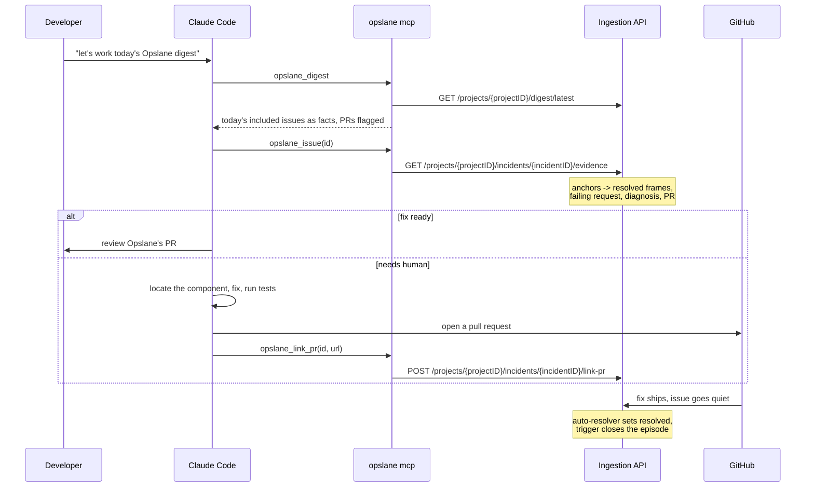

# Working the Opslane digest from Claude Code (against the landed pipeline)

Status: specification, not built. Supersedes `docs/design/2026-08-14-opslane-mcp-surface.md`,
which was written against the pre-rewrite schema.

The pipeline rewrite has landed on `main` (migrations 054 through 059). This document
is written against that code, not against the plan that produced it.

## Problem

A developer reads the daily Opslane digest in Slack, picks something worth fixing, and
then has to open the dashboard to act on it. The context Opslane already gathered lives
in a web UI, so the developer reads a title on their phone, walks to their editor, and
starts from a blank prompt. The marketing promise is that they never open a dashboard.
Today, acting on a digest item means opening one.

The rewrite makes this worse in one specific way and better in another. Worse: the digest
is now model-authored prose, so the structured facts a coding agent needs are one layer
below what Slack shows. Better: every issue now carries a customer-facing `state`
(`inboxState`, `packages/ingestion/handler/read_api.go:201`) and its evidence is frozen
and addressable, so a good answer exists to give the agent if we expose it. That state
is present for issues that have an episode; pre-rewrite issues, friction buckets, and
archived issues carry none (`attachPipelineState`, `read_api.go:228`).

## What this builds

Three MCP tools inside the existing `@opslane/cli`, run as `opslane mcp` over stdio, and a
Claude Code skill that drives them:

- `opslane_digest()` returns today's model-selected issues as facts, not prose.
- `opslane_issue(id)` returns everything Opslane knows about one issue, rich enough to fix
  without a second system.
- `opslane_link_pr(id, url)` records a pull request against an issue.

And the server-side reads and one write they need, because none exist yet.

This replaces the MCP surface that already ships. `cli/src/mcp/tools.ts` registers three
pre-rewrite tools against the old friction schema: `opslane_worklist`, `opslane_issue`, and
`opslane_resolve`. `opslane_resolve` writes `resolved` (`client.ts:88`), which this design's
non-goals forbid, so it is deleted rather than renamed. `opslane_worklist` becomes
`opslane_digest`. The CLI-side files that assume the old shape (`format.ts`, `client.ts`,
built around `element_selector` and `/incidents?kind=friction`) are rewritten against the
new endpoints. `opslane mcp` and `opslane init-claude` are already wired
(`cli/src/index.ts:176,186`); only the tools, the skill, and the client change.

A glossary, because the rewrite renamed the nouns:

- An **issue** is a stable problem. Its database row is an `error_group`; its identity is
  settled after stack resolution rather than at write time.
- An **episode** is one open round of work on an issue. A resolved issue closes its
  episode; a later recurrence opens a new one.
- The **digest** is the daily message. A Go query freezes a candidate set, then a model
  chooses which candidates to `include` and writes prose for each (`DigestPayload`,
  `packages/worker/src/digest-writer/schema.ts`).
- **Resolution** is a status of `resolved` on the issue. A database trigger then closes
  the open episode (`055_close_episodes_on_resolution.sql`).
- A **pull request** attached to an issue lives on `error_groups`: `pr_url`, `pr_number`,
  `pr_created_at`, and `status = 'pr_created'` (`error_groups`, `001_baseline.sql:83,91`; `pr_created_at` added in `006_admin_observability.sql:4`). It does not live on
  `diagnosis_decisions`, which records only the diagnosis. The merge webhook matches a PR
  by `github_repo` + `pr_number` + `status IN ('pr_created','pr_draft')`
  (`queries.go:1876`), so those columns, not the URL alone, are what make a merge resolve.

## Goals

Work one digest item end to end from a Claude Code session: read it, find the code, fix
it or review Opslane's fix, record the pull request. Never open the dashboard.

Hand a coding agent everything Opslane learned about an issue, so a `needs_human` is
fixable from the editor and a `verified_fix` is reviewable there.

Ship against the landed pipeline, reusing its frozen evidence rather than recomputing it.

## Non-goals

**Choosing what matters.** The MCP shows the model's selection. It does not re-rank, filter,
or second-guess the digest. If the selection is wrong, that is pipeline work.

**Marking anything resolved from a human claim.** No tool writes `resolved`. A fix is
resolved when it ships and the issue goes quiet, which the pipeline's auto-resolvers and
the closure trigger already handle.

**Reproducing the dashboard.** The dashboard is for browsing every issue. The MCP is for
working the day's selection. The list is the digest's `included` set, not the full inbox.

**Serving the worker's evidence assembly.** The worker builds its own evidence for the
inquiry. The MCP reads the same frozen anchors through a Go endpoint rather than sharing
the worker's TypeScript. Two readers of one frozen source, not one shared function.

## Requirements

| | Requirement | Verified by |
| --- | --- | --- |
| R1 | A developer sees today's model-selected issues | `opslane_digest` returns the `included` set of the latest delivered `digest_run` |
| R2 | Each list row carries enough to choose without a second call | A row has the issue, its `state`, affected users or accounts, and a PR URL when one exists |
| R3 | An issue that already has a PR is flagged with its URL | A row shows `error_groups.pr_url`, already stamped onto the delivered digest card (`digest/validate.go:144`) |
| R4 | A developer sees a resolved stack pointing at real source | `opslane_issue` returns frames from `error_event_resolutions.envelope`, read through the episode's anchors |
| R5 | A `needs_human` friction issue is locatable | `opslane_issue` returns the failing request from `session_request_failures` when the diagnosis alone does not name a component |
| R6 | The developer sees what Opslane already tried | `opslane_issue` returns the diagnosis outcome and `decision_reason` from `diagnosis_decisions`, and `error_groups.pr_url` when set |
| R7 | A developer records a PR | `opslane_link_pr` writes `error_groups.pr_url/pr_number/pr_created_at` and sets `status = 'pr_created'`, refusing to overwrite an existing `pr_number` |
| R8 | Recording a PR does not claim the issue is fixed | `opslane_link_pr` does not set `resolved`; the pipeline resolves on merge-and-quiet |
| R9 | Customer text reaches a model as data | Titles, routes, and diagnosis text are fenced, and the fence cannot be closed by its content |
| R10 | The protocol is not corrupted by logging | An `initialize` exchange returns one line of JSON-RPC and stderr is empty |

## System overview

## Component design

### `opslane_digest()`

Reads the latest delivered `digest_run` (`status = 'delivered'`) and returns the cards in
its `rendered_payload.digest.generated_cards` as structured facts. These are the model's
`included` set after validation dropped any card whose claimed counts did not match the
frozen candidate (`digest/validate.go:128`), so they are the delivered set, not the raw
model output.

**Why the delivered run, not a live query.** The developer arrives having read the Slack
digest. A live query would return a different set, so the item they came for might be
missing or joined by items they never triaged. The digest is only useful because it is the
same list. The run is already frozen and stored in `digest_runs.rendered_payload`, so this is a read,
not a recomputation. The same "latest delivered" query already runs in
`cmd/digest-eval/main.go:44`.

**Why facts, not the model's prose, and why this is nearly free.** Two payload columns are
easy to confuse. `writer_payload` (also `payload`) holds the model's `{included, deferred}`
output (`digest-writer/schema.ts`), written for a person. `rendered_payload` holds the
delivered `GeneratedDigestCard`s (`notify/event.go:78`), and `digest/validate.go:144` stamps each
one with the system's own `incident_id`, `title`, `affected_users`, `accounts`, and
`pr_url` taken from the frozen candidate, not the model. So the delivered cards already
carry system-truth facts. The list reads them and joins only `inboxState`, which the
`generated_cards` do not include. It keeps the model's one-line `action` as a hint.

**Why the PR flag is a first-class field.** A `verified_fix` row means Opslane already
opened a PR. The developer's job there is review, not authoring, and burying the URL inside
a detail call would cost a round trip per row. The URL rides on the list row.

### `opslane_issue(id)`

Everything known about one issue, assembled from the frozen evidence so a coding agent can
act without opening anything else.

**Why it reads anchors, never `sample_event_id`.** The pipeline freezes three evidence
events per episode in `issue_evidence_anchors` (`anchor_kind` of `threshold`, `first`,
`recent`). `sample_event_id` is rewritten on every new occurrence
(`db/queries.go` rewrites it), so reading it would hand the agent a moving target. The
detail view reads the anchored events, which are stable.

**Why the resolved stack comes from `error_event_resolutions`.** The rewrite resolves
stacks to source before grouping and stores the frames in `error_event_resolutions.envelope`
as JSONB. Reading that gives the agent file and line against the developer's own tree. The
old `sample-event` endpoint returned only the raw minified stack; this is the field that
was missing.

**Why the failing request is included for friction.** A `needs_human` friction issue often
cannot be located from the diagnosis alone, because the selector is positional and its
classes are generated at build time. `session_request_failures` carries the route, method,
endpoint pattern, and status for the failing action, which points the agent at the network
call behind the dead click. This is the cheapest evidence that closes the friction gap.

**Why it hands over the diagnosis and the attempt.** The issue carries a diagnosis outcome
of `verified_fix`, `needs_human`, or `unable_to_establish_cause`, plus a summary and a PR
when one exists. For a `needs_human`, that summary is where the agent starts. For a
`verified_fix`, the PR is what it reviews.

**Bounded and fenced.** Every field is capped, the payload is capped, and truncation is
marked. Titles, routes, and diagnosis text come from customer browsers or a model, so they
are wrapped and the wrapper cannot be closed by its content.

### `opslane_link_pr(id, url)`

Records a pull request against an issue. The only write.

**Why it is symmetric with Opslane's own PR.** A PR attached to an issue is one fact: a
fix is in flight at this URL. It does not matter who opened it. Opslane records its own PR
on `error_groups` (`pr_url`, `pr_number`, `pr_created_at`, `status = 'pr_created'`); the
developer's PR goes in the identical columns. There is no separate developer-PR record.

**Why it sets `status = 'pr_created'`, which is required, not optional.** The merge webhook
matches on `pr_number` and `status IN ('pr_created','pr_draft')` (`queries.go:1876`). Write
the URL without the status and the merge never matches, and the issue never resolves. This
is the exact bug that reached a green test suite in the pre-rewrite design. Setting the
status is not a claim the fix works; it is the claim that a PR exists, which just became
true. `resolved` is still never written here.

**Why it refuses to overwrite an existing `pr_number`.** Forcing `pr_created` over a group
that already holds Opslane's own `pr_number` would clobber Opslane's PR association and
break the merge match for that PR. So the write is guarded: it refuses when `pr_number` is
already set, and it confirms the PR's repository matches `projects.github_repo` first. The
repository check is mandatory here, not the optional nicety Open-Q4 once called it.

**The cost of setting `pr_created`: the merge webhook becomes the only resolver.**
`resolveInactiveGroups` excludes `pr_created` (`db.ts:1668`), so a linked PR that is
abandoned, or that lands in a repository other than the project's, strands the issue in
`pr_created` with no auto-resolution. The repository guard removes the wrong-repo case; the
abandoned-PR case is a real edge the pipeline does not currently sweep.

## Server-side work

Three reads and one write, all Go, all reused by the dashboard.

**`GET /projects/{projectID}/digest/latest`.** Returns the latest delivered run's `included`
episodes joined to issue facts and `inboxState`. New. Nothing serves the digest today.

**`GET /projects/{projectID}/incidents/{incidentID}/evidence`.** Assembles the detail bundle from
`issue_evidence_anchors`, `error_event_resolutions`, and `session_request_failures`. New.
The incident endpoint already carries `state`, `episode_id`, and priority
(`read_api.go:201`), but not the frozen frames or the failing request.

**`POST /projects/{projectID}/incidents/{incidentID}/link-pr`.** Writes `error_groups.pr_url/pr_number/`
`pr_created_at` and `status = 'pr_created'`, guarded against overwriting an existing
`pr_number` and against a foreign repository. New.

Two things are more built than a first look suggests, and the evidence endpoint should lean
on them. The incident detail endpoint already returns per-issue `state`, `episode_id`, and
the anchor `evidence_event_ids` via `IssuePipelineRecords` (`db/inbox.go:28`,
`read_api.go:259`). And `packages/worker/src/evidence/bundle.ts` `loadEvidence` is a
complete blueprint for the bundle: frames from `error_event_resolutions.envelope` through
the anchors, failing requests from `session_request_failures`, a `recordingAvailability` of
`available`/`partial`/`expired`/`missing`, and a replay pointer. The Go endpoint is a port
of it. Only the frames and the failing-request assembly are genuinely net-new; the anchor
IDs are already exposed.

## Milestones

| | Deliverable | Exit criterion |
| --- | --- | --- |
| 1 | `GET /projects/{projectID}/digest/latest` | The latest delivered run's `included` set returns as facts with state and PR URL; a project with no delivered run returns an empty set, not an error |
| 2 | `GET /incidents/{id}/evidence` | An issue returns resolved frames from its anchors and the failing request; an issue whose recording expired returns stated availability, not an error |
| 3 | `POST /incidents/{id}/link-pr` | A PR sets `error_groups.pr_number` and `status='pr_created'`, then a merge webhook drives the issue to `merged`; a foreign repo and an already-set `pr_number` are both refused |
| 4 | The three tools over stdio | `tools/list` returns exactly `opslane_digest`, `opslane_issue`, `opslane_link_pr` and no others, so a leftover `opslane_resolve` fails the check; stderr is empty during `initialize` |
| 5 | The rewritten skill and tools | From a linked repository, a fresh session works one item start to finish without the dashboard. `opslane init-claude` already ships, so only the skill and the three tools are new here |

Milestone 4 is gated on 1 through 3.

## Testing and validation

Go handler tests drive the real router with a real database and a real session token.
Database-gated tests skip when `DATABASE_URL` is unset, so read the skip count before
trusting a green suite. Note the pattern is not uniform: `digest/build_test.go:20` falls
back to the Compose DSN rather than skipping, so a bare `go test ./...` still exercises that
package.

Vitest covers the pure parts: digest partitioning, fencing, rendering, and tool
registration. Client tests mock `authedFetch`.

Two things need a live run: the stdio cleanliness check, because a stray `console.log`
anywhere in the import graph corrupts the protocol, and Milestone 5, which is a person
working an item.

## Risks

**Duplicate projects make the wrong project reachable.** Production has multiple projects
named AMFJ sharing a repository. The MCP picks a project from the git remote, so it can pick
the wrong one, and `link_pr` would write to it. The repository check does not help here: the
duplicates share a `github_repo`, so it passes for both. Worse, the merge webhook matches on
`github_repo` and `pr_number` without scoping to a project (`queries.go:1878`), so a
`pr_number` that collides with a sibling project's Opslane PR could resolve the wrong
project's issue. The `link_pr` write is what makes that reachable. The real fix is
de-duplicating the AMFJ projects, which is upstream.

**Evidence availability degrades.** Recordings and source maps expire. The evidence endpoint
must state what is missing rather than fail, or a coding agent treats an expired recording
as an empty one.

**A linked PR can strand an issue in `pr_created`.** Once the write sets `pr_created`, the
merge webhook is the only resolver, because `resolveInactiveGroups` excludes that status
(`db.ts:1668`). A PR opened and then abandoned leaves the issue stuck. The repository guard
handles the wrong-repo case; the abandoned case needs a pipeline sweep that does not exist
yet, and is worth flagging to whoever owns resolution.

**The digest may be empty or thin.** The pipeline is new. If a day's run includes few
issues, the MCP is honest but sparse. This surface delivers the selection; it cannot enrich
it.

**The evidence assembly is a second implementation.** The Go endpoint ports `loadEvidence`
from the worker's TypeScript (`evidence/bundle.ts`). They read the same frozen anchors, so
they select the same events, but the two shapes are authored separately and can drift. The
mitigation is to mirror `loadEvidence` field for field and test both against one fixture,
rather than designing a fresh shape.

## Alternatives considered

**Read the model's prose cards directly.** Rejected. The cards are written for a human
reader. A coding agent wants facts, and the facts are one join below the prose.

**Reuse the worker's `loadEvidence` over HTTP.** Rejected. It would make the inquiry, a
batch job, depend on ingestion being up at request time, which it does not today. The two
services share a database and nothing else, and the plan keeps it that way.

**Serve the full inbox instead of the digest.** Rejected for the list. The inbox is for
browsing; the day's work is the digest's selection. The inbox belongs behind a future tool,
not this one.

**A standalone `@opslane/mcp` package.** Rejected. Only `opslane login` produces a session
usable on these routes, and it lives in the CLI. A standalone package would reimplement
auth to avoid a dependency it would then recreate.

## Open questions

**1. Should `opslane_digest` fall back to the inbox when there is no delivered run today?**
A developer working before the daily run has nothing to read. Falling back to recent
`needs_human` and `fix_ready` issues would fill the gap but breaks the "same list as Slack"
guarantee.

**2. Should the evidence endpoint be one call or several?** One call is fewer round trips
but a larger payload with expiry-dependent parts. Several calls let the agent pull the
replay only when it needs it. My lean is one call with the replay as a pointer, not the
bytes, matching `loadEvidence`'s existing `ReplayPointer`.

**3. Should a developer be able to relink after abandoning a PR?** The write refuses to
overwrite an existing `pr_number`, which protects Opslane's PR but also blocks a developer
who opened the wrong PR and wants to correct it. A relink path would need to distinguish
"replace my own abandoned PR" from "clobber Opslane's".

## The honest caveat

The detail view assumes the frozen evidence is enough for a coding agent to fix a
`needs_human` from the editor. This has never been driven from a real production issue
through the new pipeline. The anchors, resolutions, and session failures all exist as
tables; whether their contents, assembled, let an agent find and fix a component is
untested. One session with one real issue would answer it, and it should happen before
Milestone 5 rather than after.
