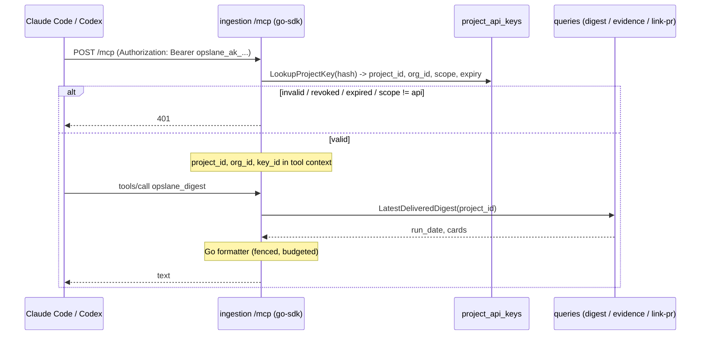

# Remote MCP Server (bearer-token v1)

**Status:** proposed
**Author:** Abhishek Ray
**Date:** 2026-08-22
**Reviewed by:** Codex (multiple rounds against the repo) and a doc-only reader test

**Problem in one line:** using Opslane's MCP tools today requires installing a CLI and running a multi-step local setup that has shipping bugs and cannot be reached from a hosted client.

**One user outcome:** a developer adds a URL and a token to Claude Code or Codex, and the three Opslane tools work. Nothing installed.

**Riskiest decision:** authenticate with a static bearer token now and defer OAuth, betting that a revocable project-scoped key is enough for the first release.

---

## 1. Problem

The three MCP tools (`opslane_digest`, `opslane_issue`, `opslane_link_pr`) run today as a local stdio server inside the `@opslane/cli` package (`cli/src/mcp/server.ts`, `cli/src/mcp/tools.ts`). To use them a developer must install the CLI, then run `opslane login`, `opslane setup`, and `opslane init-claude`, after which Claude Code launches `opslane mcp` as a subprocess.

Three things are wrong with that path for an MCP-first product:

1. **It forces a local install and two credential files.** `opslane mcp` reads a session token from `~/.opslane/credentials.json` and a repo-to-project mapping from `~/.opslane/agent-credentials.json` (`cli/src/mcp/client.ts` resolves `api_url` and `project_id` from the latter). Both must exist before a single tool call works.

2. **`setup` has two shipping bugs.** When the server reports a repo is already configured, the CLI prints the response and returns without writing local credentials (`cli/src/setup.ts`, the `already_configured` branch calls `jsonOutput(body); return;`). On a fresh machine that leaves `opslane mcp` with nothing to read. Separately, the package is marked `"private": true` while declaring a `bin` (`cli/package.json`), so it cannot be installed globally, which is the very thing `init-claude` assumes when it writes `{"command": "opslane"}` into `.mcp.json`.

3. **A local stdio server cannot be reached from a hosted client.** Claude Code and Codex both support remote MCP servers over HTTP. The local model rules that out.

The CLI is also large, and most of its weight is SDK-onboarding machinery unrelated to working the digest: `cli/src/onboard/` and `cli/src/codemods/` measure about 7,500 lines together. That is scoped in a separate decision and is not this document's subject, but it is the backdrop: the MCP path is a thin slice buried in a heavy package.

The product bet is MCP-first: a developer works the daily digest from a coding-agent session and never opens the dashboard. A remote server that takes a bearer token removes the install, the two credential files, and both `setup` bugs at once.

## 2. Goals and non-goals

**Goals**

- A remote MCP server that Claude Code and Codex connect to over HTTP with a static bearer token in the client config.
- Reuse the three existing tools and the ingestion endpoints added in PR #400 as the data layer.
- The token selects the project, so there is no repo-to-project mapping to build.

**Non-goals** (each is a deliberate scope cut)

- **OAuth.** It is phase 2. Both Claude Code and Codex require Dynamic Client Registration in practice for MCP OAuth (open issues confirm it: claude-code #67258 and #3273, codex #19154 and #15818), which is more surface than a first release needs. Section 9 covers why bearer-first is not throwaway work.
- **SDK onboarding.** Getting instrumentation into a customer app is a separate job with its own decision; this document does not touch `onboard`/`snippet`/`codemods`.
- **Per-user attribution on `link_pr`.** The current mutation records project, incident, and PR state but no actor (`packages/ingestion/db/queries.go`, `LinkPR`). Bearer v1 keeps that; per-user identity arrives with OAuth.
- **The CLI itself.** Its deletion is a follow-up PR, gated on this landing.

## 3. User requirements

| ID | Requirement | Verified by |
| --- | --- | --- |
| R1 | A developer adds one URL and a bearer token to Claude Code or Codex and the three tools work | Slice 3 end-to-end test: a real streamable-HTTP client lists tools and calls `opslane_digest` against seeded data |
| R2 | The token is durable and revocable | Revoke endpoint plus a test that a revoked key gets 401 |
| R3 | The token selects the project with no repo mapping | `project_id` carried in the verified token context; `opslane_digest` returns that project's cards |
| R4 | A token for project A cannot read project B | Tenancy test: an incident id from another project resolves to not-found or an empty bundle, never another tenant's data, because every query filters by the token's project id |
| R5 | The three tools return the same content a developer sees today | Go formatter parity tests ported from `cli/src/__tests__/mcp-digest.test.ts` and `mcp-format.test.ts` |
| R6 | Customer-controlled text stays fenced as untrusted | Ported fence tests (escape attempts, malformed envelopes, byte-budget close) |

## 4. System overview

The MCP server is co-hosted on ingestion. It is an OAuth resource server in posture but, in v1, validates an opaque project key rather than an OAuth token. Each request carries the key in the `Authorization` header; the server resolves it to a project and runs the tool against the existing queries.

The three ingestion endpoints from PR #400 (`GET /projects/{id}/digest/latest`, `GET …/incidents/{id}/evidence`, `POST …/incidents/{id}/link-pr`) stay in place as the dashboard's data layer. The MCP tools do not call those HTTP routes; they call the same underlying queries in process, because those routes require a session JWT (`AuthenticateUserSession` in `packages/ingestion/handler/auth.go`) and would reject an opaque key.

This is not partial OAuth. The `/mcp` handler validates an opaque project key using the SDK's generic bearer middleware; it does not run any authorization-code flow. OAuth in phase 2 changes only how the token is obtained, not this validation.

Tenancy on the read and write tools is enforced the same way as on the dashboard: the tool never trusts a project id from the request, it uses the project the key belongs to, and every query filters on it. `GetErrorGroup` requires `id = $1 AND project_id = $2` (`packages/ingestion/db/queries.go`), `IssueEvidence` pins the project on the episode and anchor lookups, and `LinkPR` is project-scoped. So an incident id belonging to another project resolves to not-found, or to an empty evidence bundle, never to another tenant's data.

## 5. Component design

### 5.1 The credential: a secret project API key (new `api` scope)

**What:** a new `api` scope on the existing `project_api_keys` table, alongside the current `ingest` and `sourcemaps` scopes. It is a secret, project-scoped API key with the prefix `opslane_ak_`, formatted `opslane_ak_<keyid>_<secret>` (16 random bytes as a 26-char base32 key id, 32 random bytes as a 43-char base64url secret, only the SHA-256 of the secret stored). It is a general programmatic credential, not an MCP-specific one: MCP is its first consumer, and a CLI or other server-to-server client can use the same scope later.

**Why a new scope in `project_api_keys` and not a new table.** The table already holds two credentials of opposite sensitivity, kept apart by the `scope` and `token_prefix` columns: `ingest` (`opslane_pk_`) is public by design (it ships in the browser bundle; the code calls it "the public ingest key" in `packages/sdk/src/config.ts` and the docs say it is "safe to expose" in `docs/install.md`). "Safe to expose" means non-confidential, not powerless: it still authorizes event, replay, and session writes, but it is meant to be published. `sourcemaps` (`opslane_sk_`) is the opposite: a secret, project-scoped, server-to-server key used from CI. The API key is a third scope in exactly the same mold as `sourcemaps`. A separate table was considered and rejected: the table already mixes public and secret keys safely, so a second table would add machinery without adding a real boundary the `scope` column does not already give.

**Why a new scope and not the existing `opslane_sk_` key.** The `sourcemaps` key has the right shape but the wrong purpose. Reusing it would hand a CI source-map credential the power to read every incident and write pull requests, couple two credentials that rotate on different schedules, and make it impossible to tell from a key what it can do. Least privilege is the whole reason `ingest` and `sourcemaps` are separate scopes; the API key is a third. Sentry and PostHog do the same: source-map upload uses a token scoped to that task, not a catch-all secret.

**What is reused.** Everything security-sensitive already exists in `db/project_keys.go`: `HashSecret`, the base32 key-id and base64url secret generation, the constant-time compare, and the `LookupProjectKey` path (which already returns `scope`). The change is small but touches more than one place, so enumerate it rather than call it a one-liner:

- A new append-only migration that **drops and recreates both** existing CHECK constraints (the `scope` list and the `scope`→`token_prefix` map each reject `api` today, so a single added constraint would not loosen them), and adds a nullable `expires_at` column.
- A `ScopeAPI` constant and an `opslane_ak_` prefix constant, plus a case in **each** codec switch: `prefixForScope` and `scopeForPrefix`.
- `LookupProjectKey` returns and enforces `expires_at` (it already returns `scope`).
- The API key is created **bare**, as `NewProjectKey("api", "")`. The `sourcemaps` scope is the only one that carries an encoded endpoint payload; `NewProjectKey` forbids an endpoint for every other scope and parsing rejects a payload on a non-sourcemaps key. So the API key is in the sourcemaps *sensitivity* mold, not its wire format; on the wire it is bare like the ingest key.
- Two cross-cutting updates so the new secret is handled like the others: add `opslane_ak_` to the body secret redactor in `packages/ingestion/masking/masking.go` (it recognizes only `opslane_pk_`/`opslane_sk_` today, so an API key captured in event text would otherwise survive masking), and update the browser SDK's key-validation message in `packages/sdk/src/config.ts`, which currently names only `sk` as secret.

**Access, ownership, lifecycle.** The `api` scope grants the programmatic surface the tools need: read the digest, incidents, and evidence, and write a PR link. It is distinct from `ingest` (write events) and `sourcemaps` (upload maps); a finer read-only versus read-write split can come later. Multiple labeled keys per project are allowed, one per machine or integration, so a single laptop can be revoked without cutting off the rest. `created_by_user_id` records who created the key. Keys support an optional expiry (a new nullable column) and are revocable at any time.

Because the key belongs to a project, MCP knows which project to act on without any repo mapping or tool argument: the project is intrinsic to the key, the same way it is for the ingest and sourcemaps keys. One key is one project; a developer working across projects creates one key per project. Being a project key rather than a user key, it has no per-user identity, so `link_pr` records which project linked a PR, not which person. That matches how Sentry organization tokens and PostHog project-secret keys behave, and it is the deliberate v1 trade for simplicity (see the caveat in section 8).

### 5.2 Transport: the official Go MCP SDK, stateless, JSON responses

**What:** mount `modelcontextprotocol/go-sdk` v1.7.0's `NewStreamableHTTPHandler` on the existing chi router at `/mcp`, with `StreamableHTTPOptions{Stateless: true, JSONResponse: true}` and an explicit small `MaxRequestBodyBytes`.

**Why:** ingestion is already Go 1.25 (`packages/ingestion/go.mod`) and builds a standard `*chi.Mux`, and chi mounts any `http.Handler`, so the SDK handler drops in. The go-sdk is a new dependency to add (it is not in `go.mod`/`go.sum` today); the APIs named here exist in v1.7.0 upstream. Stateless mode avoids per-replica session affinity, so the server does not need sticky routing or shared session storage when ingestion runs more than one replica.

`JSONResponse: true` is the setting that matters, and the reason is a limitation in our own request logger. Ingestion's `StructuredLogger` (`packages/ingestion/handler/middleware.go`) wraps the response writer with only `Write` and `WriteHeader`, exposing neither `Unwrap` nor `Flush`, and the SDK's server-sent-events path needs `Flush`. All three tools are single request-response, so returning plain JSON sidesteps SSE and this logger limitation entirely. There is no client cost: the MCP transport spec requires streamable-HTTP clients to accept either JSON or SSE, and Codex's client library handles both. Enabling SSE later would first require adding `Unwrap()` to the logger's writer. `/mcp` mounts before the SPA catch-all so it is not swallowed by it.

### 5.3 Auth: the SDK verifier over the key lookup

**What:** the SDK's `RequireBearerToken` with a `TokenVerifier` that calls `LookupProjectKey`, requires the `api` scope, rejects a revoked or expired key, and puts `project_id`, `org_id`, and the public `key_id` into the tool context.

**Why the verifier and not the existing project-key HTTP middleware:** that middleware also resolves a default environment, which the MCP path does not want, so the verifier calls `LookupProjectKey` directly. The lookup returns the stored `scope` (already present) and gains `expires_at`, honoring it in the lookup itself (a null value means no expiry) so any future expiring key of any scope is handled in one place. Note this makes expiry apply to `ingest` and `sourcemaps` too, since the shared middleware calls the same lookup; existing rows have null expiry and are unaffected, but it needs a regression test. The scope is not hard-coded to `api` inside the generic lookup; the verifier enforces the required scope, which is what stops an ingest or sourcemaps key from working at `/mcp`.

**Reconciling null expiry with the SDK.** go-sdk v1.7.0's `RequireBearerToken` rejects a token whose `TokenInfo.Expiration` is zero unless `AllowMissingExpiration: true` is set. Since a key with no expiry is normal here, the verifier sets `AllowMissingExpiration: true` and keeps the real expiry check in `LookupProjectKey`. Without that option, every non-expiring key would 401.

A dedicated MCP rate limiter runs after bearer verification, because rate limiting in ingestion is per-route and per-replica today, not global.

### 5.4 Key management with a real tenant boundary

**What:** admin-gated `create`, `list`, and `revoke` endpoints, each scoping to the session's org and the target project **in the SQL**.

**Why the check lives in the query:** `RequireRoleIfCloud("admin")` is intentionally transparent in the open-source build (`packages/ingestion/handler/auth.go`), so an admin gate alone does not prove the `{projectID}` in the URL belongs to the caller's org. Create uses `INSERT … SELECT FROM projects WHERE id = $projectID AND org_id = $orgID`. List and revoke filter by org and project **and by `scope = 'api'`**: the table holds `ingest` and `sourcemaps` keys for the same project, so without the scope filter this management surface could list or revoke those sibling credentials. Revoke also sets `revoked_by_user_id`. That matches the repository rule that database helpers enforce tenant scope in their own query. List responses return a redacted `opslane_ak_<key_id>_…`, never the secret, and identify each key by `key_id` because the prefix is the same on every API key.

### 5.5 The issue presenter, shared with the dashboard

**What:** a small presentation function that both the PR #400 HTTP handler and the MCP `opslane_issue` tool call, so the two cannot drift.

**Why:** `opslane_issue` is not the raw incident query. The dashboard representation suppresses `root_cause` and `suggested_mitigation` while readiness is pending or ineligible (`toIncidentJSON` in `packages/ingestion/handler/read_api.go`), and `GetIncident` attaches derived pipeline state that the formatter prefers over the raw status (`attachPipelineState`). The MCP path must reproduce exactly that subset: the project-scoped incident lookup including hidden-candidate behavior (`GetErrorGroup` in `packages/ingestion/db/queries.go`), the fields `formatIssue` reads, the pending/ineligible suppression, the pipeline-state derivation, and `IssueEvidence` with its nil-to-empty normalization and recording and source-map availability. It does not need agent briefs, environments, receipt framing, the trace URL, replay pointers, or recordings, because the formatter never reads them. Pipeline derivation stays best-effort: if that query fails, the tool omits derived state rather than failing.

### 5.6 The formatter, ported to Go with parity tests

**What:** port `fence`, `truncate`, `isFillerRootCause`, `clampPayload`, and the source-frame traversal from `cli/src/mcp/format.ts` to Go, and convert the matching TypeScript tests into Go table tests per slice.

**Why parity tests matter:** the formatter carries the security-sensitive parts. `fence` neutralizes injected `<untrusted>` tags so a coding agent reads customer text as data, `truncate` slices by Unicode code point so it never splits a character, and `clampPayload` enforces an 8 KiB byte budget while closing an interrupted fence. The existing tests cover fence-escape attempts, malformed envelopes, multibyte truncation, and the budget close; those cases must survive the port. One thing to settle here: the project label. Today the CLI builds it as `${projectId} (${repo})` from local git metadata (`cli/src/mcp/client.ts`) and interpolates it unfenced (`cli/src/mcp/format.ts`). The remote server has no local git, so it must choose a label source: the project id alone (safe, no fencing needed), or the DB project name and repo via `GetProjectIdentity` (customer-controlled, so it must be fenced and truncated). Whichever we pick changes the label from what the CLI prints today, so "same output as today" holds for the card body but not the header line; the parity tests should assert the chosen label format, not the old one.

### 5.7 `link_pr`, the one write

**What:** a shared domain operation that preserves the URL validation (`parseGitHubPR`) and the typed conflict, not-found, and repo-mismatch outcomes the current handler returns, and skips the post-write incident refetch the CLI ignores anyway.

**Why called out:** it is the only tool that mutates, and the mutation records no actor today. v1 logs the `key_id` for provenance and accepts that per-user attribution waits for OAuth (see the caveat).

## 6. Milestones

Each slice is one reviewable PR with an exit criterion that can be checked, not judged by feel.

1. **Credential.** Migration that drops and recreates both CHECK constraints to admit `api`/`opslane_ak_` and adds nullable `expires_at`; add the `ScopeAPI` and prefix constants and the case in both codec switches; make `LookupProjectKey` enforce `expires_at`; add `opslane_ak_` to the secret redactor and update the SDK key-validation message; add admin-and-org-scoped create/list/revoke that also filter `scope = 'api'`. Exit: create an API key for a project, list it (redacted), revoke it (sets `revoked_by_user_id`); a cross-org create fails in the query; list/revoke never touch a sibling `ingest`/`sourcemaps` key; an expired or revoked key is rejected at lookup; the migration applies clean, applies on an existing database, and reapplies.
2. **Transport and auth.** Mount the SDK at `/mcp` stateless with JSON responses, wire the verifier to require the `api` scope, add the MCP rate limiter and auth logging and metrics. Exit: an unauthenticated request gets 401; a valid `api` key reaches a trivial tool; a revoked key, an expired key, or an `ingest`/`sourcemaps` key all get 401.
3. **`opslane_digest` only, end to end.** Port `formatDigest` and its tests, and settle the project-label source (section 5.6). The shared E2E seed (`scripts/seed-e2e.sql`) creates projects and keys but no delivered `digest_runs` row, so this slice inserts its own delivered digest or extends the seed. Exit: a real streamable-HTTP client, configured with a created key, lists tools and returns the seeded project's digest with fenced fields, matching the chosen label format.
4. **`opslane_issue`.** Build the shared presenter and port `formatIssue` and its tests. Exit: an issue with a pending diagnosis hides its root cause; a resolved issue shows its frames; output matches the TypeScript formatter.
5. **`opslane_link_pr`.** Exit: linking a PR drives the incident toward the merge path; an already-linked or foreign-repo incident returns the correct typed refusal.
6. **Dashboard token UI.** Self-service create, list, revoke. Does not block slices 1 through 5.
7. **CLI deletion.** Separate PR, after the remote path is live.

Slices 1 and 2 gate the rest: there is nothing to authenticate against until the key and transport exist.

## 7. Testing and validation

- **Unit, in CI:** formatter parity tests (Go table tests converted from the TS suites), the token creation and lookup round-trip, and the revoked and expired rejection paths.
- **Integration, in CI where a database is available:** create a key, connect a real streamable-HTTP MCP client, list tools, call `opslane_digest` against seeded data, then revoke and confirm 401. Tenancy: a key for project A cannot read project B.
- **Live smoke, manual:** run ingestion from the branch, create a key, point a real Claude Code or Codex client at `/mcp`, and drive all three tools. Do not use the SDK client's `Ping` for the health assertion; v1.7.0 has a stateless-protocol ping bug (go-sdk issue #1174), so assert via a real tool call.

The line between CI and live matters: CI proves the server and the queries; only a real client proves the header config and the two target clients accept the transport.

## 8. Risks and mitigations

| Risk | Mitigation |
| --- | --- |
| A long-lived secret sits in a client config file | The key is revocable and project-scoped, supports expiry, and the docs use an environment variable rather than a literal token |
| The Go SDK spike fails to compose with chi | Fall back to a Node sidecar built on the TypeScript SDK's HTTP transport, reusing the existing formatter code; do not hand-roll the protocol |
| Formatter port drifts from the TypeScript behavior | Port is gated on the parity tests; a slice does not land until its converted tests pass |
| Rate limiter is per-replica | Accepted; it matches every existing limiter in ingestion, and stateless mode needs no shared session store |
| SSE ever gets enabled later and hits the logging wrapper | v1 uses JSON responses; enabling SSE requires adding `Unwrap()` to the logger's writer first |

**The honest caveat.** The one thing this design leaves unsolved is per-user accountability. Because the credential is a project key, `opslane_link_pr` records which project linked a PR but not which person. If individual accountability for the write tool becomes a hard requirement, OAuth has to come sooner than planned. The related cost, a real secret the user copies into a config file rather than a browser consent that refreshes itself, is accepted rather than unsolved: the key is revocable, project-scoped, supports an expiry, and the docs use an environment variable instead of a literal token. Pasting a token is the norm for MCP servers today.

## 9. Alternatives considered

- **OAuth now.** Rejected for v1 on cost and timing, not on merit. Both Claude Code and Codex require Dynamic Client Registration in practice, and OAuth adds discovery metadata, a registration endpoint, HTTPS redirect handling, and audience binding. The spec has also revised repeatedly (2025-03, 2025-06, 2025-11). Bearer-first is still not throwaway work: the `/mcp` endpoint, the tools, and token validation are identical under both models, and OAuth only changes how the token arrives. It is a clean phase 2.
- **A Node sidecar reusing the TypeScript tools.** Rejected as the primary path, kept as a fallback. The current TS client is not reusable as-is: it resolves a local git remote and depends on the session credential flow, and its server is stdio only. A sidecar would also need its own HTTP transport and an ingestion auth path, because the PR #400 routes reject opaque keys. That is more infrastructure than porting 166 lines of formatter.
- **A separate Go MCP service instead of co-hosting on ingestion.** Rejected for v1. A separate service would still need its own copy of, or a network hop to, the digest, evidence, and link-PR queries, and its own database access and deploy. Co-hosting lets the tools call those queries in process against the code that already owns them, and adds one route to a service that is already deployed. If the MCP surface grows enough to warrant isolation later, the transport and tools move without changing their contract.
- **A separate table for the API key.** Considered, because the `project_api_keys` table also holds the public `ingest` key and mixing a secret with a publish-safe credential is a real hazard. Rejected because the table already contains a secret sibling, the `sourcemaps` key, kept apart from `ingest` by the `scope` and `token_prefix` columns. The API key is a third scope in the same mold, so a separate table would add machinery without a boundary the `scope` column does not already provide. The one honest cost, that the create/list UI and docs must clearly mark the API key as secret (as they already must for `sourcemaps`), is cheaper than a parallel table.
- **Reusing the existing `opslane_sk_` sourcemaps key.** Rejected on least privilege. It has the right shape but the wrong purpose: a CI source-map credential would silently gain the power to read every incident and write pull requests, the two uses would be forced to rotate together, and a key would no longer tell you what it can do. That is exactly why `ingest` and `sourcemaps` are separate scopes, and why Sentry and PostHog scope their source-map upload tokens rather than reuse one catch-all secret.
- **A long-lived stateless JWT instead of a stored key.** Rejected. A stateless JWT cannot be revoked before it expires, which is the wrong property for a secret living in a config file. Reusing the revocable stored key is both safer and less work.
- **Keeping the local stdio CLI.** Rejected. It carries the install burden, the two `setup` bugs, and cannot be reached from a hosted client, which is the whole point of the move.
