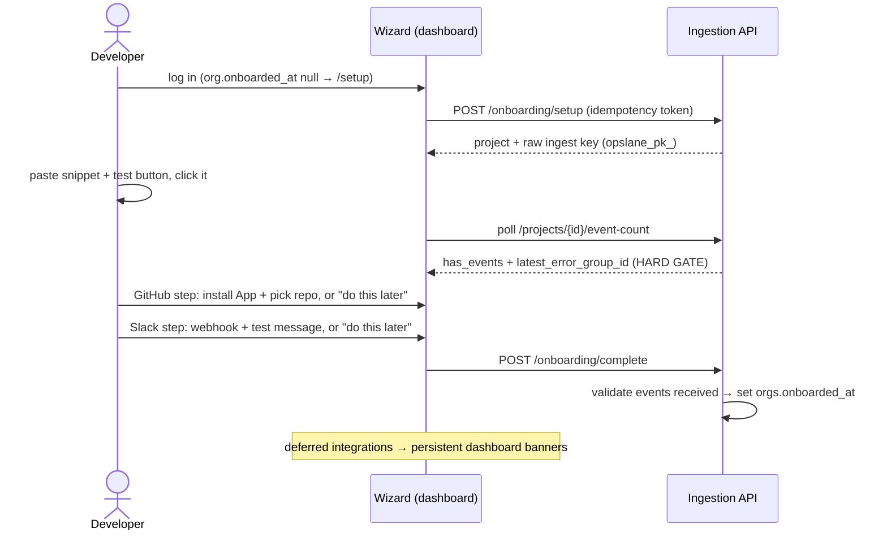

# Onboarding v2: manual-first wizard

Status: approved design, pre-implementation. Supersedes the wizard flow described in `docs/design/2026-07-22-onboard-engineering-design.md` and the "legacy dashboard setup path" flagged in `docs/design/2026-07-29-keys-sourcemaps-onboarding.md:194`. Hardened by two adversarial Codex review rounds and a standalone reader test; then deliberately simplified: v1 has exactly one hard gate (first event received), and the GitHub/Slack permission edge cases that earlier revisions engineered around are deferred to v2 (§10).

## 1. Problem

The setup wizard's step 4 has a failure branch with no exit: `SetupWizard.vue:378` offers only "Retry". A user who skipped GitHub on step 1 hits guaranteed failure ("no installation token") and is hard-stuck: there is no manual-install path anywhere in the wizard.

The step it retries is an agent that clones the user's repo and opens an SDK-install PR. That agent cannot handle monorepos at all: everything is rooted at `/home/user/repo` (`sandbox-repo.ts:15`), meaning root `package.json`, root lockfile, root build, with zero workspace/turbo/nx awareness in `setup-agent.ts` or `sandbox-repo.ts`. For the teams most worth winning (bigger orgs, multi-app repos), the first thing Opslane does is fail inside their codebase. The agent also carries known bugs even on the repos it does support: it injects `VITE_`-prefixed env vars into Next.js projects (`setup-pr.ts:143`), its prompt forbids the `environment` option that `packages/sdk/src/config.ts:34` supports and `docs/install.md` documents, and its build gate accepts `skipped_no_runner`, shipping unverified diffs for any repo without a root build script.

Meanwhile the wizard never asks for the thing the daily product actually runs on: there is no Slack/digest step, even though the digest is how users act on Opslane and the entire backend for it already exists (`notification_destinations`, create/test routes, Settings UI).

## 2. Goals / non-goals

**Goals**

- A developer reaches their first captured event in one sitting. This is the single hard gate. A dev/localhost event counts (`HasEvents` at `queries.go:3681` has no environment filter, verified).
- GitHub and Slack are guided steps in the flow, deferable in one click; whoever defers carries a persistent dashboard banner until connected. Make sure people get through; remind them of what's missing.
- Every wizard state is recomputable from server facts: resume-correct on any device.
- Self-hosted installs that authenticate with a PAT (a personal access token, no GitHub App configured) onboard fully.

**Non-goals (v1)**

- Fixing the setup-PR agent. It gets deleted. A future "SDK config PR" would be rebuilt on event data, which knows which bundle errors come from (the monorepo answer this agent never had), so nothing here is worth preserving. Tracked as a follow-up issue.
- Hard-gating on GitHub or Slack, and the permission machinery that gating forces: pending-admin-request detection, webhook-loss reconciliation, approval landing pages. All deferred to v2 (§10) — in v1, a user without GitHub org rights or Slack webhook rights defers the step and gets banners.
- Sourcemaps, `release`, env-var hygiene, `setUser` depth. Build-pipeline concerns; a post-onboarding nudge on the first minified event handles them (follow-up issue).
- Non-Slack digest channels (follow-up issue).
- Making the first *prod* event an onboarding gate. Later milestone, nudged asynchronously.

## 3. User requirements

| # | Requirement | Verified by |
|---|---|---|
| R1 | A new user reaches a captured, linked error group in one sitting, before any GitHub or Slack setup | M2 AC3: live smoke with `test-fixtures/vue-app`; snippet + test button flips the listener within one poll interval |
| R2 | The snippet always shows a working ingest key, including after a full browser reset | M1 AC3 (mint with `scope: ingest`), M2 AC2 (mint-on-resume) |
| R3 | Onboarding cannot complete without a received event; GitHub and Slack never block completion | M1 AC7: `POST /onboarding/complete` 422s without events, succeeds without GitHub/Slack; M2 AC5 |
| R4 | Any device, any reload, cleared storage: the wizard resumes at the correct step | M2 AC4: per-step reload matrix from server facts only |
| R5 | Deferring GitHub or Slack produces a persistent dashboard banner that clears when the integration lands | M2 AC8: banner matrix against the connection facts |
| R6 | Pre-existing orgs with projects never see the wizard; projectless orgs do | M1 AC1 (backfill predicate), M2 AC4 |
| R7 | A self-hosted PAT install onboards end to end, and free-text repos are validated before persisting | M2 AC7: inaccessible repo shows the validation error, nothing persists |
| R8 | Deleting the setup-PR path leaves worker health clean, including on databases with legacy `setup_pr` jobs | M3 AC2: seeded legacy pending rows; queue-depth/health report clean post-migration |
| R9 | An untested Slack webhook can never become the enabled digest destination | M2 AC6: reload between create and test does not complete the connection; enablement requires `ok:true` |

## 4. System overview

Four screens. One hard gate (the event). One stored completion fact (`orgs.onboarded_at`) gates wizard *entry* only; the server sets it.



The server owns step derivation: `GET /api/v1/onboarding/state` returns the facts plus a derived `next_step`, sharing its fact-evaluation code with `POST /onboarding/complete` so the wizard and the completion gate can never disagree. The wizard renders `next_step` and never derives anything itself. One exception: the step-2 event poll hits `event-count` directly every 3s (cheap single query; the aggregate has no business on a fast poll loop).

| Fact | Source | Role |
|---|---|---|
| Project exists | org project list | missing → step 1 |
| Raw ingest key in hand | wizard memory; else mint | missing → step 2 mints first |
| Has events | `GET /projects/{id}/event-count` | missing → step 2. **The only completion-blocking fact.** |
| GitHub installed + repo attached (or PAT repo) | `github/status` + `projects.github_repo` | missing → step 3 offers it; deferred → banner |
| Enabled `digest.daily` destination | `GET …/notification-destinations` | missing → step 4 offers it; deferred → banner |

**Banners** (dashboard shell, `App.vue`, all orgs, not dismissible in v1): no installation-plus-repo → "Connect GitHub to get automated fix PRs"; no enabled digest destination → "Connect Slack to get your daily digest". Both link to Settings, clear as soon as the fact flips, and apply to backfilled legacy orgs too — that pressure is the point, and dismissal-with-cooldown is a one-line change if it proves hostile.

## 5. Component design

### 5.1 Project creation and keys (ingestion)

`POST /api/v1/onboarding/setup` today creates a project on every call (`onboarding.go:48`) and returns the raw key exactly once; the DB stores only a hash (`028_project_api_keys.sql`). Two consequences the design must handle: a lost response + retry duplicates the project and strands the only key, and a cleared browser can never re-show the snippet.

**Why token idempotency, not name matching:** `projects` has no `(org_id, name)` unique constraint (`001_baseline.sql:16`), so read-then-insert on name races under concurrent retries. The wizard sends a client-generated idempotency token; the server does a conflict-safe insert keyed on it, the same pattern token-based provisioning already uses (`queries.go:430,474`). Replay returns the same project plus a freshly minted key. An org with `onboarded_at` set gets a typed 409. That 409 is new behavior: today's handler would happily create another project. Cross-device duplicates are closed by a second rule: on an un-onboarded org that already has a project, setup returns that project plus a fresh key regardless of token.

**Why mint-on-resume, not recoverable key storage:** storing raw keys defeats the hash-at-rest design for zero benefit, since ingest keys are cheap and additive. The existing key endpoint cannot be reused as-is: it mints only `opslane_ak_` (`api_keys.go:48` → `CreateAPIKey`, hardcoded `ScopeAPI`). The create endpoint gains an optional `scope: "ingest"`, and the Settings key listing widens past its `scope='api'` filter (`project_keys.go:294`, dashboard type `api.ts:57`) so minted keys are visible and revocable; otherwise the "rotate it in Settings" story in the snippet copy would be false. Minted keys carry the name `onboarding` (the existing key-name field). Growth is capped, not aggressively revoked: each mint revokes only `onboarding` keys beyond the five most recent. (An earlier draft revoked all prior keys when the project had zero events; that silently kills a snippet pasted on machine A when the user resumes on machine B, so step 2 could never flip.)

### 5.2 Snippet step (dashboard) — the one hard gate

Framework tabs (Vue / React / Next.js / Other), key inline, `environment: 'development'`, and an endpoint rule with a deterministic source of truth: the dashboard is served by the ingestion service, so `window.location.origin` *is* the ingest endpoint. Include `endpoint: origin` unless the origin equals the compile-time hosted constant `https://app.opslane.com`.

**Why the key is inline** (killing the show-once ceremony): it's `ScopeIngest` (`opslane_pk_`), write-only, ships in the browser bundle by design, and `docs/install.md:111` already documents it as safe to expose. The honest cost, stated in the same doc: a committed key is slow to rotate. Accepted for activation speed; the success screen nudges "move it to an env var before you commit".

**Why a thrown error, not a capture call:** the test must exercise `window.onerror`/`unhandledrejection` wiring and init ordering, the path the product depends on. The SDK exposes no global (verified: nothing on `window` in `packages/sdk/src`), and adding one would test less while becoming permanent API. So the snippet includes a temporary button:

```tsx
<button onClick={() => { throw new Error('opslane-test'); }}>Test Opslane</button>
```

The listener polls `event-count` (which gains `latest_error_group_id`; today it returns only `has_events`, `read_api.go:1184`) and links the latest captured group. Copy says "the latest error Opslane captured": if the app was already erroring, that group may not be `opslane-test`, and v1 does not do marker matching (follow-up issue). There is no way to advance past this screen without an event; Vue and React tab content follows `docs/install.md`, and the Next.js tab is new content shipped with a matching install.md section in the same PR.

### 5.3 GitHub step (deferable)

Goal of the step: installation plus a connected repo, because that is what fix PRs need. Two modes, chosen by server config:

**App mode** (cloud and app-configured self-hosts): the existing install link and OAuth-during-install callback (`github_oauth.go:131-134`), unchanged, then the existing `RepoSelector` + `PUT /projects/{id}/github`. If the user returns without an installation (closed the tab, or GitHub turned their click into an admin approval request), the step shows "waiting for GitHub" with a copy-a-message-for-your-admin affordance and a **"do this later"** link that advances the wizard. No detection of the pending request, no callback surgery, no reconciliation: v1 does not distinguish "request pending with an admin" from "never finished" — both defer with a banner, and the `installation.created` webhook flips the fact whenever the install eventually lands.

**PAT mode** (`GITHUB_APP_SLUG` unset): free-text `owner/repo` → `PUT /projects/{id}/github`, which gains a PAT branch that validates the repo is reachable with the configured `GITHUB_TOKEN` before persisting (today the handler rejects org-without-installation outright, `github_settings.go:23,51`); unvalidated free text would store a typo without complaint.

The step is encouraged, not gated: the screen sells fix PRs, the defer link is quieter than the install button, and the banner persists after deferral.

### 5.4 Slack step (deferable)

Paste a Slack incoming-webhook URL (link to `docs/guides/slack-notifications.md`), or **"do this later"** — a user without rights to create a webhook in their workspace defers and gets the banner; nothing blocks. When they do paste one, the sequence is create-disabled → test → enable:

1. `POST notification-destinations` with `enabled: false` (a server change, since create hardcodes `Enabled: true`, `notifications.go:191`) and `delivery_policy: "post_triage"` (the guide's recommendation; the default is `immediate`).
2. `POST …/{destID}/test` with `issue.created` (a new project's digest preview is empty). The endpoint returns HTTP 200 with `{ok:false}` on send failure (`notifications.go:374`); the wizard branches on `ok`, not HTTP status.
3. `ok:true` → `PATCH enabled: true` → green check ("check your channel"). `ok:false` → error + retry, where retry updates the existing disabled row rather than creating another, so failed attempts don't accumulate orphans.

**Why create-disabled:** the naive create-then-test had two holes. Creation immediately stored an *enabled* `digest.daily` destination, so a reload between create and test would count an untested webhook as connected; and delete-on-failure could itself fail, leaving an enabled orphan. A disabled orphan can do neither: it can't flip the connection fact and the digest scheduler skips it.

Timezone: picker defaulting to browser timezone, `PATCH digest_timezone`, best-effort and non-gating (UTC default; Settings can fix it later).

Cloud non-admins are blocked from most wizard mutations anyway (project creation, key minting, and project updates are admin-gated, `routes.go:129,134,135`), so the wizard checks role at entry and shows one "ask an org admin to run setup" screen up front.

### 5.5 Completion and routing

Fact evaluation lives in one server function with two faces: `GET /api/v1/onboarding/state` (read-only: facts + derived `next_step`, what the wizard renders from) and `POST /api/v1/onboarding/complete`, which requires exactly one thing — the project has received an event — and then sets `orgs.onboarded_at`; a second call is a 200 no-op. GitHub and Slack facts are reported in `state` (they drive the step offers and the banners) but never block `complete`. A client-set flag would make the event gate bypassable by one fetch call, so only the server writes it.

The field is exposed through auth/me (`AuthMe` carries no such field today, `auth_handlers.go:317`), and `post-auth.ts`/router route on it instead of the current `localStorage`-only check (`router.ts:57`) that made cross-device resume impossible. The migration backfills `onboarded_at = now()` **only for orgs with ≥1 project**: backfilling a projectless org would mark it complete while the entry rule denies it the wizard, leaving it no path to a first project.

### 5.6 Setup-PR deletion (worker + ingestion + dashboard + shared)

Full inventory: `setup-pr.ts`, `setup-agent.ts`, their tests, the dispatch in `worker/src/index.ts`, the `setup_pr` claim-allowlist entry (`db.ts:619`), `recordSetupPrResult` (`db.ts:2425`), the job type in `shared/src/types.ts:479`, the Go routes + `EnqueueSetupPrJob` + `GetSetupPrStatus`, and the dashboard wrappers + `SetupPrStatus` types (including `already_installed`, which no backend code ever wrote). Plus a data migration settling lingering `setup_pr` jobs to a terminal status: removing the allowlist entry alone leaves them pending forever, and pending-but-unclaimable jobs poison queue-depth and health accounting (`db.ts:706`, `index.ts:251`). The `projects.setup_pr_*` columns stay; dropping retained-data columns buys nothing here (housekeeping follow-up).

## 6. Milestones

Ordered by dependency; each independently releasable.

**M1 — Server groundwork.** Migration (`orgs.onboarded_at` + predicated backfill), token-idempotent setup + 409 + has-project reuse rule, ingest-scope mint + Settings listing + key cap, `enabled:false` on destination create, `latest_error_group_id`, auth/me field, `/onboarding/state` + `/onboarding/complete` (one shared fact-evaluation function), PAT branch on `PUT /projects/{id}/github`. Exit criteria: Appendix A, M1. No UI change; the old wizard keeps working.

**M2 — Wizard rewrite.** New step order; snippet step (with the Next.js install.md section in the same PR); event listener; deferable GitHub step (both modes); deferable Slack step; derived routing on auth/me; shell banners. The wizard stops calling setup-PR routes. Exit criteria: Appendix A, M2.

**M3 — Delete the setup-PR path.** The §5.6 inventory plus the legacy-job settlement migration. Exit criteria: Appendix A, M3.

**M4 — Docs sync.** install.md quickstart aligned with the wizard; `github-app.md` both modes; `slack-notifications.md`; `api-keys.md` ingest-key visibility; `http-routes.md`; voice + drift checks pass.

## 7. Testing & validation

- **CI (Go + Vitest):** idempotency race (two concurrent same-token inserts), 409 contract, key cap, `enabled:false` scheduler skip, `state`/`complete` agreement across fact combinations, PAT validation, settlement migration on seeded legacy jobs, migration idempotency (applied twice to clean + representative DBs).
- **Live (worktree stack, per AGENTS.md port/env conventions):** the M2 smoke: real `test-fixtures/vue-app`, real snippet, real click, listener flips, group linked. Slack test-send against a real webhook (or a local HTTP sink standing in for Slack, as prior digest verification runs used).
- **The skips trap:** per repo rules, a green `go test ./...` with storage misconfigured silently skips ~30 tests; every gate run must report zero skips.

## 8. Risks & mitigations

- **Deferral cohort onboards into silence.** Some users defer both integrations and see neither fix PRs nor digests. Mitigation: non-dismissible banners, and the deferral rates are the first thing to instrument — they tell us whether v2's verified-pending machinery (§10) is worth building. This is the deliberate trade of v1: completion over enforcement.
- **Users commit the inline key.** Rotation is real (M1 makes ingest keys visible/revocable in Settings) and the nudge copy pushes env vars before commit. Accepted for activation speed.
- **Cloud non-admins cannot run the wizard**, because admin gates span project-create through Slack. The wizard says so at entry instead of dead-ending late. Rare (the onboarder is almost always the org creator/admin).
- **Lost `installation.created` webhook leaves a stale GitHub banner.** v1 accepts this (the user can retry the install from Settings, and the banner copy links there); API reconciliation is v2 scope.

## 9. Alternatives considered

- **Fix the setup-PR agent (monorepo support, app pickers).** A research project sitting on the activation funnel; even fixed, an agent writing to a repo it has never seen, pre-trust, has the worst possible failure mode. Deleted instead; the event-data-informed rebuild is strictly better positioned.
- **Keep the agent dormant behind the wizard.** Repo rule prefers deletion; the code has known bugs and no user path, and the future version would not be built from it. Precedent: the CLI removal (PR #404).
- **Hard-gating GitHub and Slack** (with verified-pending detection for GitHub's admin-approval flow). Designed in full through two review rounds, then cut: the machinery it forces — pending-request matching via `GET /app/installation-requests`, callback `setup_action` branches, a public approval landing page, webhook-loss reconciliation, three extra `orgs` columns — exists only to police edge cases at the cost of stranding users, and v1's goal is that people get through. The full design is preserved in git history at this file's earlier revisions and summarized in §10 for v2.
- **`window.Opslane` global + console-paste test.** One paste, but a weaker proof (bypasses the uncaught-error path) and permanent public API for a transient onboarding need.
- **Stored onboarding step pointer.** State that can lie (step says 3, events already flowed). Server-derived `next_step` plus a single server-validated completion timestamp gets resume-correctness without a state machine.
- **Digest-preview as the Slack test message.** A brand-new project's digest is empty; `issue.created` proves the pipe with content.
- **Name-based idempotency for project creation.** Race-prone without a uniqueness constraint; token-based insert matches an existing repo pattern.

## 10. What this deliberately does not solve (v2 backlog)

v1 chooses completion over enforcement, and the cost is stated flat: a user can finish onboarding with no GitHub and no Slack, which means no fix PRs and no digests until the banners convert them. Deferred to v2, with the design work already done in this file's git history:

1. **Verified GitHub pending-request detection** — distinguish "my admin is reviewing the request" from "never finished": `setup_action` callback branches, requester matching against `GET /app/installation-requests`, the public approval landing page, and API reconciliation so a lost webhook can't wedge state. Build it when deferral instrumentation shows the admin-approval cohort is big enough to matter.
2. **Non-Slack digest channels** (Teams/Discord/email).
3. **Test-marker matching** for the step-2 success state (link the `opslane-test` group specifically).
4. **Post-onboarding SDK-config PR** rebuilt on event data (the monorepo answer).
5. **Sourcemap/release/env nudge** on the first minified event without debug IDs.
6. **`projects.setup_pr_*` column drop** (housekeeping migration).

## Appendix A — Acceptance criteria per milestone

**M1 — Server groundwork**

1. Migration applies to a disposable clean DB and a representative existing DB, twice (idempotent); orgs with ≥1 project get `onboarded_at` backfilled; projectless orgs stay null.
2. Same-token double-`POST /onboarding/setup` returns the same project id and two distinct working ingest keys; concurrent same-token requests create exactly one project; a different-token call on an un-onboarded org with an existing project returns that project (no duplicate); an onboarded org gets a typed 409.
3. Ingest-scope key mint works and appears in the Settings key listing; the five most recent `onboarding` keys all stay valid; a sixth mint revokes only the oldest.
4. `POST notification-destinations` with `enabled:false` creates a disabled row the digest scheduler skips; omitting the field keeps today's behavior.
5. `event-count` returns `latest_error_group_id` when events exist, null otherwise.
6. PAT-mode `PUT /projects/{id}/github` (no `GITHUB_APP_SLUG`) validates the repo with `GITHUB_TOKEN` and persists on success; an inaccessible repo returns the validation error and persists nothing; app-mode behavior is unchanged.
7. `POST /onboarding/complete` refuses (422) until the project has received an event, then sets `onboarded_at` regardless of GitHub/Slack state; auth/me exposes it. `GET /onboarding/state` reports the same facts and a `next_step` that agrees with what `complete` would accept, proven by a test that diffs the two on every fact combination.
8. Full repo gate green (`pnpm -r build`, `pnpm test` with `DATABASE_URL`, `go build ./... && go test ./...` zero skips, `docker compose config --quiet`).

**M2 — Wizard rewrite**

1. New order renders; project creation is name-only with an idempotency token; no setup-PR call remains in the wizard.
2. Snippet shows a real working `opslane_pk_` key on first load and after a full browser reset (mint-on-resume), correct per tab; self-hosted origin gets `endpoint`; hosted omits it.
3. Following snippet + test button in `test-fixtures/vue-app` against a live stack flips the listener green within one poll interval; success links `latest_error_group_id`.
4. Reload/cleared-browser at every step resumes at the correct step from server facts; an org with `onboarded_at` never sees the wizard; a projectless legacy org does.
5. Cannot advance past step 2 without `has_events`; GitHub and Slack steps each advance via success or "do this later"; finishing calls `/onboarding/complete`, which succeeds with both integrations deferred and refuses without events.
6. Slack: reload between create and test leaves the destination disabled (not connected); `ok:false` shows the error and leaves no enabled row; success branches on `ok`, not HTTP 200.
7. PAT-mode stack completes the GitHub step via validated free-text repo; an inaccessible repo shows the validation error and does not persist.
8. Banners: deferring GitHub shows the GitHub banner until installation + repo exist; deferring Slack shows the Slack banner until an enabled `digest.daily` destination exists; both clear without a reload cycle beyond the next status fetch; a non-admin cloud member sees "ask an admin" at wizard entry.

**M3 — Delete the setup-PR path**

1. `POST /api/v1/projects/{id}/setup-pr` returns 404; route absent from `http-routes.md`.
2. After the settlement migration, no `setup_pr` job is in a non-terminal status; worker health/queue-depth report clean on a DB seeded with legacy pending rows.
3. No references to deleted symbols outside git history; docs drift checks pass with updated `covers:`.
4. Full repo gate green.

**M4 — Docs sync**

1. install.md quickstart matches the wizard snippets (inline key + commit/rotation caveat, dev environment, test button); the Next.js section M2 shipped is reviewed and expanded to parity with the React/Vue sections.
2. `github-app.md` documents App and PAT modes; `slack-notifications.md` reflects the wizard; `api-keys.md` covers ingest-key visibility; `http-routes.md` current.
3. Voice and drift checks pass.
