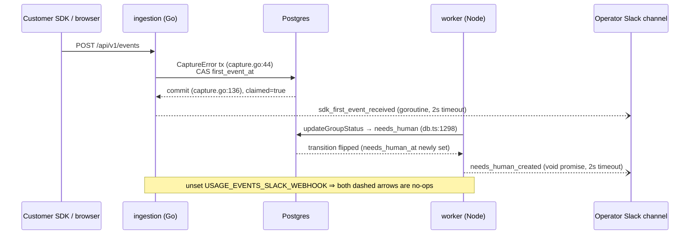

# Usage event notifications

**Status:** approved design, not yet implemented
**Owner:** Abhishek Ray
**Reviewed:** grilled interactively 2026-08-26; two adversarial Codex review rounds folded in

## Problem

The operator of an Opslane deployment cannot tell when a customer signs up, wires the SDK, gets a fix PR, or touches the MCP surface without running SQL against production. Usage evidence exists (users, environments, `fix_run_ledger`, `digest_runs`), but nothing pushes it anywhere. The closed-source predecessor (verify-cloud) solved this with a `track()` fan-out to PostHog and Slack (`src/lib/analytics.ts` in that repo); Opslane inherited none of it; the only PostHog references in this repo are prose comments (`packages/worker/src/investigate.ts:38`, `packages/sdk/src/__tests__/core.test.ts:309`).

The first consumer is the hosted Opslane deployment, but the feature is operator-generic: anyone self-hosting can point it at their own Slack. Opslane is AGPL and self-hostable, so the design must be a strict no-op for every install that does not configure it, and nothing may ever be sent anywhere except the operator's own webhook.

## Goals / non-goals

**Goals**

- Every meaningful customer action on a configured deployment produces a Slack message in the operator's chosen channel within seconds (best-effort, per the delivery contract below).
- Zero behavior change for unconfigured installs: with `USAGE_EVENTS_SLACK_WEBHOOK` unset (the default), every emit path is a no-op.
- Telemetry can never break a product path: zero-throw, bounded time, no retries.

**Non-goals**

- **No phone-home.** Events go only to the webhook the operator configures; installs never send anything to the Opslane maintainers. A telemetry program for OSS installs is a separate product/community decision with its own opt-in policy.
- **No PostHog.** No PostHog project exists for Opslane anywhere (repo and `~/deploy` both checked). Funnel/retention analysis is deferred; the event vocabulary is the seam for adding it later.
- **No durable event log.** No new queue, no event table (beyond one column, R3). The existing `outbound_events`/`outbound_deliveries` outbox (`packages/ingestion/notify/dispatcher.go`) stays a customer-notification system.
- **No dashboard page-view analytics.** That requires a frontend→server track endpoint; it rides with the future PostHog decision.
- **No per-ingested-event messages.** The hosted deployment currently holds ~725 friction and ~192 error groups; per-raw-event emission makes the channel unreadable. The rule: first-times, human actions, terminal outcomes, notable external side effects, and per-occurrence product deliveries (an issue created for a customer, a digest delivered, an MCP call). What stays excluded is the raw firehose: individual ingested events and group-count churn. `mcp_tool_used` fires per call because MCP adoption is the signal being watched and current volume is near zero; if it grows, it gets demoted to a daily aggregate.

## Delivery contract (read this before the events)

**Best-effort.** Messages can be lost (webhook timeout, worker shutdown, crash between a state transition and the POST) and can rarely duplicate (worker crash after POST but before job completion persists). Both are accepted: the consumer is an operator glancing at a channel, not an analytics pipeline. The only once-only mechanism in the design is the `first_event_at` claim (R3), and it is once-only on the *claim*, not the delivery: a webhook failure after the claim loses that one ping permanently.

Where the once-only claims in R2–R4 fit under this contract: they bound *emission* (the decision to send), which is tied to a committed state transition. The duplicate clause covers the windows those transitions can't see: a worker crash after `createPR` succeeds but before job completion persists (a second `fix_pr_opened`), and a digest run with multiple destinations (one message per destination). Loss is possible for every event without exception.

This is the doc's riskiest decision. The alternative, idempotency state per event, was reviewed and rejected twice (see Alternatives).

## User requirements

| # | Requirement | Verified by |
|---|---|---|
| R1 | With `USAGE_EVENTS_SLACK_WEBHOOK` unset, no HTTP request is ever made and no code path errors | Unit tests in both runtimes: emit with env unset, assert no fetch/no client call |
| R2 | `user_signed_up` fires exactly for newly created users, never for returning logins | Unit test on the provisioning seam: upsert path emits nothing; insert path emits after commit |
| R3 | `sdk_first_event_received` fires at most once per environment; environments with pre-existing history never ping once the post-deploy reconciliation (see migration section) has run | Migration test (backfill with and without purged raw events); concurrent-ingest test asserting single claim; reconciliation step in the M3 checklist (the rolling-deploy window itself is closed operationally, not by a test) |
| R4 | Worker terminal events do not re-emit on job retry or lease recovery | Test: drive `updateGroupStatus` to `needs_human` twice; one emit |
| R5 | Customer-controlled text cannot inject Slack formatting, links, or fake fields | Unit tests: CR/LF, `<`, `>`, `&`, oversized values, multi-byte truncation boundaries |
| R6 | The webhook URL never appears in logs | Test asserting error/startup log output for a failing send contains no URL substring |
| R7 | A telemetry failure never fails a request, job, or digest | Zero-throw contract tests: sender that always errors; assert caller result unchanged |

## System overview

Two independent emitters, one sink. No shared code, no shared state; the event vocabularies are disjoint per runtime, so nothing needs to stay in sync.



The diagram shows one flow per runtime, each with the transaction-then-emit ordering; the other six events follow one of these two shapes. The only non-obvious placement is `digest_delivered`, which emits from the notify *dispatcher* (customer-delivery success), not from the digest pipeline; see the events table.

## Events

| Event | Emitter and anchor | Props ("stable IDs" below means the UUIDs from the owning tables: user, org, project, environment, error-group) |
|---|---|---|
| `user_signed_up` | ingestion; after the provisioning commit (`db/queries.go:2544`), callers in `handler/embedded_auth.go` and `handler/github_oauth.go` | email, auth provider, user ID, org ID |
| `user_logged_in` | ingestion; the `Login` handler and the browser OAuth callback (`github_oauth.go:131`) only; never `completeEmbeddedLogin` itself (shared by Signup/VerifyEmail), never JWT middleware, session refresh, or API-key auth | email, user ID, org ID |
| `sdk_first_event_received` | ingestion; CAS inside the `CaptureError` tx (`db/capture.go:44-136`), POST after commit. Scope limit: the claim runs on the error-event ingest path only, so an environment producing only session/friction data never claims or pings, accepted for v1 | project + environment names and IDs, environment_age (`first_event_at − environments.created_at`, both server clocks; SDK timestamps are untrusted) |
| `issue_created` | ingestion; emitted after the filter admission tx commits in `filter/dispatch.go` `admitOne` (the `INSERT ... 'issue_inquiry' ... ON CONFLICT DO NOTHING` whose `RowsAffected()==1` marks a newly admitted issue). This is the live pipeline's "issue created for a customer" moment and covers error and friction episodes alike. (`publishIssueCreated` at `db/queries.go:994` looks like the anchor but is dead on the live path: its only caller `InsertErrorEventAndGroup` has no non-test callers.) A re-admission of the same episode at a higher input version pings again; that is a new inquiry round, not a duplicate | project ID + name, issue ID + title, episode ID, dashboard incident URL |
| `fix_pr_opened` | worker; in `pipeline.ts` after `createPR` (`pr.ts:786`) returns | project ID + name (one DB read, ID-only fallback on failure), group title, PR URL, incident URL (`incidentUrl` is already in `PRInput`, `pr.ts:71-110`) |
| `needs_human_created` | worker; inside `updateGroupStatus`/`updateGroupInvestigation` when the status *newly* becomes `needs_human`: the `IS DISTINCT FROM` test at `db.ts:1314` already computes this; expose it via `RETURNING` and emit on true. One seam covers all ten call sites in `index.ts`. A group that leaves `needs_human` (human reopens or retries it) and later transitions in again pings again; that is a second real incident outcome, not a duplicate | project ID + name, group ID + title, reason, dashboard incident URL |
| `digest_delivered` | ingestion; `notify/dispatcher.go` `complete()` when a delivery row flips to `delivered` (`dispatcher.go:443`) and its event is `digest.daily`, i.e. after the *customer* delivery succeeded, not when the run is validated. One message per (run, destination); nearly all projects have one destination, so in practice one per project per day | project ID + name, digest run ID, per-run fixed / needs-human counts |
| `mcp_tool_used` | ingestion; one wrapper around the three registrations in `handler/mcp.go:90` (`opslane_digest`, `opslane_issue`, `opslane_link_pr`), emitting only on successful, authenticated calls; `ProjectIDFromCtx`/`OrgIDFromCtx` are available in every closure via `mcpProjectContext` (`mcp.go:196`) | project ID, org ID, tool name |

Two anchors force small interface changes, called out so nobody discovers them mid-implementation:

1. **`ProvisionFromIdentity` cannot report newness.** It returns only `(userID, orgID, err)`; the new-user branch is internal (`queries.go:2612`). R2 requires extending the return to include `created bool`. Path map, since there are three provisioning routes: password signup and the cloud (WorkOS-backed) OAuth callback both land in `ProvisionFromIdentity` via `completeOAuthIdentity` (`github_oauth.go:429`) and use the new `created` flag; the legacy self-host GitHub path (`github_oauth.go:541-570`) and agent provisioning (`agent_provision.go:190`) already have explicit new-user branches and emit there directly. All three emit after their respective commit.
2. **`CaptureError` must surface the claim.** Add the CAS (`UPDATE environments SET first_event_at = now() WHERE id = $1 AND first_event_at IS NULL`) inside the existing tx and return `FirstEvent bool` in the `CaptureReceipt` (`db/capture.go:14`) so the handler emits after commit, never from inside the tx. Issue creation is NOT observable here; `CaptureError` deliberately creates no issue (see its doc comment), which is why `issue_created` anchors at filter admission instead.

## Component design

### `packages/ingestion/usageevents` (Go, new package, ~150 lines)

```go
// Emit posts one usage event to the operator's Slack webhook. It never
// blocks the caller, never returns an error, and is a no-op when the
// webhook is unset.
func Emit(event string, props map[string]string)
```

Why it's built this way:

- **Detached context:** `Emit` spawns a goroutine holding `context.WithTimeout(context.Background(), 2*time.Second)`, never the request context, which is cancelled the moment the handler returns and would kill the POST mid-flight.
- **Bounded concurrency:** a `chan struct{}` semaphore (cap 8); when full, the event is dropped with a warn log. This exists for one reason: an authenticated MCP client scripting tool calls could otherwise open unbounded goroutines. The drop policy is event-blind, so an MCP flood that saturates the semaphore can crowd out a concurrent signup or first-event ping. Accepted, since the same flood is itself visible in the channel and the fix (demoting `mcp_tool_used` to an aggregate) is pre-agreed.
- **One shared `http.Client`**, response bodies drained and closed, non-2xx logged with status code.
- **Sanitization before send:** CR/LF normalized to spaces; `&`, `<`, `>` escaped (Slack mrkdwn's link/mention syntax lives in `<...>`); rune-safe truncation at ~300 chars per value; final payload capped in UTF-8 bytes after JSON encoding. Other formatting characters (`*`, backticks) are left alone; the worst case there is cosmetic.
- **Links are built server-side only** from the existing `DASHBOARD_URL` config (`main.go:150`, builders in `notify/url.go`); customer-supplied URLs are never rendered as links.
- **Startup:** `main.go` validates the URL shape (https, parseable), logs `usage events: enabled` or `disabled`, and never logs the URL itself. A malformed value must not report enabled while every send fails.

### `packages/worker/src/usage-events.ts` (TypeScript, ~80 lines)

```ts
// Fire-and-forget; resolves to void, never rejects.
export function emitUsageEvent(event: string, props: Record<string, string>): void
```

`void fetch(url, { signal: AbortSignal.timeout(2000), ... })` with a `.catch` that warn-logs. Same sanitization rules, code-point-safe truncation. Events in flight during worker shutdown are lost, which the delivery contract accepts. The env var joins the worker's env-echo table (`index.ts:157-161`) as `set`/`unset`, not its value. No semaphore: worker events are job-driven and bounded by the job loop.

Deliberately duplicated rather than shared: putting this in `shared/` would move server-side code into the MIT boundary, and ~80 lines of duplication is cheaper than a new AGPL workspace package for one function.

### Migration `062_environment_first_event.sql`

```sql
ALTER TABLE environments ADD COLUMN first_event_at TIMESTAMPTZ;

-- Backfill from group tables, not raw event tables: retention purges raw
-- error_events/friction_events first, and groups are small (hundreds of rows
-- in prod vs. potentially large event tables), so this stays cheap and
-- correct for purged history.
UPDATE environments e SET first_event_at = evidence.earliest
FROM ( /* min(created_at) per environment across error_group_environments →
          error_groups and friction_groups */ ) AS evidence
WHERE e.id = evidence.environment_id AND e.first_event_at IS NULL;
```

Environments with zero evidence keep `NULL`, so a genuinely first event later still pings. `first_event_at` is a product-meaningful activation timestamp (when did this environment first send data), useful to any operator and a natural future dashboard field, which is why it lives in the schema rather than in notification-only state.

**Rolling-deploy race:** an old ingestion instance can accept an event after the backfill but before the CAS-aware code is live, leaving `first_event_at` NULL and producing a false ping later. Closure: re-run the (idempotent) backfill UPDATE once after the deploy completes. The hosted deploy is effectively single-instance, so the window is seconds, but the reconciliation step is cheap enough to keep regardless.

## Milestones

| # | Deliverable | Exit criterion |
|---|---|---|
| M1 | `usageevents` Go package + `usage-events.ts`, with the full test set from R1/R5/R6/R7 | `go test ./...` and worker vitest green; a manual `Emit` against a scratch webhook renders correctly in Slack |
| M2 | Ingestion events wired: signup (with the `created bool` signature change), login, first-event and issue-created (migration 062 + `CaptureError` receipt changes), digest, MCP | Live smoke on a worktree stack: seed → sign up → send first event → one MCP tool call, confirming `user_signed_up`, `user_logged_in`, `sdk_first_event_received`, `issue_created` (send enough events to clear the filter's admit threshold — 2 impact units for error episodes — then wait for the filter sweep), and `mcp_tool_used` at an in-network request-catcher sink (host networking is blocked on this box; see the digest-v4 rig notes); `digest_delivered` confirmed via a forced digest run in the same stack. `go test ./...` with **zero skips** |
| M3 | Worker events (`fix_pr_opened`, `needs_human_created` via the `updateGroupStatus` seam) + deploy | R4 test green; env var set on **both** containers in `~/deploy`; post-deploy backfill re-run executed; first real event observed in the hosted deployment's channel |

## Testing & validation

CI (no external dependencies): everything in R1–R7; the sender is injectable in both runtimes, so tests assert against a fake sink. Database-gated Go tests need `DATABASE_URL` exported; read the skip count, not the pass count (repo-level gotcha).

Live, pre-deploy: worktree Compose stack with the webhook pointed at an in-network sink container, driving the real pipeline (`scripts/seed-e2e.sql`, a fixture event to `/api/v1/events`). Confirms ordering (emit-after-commit) and message rendering, which unit tests can't.

Live, post-deploy: one real signup + SDK event against the hosted deployment, watched in its configured channel.

## Risks & mitigations

- **Silent total failure:** a revoked/rotated webhook turns the feature off with only warn logs as evidence. *Mitigation:* startup validation and the enabled/disabled log line. *Unmitigated remainder:* nobody is paged; if the operator stops seeing messages, checking logs is the diagnostic. Accepted for a single-operator deployment; a failure counter is the first thing to add if this bites.
- **Channel noise:** `user_logged_in` and `mcp_tool_used` are the likely offenders (the latter is per-call by design), and `issue_created` can spike when a customer deploy mints many distinct new groups at once (grouping dedups repeats of the same bug into one group, so a spike means genuinely new issues, which is arguably signal). *Mitigation:* pre-agreed demotions (delete the login event, aggregate the MCP or issue events), each a one-line change at its emit site.
- **PII in Slack:** emails and error-group titles land in the operator's workspace. *Mitigation:* sanitization (R5) bounds injection and size; the email exposure is a deliberate, revisitable choice confined to a private channel the operator controls.
- **False first-event pings:** the backfill or the rolling-deploy race mis-set `first_event_at`. *Mitigation:* group-table backfill + post-deploy reconciliation + R3 tests.
- **Duplicate pings:** crash-retry around `createPR` or a multi-destination digest. *Mitigation:* none; tolerated by the delivery contract. `createPR` already has an idempotency pre-check for the PR itself (`pr.ts:819`), so the duplicate is only the Slack message, never a second PR.

## Alternatives considered

- **Reuse the existing outbox** (`outbound_events`/`outbound_deliveries` + `notify/dispatcher.go`): durable, already built, single routing point. Rejected: the outbox publishes inside customer-facing transactions and its dispatcher enforces lease/terminal contracts; operator telemetry would entangle a best-effort concern with a guaranteed-delivery system, and the worker (Node) would need a new write path into it. The grill also priced the dispatcher's contract-heavy test surface as a real slice, not "reuse."
- **PostHog + Slack fan-out (the verify-cloud pattern verbatim):** rejected for v1 because PostHog here is greenfield (project, keys, terraform, identity mapping) purchased for funnel queries nobody has needed yet. The event vocabulary is the seam; adding PostHog later is one sink function.
- **Phone-home telemetry from OSS installs:** rejected outright; different problem, real community-trust cost in an AGPL repo, deserves its own brief.
- **Per-event idempotency state** (exactly-once Slack delivery): rejected twice under adversarial review pressure. The consumer is a human glancing at a channel; rare duplicates are cheaper than delivery-tracking machinery.
- **A shared `@opslane/usage-events` package:** rejected; see component design (license boundary + duplication cost).

## What this deliberately does not solve

If the webhook breaks, the operator finds out by noticing silence, not by an alert. And the moment a second person needs this data, or anyone asks a retention/funnel question, Slack scrollback stops being an answer; that is the trigger to do the PostHog integration this design keeps deferring.
