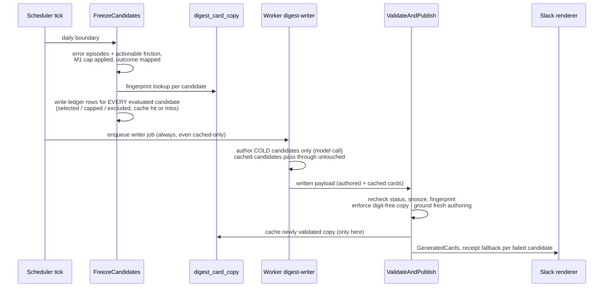

# Unified digest cards: one writer, one template, both kinds

Status: implemented behind rollout flag; production rehearsal pending · 2026-08-27, amended 2026-08-28 · Owner: Abhishek Ray

> **Amended 2026-08-28.** Verification run `.verify/runs/20260827-192819` found four
> defects at the seam between this design's two lanes, and the rulings that
> resolve them change parts of what follows. `docs/design/2026-08-28-unified-cards-fixes.md`
> is the current design for the ON lane and supersedes this document wherever
> they disagree; the sections below are annotated where that happens. The three
> changes to read for: shadow mode is deleted, ON has exactly one lane (an item
> appears if and only if a person owes it an action, and repeats until they act),
> and the card's instruction line is a deterministic function of incident state
> that the model never owns.

## Implementation and rollout notes

- `DIGEST_UNIFIED_CARDS` defaults to `off` and takes exactly two values, `off`
  and `on`. The value used at freeze is stamped on
  `digest_runs.unified_cards_mode`, and later validation/publication never
  reinterprets a run using the current process environment. The retired
  `shadow` value is treated as any other unknown value: the run is `off`, with
  one startup warning.
- Migration 065 dual-writes nullable `digest_run_items.error_group_id`.
  `NOT NULL` and `(run_id,error_group_id)` uniqueness remain deferred to a
  future hardening migration after production dual-write verification. That
  migration's preconditions cover **both** snapshot tables: no NULL
  `error_group_id` in `digest_run_items`, and no duplicate
  `(run_id,error_group_id)` in either `digest_run_items` or
  `digest_unified_run_items`.
- Because the pre-065 run-item primary key made `episode_id` implicitly
  non-null, migration 065 leaves that legacy key and column untouched. The ON
  lane's incident snapshots use the additive `digest_unified_run_items`
  transition table; ingestion and worker dual-read/write both tables.
  Consolidating the tables is deferred until production proves the
  dual-compatible build and no in-flight legacy run remains.
- **`digest_unified_run_items` is the ON-mode snapshot store**: one row per
  frozen candidate, keyed `(run_id, error_group_id)`, holding the immutable
  `candidate_snapshot` the writer and validator both read plus the run's
  `outcome`/`reason`. Rows CASCADE from both `digest_runs` and `error_groups`,
  so deleting a run or an incident leaves nothing behind. It exists because
  friction has no episode and the legacy table's primary key requires one; it
  is not a second source of truth, and `loadFrozenCandidates` reads the two
  tables as one UNION ordered by identity.
- Migration 065 never shipped, so it is edited in place rather than superseded.
  A development or verification database that applied its earlier draft keeps
  two dropped columns (`digest_run_candidate_evaluations.shadow_render_mode`,
  `digest_card_copy.source`) and one dropped constraint as harmless drift; no
  code reads them and a fresh install never creates them. The edited file
  normalizes any `'shadow'` run rows before tightening the mode CHECK, so it
  replays onto those databases.
- Error candidates dual-write incident and episode identity in OFF. If legacy
  data exposes multiple qualifying episodes for one incident, freeze keeps the
  latest decision, breaking ties by the highest episode sequence. ON has no
  episode lane and freezes incident identity only.

## Problem

The 2026-08-27 digest delivered friction incidents for the first time, and they render as plain "receipts" (title, raw signal count, canned state line, investigation excerpt) next to the polished model-authored cards errors get (narrative copy, "Needs you:" line, people and account context, Watch replay / View issue buttons). Two templates in one message, and the plainer one carries the project's biggest findings.

The split is an accident of build order, not a design position. The v4 card writer consumes *episodes*, an error-pipeline internal, because errors were the only thing reaching the digest when it was built. Friction incidents are valid incidents with no episodes, so M1 delivered them through the pre-v4 receipts renderer instead. Detection staying plural is correct (a stack trace and a dead click have different evidence economics); the presentation layer being plural is debt.

## Goals / non-goals

Goals:

- One card pipeline from the incident boundary up: the writer consumes an incident plus its evidence bundle, regardless of kind.
- Friction cards get the same authored narrative, grounding validation (the check that every number and name in authored copy exists in the frozen facts), sections, and buttons as error cards.
- The receipts template leaves the daily digest except as a fallback.
- Repeat-while-actionable survives the writer: an authored card repeats daily at zero marginal model cost.

Non-goals:

- Changing detection pipelines, thresholds, or the M1 delivery contract (ledger, snooze, SLA diagnostics, selection cap all stay).
- Populating friction user attribution (`friction_group_affected_users` is empty for friction in prod; separate data-quality work).
- Retiring episodes. They remain the error pipeline's internal unit; this design only stops the presentation layer from depending on them.

## User requirements

| # | Requirement | Verified by |
|---|---|---|
| R1 | A friction incident renders as a model-authored card: narrative copy, action line, buttons, correct section | Live smoke (M4) + prod observation after cutover |
| R2 | Authored copy for a repeating card is reused daily with zero model calls while its facts are semantically unchanged | Integration test: two consecutive runs, one authoring; writer-job model-call count is 0 on run 2 |
| R3 | Cached copy never fails grounding as live counts drift | Spike S2 (proven) + server-side digit rejection test |
| R4 | A semantic change (diagnosis, action, status, diff) re-authors; a stale authored card is never delivered | Integration tests: fingerprint mismatch at freeze re-authors; mismatch at validate falls back to receipt |
| R5 | ~~Actionable error cards repeat daily; FYI error cards stay one-shot; both transition directions behave~~ **Superseded 2026-08-28:** ON has no FYI lane. An incident appears if and only if it awaits a human action, and leaving that status set removes it. | Freeze tests: an incident that stops waiting stops appearing; an investigated incident produces no candidate at all |
| R6 | Writer failure or budget exhaustion for one candidate never suppresses that incident | Integration test: mixed batch with one forced failure → receipt fallback, others authored |
| R7 | Cached-only and empty days reach `delivered` with zero model calls | Integration test on the run lifecycle |
| R8 | The freeze decision is durable: ledger written at freeze for every evaluated candidate, updated at validation | Integration test: ledger rows exist post-freeze, pre-validation |
| R9 | Migration 065 applies and reapplies cleanly | Migration test on a disposable DB (table is empty in prod: S3) |

## System overview



The one structural fact that makes this cheap: the writer contract is already kind-agnostic. `digest.Candidate` (`freeze.go:17`) carries `Title`, `Outcome`, `Summary`, `AffectedUsers`, `OccurrenceCount`, `Accounts`, `RoutePurpose`, `ReplaySessionID`, `ValidAction`; the prompt (`digest-writer/job.ts DIGEST_SYSTEM_PROMPT`) is purely fact-driven; the renderer buckets on `card.Outcome` (`slack_digest.go:50`) and derives buttons from `ReplayURL`/`PRURL`. Only the identity fields (`EpisodeID`, `EpisodeSequence`) are error-specific.

## Component design

### 1. Candidate identity moves to the incident (not a polymorphic key)

```go
type Candidate struct {
	ErrorGroupID    string `json:"errorGroupId"`              // card + publication identity, both kinds
	EpisodeID       string `json:"episodeId,omitempty"`       // evidence provenance, error-kind only
	EpisodeSequence int    `json:"episodeSequence,omitempty"` // absent = no recurrence claim, never "sequence zero"
	// ...existing fact fields unchanged
}
```

Why: "episode id for errors, incident id for friction" in one field would preserve two identity domains under one untyped key; making the incident the identity and the episode optional provenance is the actual incident-boundary contract. Migration 065 adds nullable `digest_run_items.error_group_id` for error-lane dual-write and stores episode-less friction snapshots in `digest_unified_run_items`. This preserves the old table's primary key and `episode_id NOT NULL` contract during rolling deploys. Spike S3 found the card lane prod-cold, but the schema still treats compatibility as mandatory rather than relying on that observation.

**Superseded 2026-08-28.** The publication split below described ON when it still
carried both lanes. In ON there is now no publication machinery at all: freeze
reads no `issue_publications` and delivery writes none, because status governs
repetition and the run ledger handles dedup. A pre-existing publication row
gates nothing. The split as written still describes OFF, which keeps the
one-shot episode lane exactly as it runs in production today:

- Actionable outcomes (`awaiting_approval`, `needs_human`): the M1 ledger is the only publication record (`included` on a delivered run). Freeze neither reads nor writes digest `issue_publications` for these, so actionable receipts repeat daily by construction.
- FYI outcomes (`investigated`, `insight`, PR events): the episode-keyed one-shot gate and publication write stay exactly as today.

### 2. Freeze persists the whole decision

**Amended 2026-08-28.** Freeze no longer selects two sources. OFF runs the
episode query alone; ON runs the actionable query alone, over the four statuses
that mean a person owes an action (`awaiting_approval`, `needs_human`,
`pr_created`, `pr_draft`) and over both kinds. The M1 selection cap still
applies before freezing so the writer never authors 127 cards, and every
candidate past the cap gets a `capped_overflow` ledger row rather than
vanishing.

`ValidAction` is no longer read from `remediation`/`reason_message`. It is the
output of one Go function, `digestAction(status, hasSavedDiff, prURL)`, whose
SQL twin is migration 066's `error_groups_action_class`:
`awaiting_approval` with a saved diff → "Approve the proposed fix."; without one
→ "Review the investigation."; `pr_created`/`pr_draft` with a PR URL → "Review
the fix PR."; without one → "Review the issue." plus a diagnostic (the incident
still renders); `needs_human` → "Review the investigation.". Validation stamps
that value onto the card before caching and rendering and logs when the model
wrote something else. Deriving the line from stored prose is what let an
incident with an empty `remediation` disappear entirely — the defect this
replaces.

Why the ledger moves to freeze time: the cap, snooze, and eligibility decisions happen at freeze, but M1 wrote the ledger at validation, which would force validation to reconstruct the cap universe from drifted live state. Instead freeze writes a ledger row for every evaluated candidate (selected, capped, excluded, cache hit/miss, spell, fingerprint) and validation updates the selected rows (delivered, dropped-stale, fallback-rendered). The ledger describes what freeze decided and what delivery did about it.

### 3. Authored copy is digit-free and cached per actionable spell

An **actionable spell** is one continuous stay in an actionable status: it starts when the incident enters `awaiting_approval`/`needs_human` (the moment the M1 lifecycle trigger stamps `actionable_since`) and ends when it leaves. Re-entering later starts a new spell with a new `actionable_since`, and cached copy never crosses spells: a returning incident is re-authored fresh.

The spikes settled the central rule: **cached copy carries no volatile numbers at all.** People and occurrence counts render mechanically beside the copy from live data; the target template already separates them (the 👥 users line is not part of the narrative). Spike S2 proved why: copy with counts fails the existing grounding scan 4/4 the moment facts drift, and people counts fail when the rolling 7-day window shrinks ("3 people" vs live 2). Digit-free copy passed grounding against fresh and drifted facts with zero validator changes, and the model complied with the digit-free instruction on the first try (one added prompt line).

```sql
CREATE TABLE digest_card_copy (
  error_group_id   uuid NOT NULL REFERENCES error_groups(id) ON DELETE CASCADE,
  spell_started_at timestamptz NOT NULL,   -- = actionable_since of the spell
  authored_at      timestamptz NOT NULL DEFAULT now(),
  input_fingerprint text NOT NULL,
  title text NOT NULL, copy text NOT NULL, action text NOT NULL,
  model text NOT NULL, prompt_version int NOT NULL,
  invalidated_at   timestamptz,
  PRIMARY KEY (error_group_id, spell_started_at, authored_at)
);
```

- `input_fingerprint` hashes canonicalized content, not just ids: title, diagnosis summary/root cause/remediation (diagnosis rows are immutable in this schema, so the diagnosis id pins them; mutable fields hash their content), kind, signal type, outcome, valid action, candidate-diff content identity, route purpose, sorted accounts, episode id/sequence, and prompt/tool-schema/validator versions. Copy is reused only while the fingerprint matches; any semantic change re-authors. This replaces growth-threshold heuristics entirely, because counts left the problem with the digit-free rule.
- Cache writes happen only inside successful validation; the versioned key means a re-authoring never overwrites the copy a past digest shipped. `invalidated_at` is stamped on the old row in the same transaction that caches its replacement (and by the validation recheck when it finds a fingerprint mismatch with nothing to replace it), so "the current copy" is always the single non-invalidated row for the spell.
- Validation rechecks current actionable status, snooze, AND the fingerprint before rendering: a mismatch drops the authored card to a current receipt fallback, does not cache the stale copy, and records the reason. Wasted authoring is accepted; stale delivery is not.
- Digit-free is server-enforced, not prompt-trusted: authored `copy` and `action` are rejected (receipt fallback) if they contain any numeric glyph; the prompt also forbids spelled-out volatile quantities, and author-time grounding still runs against fresh facts. Titles and sourced identifiers stay under the existing grounding scan, since a blanket digit ban there would break names like "2FA". Four compliant spike samples motivated the rule; the enforcement is what makes it a contract.

### 4. Receipts demoted to per-candidate fallback, never a veto

The repeat contract outranks the writer: if authoring fails, defers, or exceeds budget for one candidate, that candidate falls back to its M1 receipt card in the same digest, the rest keep their authored cards, and the ledger records it. The eligibility vocabulary is untouched (`outcome=included`, `primary_reason=included`); a new `render_mode` field (`authored | cached | receipt_fallback`) records how the card shipped, so M1 reconciliation and SLA semantics do not change. Full receipts remain the savepoint-degrade fallback for the whole section, then the delivery alert.

**Extended 2026-08-28: `publishable()` decides card versus receipt, never
presence.** A candidate it refuses an authored card — no validated diagnosis, a
PR status with no URL, a filler root cause — is stamped `receipt_fallback` at
freeze with `details.receipt_reason='never_card_eligible'` and is deferred by
the writer without a model call, then renders the same mechanical receipt
production ships today. A card that was eligible and lost at validation gets
`receipt_reason='card_validation_failed'`, and its cached copy (if it had one)
is invalidated by primary key in the same transaction so tomorrow re-authors
instead of demoting forever. Applying an eligibility rule to presence, rather
than to presentation, is what discarded an authored card daily after paying for
it.

### 5. One writer path for every day shape; cached cards are budget-free

The scheduler state machine is unchanged: freeze always enqueues the writer job, including cached-only days, so cold, cached, mixed, and empty days share one freeze → written → validate lifecycle. Frozen run items embed the cached copy at freeze time; the writer never re-reads a mutable cache mid-flight. Budget partitions before `maxWritesPerRun`: cached cards consume no writer budget and no model tokens; only cold authoring attempts count, and cold overflow past the budget receipt-falls-back rather than disappearing. R7 pins the wedge risk: cached-only and empty runs must reach `delivered` without a model call.

## Spike results (run 2026-08-27; harness and outputs in the session scratchpad)

- **S1, the writer fits friction with zero prompt surgery.** A 4-candidate matrix built from real prod facts (the 209-signal dropdown incident; zero-identified-user cases; a synthetic 3-user case with accounts; a no-replay case) ran against the real model with the unmodified prompt and tool schema. All 4 authored correctly; zero-user candidates produced no invented people count; the digit-free variant complied on the first attempt.
- **S2, the digit-free rule is required, not stylistic.** Through the real `firstUngroundedNumber`: count-carrying copy passes fresh facts 4/4 and fails drifted facts 4/4; digit-free copy passes both 4/4, including the people-count shrinkage case. No validator changes, no snapshot-validation machinery.
- **S3, the identity migration is greenfield, and the card lane is prod-cold.** `digest_run_items` has zero rows in prod across all projects; the frozen card lane has never fired. No backfill risk, but the lane's full orchestration has also never run in production, which is why M1 below is a smoke, not a formality.

## Milestones

| M | Deliverable | Exit criterion |
|---|---|---|
| M1 | Production-cold full-stack smoke | Pending deployment environment and real model credentials |
| M2 | Migration 065 + Candidate/ledger schema changes | Implemented; migration apply/reapply and old-writer compatibility tests pass |
| M3 | Freeze two-source selection + freeze-time ledger + copy cache + writer partition | Implemented; local DB integration and worker tests pass |
| M4 | Validation recheck + digit enforcement + receipt fallback + renderer wiring | Implemented; authored, cached, digit-fallback, and Slack renderer tests pass |
| ~~M5~~ | ~~Shadow in prod~~ | **Dropped 2026-08-28.** Shadow is deleted: a third mode's semantics already went wrong once (it published one-shot cards it then replaced with receipts, losing them for good). Cost accepted: the first ON day authors every card cold. |
| M6 | Cutover: render cards; ON reads and writes no `issue_publications` at all | Freeze/validation tests over all four ON statuses pass; first prod digest with authored cards |

## Testing & validation

- **CI (unit):** fingerprint canonicalization determinism; digit-glyph rejection; outcome/action mapping incl. diff-less `awaiting_approval`; budget partition arithmetic.
- **CI (integration, DATABASE_URL-gated):** R2 (reuse without model call), R4 both halves, R5 four transition cases, R6 forced-failure fallback, R7 lifecycle shapes, R8 freeze-time ledger. Per repo convention these skip without `DATABASE_URL`; the gate is the skip count.
- **Live (worktree stack):** M1 smoke with a real model call; M4 rendered Slack blocks inspected for buttons and section placement, both kinds.
- **Prod:** M6 first-cutover digest checked against the ledger.

## Risks

- **Writer cost:** worst case (cold cache) ≤5 friction cards authored once per actionable spell; steady state ~0-1/day. Bounded by the pre-freeze cap.
- **Digit-free narrative is slightly less punchy** ("People tried to save an asset and couldn't" vs "3 people..."). Accepted: the 👥 line beside it carries the live count, and the copy cannot drift into a false claim.
- **Act-after-freeze race:** resolved/snoozed/changed between freeze and validate → validation rechecks and drops or falls back with a ledger reason. Wasted authoring accepted; stale delivery not.
- **`AffectedUsers` is 0 for all prod friction today** (attribution unpopulated; the spike's 3-user candidate was synthetic prompt input, not a prod observation). Zero means unattributed, not "nobody affected": cards say "People" without a count and omit the 👥 line until attribution lands.
- **Diff-less `awaiting_approval` exists in prod** (both flagship incidents). The action mapping never claims "approve the fix" without a diff; M1's receipt line already overclaims this and gets corrected as a side effect.

## The honest caveat

This design makes friction cards look and read like error cards; it does not make them equally *substantiated*. An error card's narrative rests on an investigated episode with settled identities and grounded user counts. A friction card's narrative rests on an adjudication verdict and a diagnosis over click signals, with no user attribution in prod today and, for current incidents, no reviewable fix diff behind the "needs your approval" framing. Unifying the template raises the polish of friction cards to match confidence the underlying evidence does not yet fully carry; the digit-free copy and the diff-gated action wording are the honesty guards, and the attribution backfill is the real fix. Until it lands, a friction card is a well-written summary of machine judgment, not of measured user impact.

## Alternatives considered

- **Render-only parity (buttons + counts on receipts, no writer).** Cheaper, but keeps two templates and mechanical copy; rejected as the end state, though it ships anyway as the fallback.
- **Author fresh daily.** Cache-free and simple; rejected: a model call per incident per day forever for identical output, and repeat-while-actionable makes "forever" literal for ignored incidents.
- **Give friction real episodes.** Unifies identity at the cost of teaching episode/identity machinery about signals; rejected as scope explosion for a presentation fix.
- **Snapshot-validated cached counts** (keep numbers in copy, validate against the authoring snapshot). Rejected by spike S2's people-count case plus review: it proves historical validity only, and a shrinking rolling window makes shipped copy silently false.
