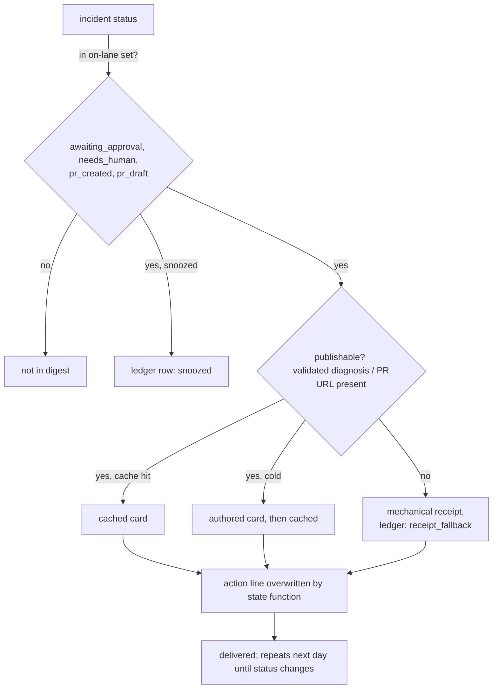

# Digest fixes: one action-only card lane

**Status:** approved design, pre-implementation. Companion plan: `docs/superpowers/plans/2026-08-28-unified-cards-fixes.md`. Supersedes the lane split and shadow mode in `docs/design/2026-08-27-unified-digest-cards.md`.

## Summary in plain words

The daily digest is the Slack message Opslane sends each morning listing what needs attention. Today it can show an item in two ways, built by two separate code paths (this doc calls each path a **lane**):

- **Show it once.** The original behavior: the day an investigation concludes, a model-written card appears, and never again. This doc calls these **one-shot** cards.
- **Show it every day until someone acts.** The behavior added by the recent friction-delivery fix and extended by the unified-cards work: an incident waiting on a human (approve a fix, review an investigation) appears daily until it stops waiting.

Verification of the unified-cards implementation found four bugs, all at the seam between those two paths: one-shot cards get destroyed or double-charged, and in one case a waiting incident disappears from the digest entirely. The product decision that resolves them is to stop having two paths. The digest shows an item if and only if a human action is pending, it repeats until the action is taken, and "review the fix PR" counts as such an action. Cards with nothing to do ("we investigated, nothing needs you") leave the digest for good. This doc specifies that consolidation.

## Problem

Black-box verification of the unified-digest-cards implementation (run `.verify/runs/20260827-192819`, 21 criteria) passed 16 and failed 3, with four distinct defects behind the failures. All four sit at the boundary between the new repeating lane and the old one-shot lane.

1. **ON mode discards every one-shot card, daily, after paying for it.** Validation applies `publishable()` (`build.go:244`), a rule keyed to actionable receipt states, to one-shot cards whose state (`investigated`) always fails it. The card is authored by the model, discarded as `not_publishable`, and re-authored the next day. Observed live: writer payload contained 3 authored cards, delivery contained 2, and the third burned one model call per day thereafter.
2. **Shadow mode destroyed cards it promised not to touch.** A card the current production lane would render arrived as a bare receipt, while its episode publication row was still written. One-shot cards shown during shadow are therefore gone for good: published but never rendered.
3. **Actionable cards wrote `issue_publications` rows.** The design forbids this (actionable cards repeat; the publications table is the one-shot gate). Nothing breaks today because the actionable lanes do not read the table, but the row poisons the incident's future one-shot card.
4. **An actionable error can vanish outright.** The card lane derives its action text from `error_groups.remediation`/`reason_message` (the `action` subquery in `freeze.go`) and skips the candidate when both are empty. A skipped candidate gets no receipt either, because receipts in ON mode exist only as a fallback for cards that failed after being built. Prod data shows the risk is real: all 11 incidents that reached `awaiting_approval` have an empty remediation field (read-only prod query, 2026-08-28). Errors are at 0 today only because none has reached that status through the same pipeline yet.

The product ruling that resolves all four (user, 2026-08-28): the digest is action-only. A card appears if and only if a human action is pending, it repeats until the action is taken, and "review the fix PR" is such an action. Pure FYI ("we investigated, nothing to do") does not belong in the digest. Shadow mode is dropped.


Terms used throughout: the **episode card lane** is the one-shot path's implementation name (it freezes an incident episode, has the model write a card, and blocks repeats by recording the episode in the `issue_publications` table); the **run ledger** is `digest_run_candidate_evaluations`, one row per considered incident per run recording why it was included or excluded; a **spell** is one continuous stretch of an incident being actionable, and `spell_started_at` (its start time) keys the copy cache so cached text dies when a new spell begins; the **fact envelope** is the JSON block of frozen incident facts handed to the model; `digest_runs.unified_cards_mode` is stamped on each run at freeze time with the flag value then in effect, so later queries judge historical runs by the mode they actually ran under.

## Goals

- G1: No code path can silently remove an incident that awaits a human action from the digest.
- G2: Every card's instruction line is derived from incident state, never from stored free text or model output.
- G3: PR-review incidents (`pr_created`, `pr_draft`) enter the actionable lifecycle: waiting age, snooze, repeat-until-resolved.
- G4: The digest writes and reads nothing in `issue_publications` when the flag is on.
- G5: A cached card rejected by validation re-authors the next day instead of demoting forever.

## Non-goals

- **No one-shot informational cards in ON mode.** "Investigation closed, nothing to do" conclusions stop appearing in Slack entirely; they live on the dashboard. This is the ruling, not an accident, and it is the one user-visible removal this design makes.
- **No shadow mode.** The safety it bought (rehearsal plus a warm cache at cutover) is not worth the third mode's semantics. Cost accepted: the first ON day authors every card cold, a handful of model calls once.
- **No changes to OFF mode.** It stays byte-identical to what runs in prod today (the receipts lane shipped in the friction-delivery fix, PR #423, plus the episode card lane that renders one-shot cards), because it is the rollback path.
- **No prod deployment in this scope.** The hardening migration (NOT NULL, wire retirement) stays deferred per the parent design.

## User requirements

| # | Requirement | Verified by |
|---|---|---|
| R1 | An incident in `awaiting_approval`, `needs_human`, `pr_created`, or `pr_draft` appears in every ON digest until it leaves those statuses, is snoozed, or falls past the cap (where it is counted in the overflow line and ledgered) | Table-driven freeze tests over all four statuses x both kinds; three day-shifted live runs per status on a fresh stack |
| R2 | An incident with empty `remediation`/`reason_message` renders exactly like one with text | F4 regression test: `awaiting_approval` error, empty field, with and without saved diff; live re-verify |
| R3 | The rendered action line equals the deterministic state function's output, regardless of what the model wrote | Worker test: deviating model action is overwritten before caching and rendering, mismatch logged |
| R4 | Entering PR review resets waiting age and clears any earlier snooze; `pr_draft`/`pr_created` flips preserve both | Migration 066 trigger tests incl. the same-class explicit-timestamp case |
| R5 | Merging the PR removes the incident from the next digest (the webhook sets status `merged`, which is outside the lane's status set); closing a draft unmerged keeps the incident but swaps the card to "Review the investigation." with a reset waiting age (webhook sets `needs_human`) | Code: `queries.go:2204` (merged) and `:2212` (closed draft to needs_human); pinned by a test in plan task 3 and a live merge/close scenario |
| R6 | Delivered ON runs write zero `issue_publications` rows, and a pre-existing row gates nothing | Go tests across all four statuses; live proof on a fresh stack |
| R7 | `investigated`/`resolved` incidents produce no candidate and no model call in ON | Freeze test asserting zero candidates and zero authoring for a seeded FYI shape |
| R8 | A cache row rejected by validation (digit, grounding, fingerprint race) is invalidated by primary key in the same transaction; a concurrent newer row survives | Unit tests incl. the concurrent-replacement case; live tail: tampered row re-authors next day |
| R9 | `DIGEST_UNIFIED_CARDS=shadow` (or any unknown value) behaves exactly as `off`, with one startup warning | Mode tests; live spot check |
| R10 | Operators can cap authoring per run via `DIGEST_WRITER_MAX_WRITES`; `0` still delivers cached cards and explicitly defers cold ones | Worker tests on the env-wired default dependencies |

## How the lane decides what a reader sees



The decisive change is the split at C. Today `publishable()` failing means the incident is excluded. After this design it only means "no authored card": the incident falls through to its mechanical receipt, exactly the receipt line prod renders today. Status alone decides presence; `publishable()` decides presentation. That single re-wiring closes defects 1 and 4, because no text field and no misapplied rule can produce absence anymore.

## Component design

### The action function (fixes defect 4)

One Go function, exhaustive over the ON status set, replaces both the `remediation`-dependent lateral in `freeze.go` and trust in the model's action text:

```go
// digestAction is the single source of the card's instruction line.
// It reads only incident state; stored prose and model output never gate it.
func digestAction(status string, hasSavedDiff bool, prURL string) string {
    switch status {
    case "awaiting_approval":
        if hasSavedDiff { return "Approve the proposed fix." }
        return "Review the investigation."
    case "pr_created", "pr_draft":
        if prURL != "" { return "Review the fix PR." }
        return "Review the issue." // inconsistent state; log a diagnostic, still render
    default: // needs_human
        return "Review the investigation."
    }
}
```

Why overwrite instead of validate: an equality check would demote a correct card over punctuation, wasting the authoring call. The model still receives the action in its fact envelope (it shapes the copy), but validation stamps the function's value onto the card before caching and rendering, and logs when the model deviated. The model cannot own a line that has exactly one correct value.

### Action classes in the lifecycle trigger (migration 066)

The 064 trigger stamps `actionable_since` when a group enters the actionable set. This design extends it with the idea of an **action class**: the value of `digestAction`. When the class changes, the ask changed, so the waiting age resets and any snooze clears; when it does not, both are preserved.

- `awaiting_approval` (snoozed, 6 days old) moves to `pr_created`: the user snoozed "approve the fix", not "review the PR". Age resets, snooze clears.
- `pr_draft` flips to `pr_created`: same review ask. Both preserved.
- `awaiting_approval` gains a saved diff: class moves from "Review the investigation." to "Approve the proposed fix.". Reset.

Mechanically: `CREATE OR REPLACE FUNCTION` on the function the shipped 064 trigger already calls (no second trigger, so the migrations cannot fight), with the trigger's `UPDATE OF` list extended to every input the class reads (`status`, `candidate_diff`, `pr_url`). Backfill for existing PR-status rows uses `updated_at`, not `now()`, so a month-old PR does not present as a fresh ask. Migration 064 itself is shipped and is not edited.

### Two status constants, not one

`actionableStatusSQL` is shared by the OFF receipts lane, the ledger, and SLA queries. Extending it in place would change OFF-mode output, which is the rollback path. So OFF keeps `m1ActionableStatusSQL = ('awaiting_approval','needs_human')` untouched, and the ON lane gets `onCardStatusSQL` with the two PR statuses added. SLA and reconciliation queries branch on the run's stamped mode (`digest_runs.unified_cards_mode`), so historical rows keep their own semantics.

### Publications removed from ON (fixes defects 2 and 3)

With no one-shot cards in ON there is nothing left for the episode gate to protect. Freeze stops reading `issue_publications` on the ON branch and delivery stops writing it; status governs repetition and the run ledger handles dedup. Shadow mode, whose only remaining job was pre-warming the cache, is deleted along with its columns (`shadow_render_mode`, `digest_card_copy.source`). Migration 065 never shipped, so it is edited in place; a guard rewrites any `'shadow'` run rows on databases that applied the old draft before the tightened CHECK lands.

### Cache invalidation by primary key (fixes the demote-forever tail, G5)

Verification showed a cached copy rejected for a smuggled digit stays the current row and demotes its card to a receipt every day. The fix invalidates exactly the consumed row, keyed `(error_group_id, spell_started_at, authored_at)`, in the rejecting transaction. Keying by group alone would let a slow validator clobber a newer concurrent replacement; the concurrent case gets its own test.

### Writer budget knob (closes verification's AC17 gap)

`maxWritesPerRun` exists in `writeDigest` but nothing wires it (`defaultDependencies()`, `job.ts:413`, sets no budget, so prod is unlimited). `DIGEST_WRITER_MAX_WRITES` feeds it; `0` still delivers cached cards and explicitly defers cold candidates. Compose passes it through; the prod ECS task definition (deploy repo) must add it before it has any effect there.

## Milestones

| Stage | Deliverable | Exit criterion |
|---|---|---|
| S1 | Shadow deleted (flag `off`/`on`; 065 edited; replay guard) | Mode tests green; migration replay from old-draft schema with a `'shadow'` row passes |
| S2 | Migration 066: PR statuses in the lifecycle, action-class trigger, `updated_at` backfill | Trigger tests incl. class-change resets, same-class preservation, 064 suite re-run green |
| S3 | ON lane: status-only candidacy, card-vs-receipt split, overwritten action, zero publications | R1, R2, R3, R6, R7 test sets green; OFF suites byte-identical |
| S4 | Cache invalidation by PK; capped rows keep `phase='freeze'` | R8 tests incl. concurrency; SLA quiet-twin test still green |
| S5 | Budget knob wired | R10 tests green |
| S6 | Live re-verification on a fresh stack (the standing verifyuc DB ran the old 065 and would lie about schema) | The failed scenarios from run 20260827-192819 pass; PR merge/close removes the card live; report recorded |

S3 carries one hard gate: R5's transition is verified in code (`queries.go:2204`, `:2212`) but must be pinned by a test before ON ships. If the pin fails, stop; repeat-forever PR cards are worse than no PR cards.

## Testing and validation

- **CI (Go):** migration replay tests (old-draft and fresh shapes), trigger class matrix, table-driven freeze tests over four statuses x two kinds, publication-absence tests, SLA mode-branch tests, cache-invalidation unit tests with a concurrent writer.
- **CI (worker):** action-overwrite test, four-status authoring-and-cache test, budget tests at 0/unset/invalid.
- **Live (fresh stack, real model):** the S6 scenario list: F4 regression both diff variants, PR card authored then cached then removed on merge, snooze cleared on class change with visible age reset, pre-existing publication gating nothing, FYI producing zero calls, `shadow` behaving as `off`, tampered cache re-authoring next day, OFF parity spot check. CI proves the rules; only the live run proves the pipeline wiring (scheduler, worker, webhook ordering) obeys them.

## Risks and mitigations

- **A status outside the four gains a pending action later** and silently misses the digest. Mitigation: the SLA `omitted_actionable` class fires for actionable incidents absent from a delivered run's ledger; the status set lives in one constant.
- **The class-reset trigger fires on an unforeseen column churn** (for example a pipeline rewriting `candidate_diff` in place) and resets ages spuriously. Mitigation: reset only when the computed class value actually changes, not on any watched-column write; the trigger test matrix includes a same-class rewrite.
- **First ON day model cost** with no shadow warm-up: every card authors cold once. Accepted; one writer call covers a whole candidate set, so this is single-digit calls per project.
- **Unsolved:** the cap plus repeat-forever means a project with more than nine standing actionable incidents will show the same top nine daily while the tail lives only in the overflow count and the ledger. Rotating which incidents fill the capped slots stays an open follow-up from the friction-delivery fix; this design does not address it.

## Alternatives considered

- **Keep both lanes and fix the validator routing** (one-shot cards validated by a one-shot rule): rejected by product ruling. It preserves cards with no action, keeps the publications machinery, and keeps the lane boundary that produced three of the four defects.
- **Keep shadow but stop it writing publications:** rejected. Its remaining value was a warm cache at cutover; the cost is a third mode whose semantics already went wrong once in exactly the subtle way modes do.
- **Validate the model's action by exact equality instead of overwriting:** rejected. It demotes correct cards over wording, wastes the authoring call, and still lets the model own a line with exactly one correct value.
- **Extend `actionableStatusSQL` in place for PR statuses:** rejected. It silently changes OFF-mode receipts, and OFF is the rollback path; two constants keep the blast radius of a bad ON rollout at zero.
- **Derive PR-card presence from `pr_url` instead of status:** rejected. `pr_url` survives on `merged` rows; status is the field the webhook transition actually maintains (`queries.go:2204`).
