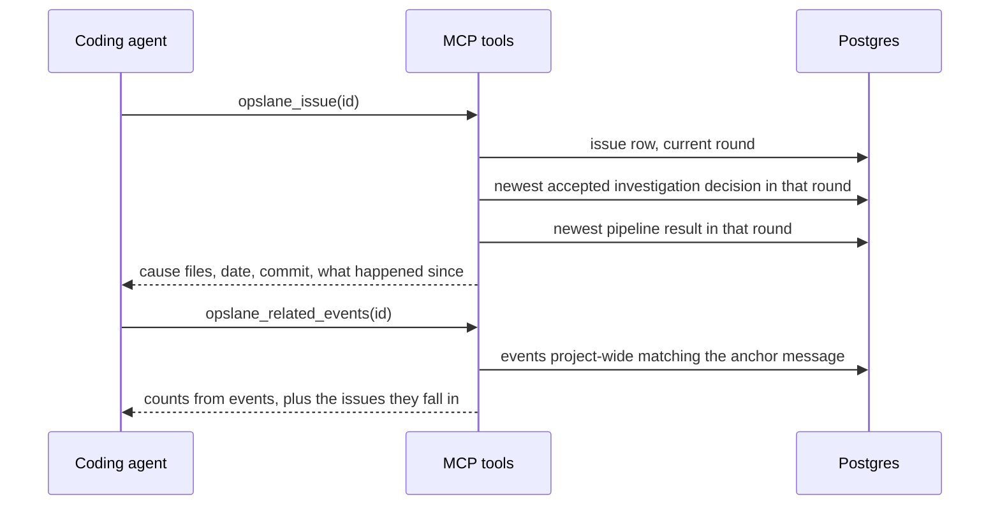

# Giving a coding agent the answer we already found

Status: draft, revision 4
Author: Abhishek Ray
Date: 2026-08-29

## Words used here

Three terms appear throughout and mean something specific in this codebase.

**Round:** one open period of an issue's life, stored in `issue_episodes`. An issue that is resolved and then happens again opens a second round, at `packages/ingestion/identity/episode.go:55`. Most tables that record what we decided about an issue point at a round, not just at the issue.

**Splinter:** one of several separate issues that are the same bug, created because their fingerprints differed. Historically this happened when the minified class name changed between deploys.

**Accepted diagnosis:** a stored decision that the pipeline itself kept, as opposed to one it produced and then rejected. Section "Choosing which decision to believe" defines exactly which stored rows qualify, because no single column says so.

## Problem

On 2026-08-28 an investigation of an AMFJ error finished and wrote this down:

```
outcome    cause_kind   cause_location
code_fix   local_code   server/app/routes/api/resources/asset.py,
                        vue3/client/src/modules/common/fetch/fetcher.ts,
                        vue3/client/src/modules/assets/api/index.ts,
                        server/app/utils.py,
                        server/app/rq/asset.py
```

The next day an engineer opened the same issue through our MCP tools and saw none of those paths. They saw a root cause sentence cut off in the middle, a timeline saying no network activity was recorded, and an impact line reading "3 users, 11 occurrences". They went to Sentry, found the error going back to 2026-07-27 across roughly twenty tenants, and worked out the rest by reading the code and reproducing the bug locally.

Four things are wrong, and all four are in our code.

**We never show the files we found.** `FormatIssue` at `packages/ingestion/mcp/format.go:230` builds its "Resolved source" list only from the source map envelope, through `sourceLocations` at `format.go:165`. That yields `fetcher.ts:49` and `fetcher.ts:75`, which is where the error surfaced in the browser. The five paths above sit in `diagnosis_decisions.cause_location` and no MCP reader selects that column.

**We do not say how old the diagnosis is or what happened since.** The root cause an agent sees comes from `error_groups.root_cause`, read at `packages/ingestion/db/queries.go:1650` and assigned at `handler/incident_present.go:93`. That column survived here, so nothing was erased. What is missing is context: a later run the same day timed out, and the tool gives no sign of it. The stored reason nobody displays:

```
Agent harness error: [deadline_exceeded] the operation timed out ...
```

Erasure is possible even though it did not happen here. `updateGroupInvestigation`, starting at `packages/worker/src/db.ts:2722`, writes `root_cause = $4` at line 2800 from `fields.rootCause ?? null`, so a terminal update carrying no cause blanks the column.

**The impact numbers describe one splinter.** Eighteen issues in that project hold events whose message is exactly "Error deleting Assets", spanning 2026-07-27 to 2026-08-28. The card showed one of them.

**We cannot tell an agent why the evidence is thin.** `FormatTimeline` at `packages/ingestion/mcp/timeline.go:184` prints "No network activity was recorded on this event" whenever the `network_timings` column is empty. On the event in question that column is empty and the event carries five breadcrumbs, four of them POST requests. The sentence is false, and the real reason is knowable: that session ran SDK 4.0.0, which predates network timings.

## Two things we learned while writing this

**We do record SDK versions.** Not on events, where ingest accepts `sdk_version` at `handler/error_event.go:124` and omits it from the write at line 252, but on sessions, registered at `packages/sdk/src/replay.ts:142` and stored at `packages/ingestion/db/sessions.go:125`. Events carry a session id, so the version is one join away. For AMFJ over seven days:

```
sdk_version   events   events carrying network timings
4.0.0            483            0
4.1.0             33           32
```

Network timings shipped in commit `81be415`, which also cut 4.1.0. So 4.0.0 has none by construction, and 4.1.0 records them almost always. AMFJ is mid-rollout and 4.0.0 still serves most of its traffic. Every event on this issue came from a 4.0.0 session. That accounts for the missing timings on this issue; it does not prove 4.1.0 is free of capture bugs, and the one 4.1.0 event without timings is unexplained.

**The SDK still records a little of its own traffic.** Ingest POSTs as a share of network breadcrumbs: 574 of 774 on 4.0.0, 108 of 687 on 4.1.0. The exclusion at `packages/sdk/src/network.ts:23` reads correctly and its test at `packages/sdk/src/__tests__/network.test.ts:102` passes, so 108 leaks on the current version is an open question rather than a known bug.

## Goals

- Show the cause files we already computed, in the first thing an agent reads.
- Say how old a diagnosis is, which commit it was made against, and what happened after it.
- Make the reach of an error visible, with the arithmetic and the guesswork clearly separated.
- Tell an agent why evidence is missing, using only what storage can prove.

## Non-goals

**Merging the eighteen splinters.** `identity/merge.go` can move events and rebuild counters. Not here. It rewrites stored data to answer a question a read-only view answers, `ConfirmMerge` has no callers anywhere in the repository, and it refuses automatic merges on issues that were investigated or published, which is all of these.

**Changing how errors are grouped.** The issue on the card has six fingerprints bound to it, which is the behavior we want. That is evidence the current pipeline absorbs fingerprint churn; it is not proof that nothing will ever fragment again. Either way, grouping is not what failed here.

**Correlating with backend errors.** The underlying failure was a Redis error visible only in the customer's Sentry. We ingest browser errors. Naming a backend file is achievable and is most of the value; joining across systems we do not hold is not.

**Capturing the failing request.** Needs browser SDK work. See the caveat at the end.

## What has to be true when we are done

Every row is proved by a seeded fixture. Production numbers move whenever a new event lands, so an acceptance test written against them fails without a defect. Production is a one-time smoke check, run by hand.

| | Requirement | Proved by |
|---|---|---|
| R1 | `opslane_issue` prints the cause paths from the chosen decision, in stored order, marking the one that was checked against the repository | Fixture with a three-path cause; assert order and marker |
| R2 | The chosen decision belongs to the issue's current round | Fixture with two rounds; assert the earlier round's cause is not shown as current |
| R3 | Rows the pipeline rejected, and rows written by the fix stage, are never chosen as the cause | Fixture containing a rejected verdict with paths and a fix-stage row; assert neither is chosen |
| R4 | The cause carries its date and, when stored, the commit it was made against | Fixture with and without a commit; assert both render correctly |
| R5 | The most recent pipeline result is shown beside the cause, whatever it was, fenced and length-capped | Fixture with a failed later run; assert the text appears inside the untrusted markers |
| R6 | A new tool reports matching events across the project: how many, how many distinct people, earliest and latest, counted from events | Fixture with three issues sharing a message and one that does not; assert the outsider is excluded |
| R7 | The sibling list is ordered deterministically, capped, and says when it truncated | Fixture with more issues than the cap |
| R8 | The timeline distinguishes "no timings recorded" from "no activity", and names the SDK version when that explains it | Fixture with breadcrumbs, no timings, on a 4.0.0 session |
| R9 | Fetch and XHR breadcrumbs appear with their status codes | Fixture; assert a 400 renders as 400 |
| R10 | Every value drawn from stored prose is fenced, and the payload stays inside the existing byte limit | Fixture with an oversized cause list and a path containing the untrusted markers |

## How the pieces fit



## The parts

### Showing the cause

Read `cause_kind` and `cause_location` from the chosen decision. No MCP reader selects them today. The fix agent reads a cause location out of the diagnosis JSON at `packages/worker/src/agent-fix.ts:413`, and that path is untouched by this work. The blast radius is not nothing, though: this adds database reads, changes MCP output, consumes payload budget, and needs new tests. It changes no existing contract.

Order is meaningful and survives the pipeline. The tool schema asks for the most important file first at `diagnose-schema.ts:253`, `parseLocations` at `diagnose-schema.ts:330` preserves order, and the string is stored unchanged by the insert at `db.ts:105`.

For a code-fix verdict, the first entry has been checked as a cause location by `deriveOutcome` at `classify.ts:195`. For a verdict concluding the cause is outside the codebase, no path is resolved at all: `classify.ts:168` reads the first path straight through without checking it. So the marker is conditional on the verdict, not universal. Later entries are advisory unless they also appear in validated evidence, which `validateVerdict` at `verdict-validation.ts:201` resolves and checks against the files the model actually read. Nothing enforces a relationship between the two lists. The render says so:

```
Cause: local_code, diagnosed 2026-08-28 against commit 324cc988
  server/app/routes/api/resources/asset.py        (checked against the repository)
  vue3/client/src/modules/common/fetch/fetcher.ts
  vue3/client/src/modules/assets/api/index.ts
  server/app/utils.py
  server/app/rq/asset.py
The order is the investigation's own ranking. Only the first path was verified to exist.
```

**Parsing the paths is lossy, and revision 2 was wrong about the fix.** That revision said to read structured paths from the diagnosis JSON. They are not there. `investigateError` flattens the array into a comma-joined string at `investigate.ts:456`, and the persisted contract at `shared/src/diagnosis.ts:125` holds `cause_location: string` and nothing else. A repository path or an external-system description containing a comma splits wrong, and no stored row can recover from that.

So there are two pieces of work, not one. Splitting on commas is what we can do for existing rows, and it stays lossy forever. Persisting a structured list for future rows is a TypeScript change in the worker's write path. Milestone one includes both, which means milestone one is not a Go-only change.

Cause paths are also often absent:

- A code-fix verdict requires the first location.
- A verdict concluding the cause is external can be accepted with none.
- Preflight and fix-stage rows carry no diagnosis at all.
- Friction diagnoses use a different shape, and older rows have no enforced shape.

The renderer treats an empty list as a normal case, not an error.

Keep the existing source map section. It answers a different question, and an agent wants both.

### Choosing which decision to believe

This is the part most likely to be got wrong, so it is spelled out rather than described.

`diagnosis_decisions` has `error_group_id`, not null since migration 033, and `episode_id`, added in migration 054 and nullable. The permitted outcomes after 054, at `054_pipeline_quality.sql:269`, are `code_fix`, `not_actionable`, `needs_more_context`, `incomplete`, `verified_fix`, `needs_human`, and `unable_to_establish_cause`.

No single outcome means "accepted". `needs_human` alone is written for four unrelated situations:

- A preflight failure with no diagnosis at all, at `index.ts:614`.
- A conclusion that the cause is outside the codebase, rewritten from `not_actionable` at `index.ts:828`.
- A valid code diagnosis held back by a gate, at `index.ts:861`.
- A fix attempt that failed, at `index.ts:1595`.

The fix stage also writes into the same table, same issue, same round. `recordFixTerminalDecision` at `db.ts:326` inserts `verified_fix` or `needs_human` with `diagnosis` set to null and `model` set to `deterministic-fix-verification`. A query ordered only by date would let one of those shadow the investigation. The digest already guards against exactly this by excluding that model, at `packages/ingestion/digest/build.go:19`, and we reuse that filter rather than inventing one.

Validation rejection is recorded, just not in the outcome column. `investigateError` sets `basis` to `invalid_verdict` at `investigate.ts:428` and `:443` when the verdict fails validation, and the row is persisted with its cause paths intact at `index.ts:787`. Selecting on "the cause field is filled" would promote a verdict the pipeline threw out.

So the cause selector is:

```
newest row where
  episode_id = the issue's current round
  and outcome in ('code_fix', 'not_actionable', 'needs_human')
  and model <> 'deterministic-fix-verification'
  and diagnosis is not null
  and basis is distinct from 'invalid_verdict'
order by decided_at desc, id desc
```

The outcome allowlist is doing necessary work. Two outcomes carry a non-null diagnosis that the pipeline itself considers unusable, and neither is caught by the `basis` filter. `unable_to_establish_cause` is written when validation rejects the verdict. `needs_more_context` with basis `citation_unresolvable` is written at `classify.ts:215` when the cited file does not exist in the checked-out repository. Filtering on a non-empty diagnosis alone would show both as causes.

`decided_at` comes from the column default at `033_diagnosis_decisions.sql:15`.

Revision 2 proposed falling back to an unscoped issue-wide query when the round is null. That is a correctness hole. An issue with a current round but no accepted decision in it would show a previous round's cause as though it were current, and a label does not fix that. The fallback is narrower. Only when an issue has no rounds at all do we read issue-wide rows, and then we present them as history rather than as the current cause.

A merge closes the rounds of the issue that was folded in, at `identity/merge.go:215`, and does not move its decisions. So a good diagnosis on the folded-in issue becomes invisible to the surviving one. This design does not solve that. It is a real gap and it belongs with the merge work, which is a non-goal here.

Separately, print the most recent pipeline result for the round. Define it precisely, because three different records could claim the name: we show the newest `diagnosis_decisions` row for the round of any kind, including fix-stage rows. We do not read `error_group_jobs.last_error`, written by `failJob` at `db.ts:822`, because a thrown attempt may be retried and is not a result.

```
Cause: local_code, diagnosed 2026-08-28 against commit 324cc988
Most recent result: 2026-08-28, ended without a diagnosis.
  <untrusted>Agent harness error: [deadline_exceeded] the operation timed out ...</untrusted>
```

### Counting how far the error reaches

The message lives on events, at `001_baseline.sql:66`. Issues store a title at line 78 and an optional sample event pointer at line 84. Nothing forces every event in an issue to share a message, so any answer built from issue-level rollups is wrong in a way that is easy to miss:

- Summing `occurrence_count` counts events whose message differs.
- `error_group_affected_users` counts people who only saw a different message.
- Issue-level first-seen widens the window with unrelated events.

Count from events. That makes the arithmetic exact for a stated predicate. The predicate is exact equality on `error_message`, restricted to the same `platform` and `environment_id`, excluding archived issues and issues that were folded into another by a merge, which keep stale counters. Distinct people means distinct non-null `end_user_id`. Every listed issue's numbers are counts of its matching events only, never its rollup.

**Which message:** the tool takes an issue id, and an issue can hold several messages, so the count needs a stated source or two people asking the same question get different answers.

Each round of an issue has one event picked out as its evidence anchor, and the timeline tool already resolves it through `TimelineAnchorEvent`. That event's message, platform and environment become the count's predicate. Picking the anchor rather than any event matters because the anchor is stable: it is chosen once when the round opens and does not move, so the same issue id always produces the same number.

When an issue has no anchor event, the tool says so and returns nothing rather than guessing. It also accepts an explicit message argument, so an agent can deliberately ask about a different message.

**The index:** `error_events` is indexed on project, environment, issue, session, end user, created-at, and release. None help. A plain text index on unbounded message text also risks entries too large for a B-tree.

Revision 2 proposed a hash column plus a backfill. That was overbuilt. `pgcrypto` is already enabled at `001_baseline.sql:6`, so an expression index does the same work. No new column, no dual-write across the two insert paths at `db/capture.go:82` and `db/queries.go:1033`, and no window in which rows arriving during a backfill are missing:

```sql
CREATE INDEX CONCURRENTLY IF NOT EXISTS idx_error_events_message_digest
  ON error_events (project_id, environment_id, platform, digest(error_message, 'sha256'));
```

The migration runner replays every file, so the `IF NOT EXISTS` is required, and a concurrent build that is interrupted leaves an invalid index behind that a replay will not repair. Migration `046_impact_query_index.sql` already solves both problems: it drops invalid indexes by name before creating them. Copy that file's structure rather than writing this statement on its own.

The query looks up by digest and then rechecks `error_message = $1`, so a hash collision cannot produce a wrong answer. Building it concurrently keeps ingest writable.

**Ordering and truncation:** sort by first-seen ascending then id, cap the list, and print how many were left out.

**The recurrence signal:** an event arriving after resolution reopens its own issue, so an issue marked resolved has not silently kept firing. The signal is about the family, and its predicate is: this issue's status is resolved, and some other matching issue has a matching event later than this issue's `resolved_at`. Say that in those words, because "resolved but recurring" means something else.

```
18 issues in this project hold events with the message "Error deleting Assets".
Counted from matching events: 94 occurrences, 24 distinct people, 2026-07-27 to 2026-08-28.
10 of those issues are resolved, and other issues carrying the same message produced
events afterwards.

  7f78d3c3  2026-07-27 to 2026-07-27    1 occ   1 person   resolved
  ...
  7f78d3c3  2026-08-27 to 2026-08-28   11 occ   3 people   needs_human   <- this issue
  ... 8 more not listed

The counts above are exact for one rule: identical message text, same platform and
environment. Whether those events are all the same bug is a guess.
```

That last sentence matters. The arithmetic is exact; the family relationship is the heuristic. Revision 2 blurred them into "treat the totals as a lead", which undersold the first half and oversold the second.

### Age

The issue's own first-seen is already loaded, at `format.go:25`, and is already correct for what it describes. Print it now, labelled, with no dependency on anything else:

```
First seen: 2026-08-27 (this issue)
```

Once the sibling tool exists, add the other number and never call it the real first-seen. It is the earliest matching-message observation, which answers a different question:

```
First seen: 2026-08-27 (this issue). Earliest matching message across 18 issues: 2026-07-27.
```

### Honest wording when evidence is missing

Each sentence has to be provable from what we store.

- No breadcrumbs and no timings: "No network activity was recorded on this event."
- Breadcrumbs but no timings, and the session ran a version that predates them: "This session ran SDK 4.0.0, which does not send network timings. The entries above come from breadcrumbs." Look the version up through the session.
- Breadcrumbs but no timings on 4.1.0 or later, or no session at all: say that plainly rather than guessing. These are separate states and the fixture list covers both.
- Session analysis found nothing: `session_analysis` records counts of 4xx failures, 5xx failures, unattributed failures, successful writes and failed writes at `038_session_analysis.sql:16-20`, and the analyzer turns only successful writes and failures into facts, at `friction/facts.ts:196` and `:212`. There is no total request count. So we report the counters and the coverage: "Analysis recorded no failed requests and no successful writes for this session. Coverage: partial." Zero counters under partial coverage prove nothing, and the coverage value is right there.

Rendering fetch and XHR breadcrumbs takes two changes. Widen the filter at `timeline.go:128`, and add a `Data` field to `rawBreadcrumb` at `timeline.go:47`, which decodes only type, timestamp, message and level. The SDK does write `data.status_code` for fetch at `network.ts:114` and XHR at `network.ts:210`, and ingestion stores it. The formatter is the only thing discarding it.

### Budgets and untrusted content

The payload limit is 8,192 bytes, at `format.go:76`. R1 promises the cause paths in order until the budget runs out, then a count of what was dropped. The sibling tool needs the same plus a hard cap on its list.

Cause paths, reason messages and titles are stored prose written by a model or produced by customer code. Each goes through `Fence` and a length cap the way existing fields do at `format.go:100`. The fixtures include a cause path containing the untrusted markers and an oversized cause list, because those are the cases that break a fence.

Adding a fifth tool has a cost. Four are registered today at `handler/mcp.go:102`, `134`, `161` and `190`. Each one is another schema in the calling agent's context and another chance for it to pick wrong. Calls also draw on a shared limit of 120 requests per project per minute at `handler/mcp.go:22`, which counts HTTP requests rather than workflows. One new tool, not three.

### The SDK

Two pieces of work, and the first is not engineering. Most of AMFJ's traffic is on 4.0.0, which predates network timings. Finishing the rollout improves their timing evidence. It does not by itself guarantee good breadcrumbs, complete session analysis, or the failing request. What we can build is the part that makes the gap legible: show the session's SDK version wherever we explain missing evidence.

Separately, 108 ingest POSTs reached the breadcrumb buffer on 4.1.0 in seven days. Configuration loads before fetch is patched, at `packages/sdk/src/index.ts:24`, so the obvious explanation of requests firing before initialization does not hold. The hypothesis worth testing first is more than one copy of the SDK in a single frame, which an Atlassian iframe app can easily produce. One copy patches fetch while another holds the configuration, and `isSdkEndpoint` returns false when it cannot read a config. Reproduce it before fixing it.

## Milestones

**One. Show what we already know.**
Cause section with date, commit and the checked-path marker. Round-scoped selection with the fix-stage and rejected-verdict filters. Most recent pipeline result printed beside it. Issue-local first-seen. Includes a worker change to persist a structured cause-location list going forward, so this is a Go and TypeScript change. Done when fixtures cover a two-round issue, a rejected verdict, a fix-stage row, and a missing commit, and the AMFJ issue returns all five paths as a hand-run smoke check.

**Two. Honest evidence wording.**
Four timeline states including the version lookup and the coverage-aware analysis sentence. Fetch and XHR breadcrumbs with status codes. Done when a 4.0.0 fixture names the version instead of claiming nothing happened, and a breadcrumb carrying a 400 renders as 400.

**Three. SDK self-traffic.**
Reproduce the leak, find the cause, fix it. Done when a fixture with two SDK copies in one frame records no breadcrumb for its own endpoint. Separately, report the 4.0.0 share to whoever owns the customer conversation.

**Four. The sibling tool.**
Anchor rule, concurrent expression index, event-level counting, deterministic capped listing. The anchor rule is settled before the index is written. Only after this lands does the issue tool print the cross-issue date. Done when fixtures prove the outsider issue is excluded, no number comes from a rollup, and the list truncates with a notice.

## Testing

Milestones one, two and four are mostly Go changes in `packages/ingestion`, tested the way that package already tests. Table-driven cases in `mcp/format_test.go` and `mcp/timeline_test.go` cover wording, ordering, fencing and truncation. Database-backed tests in `handler/mcp_issue_test.go` and `handler/mcp_timeline_test.go` cover the queries. Milestone one also changes the worker's write path, which needs a Vitest case asserting the structured list is persisted and the comma-joined string still written for readers that expect it.

Correctness comes from fixtures. Production is a smoke check run once by hand.

Milestone three needs a browser. `test-fixtures/vue-app`, a real endpoint, two SDK instances, then assert no breadcrumb names the endpoint.

Milestone four's index is built concurrently and its query is checked against a seeded table large enough that a sequential scan would be visibly slower.

## Risks

**Message matching sweeps in unrelated bugs.** A generic string like "Request failed" would gather errors that share nothing. Mitigated by exact matching, by listing the issues so a reader sees what matched, and by separating the exact arithmetic from the family guess. Not fully solved.

**A reworded message splits a family.** Real and unmitigated. Fuzzy matching fails in a worse direction by silently merging different bugs.

**A stale cause presented as current.** Mitigated by printing the diagnosis date, and the commit when the row has one. The commit is persisted at `index.ts:750` and older rows may lack it.

**A merged-away diagnosis stays invisible.** Named above and not solved here.

**Index build load.** Building concurrently on a large `error_events` table takes time and I/O. It is reversible: drop the index. This is the only operational step in the plan.

## Alternatives we rejected

**Merge the eighteen splinters.** `ConfirmMerge` would move the events and rebuild the counters, producing one issue with a true history. No callers, refuses automatic merges on investigated or published issues, and rewrites stored data to answer a question a view answers.

**A hash column with a backfill.** Revision 2's plan. It needs identical encoding in both insert paths, a dual-write deployment, a batched backfill, and a barrier before reads, and it still leaves rows written during the backfill null. An expression index over `digest(error_message, 'sha256')` needs none of that.

**A separate message table.** Adds normalization, a foreign key, and an upsert on the ingest hot path, for one read query.

**Grep the customer's repository for the message string.** The reviewer's suggestion: match the error text against the codebase to find the handler. Roughly what the investigation does, though not deterministically. It runs a model over a repository clone with file tools; nothing in the code guarantees it searched for the message. What it produced is the cause list, and showing that is cheaper than building a second search.

**Let the coding agent search instead.** It has the repository. But a model already read those files on a clone and the answer is stored. Making every agent redo it is slower and less consistent.

## What this does not fix

The failing request. It was the first thing our reviewer said they never found, and after all of the above it is still missing. No breadcrumb on any event in this issue names an AMFJ API host.

Revision 2 explained this by the 30 second breadcrumb age limit, configurable at `packages/sdk/src/config.ts:64`. That explanation is wrong. Breadcrumbs are added when a request settles, not when it starts, at `network.ts:117` and `network.ts:150`, so a slow request does not age its own breadcrumb out. Why the request is absent is unexplained. What would settle it: reproduce a bulk delete against a 4.1.x build and see whether the POST is recorded. Until then this is an open question, not a diagnosis.
