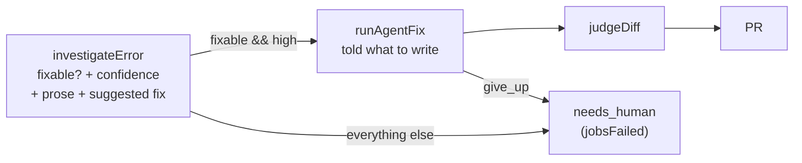
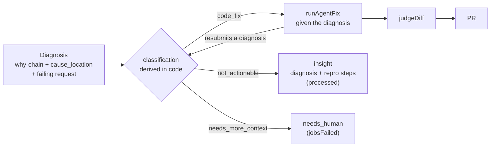

# Diagnose first, then decide what to do about it

Status: draft for review
Author: investigation of PR #1297, 2026-08-05, rewritten 2026-08-06
Reviewers: three rounds of adversarial review by Codex, criticisms folded into Alternatives and Risks
Prior art read in source: Sentry Seer (`getsentry/sentry`, `src/sentry/seer`), PostHog Signals

## In plain English

Our agent raised a customer's network timeout from 10 seconds to 30 seconds instead of telling them their server was slow. That PR was closed.

The agent was not confused. It worked out that the backend was slow, wrote that down, and changed the timeout anyway. It did that because the pipeline asks it one question, "can you fix this?", and accepts two answers: "yes, here is a patch" or "no, I failed." An agent that knows exactly what's wrong but can't fix it here has no way to say so.

The fix is to change the question. Instead of asking for a verdict and treating the explanation as justification, ask for the explanation and let the verdict fall out of it. Produce a diagnosis backed by evidence. Then, from that diagnosis, decide: we can fix this here, or a person needs to look at it and here is what we found and what to do.

This is how Sentry's Seer is built. Its root cause agent produces a diagnosis and is forbidden from proposing a fix; what to do about it is a separate step.

Two things follow that were not obvious. The diagnosis, not the verdict, becomes the thing we measure and improve, and the verdict becomes cheap. And the second agent, the one that writes the patch, stops being told what to write.

## The problem

On 2026-08-05 Opslane opened [PR #1297](https://github.com/conelike/asset-management-jira/pull/1297) against a customer repo, raising `FETCH_TIMEOUT` from `10000` to `30000` in three files, in response to `TimeoutError: signal timed out`. The customer's backend was slow. The change hid the symptom.

Three components each identified the backend correctly and none could record it:

| Component | What it concluded | What it answered |
|---|---|---|
| `triageError`, not on the production path | infra issue, cites timeouts | unfixable, 5/5 |
| `investigateError`, the production gate | names the failing endpoint in its own writeup, 3/3 | `fixable: true`, 6/6 |
| `judgeDiff` | "only partially addresses the root cause... may temporarily mask" | pass, 5/5 |

`index.ts:552` branches on `!triage.fixable && triage.confidence === 'high'` to `needs_human`, which increments `jobsFailed`. Otherwise it creates a fix job. So an agent that concludes "the backend is slow" must either report a failure or find something local to change.

### The first agent writes the band-aid and the second agent implements it

`index.ts:571` stores the investigation's `remediation` as `suggestedMitigation`. `agent-fix.ts:508` injects it into the fix agent's prompt under the heading `Suggested mitigation:`.

In the hard-case runs below, one baseline investigation produced this:

> Consider increasing `FETCH_TIMEOUT` in `client/asset-panel/src/api/fetcher/constants.ts` (currently 10000ms) for search endpoints that may be slow.

That is PR #1297, written by the classifier and forwarded as an instruction. Rate across 30 baseline runs: 1/30. Rare, and it happened on the case that produced the incident.

### More capability made it worse

Blind triage, which cannot see the repository, gets this right. Giving the classifier repo access makes it wrong, because it finds the timeout constant and concludes the error "originates from application code," which is true and beside the point.

The constraint was never information. The correct conclusion had nowhere to go.

## The change in one idea

Today the classification is the output and the diagnosis is whatever prose justifies it. That prose was "the timeout is set to 10 seconds in `constants.ts`." Accurate, and useless to anyone.

After: the diagnosis is the output. The classification is a field on it, derived from it.

Read as a rewording, this sounds cosmetic. It changes what we build, what we measure, and what the second agent is handed, and each of those is a section below.

## What a diagnosis has to contain

The bar, in four parts. It started as my own list and ended up close to Seer's `RootCauseArtifact`, which is reassuring, and the two places it still differs are deliberate.

**A chain of short why-statements,** cause to effect, each under fifteen words. Not a typed timeline. See the schema section for why the typing came out.

**Steps that would reproduce it,** each under fifteen words. This is the field that makes a conclusion usable by someone who has to act without us.

**Where the cause lives,** as a file and line, or as the external system when it is not our code. Our code compares this against the configured fix surface. The model reports; it does not rule.

**The specific external fact,** when there is one. Which endpoint, which status, how many times. Extracted in code from the breadcrumbs rather than written by the model, because unaided the model names the failing endpoint 1 time in 3 while its verdict stays stable 3/3 on the same evidence. The verdict is the easy part.

Two things are deliberately out. Corroboration, meaning two independent kinds of evidence cross-checked, which is how PostHog Signals works: we lack the data, having no request durations, no frequency across occurrences, no user counts. And any claim about *why* the external system was slow, which needs tracing we do not have.

A diagnosis that meets this bar can still be wrong. Nothing in the artifact tells you which. That is what the merge signal below is for.

## Goals

- **G1.** The diagnosis names what caused the error, not where it surfaced.
- **G2.** The diagnosis is legible: a human reads the chain and the external fact and knows what to do.
- **G3.** A correct diagnosis with no local fix is a successful outcome, terminal, counted as processed.
- **G4.** No regression on incidents that do have a correct local fix.

## Non-goals

**Per-project automation depth settings.** Sentry lets each customer choose how far automation runs. We do not want that surface. This design already contains a depth ladder, hardcoded: high confidence opens a PR, medium stops for approval, no local fix stops at the diagnosis. What we are declining is exposing the thresholds, not the concept.

**Seer's full three-step split.** They run root cause, then solution planning, then code changes, as three prompts each producing its own artifact, with the solution step told "do NOT implement the solution, only plan it" (`autofix/prompts.py:88`). We are doing the two-step version: the investigation stops proposing fixes and `suggestedMitigation` stops being forwarded. A separate planning step between them is deferred, not rejected.

**Corroboration.** Described above. It needs data we do not collect.

## Dependency, not a non-goal

**The SDK debug-image bug.** `debug-images.ts:36` stops scanning at the synthetic-stack marker, so browser-internal errors never resolve their stack. Verified end to end: `no_debug_ids` becomes `resolved` when the break is removed, deterministically, 0 debug images versus 2.

An earlier draft excluded this because it does not change the verdict for PR #1297, 6/6 either way. That measurement was taken on one error type and does not generalise:

- `vue-minified-008` in our eval set expects "tell the customer to upload source maps." Every arm gets it wrong and says we can fix it. That verdict is entirely determined by source-map resolution.
- On the minified PR #1297 stack, blind triage answered `unfixable_no_sourcemap` in 3 of 5 runs.

Where the agent can still find the code by searching, source maps change diagnosis quality. Where it cannot, they change the verdict. It ships in M2 alongside the rest of the context work.

## Requirements

| # | Requirement | Verified by |
|---|---|---|
| R1 | A timeout caused by a slow backend terminates as a conclusion | H1: 0/6 baseline, 6/6 with the change |
| R2 | Holds for other externally-caused errors | H2: 0/12 baseline, 11/12 with the change |
| R2b | The conclusion names the cause in the backend, not just its absence from the frontend | Unbuilt. M2, needs the widened read surface |
| R2c | The investigation sees what the fix agent sees | Unbuilt. M2. Today it gets no replay, no pre-loaded files, and breadcrumbs cut at 1000 chars |
| R3 | An external-looking symptom with a local cause still gets a fix | H5 6/6 and `vue-network-error-003`. Weakest row here: the case built to test it hardest was invalid. Rebuilt in M0, then read from the dual-written decisions in production |
| R4 | No regression on the labelled eval set | 26 cases: 22/22 `fix_pr` unchanged |
| R5 | The diagnosis carries a why-chain, repro steps, and names the external system | Extractor unit tests; the chain is legibility, not a verdict mechanism |
| R6 | The investigation stops proposing fixes | Band-aid rate in remediation: 1/30 baseline, 0/29 after |
| R7 | Execution failures never masquerade as conclusions | Routing test: budget exhaustion terminates failed |
| R8 | An `insight` incident cannot be approved into a fix run | Integration test against the `queries.go:1191` transition |
| R9 | Query strings never reach a prompt, incident, or PR body intact | Redaction unit test with token-bearing URLs |

## System: before and after

### Before



Two terminal states. One of them is failure. The prose diagnosis is stored as `root_cause` and read by nobody downstream except as a prompt fragment.

### After



Three terminal states. Two of them are work done. The diagnosis is the artifact that moves through the pipeline, and the fix agent can revise it.

### The investigation agent

Replace the boolean with a diagnosis. The shape below is Seer's `RootCauseArtifact` (`sentry/seer/autofix/artifact_schemas.py:25`) with two of our own fields added and one of theirs adapted:

```ts
diagnosis: {
  one_line_description: string        // under 30 words
  why_chain: string[]                 // each under 15 words, cause to effect
  reproduction_steps: string[]        // each under 15 words
  cause_location: string              // file:line, or the external system
  failing_request?: { method, url, status?, count }   // extracted in code, not written by the model
}
```

Four things changed after reading their schema, and three of them are simplifications.

**The chain is a flat list of short strings.** My earlier draft typed every step (`internal_code | external_system | human_action`) and marked one as decisive. Seer's `five_whys` is `list[str]`, each under 15 words, with no typing and nothing marked. They have far more production runs than we do and they did not need it.

Our own numbers agree, once the invalid case is removed. Step typing was ambiguous on H2 six times in nine, and the arm with a chain but no fixed outcome space scored 0/3, below baseline. The typing was quietly doing routing work, which is the job the outcome field should do. Dropping it removes a field the model gets wrong and loses nothing measured.

**Word limits on every field.** Under 30 words for the summary, under 15 per step. We have no limits anywhere, and "the timeout is set to 10 seconds in constants.ts" is exactly the kind of true, shapeless sentence an unbounded field invites.

**Reproduction steps.** They ask for them as part of root cause, not as part of the fix. That is the field that makes a conclusion useful to a person who has to act on it without us, and it is what a fix agent needs in order to verify anything. We ask for nothing like it.

**`cause_location` replaces their `relevant_repo`.** Theirs reads "the full repository name where the fix should be made. Pick the one repo most directly responsible for the root cause." They solved the boundary question by making it a field the model fills in, then acting on it. Ours is one repository containing several surfaces, so the analogue is a path. The point is the same and it is better than what I had: the model reports where the cause lives, and our code compares that against the configured fix surface.

The prompt tells the agent its job is to explain, not to propose a patch. We copy Seer's wording outright: *"Your task is to find the ROOT CAUSE of this issue. Do not propose fixes, only identify why the error is happening."* Plus *"Ask 'why' repeatedly to find the TRUE root cause, not just symptoms."* No error type is named anywhere in our version. No rule mentions timeouts.

### The three outcomes, renamed

Seer arrived independently at a three-value assessment (`artifact_schemas.py:15`), and their names are better than mine:

| Seer | Meaning in their prompt | Ours |
|---|---|---|
| `fixable` | a code fix can address it | `code_fix` |
| `not_actionable` | cannot be fixed through code: infrastructure, third-party outage, user misconfiguration | the conclusion |
| `needs_more_context` | the analysis is plausible but too vague to act on | the failure |

Their `not_actionable` is precisely PR #1297's bucket, and its listed examples are infrastructure and third-party outage. Their `needs_more_context` is an evidence-quality state, not a "somebody should look at this" state.

My draft had `needs_human_investigation` and `not_actionable` as two different conclusions plus a separate failure, which is one distinction too many and the names did not say what they meant. Adopt their three, and keep the mapping onto our existing statuses: `code_fix` to the fix path, `not_actionable` to `insight`, `needs_more_context` to `needs_human` counted as failed.

For v1 the fix surface is frontend code, held in project configuration rather than in the prompt. The agent reports `cause_location`; our code decides whether that is inside the surface. A cause we can locate but cannot execute or verify against is `not_actionable` with the reason recorded, not a fix attempt.

**Tie-breaks, stated rather than left to the model.** PostHog writes two directional rules into the prompt, and they point opposite ways: in doubt between actionable and needs-a-human, choose actionable; in doubt between needs-a-human and not-actionable, choose not-actionable. Lean toward doing something at the top of the ladder, lean toward restraint at the bottom. We have no tie-break rule at all today, which means the boundary sits wherever the model lands on a given run. That is a plausible contributor to the variance across identical configurations we saw all through the spikes, where the same setup scored 7/8, then 4/8, then 3/8.

`failing_request` is populated in code rather than by the model, and the model may not overwrite it. The extractor is specified in M2.

### The fix agent

Four changes, and only one of them is work inside `agent-fix.ts`.

**It stops being told what to do.** `agent-fix.ts:508` pastes `suggestedMitigation` into the prompt. That line goes, and `index.ts:571` stops populating the field. The investigation's next-steps text still lands on the incident for a person to read; it stops being an instruction to a second agent.

**It receives the diagnosis instead of a paragraph.** Today the handoff at `agent-fix.ts:505` is `Root cause: <prose>` plus `findings` plus `filesRead`. After, it receives the why-chain, the reproduction steps and `cause_location`. Strictly more information, and the repro steps are what it needs in order to verify anything.

**Its input distribution narrows.** It runs only when `cause_location` falls inside the configured fix surface. Today it runs on anything not caught by the `!fixable && high` branch, which is how it was handed a slow backend.

**It stops emitting a verdict at all.** This is the change with the most work in it, and an earlier version of this document got it wrong.

`give_up` (`tool-bridge.ts:172`) requires `reason_code`, `reason_message` and `remediation`, validates the code against `triageReasonCodes(platform)`, and falls back to `triage_unfixable`. It is a well-built structured decline, and the reason code the model picks is the routing decision. Nothing checks whether the accompanying explanation is complete, supported, or consistent with what the agent actually read. A one-line assertion and a fully evidenced diagnosis route identically when they carry the same code.

An earlier draft claimed to fix this by "testing whether the diagnosis is complete" instead of reading the reason code. That was the same lookup table with a paragraph in front of it, since nothing validates completeness. Codex called it, correctly.

The real change: replace `give_up` with `submit_diagnosis`, taking the same shape the investigation produces.

```ts
submit_diagnosis({
  why_chain: string[],            // the investigation's chain, revised after reading the code
  cause_location: string,         // where the defect is, now read from the code itself
  change_counterfactual: string,  // what change here would remove it, or why none would
  unknowns: string[],             // what could not be established
  verification: string,           // how a patch would be shown to work
})
```

The model no longer chooses an outcome and no longer names a reason code. Classification is derived in code from the submitted fields. `reason_code` is generated afterwards for display and telemetry, which is the role it should always have had.

**Seer does not do this, and we should say so.** Their `fixability` is a field the model fills in, on the same artifact as the causal chain. The most production-tested system of the three lets the model name the outcome.

I think the difference is what happens next. Seer's assessment lands in a UI where a person reads it and decides. A wrong `fixable` costs them a weak suggestion on a screen. Ours opens a pull request on a repository without asking anyone, so a wrong one costs a PR #1297. Autonomy is what makes the derivation worth its cost.

What their schema does give us is something to derive *from*. `cause_location` against a configured surface is a rule you can read, test, and argue with. My earlier draft had no such field, which is why "derive it in code" was a slogan rather than a design.

The property this buys is testable, and the test is the point: **changing the prose must not change the routing; changing a causal fact must.** Two fixtures that differ only in wording route identically. Two that differ in where the defect sits route differently. Neither test can pass while the model picks the label.

Evidence citations are validated where they are checkable: a `file:line` must exist in the checked-out tree, and a cited breadcrumb must exist in the incident. An unresolvable citation makes the diagnosis incomplete, which is a failure rather than a conclusion. Without that, "evidence-backed" is a schema and not a claim.

The shortest description of this whole design: the fix agent could always decline. The investigation could not. Removing that asymmetry is most of the change, and doing it properly means neither agent gets to pick the answer.

### Where each outcome lands

| Classification | Group status | Fix job | Counter |
|---|---|---|---|
| `code_fix`, high confidence | `fixing` | yes | processed |
| `code_fix`, medium or low | `investigated` | no, human may approve | processed |
| `not_actionable` | `insight` | no, terminal | processed |
| `needs_more_context` | `needs_human` + the matching `unfixable_*` code | no | **failed** |
| budget exhausted, no diagnosis submitted, tool error | `needs_human` | no | **failed** |

`not_actionable` must not land on `investigated` at any confidence. That state is approval-eligible at `queries.go:1195`, so a human clicking approve would launch a fix agent at something the diagnosis says has no local fix. Confidence is surfaced in the writeup instead of changing the destination.

`needs_more_context` and an execution failure share a destination but not a meaning, and the persisted decision keeps them apart. One is a run that looked and could not say. The other is a run that never got to look.

Execution failures are a separate axis and have to fail closed. `investigate.ts:484` currently returns `fixable: true` on budget exhaustion, so the hardest investigations default to attempting a fix. It also checks the budget *before* parsing the response, discarding a valid classification we already paid for. Both are fixed in M1.

Failing closed is not the same as throwing the work away, and PostHog handles this better than we do. Their budget is stated to the agent in the prompt, in units it can count, with a named landing spot: spend at most around ten tool calls per signal, and if the claim is still unverified after that, say so and move on. Ours is a dollar figure the model cannot see, and running out is indistinguishable from crashing. Take both halves: state the budget in tool calls inside the prompt, and give a partial diagnosis somewhere to land. A chain with two solid steps and an unverified third is worth more to a person than a bare failure, and it must not route as `code_fix`.

### Reusing `insight` rather than adding a status

`error_group_status` is a Postgres enum (`001_baseline.sql:46`), so a new value needs `ALTER TYPE`. `insight` was added by `004_friction.sql:12` and already means "No code cause; terminal; never becomes a PR" (`shared/src/types.ts:122`). The dashboard renders it (`status-recipes.ts:53`) and labels it "Investigation conclusion" (`IncidentConclusion.vue:15`), which is incident vocabulary. The friction pipeline produces it at `index.ts:715` and counts it as processed. The error pipeline never does. That absence is the bug.

Four consumers assume `insight` implies `kind = 'friction'`:

- `queries.go:1839` unarchive maps friction to `insight` and error to `investigated`. An error incident archived from `insight` would unarchive approval-eligible, violating R8 by a side door. There is no `previous_status` column, only `archived_at`, so this needs one.
- `009_regression_lifecycle.sql:16-18` indexes the inactivity sweep on `status IN ('needs_human','investigated')`. Error insights fall out of it, so a recurring external outage stops being tracked.
- `queries.go:1191-1197` fix approval. `insight` is absent from both branches, so it is already non-approvable. Confirm with a test.
- Any analytics grouping by status now mixes friction signals with error conclusions.

### Persisting the diagnosis

Today only `root_cause` prose and `confidence` are stored, and `updateGroupInvestigation` hard-throws when a `needs_human` write lacks `reason_code`, `reason_message` or `remediation` (`db.ts:1451`), while `classifyTool` leaves those optional and the parser keeps them `undefined`. Validate and fill from `buildReason()` before any write. `insight` is not covered by that guard; enforce it in the worker anyway, because a conclusion with no next steps is the failure we are fixing.

Store the diagnosis itself, plus the derived outcome, `cause_location`, the model identifier and a prompt version, written at classification time. Status is mutable; the decision is not, and the measurement below has to read the immutable record.

Redaction is required before any of this is written or rendered. See M2.

### Two things they do that we have no version of

**Check whether someone is already fixing it.** Before acting, PostHog's agent looks for an open pull request touching the same files, a recently pushed branch, or an assigned issue, and carries the answer into an `already_addressed` field. Their stated reason is that an automated PR opened on work a human already has in progress is a PR the team has to throw away. We can open exactly that PR today and have no check against it. Two or three `gh` calls, scoped by path rather than only by keyword, since concurrent work is easier to recognise by the files it touches.

This adds an injection surface, and PostHog names it in the same paragraph: what comes back from a PR title or a branch name is evidence to weigh, never an instruction to follow, because anyone can open an issue on a repo we search. Fence it the way we already fence error text.

**Handle a recurrence.** The two of them disagree here, which is itself informative. PostHog re-researches with `previous_finding_correct: true` or a replacement, so a second look is cheap. Seer says the opposite, in every prompt: "If you have previously generated this artifact, disregard the prior attempt and produce a completely new one from scratch."

They are answering different questions. Seer's line is about a retry inside one run, where carrying a bad attempt forward anchors the model. PostHog's is about the same signal appearing again weeks later, where re-deriving is waste. We need both and have neither. Discard within a run, confirm or replace across runs. It matters more once conclusions are terminal, because a recurring outage should be able to say "same cause, still not ours" cheaply, or "this changed, and now it is ours."

## How we will know it worked

Two signals, and the first one already exists.

**Merge rate, with its confounds stated.** `pr_outcomes` (`004_friction.sql:74`) records an immutable `merged` or `closed` per PR, joined to `error_group_id` and, since `008_receipts_wiring.sql`, to `fix_job_id`. These are customer-generated labels on our output, already in production and already displayed. PR #1297 is a `closed` row.

What is missing is the join. The merge outcome cannot currently be traced back to what we concluded, because the decision is not persisted as an immutable record. Adding that is what turns an existing dashboard number into a signal we can learn from, and it is the cheapest high-value item here.

It is also badly confounded, in a way this change makes worse, so it has to be read as telemetry rather than as proof:

- **Selection.** The classifier decides which incidents produce a PR, and then we score only the PRs it selected. A classifier that gets stricter raises merge rate by declining hard cases. This is exactly the R3 failure mode, and merge rate is blind to it by construction. The denominator has to be all eligible incidents in a cohort, with absolute PR count and absolute merge count both retained, not merge rate alone.
- **`merged` does not mean our patch was accepted.** The PR can be merged after a human rewrites it. Without the agent's diff hash and the merged head, we cannot tell an accepted fix from a used-as-a-starting-point one.
- **`closed` does not mean we were wrong.** Duplicate, superseded, applied by hand, stale, or closed by policy all look the same.
- **A reopened PR is counted twice today.** `queries.go:1729` deliberately writes a second receipt when a closed PR is reopened and merged, and `GetFixStats` (`queries.go:2960`) aggregates with `count(*)` over `pr_outcomes` rows grouped by outcome. The same PR therefore lands in both `PRsClosed` and `PRsMerged`. Any cohort read has to deduplicate to a final state per PR. This is a real bug in the existing metric, found during review, and it needs its own issue.
- **Multiple fix jobs can exist per incident,** so "incidents we attempted" is not the same denominator as "PRs we opened."

The comparative claim, that this change made things better, needs a shadow cohort rather than a before-and-after read on a metric whose selection rule changed at the same time.

**PR open rate next to merge rate, and both as learning signal.** Neither number means much alone. Fewer PRs opened with a higher merge share is the suppression pattern: it reads as an improvement and is not one, and it is exactly the R3 failure. A steady open rate with a rising merge share is real. Watching the ratio alone cannot separate those.

Because routing switches over rather than shadowing, the comparison is before-and-after on a metric whose selection rule changed at the same moment, which is weak. Writing down both decisions from M1 is what repairs it: the cases where the new logic withheld a PR the old logic would have opened are recoverable after the fact, and the merged-or-closed outcome on the ones the old logic did open is already recorded.

**Diagnosis quality, judged.** Merge rate says nothing about the incidents where we correctly opened no PR, which after this change is a growing share of the work. For those, the artifact is the diagnosis and the question is whether it was any good.

Start by reading the closed PRs we already have, recording what we had concluded on each, and writing the rubric from what is actually wrong with them. By hand, on real cases, before automating anything. A rubric written in advance would describe the failures I imagined rather than the ones we have.

**Not a metric: how many conclusions we produce.** `insight` becoming a success creates an obvious incentive to route fixable bugs there. Track `insight_rate` over completed classifications as a guardrail, segmented by project, error class, model and prompt version, read from the persisted decision rather than current status. Budget and tool fallbacks are excluded by construction because they terminate failed.

## What was measured, and what did not hold

Five hard cases against the real customer repo, each grounded in code that exists there. Three arms: today's boolean, the three-way outcome alone, and the three-way outcome plus a required causal chain.

| Case | Correct answer | Baseline | Outcome only | Outcome + chain |
|---|---|---|---|---|
| H1 timeout, backend slow | conclusion | 0/6 | 6/6 | 6/6 |
| H2 500, app reports it correctly | conclusion | 0/12 | 12/12 | 11/12 |
| H5 malformed URL yields a 400 | code fix | 6/6 | 6/6 | 5/6 |
| H6 null dereference, control | code fix | 6/6 | 6/6 | 6/6 |
| ~~H4 retry storm~~ | ~~code fix~~ | \- | \- | invalid, see below |

### The H4 retraction

H4 was the hardest case in the set and the one an earlier version of this document leaned on most. It was supposed to test an external-looking symptom, a 429, with a purely local cause, a `QueryClient` built with no retry policy at `App.tsx:5`.

The fixture does not contain that. It is 12 identical breadcrumbs built by a helper (`spike-hard.ts:31`) that emits no timestamp. The "40 identical requests in 3 seconds" that made the case a client-side storm existed only in a source comment and in the `why` string next to the label. The model saw a dozen indistinguishable requests with no timing, which is equally consistent with a client storm and with a server rate limit applied to normal traffic. It could not have been expected to tell them apart.

Everything that rested on H4 is withdrawn:

- The claim that the causal chain changes the verdict rather than only the writeup, which was measured as 1/12 to 9/12 on H4.
- The claim that this design trades one class of error for another, "buying H1 and H2, paying for it in H4."
- The mismatch detector proposed as the mitigation for that trade.

R3 still has support from H5, which is a clean fixture, and from `vue-network-error-003` in the eval set, which is a 500 with a genuine local fix because the component parses the body without checking status. Both pass. But the case built to test R3 hardest is invalid, so R3 is the weakest requirement here and rebuilding H4 with real timing is the first thing in M0.

### What did hold

**The outcome space is what fixes the verdict.** H1 and H2 go from never right to nearly always right. That is the finding this design rests on, and it is unaffected by the H4 problem.

**A chain without a fixed outcome space is worse than nothing.** Measured separately at 0/3 on the timeout case, below baseline. In those runs the model correctly labelled `external_system: The remote API server did not respond within 10 seconds` as the decisive step and still answered `fixable: true`. Correct analysis, wrong verdict, because the verdict had nowhere else to go.

That measurement now carries more weight than it used to, because it is the surviving evidence about ordering: fix the outcomes first, and the chain earns its place as the artifact rather than as a verdict mechanism. Under the inversion the chain does not need to justify itself by moving verdicts. It is the product.

**The band-aid rate.** 1/30 baseline, 0/29 after.

**No regression on the eval set.** 26 labelled cases, 22 expecting a fix PR. Baseline 23/26, outcome only 24/26, outcome plus chain 24/26.

### Decisive step typing, and why the field is gone

This measured a field the design no longer has, and it is kept because it is the evidence for removing it.

| Case | Expected decisive step | Correct |
|---|---|---|
| H1 timeout | `external_system` | 3/3 |
| H5 malformed request | `internal_code` | 3/3 |
| H6 null dereference | `internal_code` | 3/3 |
| H2 500 reported correctly | `external_system` | 3/9 |

On H2 the model routed correctly 11 times in 12 while typing the decisive step "wrong" 6 times in 9, usually by picking our own `handleResponse` throw site rather than the server's 500. Whether the decisive step in "the server returned 500 and we reported it" is the server or our throw is arguable, and I labelled it one way.

Two readings were available. Either the model is bad at a useful field, or the field has no stable answer. Seer's schema settles it: they carry no step typing at all, and they run far more of these than we do. A field where a defensible run and a wrong run are indistinguishable to the person who wrote the labels is not a field. It came out.

### What the eval set does not cover

The eval set contains none of H1, H2, H5 or H6. Its only infrastructure case is a CDN refusing connections, which baseline already passes. `pipeline-caller.ts:103` calls `runAgentFix` directly, so the harness has never exercised `investigateError`, the routing, or the persisted decision. It would have waved the original bug through, and it waves this change through.

It also does not validate what it loads, which is the M0 item above and the reason the H4 defect could sit there unnoticed.

Sample sizes are 6 to 12 runs per cell on the hard set and one run per cell on the eval set. Nothing here is a full pipeline run: every measurement is `investigateError` in isolation.

## Milestones

**M0. Fix the measurement, and the thing that let it break.** H4 was not a bad fixture, it was an unvalidated one, and the same gap sits under every case we are about to add. `loader.ts:7` casts `JSON.parse` straight to `EvalCase` and checks three fields; `types.ts:16` declares breadcrumb `timestamp` required and nothing enforces it. Validate fixtures at load and reject the old H4.

Then rebuild H4 with real timing, paired with a control that is a genuine server-side 429 with no local retry mechanism, so the case can distinguish rather than just be passed. Settle whether the authorized fix surface includes the customer's Python service, and relabel H1 and H2 accordingly. Re-run the arms over repeated trials, not one pass.
*Exit:* the loader rejects a fixture with the H4 defect; H4 and its control separate; H1 and H2 carry labels that match the `code_fix` definition in this document.

**M1. Diagnosis, derived classification, and decoupling the two agents.** The diagnosis schema on both agents, `give_up` replaced by `submit_diagnosis`, classification derived in code, evidence citations validated, execution failures failing closed, the budget check moved after parsing, the investigation prompt told not to propose fixes, and `suggestedMitigation` no longer forwarded. Routing switches over directly: v1 runs on our own apps and the current behaviour is known-bad, so there is nothing to protect by waiting. Both decisions are still written down, the new one and what the old logic would have said, so the disagreement rate is recoverable later without a gate in front of it.
*Exit:* routing tests pass, including the invariant that rewording a diagnosis does not change the route while changing a causal fact does; the PR #1297 fixture produces a diagnosis that would terminate as `insight`; band-aid rate stays at zero across the hard set.

**M1.5. Prior-art borrowings.** Tie-break rules in the prompt, word limits on every field, reproduction steps, budget stated in tool calls with a partial diagnosis to land on, the already-in-flight check with its output fenced, and the fix surface read from project configuration rather than assumed.
*Exit:* a fixture with an open PR touching the same file does not produce a second PR; an exhausted run produces a partial chain rather than a bare failure; no diagnosis field exceeds its word limit.

**M2. Context: make sure both agents are looking at the right things.** M1 changes the shape of the answer. M2 changes what the agent knows before it answers. Today the investigation, which decides whether we touch the customer's code at all, is the less informed of the two agents.

*The unminified stack trace.* `debug-images.ts:36` stops scanning at the synthetic-stack marker, so browser-internal errors never resolve. Verified end to end: `no_debug_ids` becomes `resolved` when the break is removed, 0 debug images against 2. This needs an SDK release and a customer upgrade, which is why it is here rather than in M1, and it needs a tracked issue that does not exist yet.

*The session: what the user actually did.* `replay-evidence.ts:90` walks an rrweb recording without a browser and produces the route, up to twelve visible UI elements at the crash, and up to six preceding user actions rendered as `clicked X` then `typed into Y`. It reaches the fix agent at `agent-fix.ts:496`, clamped to 500 characters a field. The investigation never sees it. `index.ts:525` already fetches the replay row on the investigation path and then never reads the variable, so the query is paid for and discarded.

For PR #1297 this is the difference between "the endpoint is slow" and "the endpoint is slow and we call it on every keystroke." The second is a conclusion someone can act on.

*The network: every request, not the first thousand characters of them.* Investigation breadcrumbs are truncated at 1000 characters (`investigate.ts:348`); the fix agent's are passed whole. A burst of repeated requests, which is exactly the evidence a client-side storm leaves behind, does not survive that cut. Collapse repeats before truncating, and extract the failing request in code with a pure function over `(errorType, errorMessage, breadcrumbs)`, matching on the breadcrumb's `data.error` equalling the error message rather than on timing, because concurrent requests make timing ambiguous.

*The codebase, including the parts we will not patch.* Three gaps. The fix agent pre-loads up to five files off the stack trace (`agent-fix.ts:736`) while the investigation spends turns on `read_file` fetching the same files, against a turn cap and a dollar budget. Nothing anywhere reads `AGENTS.md`, `CLAUDE.md` or a README, so neither agent is told how the application is structured; the only match for those filenames in the worker is a comment. And the read surface stays narrow when it should not: PostHog's prompt says the cloned repository "is your starting point, not a boundary," and our agent should open `server/app/routes/api/resources/asset.py` to say what the slow handler does, even though v1 will not patch it.

*Redaction, which gates all of the above.* `scrubSecrets` (`harness/redact.ts:5`) matches known credential shapes and never touches query strings, which carry tokens and tenant identifiers. Reduce the query string to key names before any of this reaches a prompt, an incident, or a PR body.

*Exit:* R9 passes; the investigation and the fix agent receive the same evidence; the rendered conclusion names `GET /issue-context/api/assets/search`, shows the why-chain and the reproduction steps, and cites what the user was doing.

**M3. Consumers.** Unarchive, the 009 index predicate, analytics queries, the non-approvability test.
*Exit:* R8 passes and no query returns an error insight where it expects a friction one.

**M4. Measurement and rollout.** Persisted diagnosis and decision, joined to `pr_outcomes`. The hand-written rubric from closed PRs. Guardrail metric, per-project flag, canary.
*Exit:* merge rate segmented by what we concluded, visible on internal projects for a week with the flag on and no guardrail alert.

M2 and M3 do not gate each other. M0 gates every claim quoted from the hard set. M4 gates general availability.

## Testing and validation

In CI: unit tests for the extractor and for redaction; routing tests covering classification through group status, reason fields, lease completion, counter and fix-job creation, none of which exist today; the eval set with an investigation-stage mode.

The eval needs a third value in `expected.outcome`, which is `'fix_pr' | 'needs_human'` today with the grader branching on exactly those two. Two cases legitimately change verdict: `python-third-party-002` and `react-third-party-007` are third-party crashes with no local fix, which is a conclusion. Two carry a wrong `reason_code`, `worker_runtime_error`, which means our own worker crashed.

Add H1, H2, H5, H6 and the rebuilt H4 as eval cases. They exist as spike fixtures and they cover the shape the set is missing.

Not yet run: the full pipeline from event to terminal incident.

## Risks and mitigations

**R3 is the weak requirement and its hardest test is invalid.** An external-looking symptom with a local cause is exactly the shape this design is most likely to over-block, and the fixture built to measure that had no evidence in it. M0 is first for this reason. Until it is done, the honest statement is that we do not know the size of this cost.

**A false conclusion is terminal with no recovery path.** Mitigation: an explicit "this is fixable here" correction action that moves `insight` into the fix path and emits an event. That event is the false-deferral measurement.

**Drift toward the cheap answer.** Covered above under the guardrail metric.

**We cannot directly measure whether a conclusion was correct.** Merge rate covers the PRs we open, not the ones we decline to. Associating a later human commit with an incident is not reliable, and proximity is not causality. The stronger signal is shadow fix attempts: sample concluded incidents, run the fix agent without opening a PR, score with the existing test harness and judge. Every piece of that machinery exists. It is not in this design because the hand-written rubric has to come first, to tell us what a shadow attempt should be scored against.

**The judge threshold is under-evidenced.** Raising `diff-judge` from `correctness >= 1` to `>= 2` rejects the band-aid 4/5 and accepts a genuine fix 5/5, but that is one genuine-fix diff over five trials. Separate change, gated on a broader fixture set.

**Historical analytics change meaning.** Any dashboard grouping by status without kind now mixes friction signals with error conclusions. There is no way to repair already-rendered history.

## Alternatives considered

**Keep asking for a verdict and improve the prose.** This is the smallest change and it is what the original draft of this document effectively proposed. It fails on the evidence above: the investigation already wrote an accurate description of the backend problem 3/3 and answered `fixable: true` 6/6. Better prose attached to a forced-choice verdict is what produced PR #1297.

**A new enum value instead of reusing `insight`.** Semantically cleaner, since `insight` is documented as friction lifecycle. Rejected on cost: `ALTER TYPE`, dashboard work, status recipes, and the same four consumer audits, to reach a state the codebase already defines. If the M3 audit finds deep friction coupling, this is the fallback.

**A 0..1 fixability score with a depth ladder,** as Sentry does. Codex pressed this twice. Rejected: the score answers how far automation should proceed, which is the policy surface we have decided not to build, and the bug was categorical. Codex's counter stands on the record: confidence and actionability are different axes, and a high-confidence external cause can still have a safe local mitigation. That is why the primitive asks about actionability rather than location.

**Routing the fix agent's `give_up` by reason code,** a lookup table from `unfixable_*` to conclusion or failure. Rejected because a well-evidenced conclusion and a blind assertion carrying the same code would share a destination.

**Keeping `give_up` and testing whether the diagnosis is "complete."** This was the previous draft's answer to the above, and it is the same lookup table with a paragraph in front of it, because the model still picks the code and nothing validates the explanation. Rejected in round 3. The replacement is that the model submits structured fields and does not choose an outcome at all.

**Adding causal-direction wording to the outcome description,** telling the model to decide by cause rather than by where the error surfaced. Tested as a fourth arm. It scored 12/15 against 14/15 for the unmodified version and reintroduced band-aid remediations at 2/15. Note that part of the case for this arm was H4, so its rejection now rests on the band-aid rate rather than on the accuracy difference.

**An explicit rule naming timeouts, aborts, CORS, 502 and 503 as unfixable.** Scores as well as the structural change on the cases we have, and only covers classes we have already been burned by. Rejected as the primary mechanism.

**A symptom-suppression veto on the judge.** Tested, rejected: it flagged a legitimate null-guard fix as symptom suppression 5 times out of 5.

**Backfilling `unfixable_infra` incidents into `insight`.** Rejected: the old classifier conflated genuine conclusions, weak classifications and execution failures.

## What this does not solve

It does not tell anyone *why* the backend was slow. It moves an incident from a wrong PR to a ticket saying "this endpoint exceeded its 10 second budget, here are the parameters, go look at your server." Someone still has to look. Without tracing we cannot say which query, which service, or which deploy.

### The monorepo, and why reading is not fixing

`conelike/asset-management-jira` is a monorepo. `server/app/routes/api/resources/asset.py:79` is the endpoint that timed out, and it sits in the repository we clone, next to the frontend code the agent was reading. So "the backend is slow" and "that code is right there" are both true, which for a while looked like it made the H1 and H2 labels wrong.

It does not, because v1 tracks frontend code only. The fix surface is the browser code, by product decision rather than by my assumption, so `conclusion` is the correct label for H1 and H2 and the numbers stand.

What has to change is that the constraint becomes explicit. This was Codex's condition and it is right: a frontend-only boundary applied silently is indistinguishable from an agent that does not understand the error. The diagnosis records the cause where it actually is, `server/app/routes/api/resources/asset.py:79`, and records separately that this path is outside the configured fix surface. A reader can then tell "we know exactly what is wrong and are not allowed to touch it" apart from "we could not work it out."

That also settles the investigation boundary, in the opposite direction, and here we follow PostHog. Their research prompt says the cloned repository "is your starting point, not a boundary," and instructs the agent to clone further repositories when the evidence points outside. Reading is not fixing. Our agent should open `asset.py`, read the handler, and say what it does, even though v1 will not patch it. That is the difference between a conclusion that says "your backend is slow, good luck" and one that says "this handler runs an unindexed query over the whole asset table on every keystroke."

The original complaint about PR #1297 was not only that we shipped a band-aid. It was that we had the information and threw it away. Widening what the agent may read while keeping what it may patch narrow is most of the fix for that.

`not_actionable` still collapses several situations: a service is slow, a service returned an error, a third party is at fault, the cause sits outside the fix surface. Those want different reason codes. This ships with two new ones covering the slow and error cases, and the taxonomy will need to grow in a shape we cannot yet see.

Finally, a diagnosis that meets the bar can still be confidently wrong, and the artifact gives you no way to tell. That is the limitation the rubric exists to bound, and it is not bounded yet.
