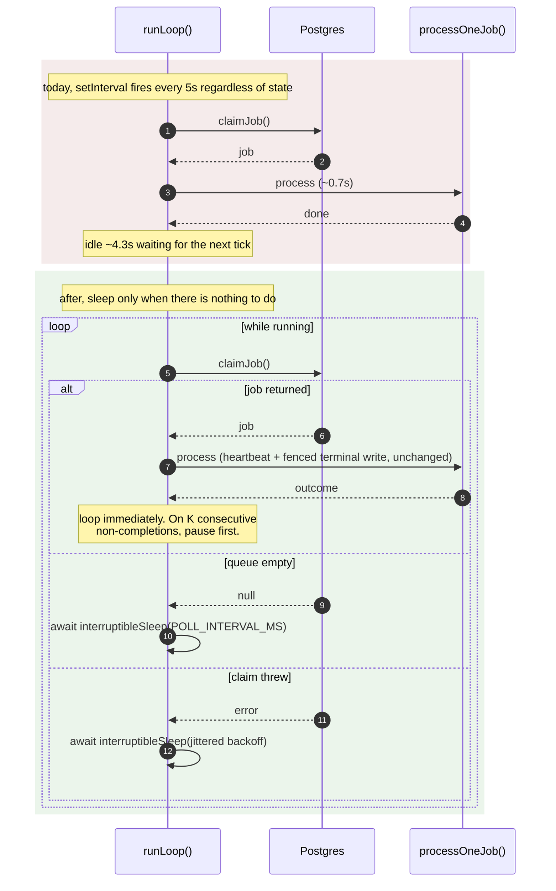

# Worker drain loop and retry backoff

Issue: [#260](https://github.com/opslane/opslane-oss/issues/260)
Status: draft. Four open items, listed in "Open questions" at the end.
Base: `main` @ `df57d51`

## In one paragraph

The worker checks for new work on a 5 second timer and takes one item per check. Most
items take under a second, so the worker spends about 86% of its time asleep, and it can
never finish more than 720 items an hour. Work is arriving faster than that, so a queue
has been growing for hours. The fix is to stop using a timer: finish an item, immediately
look for the next one, and only wait when there is nothing to do. The complication is that
the 5 second wait was quietly doing four other useful things nobody wrote down. If we
remove it without replacing those, we trade a slow queue for a worse problem.

### Terms used below

| Term | Meaning |
|---|---|
| claim | A worker taking ownership of one queued item so no other worker touches it |
| lease | A time limit on that ownership. It expires if the worker dies |
| heartbeat | A periodic "still working" update that extends the lease |
| reaper | A background sweep that takes items back when their lease expires |
| dead-letter | Giving up on an item after too many failed attempts. Customer-visible here |
| backoff | Waiting longer between each retry instead of retrying instantly |
| drain loop | The proposed shape: keep taking work while work exists |
| `session_analysis` | The cheap, high-volume job type that is backing up |

## The problem

A single worker process cannot complete more than 720 jobs per hour, no matter how cheap
the jobs are. Production sat at 699-712/hour for eight straight hours. That is a ceiling,
not a workload shape.

The cause is in `packages/worker/src/poller.ts`:

```ts
// poller.ts:34-35
async function tick(): Promise<void> {
  if (!running || activeJobPromise) return;
```

`tick()` runs on `setInterval(..., POLL_INTERVAL_MS)` (`poller.ts:153`) with
`POLL_INTERVAL_MS` defaulting to 5000 (`index.ts:73`). It claims at most one job per firing
and returns immediately if a job is in flight. The worker claims a job, works ~0.7 seconds,
then idles ~4.3 seconds. 3600 / 5 = 720.

**Provenance of the numbers.** The 699-712/hour, the 3,606 pending jobs, the ~1,350/hour
arrival, and the 0.7s mean all come from the prod evidence in issue #260, dated 2026-08-03.
This design did not re-derive them, and because it rests on two of them, M0 re-pulls those
two before any code is written. The 4.05ms claim-query measurement is different in kind: it
was produced during review by running `EXPLAIN (ANALYZE, BUFFERS)` on a disposable database
seeded with 200k historical rows and 4k pending, using the real index set. It is a
same-shape approximation of production, not a production measurement.

### What the 5 second wait is quietly doing

The 5-second gap is not only pacing throughput. It is silently providing four guarantees,
none of them written down:

| # | What the 5s tick actually does | What happens if we just delete it |
|---|---|---|
| 1 | **Spaces retries.** `failJob` resets `status='pending'` and never writes `available_at` (`db.ts:295-345`). A failed job is instantly re-claimable; only the next tick separates attempt 1 from attempt 2. | Against a fast-failing dependency, three attempts burn in *milliseconds*. A brief MinIO outage dead-letters thousands of jobs. |
| 2 | **Limits failure blast radius.** On heartbeat abort the job is deliberately left `claimed` with no terminal write (`poller.ts:90-95`). | An outage walks the whole backlog into abandoned-claimed state in minutes rather than hours. |
| 3 | **Paces a fleet-wide lock.** Every claim takes `pg_advisory_xact_lock(hashtext('opslane-job-claim'))` (`db.ts:142`). | Per-worker claim rate rises from 0.2/sec toward 1/job-duration. |
| 4 | **Caps per-tenant spend.** Claim order is global `created_at ASC` with no per-project bound. 720 analyses/hour is the only limit on how fast one project burns Anthropic budget. | One high-volume project can monopolize the analysis lane. |

**This is the core insight.** Removing the tick is not one change. A patch that fixes only
the throughput ceiling ships regressions in 1 and 2.

Guarantee 1 is the expensive one to get wrong. Dead-lettered `session_analysis` runs
`reconcileDeadLetteredSessionAnalysis` and sets `sessions.status='analysis_failed'`
(`db.ts:409-416`), writing customer-visible "Unchecked friction" diagnostic incidents. A code
revert does not remove those.

## Goals

- Remove the per-worker throughput ceiling so completion rate is bounded by job cost, not poll cadence.
- Replace guarantees 1 and 2 with explicit mechanisms, in the same commit that removes the tick.
- Keep lease ownership, fencing generations, and terminal-state transitions unchanged. Retry *timing* changes by design; retry *semantics* do not.

Guarantees 3 and 4 are **not** replaced. That is a deliberate, argued choice, not an
oversight. See "What we are not solving."

## Non-goals

- **In-process concurrency.** See D-1; this is the one design decision still open.
- **Fixing head-of-line blocking.** Issue #260 says the change stops "a single multi-minute
  investigate/fix job blocking all session analysis." **It does not.** A serial drain loop
  still runs one job at a time. This must come out of the issue's acceptance criteria or
  #260 gets reopened after shipping.
- **Idle-queue latency.** `POLL_INTERVAL_MS` changes meaning from "how often we poll" to
  "how long we wait when the queue is empty." The first job after an idle period still waits
  up to 5 seconds. `LISTEN/NOTIFY` would fix that; separate problem.
- **Reducing arrival rate.** Sampling sessions with nothing analyzable is plausibly a bigger
  lever than speeding up the consumer, but it changes product behavior and needs its own issue.
- **Per-tenant fairness budgets.** Pre-existing; this design makes it sharper without solving it.

## What has to be true before we ship

| ID | Requirement | Verified by |
|---|---|---|
| R1 | The loop claims the next job without waiting a poll interval | Unit: 3 queued jobs all complete inside `advanceTimersByTimeAsync(0)`, with zero simulated time elapsed. Integration: 10 seeded jobs with a stub handler complete in under 2s wall clock at `intervalMs: 5000`. **Both use stub handlers, so they prove loop cadence, not job throughput.** Real throughput is an M0/production measurement, not a test |
| R2 | A failed job is not retried immediately | Integration: after `failJob`, `status='pending'` and `available_at > now()`; a `claimJob` against a fixture where this is the *only* eligible row returns null |
| R3 | A claim error does not spin | Unit: `claimJob` rejects; exactly one call at t=0, second only after the backoff window. Jitter is injected via a seam so the assertion is deterministic |
| R4 | A run of failures pauses the worker instead of draining the backlog into a failed state | Unit: K consecutive aborts, assert claim K+1 waits; assert one success resets the counter |
| R5 | Shutdown strands no claimed job, whether it arrives before, during, or after a claim | Integration: after `stop()` resolves, `count(*) where status='claimed' and worker_id=$1` is 0, run for all three timings |
| R6 | Lease fencing is unchanged | Existing `poller.integration.test.ts:99,128` pass **unmodified** |
| R7 | Raising the fleet cap buys no throughput at fleet size 1 | No milestone exit criterion in this doc depends on the cap. Recorded in `packages/worker/AGENTS.md` so the deploy workstream inherits it |
| R8 | A stalled claim loop is visible without reading logs | `/health` reports oldest eligible job age and claims-per-minute by job type; asserted by a test that stalls claims and reads the endpoint |

R8 is what stops this recurring. Today `/health` returns 200 while claims are fully stalled
(`index.ts:979-994` reports `jobs_processed` and nothing about the queue).

## How it fits together

Nothing moves between services. The change is the *shape* of the worker's claim loop, one
SQL predicate in each of two functions, and additive health fields.



## The pieces

### C1. The loop (`poller.ts`)

`setInterval` cannot survive alongside a drain loop. Four specific incompatibilities. A
recursive `tick()` no-ops against the existing `activeJobPromise` guard. Interval callbacks
keep firing during a long drain. After an empty claim, the next tick is anchored to the old
schedule and can fire sooner than a full interval. And `clearInterval` does not stop an
already-draining `tick()`.

```ts
let loopPromise: Promise<void> | null = null;
let consecutiveNonCompletions = 0;

async function runLoop(): Promise<void> {
  while (running) {
    let job: ClaimedJob | null;
    try {
      job = await claimJob(workerId, leaseDurationMs);
    } catch (err) {
      logClaimError(err);
      await interruptibleSleep(nextClaimErrorDelay());   // R3
      continue;
    }

    if (!job) {
      resetClaimErrorBackoff();
      await interruptibleSleep(intervalMs);              // empty-queue wait
      continue;
    }

    // stop() may have fired while the claim was in flight.
    if (!running) {
      await rescheduleJob(job, new Date());              // R5, no attempt consumed
      return;
    }

    resetClaimErrorBackoff();
    const outcome = await processOneJob(job);            // 'completed' | 'failed' | 'aborted'

    if (outcome === 'completed') {
      consecutiveNonCompletions = 0;
    } else if (++consecutiveNonCompletions >= CIRCUIT_BREAKER_THRESHOLD) {
      await interruptibleSleep(nextCircuitBreakerDelay()); // R4
    }
  }
}
```

`processOneJob` is the existing IIFE body (`poller.ts:87-141`) with one change: it returns
its outcome instead of discarding it. Same heartbeat, same `AbortController`, same fenced
terminal writes. `activeJobPromise` and `pollTimer` are deleted.

**`stop()` replaces `activeJobPromise` with `loopPromise`:**

```ts
async stop(): Promise<void> {
  running = false;
  wakeInterruptibleSleep();        // resolve any pending sleep now
  await Promise.race([
    loopPromise,
    deadline(SHUTDOWN_GRACE_MS),   // see below
  ]);
}
```

**`interruptibleSleep` contract**, stated precisely because three tests depend on it:

- Resolves (never rejects) on whichever comes first: the elapsed duration, or `wakeInterruptibleSleep()`.
- Callers always re-check `while (running)` after it returns, so resolve-on-wake needs no special casing.
- One module-level pending handle; `wakeInterruptibleSleep()` when nothing is pending is a no-op.
- The timer is `.unref()`'d so a pending idle sleep never keeps the process alive.

Without the wake path, **all nine existing poller tests hang**: they run under
`vi.useFakeTimers()` (`poller.test.ts:48`) and end in `await poller.stop()`, and a plain
`setTimeout` promise never resolves because nothing advances the clock while the test awaits
`stop()`.

**Shutdown deadline.** `fix` jobs are multi-minute and `LEASE_DURATION_MS` is 300s
(`index.ts:77`). If `stop()` waits unconditionally, the container's termination grace period
SIGKILLs the process and strands the job anyway. `SHUTDOWN_GRACE_MS` must be set below the
platform grace period; on expiry the worker exits and leaves the job to the reaper, which is
strictly better than an unfenced terminal write from a dying process. **Unverified:** the
actual ECS/platform grace period. M1 needs that number.

**Backoff constants.** `nextClaimErrorDelay()` and `nextCircuitBreakerDelay()` both use
`min(base * 2^n, cap)` with jitter: base 1s, cap 60s for claim errors; base
`POLL_INTERVAL_MS`, cap 300s for the breaker. Jitter is required, not optional. A fixed
sleep prevents the spin but synchronizes the whole fleet into a retry convoy during an outage.

### C2. Circuit breaker (`poller.ts`): guarantee 2

The one component with no counterpart in today's code, and the one most likely to be
dropped under schedule pressure.

When the heartbeat loses the lease, `processOneJob` returns without a terminal write
(`poller.ts:90-95`) and lets the reaper own the job. Correct behavior. But it means a
systemic failure produces a fast, silent loop: claim, abort, claim, abort. With no
processing time to pace it, the abort path is *faster* than the happy path, so a down MinIO
walks the entire backlog into abandoned-claimed state in well under an hour. The reaper then
increments `attempts` on all of them and the dead-letter path writes thousands of
customer-visible incidents.

`CIRCUIT_BREAKER_THRESHOLD = 3` is a starting value, not a researched one. M0 pulls the
current abort/fail rate so it can be chosen against a real baseline rather than guessed.

Note the interaction with C3: once backoff exists, a *failed* job is no longer instantly
re-claimable, so the runaway this breaker actually guards is the **abort** path. The
implementation counts both because an abort storm and a fail storm are indistinguishable
from the loop's position, and pausing on either is safe.

### C3. Retry backoff (`db.ts`): guarantee 1

Add to the `SET` list in `failJob` (`db.ts:309-336`), which already contains
`attempts = attempts + 1`:

```sql
available_at = CASE
  WHEN attempts + 1 >= max_attempts THEN available_at
  ELSE now() + make_interval(secs => LEAST(
         $5::double precision * power(2, attempts) * (0.5 + random()),
         $6::double precision))
END,
```

`$5` = 30 (base seconds), `$6` = 900 (cap seconds). **Jitter is applied inside `LEAST`,
not outside**. Outside, the 0.5-1.5 multiplier would let the effective delay reach 1.5× the
cap, so the cap would not be a cap.

**The `attempts` trap.** In a single Postgres `UPDATE ... SET`, every right-hand expression
reads the row as it was *before* the statement. So `attempts` is the number of failures
*before* this one. The exponent wants that pre-value, so the first retry gets `30 × 2⁰ = 30s`.
The status decision in the same statement wants the count *after* this failure, so it writes
`attempts + 1 >= max_attempts`. Two different quantities, same statement, both correct as
written. Swapping them silently doubles every delay in the schedule.

`claimJob` needs no change: `available_at <= now()` is already in its predicate (`db.ts:155`).

**`requeueStaleJobs` needs the same clause** (`db.ts:357+`). It has the identical shape:
increments `attempts`, resets to `pending`, never touches `available_at`. Without it a failed
job backs off but a lease-expired job retries instantly, and a job that OOM-kills the worker
re-claims every 60 seconds forever with no growing delay.

### C4. Observability (`index.ts`): R8

By job type, without session-ID labels: oldest eligible age, eligible pending count,
backed-off pending count, claims/min, claim errors, completions, retry-reschedules, terminal
failures, and last drain-batch size.

Constraint: do not run a queue-age aggregate per claim. Sample on a low-cadence timer, or
derive claim-wait from timestamps already on the returned job row.

## Milestones

### M0: measure before building (blocking)

Queries against production. Nothing else starts until they return.

```sql
-- 1. Does the expensive path produce anything?
SELECT count(*) FROM error_groups
 WHERE kind='friction' AND adjudication_status='accepted'
   AND first_seen > now() - interval '24 hours';

-- 2. What is the queue actually made of?
SELECT status, count(*), min(created_at), max(created_at)
  FROM error_group_jobs WHERE job_type='session_analysis' GROUP BY 1;

-- 3. Baseline for the circuit-breaker threshold.
SELECT count(*) FILTER (WHERE last_error IS NOT NULL) AS failed,
       count(*) AS total
  FROM error_group_jobs
 WHERE job_type='session_analysis' AND updated_at > now() - interval '24 hours';

-- 4. The real duration distribution (the 0.7s mean is bimodal).
SELECT percentile_disc(ARRAY[0.5,0.95,0.99])
         WITHIN GROUP (ORDER BY updated_at - claimed_at)
  FROM error_group_jobs
 WHERE job_type='session_analysis' AND status='completed'
   AND claimed_at > now() - interval '24 hours';
```

**Resolved 2026-08-04: `ANTHROPIC_API_KEY` is set in production.** Adjudication runs, so
the "backlog produces nothing" scenario is off the table and query 1 is a sizing input
rather than a kill switch. Two consequences follow. Query 4 becomes the important one,
because a running adjudication path is exactly what makes the duration distribution
bimodal. And the cost risk is now live rather than hypothetical: raising throughput 7x
raises model spend on the same multiple.

**Exit criterion:** M0 produces the p50/p95/p99 from query 4 and a 24-hour accepted-incident
count from query 1. There is no longer a pass/fail gate on query 1; with the key confirmed
set, its job is to size the spend multiple that M1 unlocks, not to decide whether M1 happens.

**What M0 can still change.** If query 4 shows a heavy tail, D-1 reopens: serial draining
stops being obviously sufficient and in-process concurrency returns as a real option. If
query 2 shows a large `dead_letter` population, the queue is already shedding load and the
arrival numbers in issue #260 need re-deriving before anyone quotes them again.

### M1: the loop, as one commit

C1 + C2 + C3, plus two safety items pulled forward from the original M2 draft:

- The `POLL_INTERVAL_MS` NaN guard. `index.ts:73` lacks the guard that `RESOLVE_AGE_DAYS`
  has twelve lines below at `:88-99`. Under a drain loop a typo makes `sleep(NaN)` a no-op
  and the error path unthrottled. That is an M1 safety property, not a polish item.
- The minimum viable slice of C4: oldest eligible age and claims/min on `/health`. Shipping
  an irreversible change *before* the instrument that detects its failure is backwards.

**These do not ship separately.** C1 without C3 is the retry storm. C1 without C2 is the
mass dead-letter.

**Rollout and revert.** Deploy to one worker first and hold. There is no feature flag. Note also that `POLL_INTERVAL_MS` stops being a throttle after M1, since it only governs the idle
case, so the operator's existing lever no longer controls behavior under load. If M1
misbehaves, **revert C1 only**: C3 and C2 are harmless without it, and reverting C3 alongside
would re-expose the retry storm during the rollback itself.

**Exit criterion:** R1-R6 and R8 verified; `pnpm --filter @opslane/worker test` green; the
integration suite run with both gate variables set and reporting **zero skips**; the root
`AGENTS.md` live pipeline smoke reaching its expected terminal state.

### M2: close the remaining gaps

Full C4, and an explicit decision on the per-tenant bound from guarantee 4.

**Exit criterion:** a stalled claim loop is diagnosable from `/health` alone, and guarantee 4
is either replaced or accepted in writing with an alarm behind it.

## How each claim gets proven

Full matrix in the companion test plan. The line that matters: **CI proves the mechanism,
production proves the outcome.** M0's questions are measurements, not tests.

| Layer | Gate | Proves |
|---|---|---|
| Unit (`poller.test.ts`) | none, always runs | Drain cadence, hot-spin guard, circuit breaker increment/reset, shutdown handback. Fake timers *can* express drain cadence: `advanceTimersByTimeAsync(0)` flushes microtasks, and a loop that never sleeps between jobs finishes the batch with zero simulated time elapsed |
| Integration (`poller.integration.test.ts`) | `DATABASE_URL` **and** `OPSLANE_RELIABILITY_DB_TESTS=1` | Backoff SQL, lease fencing under drain, real backlog drain, no-stranded-claim on shutdown |
| Live smoke | manual, per root `AGENTS.md` | End-to-end terminal state |

**Skip hazard, stated flat:** the integration file is double-gated
(`poller.integration.test.ts:27-28`). A green `pnpm test` with either variable unset proves
nothing about R2 or R5. Read the skip count, not the pass count. The same trap applies to
`go test ./...`, which reports `ok` while ~30 storage tests never run if the MinIO
environment is incomplete. **Unverified:** whether CI sets `OPSLANE_RELIABILITY_DB_TESTS=1`.
If it does not, M1's exit criterion cannot be met in CI and the integration run has to be
done deliberately.

Two mocks currently hide the wiring: `index.test.ts:58` and `python-production-path.test.ts:23`
both mock `createPoller` entirely, so `index.ts:1000-1005` and the shutdown ordering at
`index.ts:1075-1086` are untested by construction. If `stop()` regresses, no unit test notices.

## What could go wrong

| Risk | Blast radius | Mitigation |
|---|---|---|
| Retry storm dead-letters the backlog | Thousands of irreversible customer-visible "Unchecked friction" incidents | C3 in the same commit as C1 |
| Systemic failure drains the queue into abandoned-claimed | Same, via the reaper | C2 circuit breaker |
| Claim-error hot spin during a database outage | CPU burn, log flood, extra load on an already-sick database | Jittered capped backoff, plus the NaN guard in M1 |
| Shutdown strands a claimed job | One job unavailable for up to 300s per deploy | `rescheduleJob` handback plus a shutdown deadline below the platform grace period |
| Claim cost grows with backlog | 4.05ms at 4k pending, sorting the whole eligible set under a global lock. Ceiling ≈250 claims/s, degrading linearly | Acceptable at ~1.4/s. `EXPLAIN` gate before the deploy repo autoscales. Note nothing in the repo deletes from `error_group_jobs`, so there is no retention job |
| Draining collapses the late-chunk coalescing window | `sessions.go:371-384` re-enqueues per late-scrubbed chunk, deduped only against `pending`/`claimed`. Today's backlog *is* the dedup window | Give the re-enqueue an explicit `available_at` debounce so the window is deliberate. **Cost is CPU/IO/storage only while adjudication is running**, because `processFrictionOutcomes` selects `adjudication_status='pending' AND incident_id IS NULL` (`promotion.ts:56-59`) and already-adjudicated signals no longer match. If M0 finds the key unset, that condition does not hold: every signal stays `pending`, and the first run after a key is added adjudicates the whole accumulated set at once |

### What we are not solving

**Guarantee 4.** Removing the tick removes the only per-tenant spend limiter, and M1 does
not replace it. Claim order inside each lane is global `created_at ASC` and
`SESSION_ANALYSIS_MAX_CONCURRENT` is fleet-wide, not per-project (`db.ts:87`). Today,
720 analyses/hour bounds how fast one high-volume project can consume Anthropic budget and
MinIO bandwidth. After M1 that bound is job duration.

This is not a tenant *isolation* bug. Every data read is project-scoped and the claim
query's cross-tenant reads are scheduler metadata. It is a fairness and cost gap, it is
pre-existing, and M1 sharpens it. M2 either adds a per-project live-lease bound to the
`claimJob` predicate or accepts it with a spend alarm. Shipping M1 without one is a
deliberate, temporary exposure.

**Guarantee 3** is accepted rather than replaced, with an argument: under a full queue each
claim is followed by a full job, so per-worker claim rate is bounded by job duration
(~1.4/sec), not unbounded. Measured lock capacity is ≈250 claims/sec. The margin is roughly
two orders of magnitude at fleet size 1 and one at fleet size 10, and it degrades with
backlog depth, which is why the `EXPLAIN` gate is a precondition on autoscaling rather than
on M1.

## What we rejected, and why

### Add workers instead of changing code

The obvious first question, and it deserves the arithmetic rather than a dismissal.

At 720/hr per worker against ~1,350/hr arrival, **two workers produce 1,440/hr**, which
does clear the arrival rate. So on the headline numbers, `replicas: 2` stops the queue
growing today, with no code.

It still loses, for three reasons:

1. **The fleet cap stops it at exactly two.** `SESSION_ANALYSIS_MAX_CONCURRENT` defaults to
   2 and counts *fleet-wide* live analysis leases (`db.ts:87`, `db.ts:156-160`). A serial
   worker holds at most one. So the third worker cannot claim analysis at all, and the
   fleet ceiling is 1,440/hr no matter how many containers you run. Scaling past two
   requires raising the cap anyway.
2. **1,440 vs 1,350 does not drain anything.** The margin is 90/hr against a 3,606-job
   backlog: roughly 40 hours to clear, assuming arrival never spikes. One drain-looping
   worker clears it in under an hour.
3. **Each worker is ~86% idle**, so this buys throughput by multiplying containers that are
   mostly sleeping.

The honest summary: adding a second worker is the correct *immediate mitigation* if the
queue is hurting right now, and it should be done independently of this design. It is not a
fix, because it caps out at 2× and leaves every worker mostly idle.

### Set `POLL_INTERVAL_MS=200` and stop

Tempting: roughly 4,000/hr for zero code, instant revert, and it directly falsifies the
"cadence is the bottleneck" hypothesis.

It loses as the permanent answer because every worker then takes the fleet-wide advisory
lock 5×/sec forever, including on an empty queue. Measured capacity is ≈250 claims/sec, so
50/sec at ten workers is not a wall, but it is 20% of a lock that also degrades with
backlog depth, spent entirely on empty polls.

**More importantly, it is not safe to run as a casual experiment before C3.** Lowering the
interval 25× compresses retry spacing 25×. It is a scaled-down version of exactly the
irreversible retry storm this design exists to prevent. If it is run as a falsification
step, it runs **after** C3 ships, or not at all.

### Others

| Option | Why it lost |
|---|---|
| **`LISTEN/NOTIFY`** | Removes idle-queue latency; changes throughput not at all once draining exists. Still Postgres, no guardrail conflict. Deferred explicitly so it is not re-proposed |
| **Batch multiple sessions per job** | Per-claim overhead is not the bottleneck; the sleep between claims is. Would also compromise per-session lease and terminal-status contracts |
| **Move analysis into ingestion (Go)** | Ingestion owns session close and has the data locally, but adjudication is an LLM pipeline living in the worker. Splits the friction pipeline across two runtimes and two licenses |

## D-1: the one open design decision

**Should a single worker run cheap `session_analysis` jobs on a small concurrent pool?**
Issue #260 proposes yes. This design proposes no. The issue author should overrule it if the
reasoning is wrong.

**The case against the pool:**

1. **`claimJob` is type-blind.** It returns whichever job the global policy selects
   (`db.ts:161-171`); there is no way to ask for "a cheap job." A notional analysis slot will
   eventually claim a multi-minute `fix`. You then either run heavy work at pool concurrency
   or hold a lease for work the slot refuses to run. Making this safe means changing
   `claimJob`, which #260 explicitly scopes out.
2. **The parallelism is partly fake.** `gunzipSync` (`chunk-reader.ts:41`) is synchronous and
   blocks the event loop. N concurrent jobs serialize on decompression while stalling each
   other's heartbeat timers.
3. **Connection starvation is silent.** `pg.Pool` is built with no `max` (`db.ts:12`), so it
   defaults to 10, and `claimJob` needs a dedicated connection for its advisory-lock
   transaction. On exhaustion the worker simply stops claiming and nothing logs an error.
4. **The arithmetic may not need it.** Serial draining gives roughly 1/0.7s ≈ 5,100 jobs/hr
   against ~1,350/hr arrival.

**Argument 4 is provisional and should not be treated as settled.** It uses the 0.7s mean
that this document elsewhere calls untrustworthy, because `processFrictionOutcomes`
(`promotion.ts:65-198`) makes one model call per fold-eligible signal, serially. If M0's p95/p99
shows a long tail, argument 4 collapses and 1-3 become problems to engineer around rather
than reasons to decline. **D-1 should be closed after M0, not before.** Arguments 1-3 stand
on their own regardless.

**A related change that is worth making for a different reason than stated in #260:**
raising `SESSION_ANALYSIS_MAX_CONCURRENT` buys no throughput at fleet size 1, because a
serial worker never holds more than one analysis lease and the cap never binds. The real
justification is that the cap counts zombie leases for up to `LEASE_DURATION_MS` (300s), so
at cap=2 two crashed workers block the entire fleet's analysis lane for five minutes.

## Open questions

1. ~~Is `ANTHROPIC_API_KEY` set in production?~~ **Resolved 2026-08-04: yes.** Adjudication
   runs; the spend risk in M1 is real and the M0 gate is a sizing question, not a kill switch.
2. **D-1**: in-process concurrency, to be closed after M0's percentile data.
3. **Guarantee 4**: per-project live-lease bound, or accept with a spend alarm? M2.
4. **What is the platform's container termination grace period?** Sets `SHUTDOWN_GRACE_MS`.
5. **Does CI set `OPSLANE_RELIABILITY_DB_TESTS=1`?** If not, M1's zero-skip exit criterion needs a deliberate manual run.
