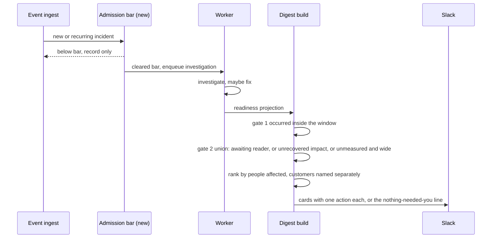

# Digest signal quality: design

Status: draft for review
Date: 2026-08-14
Supersedes parts of: `2026-08-07-daily-digest-design.md` (purpose section stands; section order and card content change)

## Summary in plain words

Opslane sends a daily Slack message about problems in your product. Right now
that message is mostly noise. It asks the reader to review four code fixes for
errors that have not happened in ten days, two of which happened exactly once
ever. It counts 58 things as needing a decision when half of them affect nobody
and half have not been seen in a week. It never mentions the three fixes that
are blocked waiting for the reader's approval.

This document proposes a bar that problems must clear before Opslane spends
money investigating them, a second bar before anything reaches the daily
message, and a rule that removes dead items. It also corrects impact wording
that currently claims more than the data supports.

Terms used below: an **error** is a crash, meaning something threw an exception
in the browser. **Friction** is when nothing crashed but the person struggled
anyway, such as clicking a control that does nothing. An **incident** is either
one, stored in the same table. A **visit** is one recorded browsing session.

## Problem

Four fix PRs are open and awaiting review in AMFJ 2. Their last occurrence
dates are 2026-07-28, 2026-07-28, 2026-07-31 and 2026-08-04. Two of the four
have an occurrence count of 1. One affects zero identifiable customers. Opslane
investigated a `DOMException` that fired a single time, wrote a patch, and asked
the owner to review it.

That is not a digest bug. It is what the pipeline was told to do. In
`packages/ingestion/db/queries.go:707`, a new error group in an in-scope
environment calls `enqueueFirst()` on its first event. No occurrence count, no
affected-user count, no impact check. **Investigation is unconditional.**

There is a bar, but it sits one stage too late and is set very low.
`impactBarEligible` (`packages/worker/src/db.ts:251`) is
`identifiedUsers >= 1 || recentAnonSessions >= 3`, evaluated at
`packages/worker/src/index.ts:731` **after** the investigation has run, to decide
whether to auto-create a fix job. Below the bar the group is parked as
`investigated` and still marked digest-eligible. So we pay for every
investigation regardless, and one identified user is enough to earn a PR.

Two corrections to the evidence above, both material. That bar shipped on
2026-08-12 in C3 (#348), so all four PRs predate it. And it would not stop most
of them today: two of the four have `affected_users_count = 1`, which clears
`identifiedUsers >= 1` on its own. The single-occurrence
`rl: The request took too long` error would still be investigated and still get
a PR under current code.

Friction is gated earlier and harder. `PROMOTION_THRESHOLD_USERS = 5`
(`packages/worker/src/friction/promotion.ts:26`) blocks standalone bucket
promotion below five distinct eligible users. The bar is not absolute:
same-session fold candidates are adjudicated eagerly, anonymous signals can
fold, and a later signal can inherit an already-accepted generation without
crossing the threshold again (`promotion.ts:82`, `promotion.ts:126`). Even so,
friction earns its place and errors do not.

The consequences compound:

| Measurement (AMFJ 2, prod, 2026-08-14) | Value |
| --- | --- |
| Open incidents | 478 |
| Still occurring within 7 days | 296 |
| With any impact measurement at all | 51 |
| Where a customer did not recover | 27 |
| With 5 or more failed visits | 4 |
| With 20 or more failed visits | 1 |

Of the 58 counted as needing a decision, 28 have a priority score of zero
(no affected users) and 28 have not been seen in over 7 days. Their reason
codes: `insufficient_context` 26, `unfixable_infra` 15,
`unfixable_third_party` 7, `unfixable_no_app_frames` 5, `budget_exhausted` 2,
`low_confidence_fix` 1. So 27 of 58 are already labelled unfixable by our own
pipeline, and 26 are cases where Opslane failed to investigate, which is our
backlog rather than the reader's.

Three further defects, each independently sufficient to make the message
untrustworthy:

**Dead items never expire.** The receipt query in
`packages/ingestion/digest/build.go:64` filters on
`dr.updated_at >= $2 AND dr.updated_at < $3`, the readiness row's timestamp. It
never checks whether the incident is still happening. A background job touching
readiness is enough to put a two-week-dead group in today's message.

**A request for approval is disguised as a status update.**
`packages/ingestion/digest/build.go:186` maps status to a receipt sentence and
ends with `default: return "report_ready"`, rendered as "Investigation report
ready." That default swallows `awaiting_approval`. AMFJ 2 has 4 friction
incidents in `awaiting_approval`, 3 of them digest-eligible, where Opslane has
finished investigating and is blocked on the owner saying yes. The digest has
never asked.

**The counter and the cards disagree about time.**
`buildTriageAndHeldBack` (`build.go:289`) has no window at all and counts every
non-resolved group for all time, while the cards are windowed. The reader sees
a lifetime backlog number next to a windowed list.

## Goals

- Raise the ratio of items worth acting on to items shown, measured on real
  AMFJ data.
- Stop spending investigation budget on incidents that have not earned it.
- Say only what the data supports about customer impact.
- Surface the approval requests that are currently invisible.

## Non-goals

- **Merging friction and errors internally.** Their differences are
  principled. Friction needs a user threshold because one dead click is
  meaningless, and friction needs approval because changing a control's
  behaviour is a product decision. Only the reader-facing presentation merges.
- **Task-completion measurement.** Knowing whether a customer finished what
  they came to do requires naming the flows that matter and instrumenting
  them. That is its own project. See the honest caveat.
- **A new notification channel, digest archive table, or per-user
  preferences.** Unchanged from the v1 design's non-goals.
- **Re-ranking the dashboard.** This document changes what is pushed to Slack,
  not the incident feed.

## The frame every decision is tested against

The reader is a founder or product engineer with no time. They want problems
that are high impact, that they can act on, and that are relevant to their
product. If the message does not clear that bar they will use Sentry instead,
which is free and already open. **They do not care whether a problem is
classified as friction or as an error. They want bugs and papercuts gone.**

Two consequences that shape everything below. First, the digest presents one
ranked list with no friction or error sections, and the kind is never a heading.
Second, an empty digest is a valid and desirable outcome, because "nothing
needed you today" is what makes the non-empty days believable.

## User requirements

| # | Requirement | Verified by |
| --- | --- | --- |
| R1 | An error is not investigated until it clears an admission bar | Unit test on the enqueue path; prod replay showing the two single-occurrence PRs are not created |
| R2 | An incident that has stopped occurring never appears in the digest | Digest build test seeding a group with an old `last_seen` and a fresh readiness row |
| R3 | An incident awaiting the reader's approval renders as an explicit ask, not as a report | Formatter test asserting the `awaiting_approval` receipt state and its action |
| R4 | The digest never states a customer failed; it states what was observed | Formatter test asserting the wording, plus review of every impact string |
| R5 | Counters describe the same window as the cards, or are removed | Digest build test comparing counter scope to card scope |
| R6 | Incident links resolve to a real dashboard URL | Live smoke against a deployed stack with `DASHBOARD_URL` set |
| R7 | Reader-facing copy never names the kind as a section or category | Formatter test over a mixed friction and error payload |
| R8 | A digest with nothing qualifying sends a short "nothing needed you" message | Digest build test with an empty qualifying set |

## System overview



Two gates, in different places, doing different jobs. The admission bar governs
spend and PR quality. The digest gates govern the reader's attention. Neither
can substitute for the other: an item admitted for investigation may still be
uninteresting today, and a costly item that we cannot patch still deserves the
reader's attention.

## Component design

### 1. Admission bar for errors

Errors currently enqueue on first event. Friction already requires five distinct
users. Aligning them is the single change that removes the most waste, because
it operates before any money is spent.

The unit should be affected people rather than occurrence count. A count of 518
from one customer is not 518 problems, and today's largest error group has
exactly that shape: 518 occurrences and `affected_users_count = 0`.

**Reuse the existing population definition rather than inventing one.**
`getGroupImpactBar` (`db.ts:272`) already counts identified users, plus
sessions in the last 7 days whose events are *all* anonymous
(`bool_and(ee.end_user_id IS NULL)`). That second term is anonymous-only
sessions, not all sessions, which matters: counting all sessions would let one
identified user qualify by retrying 20 times. Admission uses the same two
counts with higher constants:

```go
// Same population as impactBarEligible (worker db.ts:251): identified users,
// plus 7-day sessions whose events are all anonymous. Only the constants
// differ. Reusing the definition keeps one notion of "how many people".
const (
    admitIdentifiedUsers  = 5   // matches PROMOTION_THRESHOLD_USERS
    admitAnonOnlySessions = 20  // placeholder; M1 sets this from replay
)
```

**Both enqueue paths must be gated, not just the new-group path.** Gating only
`isNew` at `queries.go:707` is bypassed by the dormant-group branch at
`queries.go:726`, which enqueues unconditionally when a group is still `new`
and has no jobs. A held group is by construction in exactly that state, so the
next event would admit it regardless. The check belongs in one helper called
from both branches.

**The recount must include the event currently being written.** The enqueue
decision runs in the same transaction that inserts the event, links it to the
group, and updates the affected-user rollup (`queries.go:622`, `queries.go:665`),
so the counts already reflect this event by the time admission is evaluated.
That ordering is load-bearing rather than incidental: recounting before the
rollup write leaves a group sitting at exactly 4 users forever, because the
fifth user's own event is the one that would never be counted. The admission
helper is called after the rollup update, and a test pins the boundary case of a
group crossing on the Nth distinct user.

**The count must be scoped to eligible environments.** Error groups are keyed by
project and fingerprint, while action scope is evaluated per event
(`queries.go:679`), and `error_group_affected_users` carries no environment
column. Without an environment-scoped recount, staging traffic can satisfy the
bar and let a single production occurrence through. Admission counts only
events in environments that are in the project's action scope.

**Held groups are visible but inert, and that is a real behaviour change.** A
group below the bar is recorded and grouped, and still appears in the incidents
API, but it has no job, no `digest_readiness` row, and no `issue.created`
notification. Two consequences to accept deliberately. Per-issue Slack alerts stop firing on
first sight of a new error. And when an old group later crosses the bar, receipt
selection keys on the new readiness timestamp while `buildTopNewIssues` still
keys on the original `first_seen` (`build.go:414`), so a late-admitted group can
miss both surfaces. Milestone 2 covers the second by treating admission time,
not `first_seen`, as the novelty clock.

**Requeue is not folded into this check.** The existing requeue path preserves
non-retriable failure states, archived dismissal, and release ordering
(`queries.go:731`), and resets `digest_readiness` to `pending` only after a job
row is actually inserted. Admission gates the *first* investigation. A regressed
group that already completed a lifecycle keeps its existing requeue rules, and
readiness is never reset unless a job was inserted.

**Open decision.** Whether a first occurrence should ever bypass the bar for a
severe crash on a checkout-shaped route. The current impact bar sits at the
opposite extreme, admitting anything with one identified user, so moving
straight to 5 is a large jump for rare-but-severe failures. Doing the exception
properly needs `route_map` tier coverage that is unverified for AMFJ. Recommend
shipping without it and measuring what it misses in M1's replay.

### 2. The two digest gates, stated precisely

**Liveness has exactly one definition in this document: the incident occurred
inside the digest window.** One predicate added to the receipt query in
`build.go`:

```sql
AND g.last_seen >= $2   -- the window start, the same bound the readiness filter uses
```

Nothing else defines liveness. The 7-day and 14-day figures elsewhere are not
alternative definitions: 7 days is the measurement horizon used to describe the
current backlog, and the 14 days in M4 is the separate question of when an
already-open fix PR is withdrawn.

This is the whole fix for the four dead PRs. It is small because the defect is
not subtle: the query filters on when our own bookkeeping row changed and never
on whether the problem is real today.

**The second gate widens the input.** Only 51 of 296 live incidents carry any
impact measurement, so a gate that *required* measured impact would drop 83% of
the input and could render an empty digest on a day when real problems exist.
It is a union of three admitting clauses. An incident reaches the digest when
any of these holds:

1. It is waiting on the reader (`awaiting_approval`, or a fix PR open for
   review).
2. It has measured impact with at least one unrecovered visit.
3. It has no impact measurement at all, and clears the reach bar on identified
   users or anonymous-only sessions.

Clause 3 is what keeps an unmeasured but widespread problem visible, and it is
also why ranking falls back to reach rather than to impact. The only incidents
excluded outright are those with measured impact where every visit recovered,
because the measurement we do have says nobody was stuck. That is the
"all 5 visits recovered" dead-click case from today's digest.

**Empty is a real outcome and has an owner.** When no incident satisfies any
clause, `Build` produces a payload with no cards, and the formatter renders a
single line saying nothing needed the reader today. This is the R8 path, it
lives in `formatSlackDigestV2` alongside the existing quiet-day branch
(`slack_digest.go:121`), and M2 owns it.

### 3. Approval as a first-class receipt state

`receiptState` gains an explicit branch before the default:

```go
case "awaiting_approval":
    return "approval_pending"
```

with the sentence "Ready to fix this. Needs your OK." and an approve action on
the card. The `default` branch stays for genuinely unknown states, but it now
logs, so the next state that falls through is visible rather than silently
rendered as a report.

This is the highest-value single change in the document. Three fixes are
already waiting; the work is done and unclaimed.

### 4. Impact wording

`impact_visits_recovered` counts sessions whose recording contains an event at
least 60 seconds after the last hit (`priority/sweeper.go:251`,
`impactRecoveryMs = 60_000`). It does not observe intent and never checks
whether the person achieved anything.

On the one case we could audit, that proxy is wrong often. For the stale-deploy
group: 262 sessions, 158 recovered, 104 scored as failed. Only 14 of those 104
belong to an identifiable customer, and 6 of those 14 had the same customer
start a new session within 10 minutes. On the followable sample, roughly 43% of
"failures" are people who reloaded and carried on. That is the expected shape,
since a failed bundle load prompts a reload and a reload starts a new session.

One further distortion: the rollup inner-joins sessions to scrubbed chunks
(`sweeper.go:238`), so a session with no usable recording leaves both the
numerator and the denominator. The ratio is therefore over recorded sessions
only, and never over everyone who hit the problem.

So the digest describes the observation, not the inference:

> 41 customers hit a stale bundle across 262 visits. In 104 the session stopped
> within a minute.

and never "104 customers failed". Session stitching (Milestone 3) upgrades the
claim once the same-customer-returned check is materialised.

### 5. Ranking and presentation

One list. Rank by customers affected, with anonymous sessions counted
separately and never merged into a customer number. Name the customers we can
identify: for AMFJ every identified user carries an `account_name` that is a
Jira site (484 users, 483 distinct, all `*.atlassian.net`), so naming is real
rather than aspirational.

Each card carries exactly one primary action, derived from state rather than
from kind: review a fix PR, approve a fix, make a decision, or read what we
found. The reason codes decide the ask, never admission. `unfixable_no_app_frames`
means our pipeline cannot write a patch. It does not mean the reader does not
need to know: that class covers stale deploy, which is 104 of the 157 failed
visits we can measure across the whole product.

**Open decision.** Whether an unfixable-but-costly item appears daily, or only
when it crosses a threshold. Recommend threshold-triggered, because a card that
appears every day with no action becomes wallpaper.

### 6. The merged counter stops being rendered

An earlier draft deleted `buildTriageAndHeldBack`. That is wrong.
`DigestTriageCounts` and `HeldBackCount` are fields on the notification payload
contract (`notify/event.go:72`), the formatter reads them for the header and
footer (`slack_digest.go:117`), and digest tests assert them
(`build_test.go:643`). Deleting the builder leaves a nil pointer that renders as
a confident zero, and drops artifact-belt failure reporting with it.

What changes is the rendered line, not the data. The merged sentence
"N fix PRs awaiting review, M issues need a decision" is removed, because its
two halves describe opposite requests: `needs_human` means Opslane gave up and
is handing work over, `awaiting_approval` means Opslane wants to take work away.
Adding them yields a figure that cannot guide anything. The counts stay in the
payload for the dashboard and for held-back reporting, and anything that needs
the reader becomes a card.

`buildTriageAndHeldBack` also gains the window it never had (`build.go:289`), so
the retained counts describe the same period as the cards.

## Milestones

**M1, admission bar.** Errors gated on identified users or anonymous-only sessions before
enqueue. Exit criterion: replaying the last 30 days of AMFJ events creates no
investigation job for either single-occurrence group, and still creates one for
the 518-occurrence group and for stale deploy. `admitDistinctSessions` fixed
from that replay.

**M2, digest gates and copy.** Liveness predicate, the three-clause admission
union, approval receipt state, the merged counter's removal from the rendered
output, impact wording, one unsectioned list, and the empty-digest line. Exit criterion, against a digest rendered from a restored prod snapshot: no
incident whose `last_seen` precedes the window start, the three pending
approvals named as approvals, and no string asserting that a customer failed. A
separate run seeded with nothing qualifying must render the nothing-needed-you
line rather than a header with no body.

**M3, session stitching.** A failed visit is re-scored as recovered when the
same identified customer starts a session within 10 minutes. Exit criterion: the
stale-deploy group's failed count drops by roughly the audited proportion, and
the digest sentence upgrades from "the session stopped" to "did not come back".

**M4, expiry of dead work.** A fix PR whose incident has not occurred in 14
days is withdrawn or marked stale rather than presented as work. Gated on M1
landing, since M1 stops the supply.

## Testing and validation

Runs in CI: the admission bar, the liveness predicate, the receipt state
mapping, counter removal, and every copy assertion. All are pure functions or
single-query behaviours with existing test harnesses in
`packages/ingestion/digest` and `packages/worker/src/__tests__`.

Needs a live run: R6, because `BuildIncidentURL` (`notify/url.go:11`) returns an
empty string for an unset base and `slackDigestLink` then silently degrades to
plain text. That failure is invisible to unit tests and is currently live in
production, where `DASHBOARD_URL` is absent from the ECS task definition. Also
needs a live run: the M1 replay, which requires prod-shaped data.

Not provable in CI: whether the resulting digest is worth a founder's time. The
proxy is that a reader can name the action for every card without opening the
dashboard.

### Contract and test impact

The frozen `POST /api/v1/events` contract is not affected. Admission is an
internal gate: a held event still returns 202 with stable event and group IDs
(`error_event.go:297`), and `wire_compat_test.go` does not assert job creation.
The contract would only break if we made identity or session ID required, or
rejected below-bar events, and we do neither.

Tests that will need updating, because they assert a job is created on first
event: `db/error_group_ingestion_test.go`, `db/notifications_publish_test.go`,
the action-scope and requeue suites, and the single-event pipeline e2e. These
are the correct tests to change, since the behaviour they pin is the behaviour
this document removes. `digest/build_test.go` needs the retained-but-windowed
triage counts rather than deleted ones.

## Risks

**The bar hides a real outage on an uninstrumented page.** A severe break on a
route where `identify()` never runs produces few identified users. The session
fallback is the mitigation, and its value is set from replay rather than guessed.
Worst case is a delayed investigation, not a lost one: the group stays `new`
with no job, so the gated dormant-group branch at `queries.go:726` admits it on
the first event after it crosses either bar. This is the first-investigation
path, not the requeue path, which handles only groups that already completed a
lifecycle.

**Ranking by customers rewards good instrumentation rather than real severity.**
Mitigated by counting anonymous sessions in the ranking while never calling them
customers in the copy. A line reading "1 customer and 379 anonymous visits" is
itself a useful signal that instrumentation has a gap.

**Session stitching over-corrects.** A customer who returns may be retrying and
failing again. M3 makes the claim weaker rather than stronger, and the wording
stays observational.

**Per-issue alerts go quiet for held groups.** Admission stops
`issue.created` from firing on a new error's first sight, which is a
user-visible change to the Slack stream, not only to the digest. That is
intended under the frame, since a first-sight alert for a one-off error is the
same noise in a different envelope. It is called out because a reader who
watches the alert channel will notice the change before they notice the
improvement.

**The digest goes quiet when it should not.** Three gates compose here: the
admission bar, the liveness predicate, and the second-gate union. Each is
individually defensible and together they could produce silence on a day with
real problems. The union's clause 3 is the specific guard, since it admits
unmeasured incidents on reach alone, and the M2 exit criterion checks the
snapshot renders a non-empty digest for a day we know had real items. If the
digest is empty for a week while the dashboard is not, the gates are wrong.

**A held group looks investigated-but-idle in the dashboard.** It has no job and
no readiness row while sitting in `new`. The incidents API still lists it, so
nothing disappears, but the UI needs a state that reads as "watching, not enough
signal yet" rather than as a stalled investigation.

**Unsolved: measurement coverage.** Only 51 of 296 live incidents have any
impact measurement, because impact requires a session recording to determine
recovery. For 83% of live incidents we cannot say whether anyone was blocked,
and ranking falls back to reach, which is what event-count tools already do. The
differentiator is capped by recording coverage, not by ranking logic. Nothing in
this document fixes that, and it should be the next investigation.

## Alternatives considered

**Filter harder in the digest, leave the pipeline alone.** Rejected. The four
junk PRs already exist by the time the digest runs. Filtering hides the waste
without stopping it, and the reader still sees the pipeline working on trivia
whenever they open the dashboard.

**Gate on occurrence count instead of distinct users.** Rejected. The largest
error group has 518 occurrences and no identifiable customers, and a single
noisy retry loop can manufacture any occurrence count. Users and anonymous-only
sessions measure spread, which is what "does this matter" actually asks.

**Raise the existing impact bar instead of adding an admission bar.** The
cheapest option by far: `impactBarEligible` already exists, already has the
right population, and moving it from `1 user or 3 anonymous sessions` to
something higher is a two-constant change with no new gating path, no
environment recount, and no held-group state. Rejected as insufficient on its
own, because the bar runs *after* the investigation at `index.ts:731`, so it
controls which investigations become PRs and never controls how many
investigations we pay for. It is a good complement, not a substitute, and M1
should tune both constants from the same replay.

**Suppress unfixable classes entirely.** Rejected after measurement. Stale
deploy is the single largest source of measurable customer harm in AMFJ, and it
has a real fix that is not a code patch. Conflating "our pipeline cannot write
the patch" with "the reader does not need to know" discards the biggest problem
in the product.

**Keep the friction and error sections and improve each.** Rejected on the
frame. The reader wants bugs and papercuts gone and does not think in our
taxonomy. Two sections force them to learn our internal model before they can
read their own list.

**Raise `friction_autonomy` to `auto_fix` instead of asking.** Not rejected,
deferred to the reader. It removes the approval step entirely and is a smaller
change than adding an approval state. It is out of scope here because it is a
product decision about how much autonomy Opslane gets, not a digest decision.
