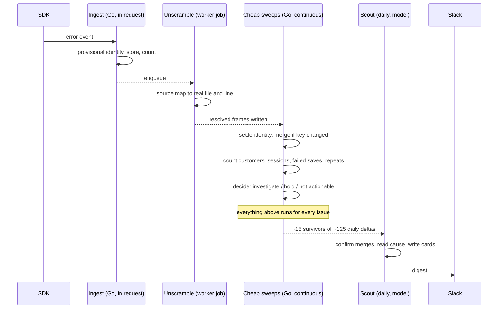

# Pipeline identity and the daily digest

Status: draft for review
Date: 2026-08-15
Supersedes: `2026-08-14-digest-signal-quality-design.md`, which treated the digest
as the problem. The digest is the last 20%.

## Problem

AMFJ 2 receives about **50 error events a day** and creates **50 to 65 new issues
a day**. More issues than errors. Measured 8 to 15 August 2026 in production.

That is not growth. It is the same bugs fragmenting. 483 open issues are roughly
163 real bugs, and the two largest problems in the product have never appeared in
a digest because each is shattered into pieces too small to notice:

| Bug | Customers | Issues it is split across |
| --- | --- | --- |
| Dead clicks on a form field, `/assets` | 74 | 10 |
| `Error deleting Assets` | 9 | 7 |

In one of those delete sessions a customer worked on `/assets` for 80 minutes,
attempted two saves, and completed none. Session `60238832`, customer
`soundcu.atlassian.net`, full recording, classified active with 10 clicks and 10
keystrokes.

### Three causes of fragmentation

**Bundle filename hashes.** A crash's identity includes its top stack lines, which
contain the bundle filename. Vite writes a content hash there, so every deploy
changes it. The seven delete issues share function, line and column and differ
only here:

```
entry-index.CaWHNXv4.js:17:78242
entry-index.DXhxKZv7.js:17:78242
entry-index.CmiI5RcM.js:17:78242
```

The normaliser meant to strip this (`grouping/fingerprint.go:20`) requires a
hyphen before the hash. This bundler writes a dot, so it never fires.

**Compiled CSS class hashes.** A dead click's identity includes the element's path
in the page. Atlaskit compiles styles into hashed class names such as `_11c81d4k`,
which change when its styles rebuild. Three of the four live form-field issues on
`/assets` differ only in these.

**Positional selectors, already fixed.** `friction/fingerprint.ts:27` strips
`:nth-of-type` and its siblings, with a comment naming this exact failure. Correct
fix, incomplete coverage.

### Finished work sits waiting

An issue reaches the digest only if a readiness flag permits it, and the sole
writer of that flag is an investigation completing (`worker/src/db.ts:137`). A
one-shot migration stamped 376 issues `backfill_unverified` and left no path out.

**Of 482 live issues, 10 can reach the digest.** Thirteen more are quarantined and
hold 196 customers between them. Going forward the same hole recurs: 43 issues
created on 14 August have no flag at all.

Separately, `digest/build.go:186` maps issue state to a sentence and ends in a
catch-all returning "Investigation report ready." Dead-click states fall through
it, so three issues where the fix is written and awaiting the owner's approval
render as passive reports.

### Links do not work

`DASHBOARD_URL` is absent from the production task definition. `BuildIncidentURL`
(`notify/url.go:11`) returns an empty string for an unset base, and the formatter
falls back to plain text. Every "Issue page" in every digest sent to date is dead
text. On per-issue alerts the button is omitted entirely.

## Goals

- One bug produces one issue, across deploys and style rebuilds.
- Cheap analysis runs over every issue; expensive analysis runs over a shortlist.
- Every issue carries a recorded decision, including a decision not to act.
- The digest states only what the data supports.

## Non-goals

**Rescuing the 376 parked issues.** New rules apply going forward. Old issues stop
receiving events and go quiet on their own. Reconciling them would mean deciding
which of two investigated issues survives and what happens to an open PR, and that
complexity buys nothing a customer sees.

**Un-merging, parent-child clusters, and two-issues-both-with-PRs.** Rare, and the
existing reopen rules (`queries.go:341`) already handle the common cases.

**Per-customer fairness in the job queue.** Job claiming is global FIFO with no
project in the ordering (`worker/src/db.ts:524`). AMFJ 2 is 960 of 968 issues and
78,421 of 78,421 analysed sessions, so one customer is effectively all the load
and this has never been exercised.

**Rewriting grouping.** Two mechanical fixes cover every observed cause.

**Task-completion measurement.** Knowing whether a customer achieved what they
came for needs the customer to name their flows. Its own project.

## User requirements

| # | Requirement | Verified by |
| --- | --- | --- |
| R1 | A bug keeps one identity across a deploy | Replay two events from different builds with identical resolved frames; assert one group |
| R2 | A bug keeps one identity across a style rebuild | Unit test on selector canonicalisation with two Atlaskit class hashes |
| R3 | Stack unscrambling runs whether or not we investigate | Integration test: an issue below the investigation bar still gets resolved frames |
| R4 | Every issue carries a recorded decision, including "held" | Query after a sweep: zero live issues with no readiness row |
| R5 | An issue that stopped occurring never reaches the digest | Digest build test: old `last_seen`, fresh readiness row, absent from output |
| R6 | An issue awaiting approval renders as an ask | Formatter test asserting the state and its action |
| R7 | Incident links resolve | Live smoke against a deployed stack with `DASHBOARD_URL` set |
| R8 | Cards name the customers we can identify | Formatter test over a payload carrying account names |
| R9 | A card can state that a save failed | Integration test joining session facts to an issue |
| R10 | Scout accept rate is observable per detector | Metric emitted per adjudication run; dashboard tile |

## System overview



The rule: everything above the Note runs for every issue regardless of size. That
is what makes it safe to be selective below it. Today selectivity means blindness,
because counting and investigating are entangled.

### Three chains

Keyed differently, volumes two orders of magnitude apart, so separate budgets.

**Issues**, about 125 a day to consider, triggered by an error arriving.

**Sessions**, 10,000 to 17,000 a day, triggered by a session closing. A model never
reads one. They are counted and the counts attach to issues.

**Codebase**, triggered by a deploy. Today it is triggered by unmapped routes on
error groups (`priority/sweeper.go:289`), so it only learns about parts of the
product that break, and never refreshes when code changes.

The chains meet twice. Dead clicks become an issue at five distinct users, which
works. Issue counting reads session facts, which does not exist and is one join.
That join is soft: counting uses whatever facts exist and recomputes when more
arrive, so it never blocks on a queue eighty times its size.

## Component design

### 1. Identity settles late

**What.** The event gets a provisional identity in the request so it has a home
and the occurrence count ticks. An unscrambling job then produces real source
frames, and identity is recomputed from those.

**Why.** Source files do not change when you deploy; bundle filenames do. Today we
make a permanent identity decision synchronously, at the moment we know least,
using the least stable representation available. Resolution cannot move into the
request because source maps are capped at 32 MiB and fetching one per event would
sink ingest latency. It can move out of investigation.

```go
// Settled identity uses resolved frames when present. The provisional key stays
// as the fallback: if source maps never arrive, nothing breaks, we just do not
// get the improvement.
func settledKey(platform, errorType, message string, resolved []ResolvedFrame) string {
    if len(resolved) == 0 {
        return "" // keep provisional
    }
    parts := make([]string, 0, len(resolved))
    for _, f := range resolved[:min(len(resolved), hashedFrameCount)] {
        parts = append(parts, fmt.Sprintf("%s:%d", f.OriginalFile, f.OriginalLine))
    }
    return hash(platform, errorType, normalizeMessage(message), parts)
}
```

### 2. Unscrambling moves out of investigation

**What.** A worker job type that resolves an event's stack and writes
`stack_trace_resolved`.

**Why.** It is currently called only from the investigate and fix jobs
(`worker/src/index.ts:538`, `:1185`). That creates a trap for the admission bar in
component 4: hold an investigation back, the stack is never resolved, the bug
keeps fragmenting, each fragment looks smaller, and it never qualifies. Same cost,
same asynchrony, different owner.

### 3. Click identity strips generated class hashes

**What.** One more rule in `canonicalizeSelector`.

**Why.** The function already strips positional pseudo-classes for exactly this
reason. Compiled class hashes are the same category of ingredient: they change for
reasons unrelated to the bug.

```ts
function canonicalizeSelector(selector: string | null): string {
  return (selector ?? '')
    .replace(/#react-select-(\d+)-[\w-]+/g, '#react-select-$1')
    .replace(/:nth-of-type\(\s*[^)]*\)/g, '')
    // Compiled style hashes (Atlaskit `_11c81d4k`) change when styles rebuild,
    // splitting one defect across many findings. Same reason as the above.
    .replace(/\._[a-z0-9]{6,}/g, '')
}
```

**Unverified.** The `_[a-z0-9]{6,}` shape is inferred from four observed selectors
(`_11c81d4k`, `_10m98stt`, `_2rko12b0`, `_ymio1r31`). Before shipping, sample the
distinct selectors in `friction_signals` and confirm the pattern does not also
match a hand-written class.

### 4. Readiness becomes an owned state

**What.** The decide step writes one of three outcomes: investigate, held, or not
actionable.

**Why.** Today readiness is a side effect of investigations completing, and its
absence is silence. Silence is what made 376 issues unreachable with no way back,
and what leaves 43 of yesterday's issues with no flag at all. "Held" is the state
that does not exist and needs to.

### 5. Recompute by rules version

**What.** Every derived value records which rules version produced it and when.
Sweeps select rows where the version moved or the input is newer than the output.

**Why.** It makes identity changeable rather than permanent, which is what makes
"fix mechanical causes at source" safe. Change a rule, bump the version, affected
events regroup on the next pass. No migration, no backfill script.

**This pattern already exists twice**: `session_analysis.rule_version` and
`ROUTE_MAP_PROMPT_VERSION`. Nothing acts on either when it changes.

### 6. The scout authors the digest

**What.** One daily pass over the delta. The cheap layer narrows about 125 issues
to roughly 15 by dropping dead ones, dropping zero-reach ones, and proposing
duplicates. The scout confirms merges, reads causes, and writes cards.

**Why author rather than template.** A template renders the rows it is given. It
cannot notice that eleven of today's new issues are the same dead click that
already has ten fragments. Merging needs judgment and must happen before anything
is written, so the merger and the writer are one pass.

**The number that keeps it honest is accept rate**, and your own data already
shows where the line sits:

| Detector | Judged | Accepted | Rate |
| --- | --- | --- | --- |
| Dead click | 1,078 | 303 | 28% |
| Rage click | 197 | 40 | 20% |
| Form abandon | 984 | **2** | **0.2%** |

Form abandon is a broken filter, not a bad prompt. Switch its adjudication off
until the detector is fixed. Sustained below roughly 20% means fix the filter;
near 100% means the cheap layer already decided and the model is ceremony.

## Milestones

**M1, links and states.** Set `DASHBOARD_URL`. Add an explicit approval state
before the catch-all in `receiptState`. Add a liveness predicate to the receipt
query.

*Exit:* a digest rendered from a restored prod snapshot contains no issue whose
`last_seen` precedes the window start, names the three pending approvals as
approvals, and every link resolves against a deployed stack.

**M2, identity.** Unscrambling as its own job. Settled identity from resolved
frames. Class hashes stripped from click identity. Rules versions acted on.

*Exit:* replaying 30 days of AMFJ events produces one issue for the delete bug
rather than seven, and one for the `/assets` form field rather than three. New
issues per day drops below 20.

**M3, decisions and facts.** Readiness as an owned state with a held outcome. A
bar before investigating. Session facts joined to issues.

*Exit:* zero live issues with no readiness row. Replaying 30 days creates no
investigation job for either single-occurrence error. A card can state a failed
save count drawn from `session_analysis`.

**M4, the scout.** Daily pass authors the digest. Accept rate emitted per
detector.

*Exit:* a digest generated end to end from a prod snapshot, three to five cards,
every card naming customers, and the accept-rate metric visible.

Gate M2 on M1 shipping, since M1 is config and copy and needs no coordination.
Gate M3 on M2, because a bar over fragmented issues holds back the wrong things.

## Testing and validation

**In CI.** Identity rules are pure functions and get table tests: two builds with
identical resolved frames, two Atlaskit hashes, a hand-written class that must
survive. The liveness predicate, the receipt state mapping, the readiness
outcomes, and every copy assertion are single-query or pure and use the existing
harnesses in `packages/ingestion/digest` and `packages/worker/src/__tests__`.

**Needs a live run.** R7, because `BuildIncidentURL` returns empty for an unset
base and the formatter degrades silently to plain text, which no unit test sees
and which is live in production today. Also the M2 and M3 replays, which need
prod-shaped data.

**Not provable in CI.** Whether the digest is worth a founder's time. The proxy is
that a reader can name the action for every card without opening the dashboard.

## Risks and mitigations

**The class-hash rule matches a real class name.** Blast radius is two distinct
bugs merging into one, which is the failure mode that hides a bug rather than
merely adding noise. Mitigated by sampling distinct selectors before shipping and
by keeping the rule anchored to a leading underscore.

**Source maps arrive after the event.** The plugin uploads at build time so maps
normally precede errors, but a fast error after a deploy can beat its own map. The
resolution job retries, and identity tolerates settling minutes late because
nothing has looked at the issue yet.

**The bar starves an uninstrumented page.** Only 4.9% of sessions carry an
identity, so a break where `identify()` never runs looks customer-free. Mitigated
by counting anonymous-only sessions alongside identified customers, and by the
fact that a held issue is admitted on the first event after it crosses either
threshold.

**The digest goes quiet when it should not.** Three gates compose. Mitigated by
the M4 exit criterion checking a known-busy day renders a non-empty digest.

**Unsolved: we cannot tell a wrong merge from a successful fix.** Merging is the
only operation here that hides a real bug inside another. If three of four merged
fragments stop after a fix and one does not, occurrences drop and it reads as
success. The cheapest guard is checking whether a bug actually stops after its fix
deploys. It is a follow-up, not a launch item, and until it exists the scout
should refuse marginal merges.

## Alternatives considered

**Patch the asset-hash regex to accept a dot.** One line, fixes AMFJ immediately.
Rejected as the primary fix because it treats a symptom: the next bundler
convention breaks it again, and it does nothing for the CDN-host and
browser-stack-format variants visible in the same six rows. Kept as a cheap
addition, not a substitute.

**Let everything fragment and have the scout merge at digest time.** Rejected. The
issue list stays at 483 and only the message looks clean, so the dashboard, the
counts, and every threshold stay wrong. Merging is also the operation most likely
to hide a bug, so doing it thousands of times a week rather than for the residue
is the wrong risk profile.

**Move raw error events to object storage with derived columns in Postgres.**
Rejected on measurement. `error_events` is 18 MB across 7,734 rows, against 249 MB
for session chunk metadata. Almost every diagnosis behind this document came from
querying raw stack traces and JSON context directly, and that stops if they become
blobs. Revisit past roughly a hundred million events.

**Adopt the friction bar of five distinct users for errors unchanged.** Rejected
as written. Errors already have a bar: `impactBarEligible` at
`worker/src/db.ts:251` requires one identified user or three recent anonymous
sessions. But it runs after the investigation (`index.ts:731`). So it governs
which investigations become PRs, and never what we pay to investigate. Move that
bar earlier rather than adding a second one.

**A workflow engine.** Rejected. The dependencies are a straight line, not a
graph, and a line is expressible as "is my input newer than my output". Adding a
queue also needs an architectural decision under the project's own guardrails, and
nothing here requires one.

## The honest caveat

**We cannot say whether a customer got their work done.** The number we have is
whether a recording continued for 60 seconds after the problem
(`priority/sweeper.go:253`, `impactRecoveryMs = 60_000` at `:34`). On the one case we could audit, the stale-deploy
group, 104 sessions scored as failed, only 14 belonged to an identifiable
customer, and 6 of those 14 started a new session within ten minutes. Roughly 43%
of the failures we could follow were people who reloaded and carried on.

So impact language stays observational, and the recovery number stays out of the
digest until either session stitching lands or the customer names the flows that
matter. Everything here ranks on reach and on whether a save failed, both of which
survive scrutiny.
