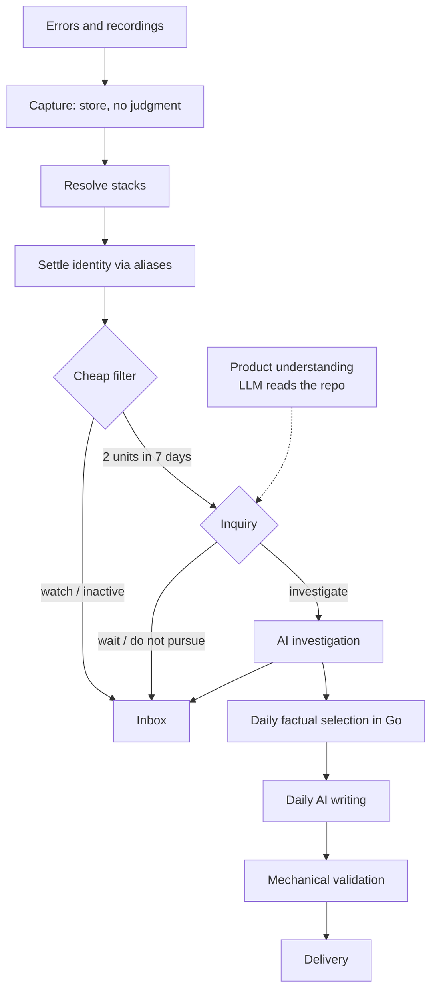

# Pipeline quality: the decision record

Status: draft for review
Date: 2026-08-16

Detail lives in two companions and is not repeated here:
`2026-08-15-pipeline-architecture-design.md` (how it works) and
`2026-08-16-pipeline-implementation-plan.md` (how it gets built).

This document exists so a reviewer can disagree before code is written. It carries
the decisions, what proves each requirement, what was rejected, and what is still
open.

## Problem

On 2026-08-15 the daily message contained four cards. All four described dead clicks
on select controls on Assets pages, covering 30 visits of which 27 continued
successfully. Every card said `report_ready`. None told the reader what to do. The
same payload reported 85 held-back items and no top new issue.

Behind that message, production holds 234 completed investigation jobs and 31
completed fix jobs. Of 58 structured diagnosis decisions, 39 need more context and 13
identify a code fix. The system investigates early, on evidence split across unstable
identities, and then cannot say anything useful.

Three cases show the shape of it:

- **Asset deletion is fragmented.** Seven live rows titled `Error deleting Assets`
  hold 28 occurrences across nine identified users. Five fragments independently
  produced a `code_fix` diagnosis. One customer problem paid for several
  investigations and produced no single outcome.
- **Dead clicks need judgment no count can supply.** Whether those four cards are one
  component defect, harmless recovered clicks, or several problems cannot be decided
  from selectors and counts.
- **Stale release assets have real reach.** One issue holds 577 occurrences across 42
  identified users and deserves review even though the fix is operational rather than
  a patch.

## Goals

- One real problem is one issue, across deploys and fragments.
- Nothing reaches the customer without a nameable action or an explicit request.
- Every issue has a recorded decision, including the decision not to advance.
- Every number in the message traces to stored observations under a written
  definition.

## Non-goals

**Critical-action overrides in v1.** One occurrence on an apparently important route
does not bypass the filter. Product understanding needs measured accuracy first.

**Perfect dead-click identity.** Generated class names and privacy-safe selectors
make click identity weaker than resolved error identity. Inquiries judge related
findings instead. Capturing a control's accessible name would help and changes the
SDK privacy trade, so it belongs in its own design.

**Pricing policy.** The model tier adds cost. V1 records tokens and cost by job,
model, and prompt version. What that means for a free tier follows measurement.

**Shadow identity, dual writes, and per-project flags.** With one production customer,
a coordinated cutover is simpler than reconciling two definitions of an issue.

## The one structural decision

Everything else follows from splitting the admission decision in two.

A **cheap mechanical filter** answers a factual question: has this happened recently,
in scope, to enough distinct people to deserve a look? It runs over everything, costs
nothing, and is auditable. It explicitly does not decide whether something is a real
defect.

An **inquiry** then answers what counts cannot: is this a genuine product problem,
was the user blocked, is this third-party noise, is there enough evidence to spend a
full investigation. It gets read-only repository access, so it can look at the shared
select component rather than guessing from a selector string.

Only work surviving both gets a full investigation. A separate daily pass writes the
customer's message from completed work.

The division of labour is the point: mechanical code owns facts, identity, counters,
validation, deduplication and delivery. The model owns interpretation, judgment,
investigation and writing. Neither crosses.

## Requirements and their proofs

Each criterion names the slice that delivers it and the evidence that settles it.
Slice numbers refer to the implementation plan.

| # | Requirement | Verified by | Slice |
| --- | --- | --- | --- |
| A1 | Every card has an action the reader can name | A week of digests generated from production snapshots; the founder names the action for every card. Any "so what?" fails | 10 |
| A2 | One unresolved problem appears once, not once per deploy or fragment | Shared golden fixture, two-build integration test, 30-day production replay | 3, 4, 10 |
| A3 | A problem card occurred inside the seven-day liveness window | Frozen candidate-query tests; a new approval or fix may appear without claiming the problem is current | 0, 10 |
| A4 | Cards name affected accounts when the SDK supplied them | Card rendering test against `end_users.account_name` | 10 |
| A5 | Cards use product language, not stack traces or internal states | Validator rejects internal vocabulary; human evaluation of a week of output | 10 |
| A6 | Every link and requested action works | Live link smoke against a deployed stack | 0, 11 |
| A7 | The inbox shows what Opslane is watching and why it did not advance | Inbox and decision-query tests; every candidate has a stored decision | 7A, 8 |
| A8 | Every number comes from stored observations under a written definition | Frozen-run validator rejects unsupported counts, IDs, and links | 10 |
| A9 | A problem fixed and later seen again is presented as returned, not new | Resolution and recurrence integration test, **plus** the production evaluation reading the card's words | 10 |

Two notes on this table.

**A4 is now satisfiable and was not always.** The baseline shows 490 identified end
users across 489 named accounts, so the SDK is supplying account names. An earlier
draft treated this as blocked on an SDK integration ticket. It is not.

**A9 needs the production evaluation, not only the integration test.** The mechanical
test proves a new work round opens. A9 is a claim about what the card says, which
only a human reading the output settles. That addition is the one change this record
makes to the companion's verification.

## System overview

The inbox reads live state throughout and is not a delivery channel. That is what
lets the daily message be selective without hiding anything.

## The decisions worth arguing about

**Identity is a binding, not a rewrite.** A separate alias table maps fingerprints to
a stable issue, and `canonical_issue_fingerprints` is the sole lookup. Normal
settlement only attaches new observations. This dissolves two failure modes rather
than mitigating them. Rewriting `error_groups.fingerprint` in place would collide
with its unique constraint exactly when two issues should merge. And because
`error_events.error_group_id` has no foreign key, the events orphaned by the obvious
recovery would go quiet rather than error, which reads as a successful fix. A confirmed merge remains a separate audited operation that does rebuild counts.

**Nothing reads `sample_event_id`.** Ingest rewrites it on every event, so any
decision keyed on it changes with arrival order. Identity would oscillate instead of
settling, and each oscillation would look like ordinary activity.

**Go alone computes the fingerprint.** TypeScript resolves frames and writes a
versioned envelope; Go normalizes, serializes and hashes it. A shared golden fixture
asserted in both runtimes is what stops a path separator or anonymous-function marker
from silently re-keying every issue in the system. That failure would present as mass
fragmentation, not as a bug.

**Reach is affected units, not occurrences.** One identified user, or one anonymous
session where no identity exists. A retry loop generates unlimited events and no
additional reach. Route weight may order work; it cannot turn one unit into two.

**Uncertainty favours investigation.** A inquiry that is unsure investigates. A silent
false negative costs more than a wasted investigation, because the customer never
learns what was dropped.

**Recordings stay in object storage.** Decoded recordings in the audited sample ran
1.1 MB to 28 MB while the useful facts fit in a small record. Postgres gets compact
failed-request rows and success rollups; the recording stays where it is and the
facts expire with it by cascade.

## Milestones

Twelve slices, two deploys. Slice 0 ships alone because it is configuration and copy
and repairs three criteria immediately. Slices 1 through 10 accumulate in one release
candidate, each leaving the repository buildable but none deployable on its own,
because Slice 2 stops the request creating issues and nothing creates them again until
7A. Slice 11 deploys the batch in one window.

| Slice | Delivers | Exit |
| --- | --- | --- |
| 0 | Digest liveness, links, wording, one safe grouping rule | A generated digest where every link resolves and no card is stale |
| 1 | Inert schema and shared contracts | Golden fixture asserted in both runtimes; no runtime path uses the tables |
| 2 | Capture without judgment | Request creates no issue, investigation, or notification |
| 3 | Stack resolution before grouping | Cached and uncached output match the fixture; missing maps fall back |
| 4 | Observations attached to stable issues | Concurrent settlement idempotent; no test settles from `sample_event_id` |
| 5 | Compact session facts and evidence lookup | Expired recordings degrade to stated availability, not job failure |
| 6 | LLM-built product understanding | Claims cite code references; human corrections win |
| 7A | The cheap filter | 30-day replay produces a held list a person reads |
| 7B | Retire the old readiness path | No runtime writer or reader of `digest_readiness` remains |
| 8 | inquiries | Only inquiry-approved work is investigated; every qualified issue has a visible decision |
| 9 | Accepted work reaches the investigator | Frozen anchors; one investigation per work round |
| 10 | Daily message authored and delivered | The founder names an action for every card across a week |
| 11 | Production cutover | Live smoke passes before traffic resumes |

## Testing and validation

Mechanical claims get deterministic tests: cross-runtime fixture agreement, idempotent
concurrent capture and settlement, fallback behaviour for missing maps and expired
recordings, one investigation and one receipt per work round, and validator rejection
of unsupported numbers and invented links.

Model behaviour cannot be tested that way, so it gets fixed fixtures and human reading.
The inquiry evaluation runs a named production set: the asset-deletion cluster, the four
dead-click cards, stale release assets, browser-extension noise, one-user errors, and
investigations that previously ended `needs_more_context`. A person reads every
rejection. The digest evaluation is a week of generated messages the founder reads.

The full repository gate runs before the cutover candidate is accepted, with
`DATABASE_URL` and storage configured, stale `dist/` removed, and zero skipped Go
storage tests confirmed.

## Risks

**A wrong merge is indistinguishable from a successful fix.** If three of four merged
fragments stop after a fix and one does not, occurrences fall and it reads as success.
The pre-cutover human read of every many-to-one change is the only guard, and it does
not scale past one customer.

**The rollback window closes when traffic resumes.** Restoring the snapshot works
until the first new canonical record arrives. After that, recovery is forward-only,
so the live smoke inside the window carries all of the rollback risk.

**The outage is bounded but not lossless.** The SDK buffers 100 events and retries
with backoff capped at 30 seconds, extended to about 45 by jitter, with a best-effort
unload flush limited to 60 KiB. Overflow, prolonged failure, or navigation still drop
events.

**Model cost is tracked but not bounded.** See the open questions.

**Nothing improves for the customer between Slice 0 and Slice 11.** The whole benefit
lands at cutover.

## Alternatives considered

**Rewrite the fingerprint in place when identity settles.** Rejected: it collides with
`UNIQUE(project_id, fingerprint)` precisely when two issues should merge, and the
obvious recovery orphans events invisibly.

**Keep resolution inside investigation, where it already runs.** Rejected: it creates
a trap. Hold an investigation back and the stack never resolves, so the bug keeps
fragmenting, each fragment looks smaller, and it never qualifies.

**One admission decision instead of two.** A single mechanical bar is cheap but cannot
tell a component defect from recovered clicks. A single model pass over everything can,
but runs over every issue at model cost. The split runs the cheap test over everything
and the expensive one over three to seven issues a day.

**Let the model decide admission outright.** Rejected: it runs over every issue, so it
must be cheap, and a skipped bug needs an explainable reason. A model may propose
merges and recommend investigation; it may not silently decide what is looked at.

**Deploy every slice.** Rejected: Slices 2 through 7A would each need compatibility
shims that then need removing. The maintenance window is cheaper.

**Shadow mode.** Rejected: it would validate identity against live traffic, which has
real value, at the cost of two live definitions of an issue and a reconciliation
problem at the end.

**A workflow engine for the async chain.** Rejected: the dependencies are a line, not a
graph, and a line is expressible as "is my input newer than my output". Postgres stays
the queue.

**One row per timeline event from recordings.** Rejected on measurement: the useful
facts are small and the recordings are not, so the recordings stay in object storage.

## The honest caveat

This design is built for one production customer and says so throughout. The direct
cutover, the human read of every merge cluster and every inquiry rejection, and the
forward-only recovery after traffic resumes are all choices that stop working at ten
customers. That is a deliberate trade for delivery speed, not an oversight. The second
customer arrives with a migration problem attached, and the inquiry evaluation becomes
the first thing that cannot be done by reading.

## Open questions

1. **Reopening an inquiry has no growth gate.** Waiting work re-runs when evidence changes, and
   counts change on every occurrence, so an issue parked in `wait_for_more_evidence`
   can reopen the inquiry continuously. This codebase already solved the same problem once:
   `friction/promotion.ts:29` sets `RE_ADJUDICATION_GROWTH = 1.5`, enforced at `:192`, with the comment
   "Re-judge only when evidence has grown by half again since the last verdict. Without
   this, a bucket over threshold is re-judged on every session." The inquiry needs the
   equivalent. Tracking cost is not bounding it.
2. **There are two held-back lists and the inbox describes one.** The filter watches 24
   to 31 issues at a single affected unit; the inquiry separately returns
   `do_not_pursue`. "Not enough people yet" and "a model judged this not a real problem"
   are different, and the second is the one a founder needs to audit. Should they render
   distinctly?
3. **What exactly does the live smoke cover?** It is the last gate before the rollback
   window closes, and it currently has no stated contents.
