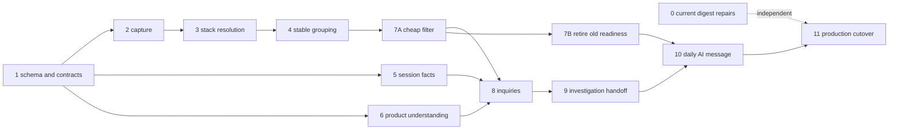

# Pipeline quality: build order and production cutover

Status: accepted build plan; implementation pending

Date: 2026-08-16

Architecture: `2026-08-15-pipeline-architecture-design.md`

## Purpose

The architecture defines how raw observations become customer action. This document
defines how to build it without creating a second, accidental architecture in the
task list.

The order follows the data:

```text
capture -> stack resolution -> stable grouping -> cheap filter -> inquiry
        -> investigation -> daily AI writing -> mechanical delivery
```

Repository understanding and session facts feed the inquiry and investigation after
stable grouping exists.

## Delivery strategy

The work uses two production deploys, not one deploy per slice.

- **Slice 0 deploys alone.** It repairs current digest liveness, links, wording, and
  one safe grouping rule.
- **Slices 1 through 10, including 7A and 7B, accumulate in one release
  candidate.** Each leaves the repository buildable and tested, but the
  intermediate runtimes do not deploy.
- **Slice 11 deploys the accumulated rewrite** during one maintenance window.

This plan deliberately avoids shadow identity, dual writes, compatibility modes,
and per-project activation flags. One live customer makes a coordinated cutover
simpler than reconciling two definitions of an issue.

## Rules for every slice

Each slice must:

1. implement one architecture section;
2. keep one writer for each new state transition;
3. add deterministic tests for mechanical behavior;
4. add fixed-fixture and schema tests for AI behavior;
5. preserve the public event contract;
6. leave the full repository buildable; and
7. state whether the result can deploy.

No frozen fixture under `test-fixtures/wire/` may change. New grouping fixtures live
outside that directory. Postgres remains the queue.

## Dependency map



## Slice 0: repair the current customer message

This slice improves the current product without depending on the rewrite.

### Changes

- Set `DASHBOARD_URL` in the production task definition.
- Filter digest cards by issue occurrence time, not `digest_readiness.updated_at`.
- Render `awaiting_approval` and draft-PR states as requests.
- Make `reAssetToken` in `packages/ingestion/grouping/fingerprint.go` accept a dot
  before a content hash as well as a hyphen.

The regex change reduced 71 groups to 63 over a 466-event production sample. No
merged group contained more than one observed message. That is useful evidence, not
proof that two distinct bugs can never share a message; the later identity audit
remains required.

### Files

- `packages/ingestion/digest/build.go`
- `packages/ingestion/notify/slack_digest.go`
- `packages/ingestion/grouping/fingerprint.go`
- focused tests beside those packages
- the production ECS task definition in the deploy repository

### Exit

Generate a digest from a known production day. Every problem card occurred inside
the liveness window, every approval reads as a request without claiming the problem
is current, every link works, and the grouping replay matches the measured 71-to-63
result.

### Deployment

Deploy this slice alone.

## Slice 1: add inert storage and shared contracts

This slice creates the storage needed by the full flow. No runtime reads or writes
the new path yet.

### Migration

Add idempotent migration `054_pipeline_quality.sql`, unless another migration claims
054 first. It adds:

- `error_capture_buckets`;
- `error_event_resolutions`;
- `sourcemap_position_cache`;
- `error_event_identities`;
- `canonical_issue_fingerprints`;
- `issue_episodes` for internal rounds of work;
- `issue_decisions` for the cheap filter;
- `issue_inquiry_decisions`;
- `issue_evidence_anchors`;
- `issue_publications`;
- `digest_runs`; and
- `digest_run_items`.

Extend `route_map` with structured actions, code references, observed requests,
commit, confidence, model, prompt version, and update time. Preserve its existing
`source='human'` override rule.

Add the job types needed for stack resolution, inquirying, and daily writing to the
existing `error_group_jobs` queue. Do not add another queue table.

`issue_decisions` records `watch`, `open_inquiry`, or `inactive` plus its factual
reason and counts. `issue_inquiry_decisions` records `investigate`,
`wait_for_more_evidence`, or `do_not_pursue` plus its grounded explanation. Each
inquiry decision also records the distinct affected-unit count, evidence signature,
relevant product-understanding version, and prompt version used for the review.

### Contracts

Add one version-2 resolved-frame fixture outside `test-fixtures/wire/`. TypeScript
must produce the exact structured envelope. Go must produce the exact canonical
string and hash from that envelope.

Document `group_id` and `error_group_id` in `docs/contracts/events.md` as provisional
capture handles. The HTTP shape remains unchanged.

Define and validate the structured AI outputs:

- inquiry: `investigate`, `wait_for_more_evidence`, or `do_not_pursue`;
- investigation: `verified_fix`, `needs_human`, or
  `unable_to_establish_cause`; and
- daily writing: all frozen candidates appear in `included` or `deferred`.

Each record carries its model, prompt version, evidence version, and source IDs.

### Invariants

Database tests pin:

- one capture bucket per project, identity version, and raw fingerprint;
- one active fingerprint binding;
- one open work round per issue;
- one inquiry and one investigation job per work round and version;
- one publication receipt per work round and channel; and
- one daily run per project and local date.

### Exit

Migrations reapply cleanly. Go and TypeScript pass the same golden fixture. No
runtime query references a new table.

### Deployment

Do not deploy independently.

## Slice 2: make ingestion capture without judging

Refactor `InsertErrorEventAndGroup` in `packages/ingestion/db/queries.go` into one
capture transaction.

### Transaction

The transaction writes:

- the immutable error event;
- its provisional capture bucket;
- a pending identity row;
- the session pin;
- the end-user link; and
- one stack-resolution job when needed.

It stops creating stable issues, investigation jobs, readiness rows, and outbound
events in the request.

Suppression remains before capture. Curated family fingerprints remain explicit in
the pending identity input. Python and stackless JavaScript carry a raw fallback.

The handler returns the existing response shape with the provisional handle. A
failed transaction leaves no partial event, bucket, link, or job.

### Tests

- Concurrent identical errors share a bucket and retain distinct events.
- A transaction failure rolls back every write.
- Suppressed events preserve current behavior.
- Python and stackless events carry a usable fallback.
- Frozen wire fixtures remain byte-for-byte unchanged.

### Exit

The endpoint passes its contract and concurrency tests. On this branch, no stable
issue appears until later slices; this state is buildable but not deployable.

## Slice 3: resolve stacks before grouping

Move source-map resolution out of the investigate and fix paths into its own worker
job.

### Worker work

- Resolve one event into the version-2 frame envelope.
- Store generated and original positions plus `original_function`.
- Read and write `sourcemap_position_cache` by artifact content and generated
  position.
- Wake waiting jobs when a matching map uploads.
- Fall back at the next daily boundary when a map never arrives.
- Retry object-store failures and report stuck jobs.

Remove on-demand resolution from the existing investigate and fix handlers in
`packages/worker/src/index.ts`. Those handlers later consume persisted resolutions.

### Go work

Add one pure serializer and hasher for the version-2 envelope. It uses original file
and function, with original line as the anonymous-function fallback.

### Tests

- Cached and uncached resolution produce identical envelopes.
- TypeScript output and Go hashing match the shared fixture.
- A missing debug ID settles immediately on the raw fallback.
- A late source-map upload wakes waiting work.
- Exhausted resolution records its fallback rather than blocking forever.

### Production replay

Replay the population measured since 2026-08-05: 720 JavaScript events with stacks,
509 debug IDs, and a 100% uploaded-map match for those IDs. Report any changed
denominator before cutover.

### Exit

Every captured event reaches a persisted resolution or an explicit raw fallback
without starting an investigation.

## Slice 4: attach observations to stable issues

Add a Go settlement sweep that claims eligible rows with
`FOR UPDATE SKIP LOCKED`.

### Settlement

For each observation:

1. choose the resolved fingerprint when present;
2. look up resolved and raw aliases in `canonical_issue_fingerprints`;
3. attach to one known issue or create one;
4. bind non-conflicting aliases;
5. record conflicts without merging;
6. update issue counts from the event; and
7. mark identity settled.

Lock candidate fingerprint keys in sorted order. `canonical_issue_fingerprints` is
the sole identity lookup. Stop treating `error_groups.fingerprint` as identity.

Add a separate confirmed-merge operation. It redirects aliases, records binding
history, reattaches source observations, and rebuilds counts. Automatic confirmation
is allowed only before investigation or publication.

### Tests

- Concurrent events settle idempotently.
- Conflicting aliases remain separate and visible.
- Retry after partial worker failure produces one attachment.
- Confirmed merge reconstructs absolute counts correctly.
- No settlement or test reads `sample_event_id`.
- Friction enters grouping directly without stack resolution.

### Production replay

Produce a read-only report showing:

- every many-to-one issue change;
- the seven `Error deleting Assets` fragments;
- deployment-hash fragmentation;
- raw and resolved alias conflicts; and
- before-and-after issue and occurrence counts.

### Exit

A logical error across two builds lands on one stable issue, while uncertain
relationships remain split.

## Slice 5: finish compact session facts and evidence lookup

Extend the existing session-analysis path rather than creating a second replay
processor.

### Changes

- Store detailed failed-request rows.
- Store successful-write rollups.
- Preserve exact click-to-request links only when the recording establishes them.
- Replace one session's fact set transactionally after late chunks.
- Cascade fact deletion with recording expiry.
- Build one evidence reader keyed by a work round and fixed anchors.

The evidence reader returns resolved frames, source events, failed requests, success
rollups, product understanding, replay availability, and repository coordinates. It
does not expose a copied general timeline or `sample_event_id`.

### Tests

- Late chunks replace rather than append duplicate facts.
- Expired and missing recordings return explicit availability.
- Direct click links survive; timing-only proximity does not become causation.
- Facts disappear with their recording.
- Evidence remains bounded for 1.1 MB and 28 MB source recordings.

### Production check

Reproduce the seven-day totals: 97 failed writes across 62 sessions and 45 5xx
responses across 36 sessions. Trace the `/assets/:id/edit`, `/onboarding`, and
`/issue-context` examples from facts back to their retained recordings.

### Exit

One call returns all durable evidence available for an issue without decoding every
recording during investigation.

## Slice 6: let an LLM build product understanding

Expand the existing `route_map` job in `packages/worker/src/route-map.ts`.

### Discovery

Mechanical discovery supplies:

- routes registered in the repository;
- likely route and page files;
- normalized routes observed in sessions;
- observed requests; and
- likely client and server handlers.

Run discovery when a repository connects, after a new deploy, and when a session
reveals an unknown route.

### LLM work

The LLM reads the relevant files with existing read-only repository tools and
returns, for each route:

- name and purpose;
- supported user actions;
- audience;
- code references;
- observed request relationships;
- confidence; and
- evidence it could not reconcile.

The worker validates that every cited path exists and every requested route belongs
to the discovery input. It upserts only non-human rows. Missing or conflicting
evidence produces unknown or review-needed, never unimportant.

### Tests

- Structured-output validation rejects extra routes and nonexistent paths.
- Human route rows survive every AI refresh.
- A changed commit reprocesses affected routes only.
- An unknown route never receives a low-importance default.
- A fixture for `/assets/:id/edit` links the page, save action, client PUT, and server
  handler from grounded code.

### Observability

Record model, prompt version, commit, tokens, cost, latency, coverage, unknown count,
and human corrections.

### Exit

The production route report explains known Assets routes from code and observed
requests, and every claim links to its evidence.

## Slice 7A: implement the cheap filter

Add internal work rounds and an append-only decision sweep in Go.

### Rule

For each settled issue:

```text
outside action scope                   -> watch
no occurrence in seven days            -> inactive
two affected users or anonymous sessions -> send to inquiry
otherwise                              -> watch
```

The count uses identified users plus wholly anonymous sessions. It does not use raw
occurrence count, route weight, `impact`, or `priority_score`.

When a current round first clears the bar, one transaction records the decision,
freezes first, threshold-crossing, and recent evidence anchors, and creates one inquiry
job. Later events update counts but do not create duplicate inquiry jobs.

Resolution closes the round. A later occurrence opens a new round and can clear the
filter again. Quiet unresolved work stays in the same round and may reactivate.

### Tests

- The second affected unit crosses the bar in the same transaction that counts it.
- Repeated events from one session remain one affected unit.
- Identified and anonymous counts do not double-count one session.
- Out-of-scope events never cross the bar.
- Watched work advances when evidence grows.
- Quiet work becomes inactive.
- A resolved issue that returns opens a new round.
- Concurrent sweeps create one inquiry job.

### Production replay

Rerun the 30-day result against the final action-scope query. The earlier replay sent
three to seven issues per recent day to inquiries and watched 24 to 31 at one affected
unit. A person reads the complete watch and inquiry lists.

### Exit

Every current issue has a recorded factual decision. Passing the filter creates a
inquiry job, never an investigation job.

## Slice 7B: retire the old readiness path

Move runtime state ownership from `digest_readiness` to the new factual, inquiry,
investigation, and publication records. This is separate from implementing the cheap
filter because the old table has six writers across two runtimes.

### Changes

- Remove the TypeScript readiness helper and its four call sites.
- Remove the direct update in `packages/worker/src/db.ts` that bypasses the helper.
- Remove the Go ingest write, if Slice 2 did not already delete it.
- Update requeue, inbox, and current digest reads to derive state from the new
  records.
- Render low-reach `Watching` work separately from `Waiting for evidence` and
  `Reviewed, not pursuing` work. Show the latest inquiry reason, cited evidence,
  review time, and re-review action for AI rejections.
- Retire readiness migration and backfill scripts from runtime operations.
- Leave `digest_readiness` present but inert until a later cleanup migration.

Do not create a compatibility projection or a second writer. Slices after 7B read
the new source of truth directly.

### Tests

- A repository search finds no runtime write to `digest_readiness`.
- Inbox state derives from the latest factual and inquiry decisions. Low-reach work,
  requests for more evidence, and AI rejections render as distinct states.
- Requeue preserves terminal investigation and publication behavior.
- The current digest test harness runs from the new records until Slice 10 replaces
  its renderer.
- Reapplying old migrations does not restore runtime ownership.

### Exit

No running path reads or writes `digest_readiness`. The table contains legacy data
only.

## Slice 8: add the inquiry stage

Add a `issue_inquiry` worker path beside the existing investigate path.

### Input

The worker loads the stable issue, current round, factual decision, fixed evidence
anchors, current counts, resolved frames, failed requests, product understanding,
recording availability, and relevant repository files.

The input is bounded and versioned. The inquiry may use existing read-only repository
tools; it does not receive write or PR tools.

### Output and transaction

Validate and store one decision:

- `investigate` with an investigation brief;
- `wait_for_more_evidence` with the missing evidence; or
- `do_not_pursue` with a specific reason.

The same transaction creates one investigate job only for `investigate`. It records
possible related issues without merging them.

Use the existing friction rule as the v1 growth policy: re-run
`wait_for_more_evidence` when the distinct affected people or anonymous sessions
reach `ceil(previous_review_count * 1.5)`. Keep the policy in neutral worker code;
the inquiry must not depend on the friction module. A single additional occurrence or
an increased raw occurrence count does not requeue the inquiry.

Materially different evidence may requeue waiting work before the count threshold.
The evidence signature covers failed-request identity, resolved code locations,
route and action, and representative recording patterns. A product-understanding
change affects only work on the changed route or action. A prompt-version change
makes work eligible for an explicit, rate-limited batch instead of requeueing it in
the capture path.

Re-run `do_not_pursue` only after materially different evidence, a relevant
product-understanding change, a controlled prompt-version re-evaluation, or a human
request.

### Tests

- Invalid or silent output fails the job.
- Every decision cites only supplied evidence and issue IDs.
- A retry stores one decision and one investigation job.
- A review at five affected units does not run again at six or seven and becomes
  eligible at eight.
- Raw occurrence growth does not requeue waiting work.
- Materially different evidence can requeue waiting work before 50% growth.
- A product-understanding change requeues only affected routes or actions.
- A prompt-version change requires an explicit batch and never requeues from
  capture.
- Rejected work renders separately from low-reach work and creates no investigation.
- Possible duplicates do not alter identity.

### Evaluation

Run a fixed production set containing:

- the asset-deletion cluster;
- the four Assets dead-click digest cards;
- stale release assets;
- browser-extension noise;
- one-user errors; and
- investigations that previously ended `needs_more_context`.

A person reads every inquiry rejection. Measure acceptance by issue type, reversal,
false-negative findings, tokens, cost, and latency. Uncertainty should favor
investigation.

### Exit

Only inquiry-approved work creates investigations, and every mechanically qualified
issue has a visible AI decision.

## Slice 9: hand accepted work to the existing investigator

Refactor the current investigate and fix paths to consume the inquiry's brief and fixed
evidence rather than a mutable sample event.

### Changes

- Add the current work-round ID to jobs and diagnosis decisions.
- Preserve the inquiry decision and evidence anchors through retries and fix jobs.
- Check out the trigger event's reachable commit; record the actual fallback commit.
- Consume persisted source-map resolution.
- Use the common evidence reader.
- Return `verified_fix`, `needs_human`, or `unable_to_establish_cause`.
- Keep deterministic verification as the authority on proposed patches.

Remove the current post-investigation impact gate. The cheap filter and inquiry now
decide whether investigation runs; fix verification and project autonomy decide
whether a PR can advance.

### Tests

- A rejected inquiry decision cannot start investigation.
- One accepted work round gets one investigation under retries and concurrency.
- The investigator uses the frozen commit and anchors.
- Expired recordings degrade without failing the job.
- Failed verification returns evidence to the agent until budget ends.
- Terminal outcomes contain a specific action or missing-evidence statement.

### Production evaluation

Run one investigation over the unified asset-deletion evidence and compare it with
the fragmented production results. It should read all nine-user evidence once and
produce one coherent outcome.

### Exit

An accepted issue reaches one useful terminal result. The customer never receives
the internal phrase `report_ready`.

## Slice 10: author and deliver the daily message

Replace the current template-first digest path with a frozen factual selection, one
AI writing job, and mechanical validation and delivery.

### Freeze candidates in Go

At the project's daily boundary, create one `digest_runs` row and candidate
`digest_run_items`. Problem-result candidates must be inquiry-approved, useful,
unresolved, newly usable since the last committed run, seen inside the trailing
seven-day liveness window, and unpublished for this work round. A newly created PR,
approval request, or other customer action may qualify without claiming that its
underlying problem is still occurring.

Freezing records the window, cutoff, source versions, issue IDs, counts, named
accounts, investigation outcomes, and valid actions. Do not advance the window yet.

### Write in TypeScript

The worker claims the daily-writing job and asks the model to account for every
candidate as included or deferred. Included cards contain one action and cite their
source issue IDs. Deferred items contain a reason.

The writer may combine related findings in prose, but it cannot merge issue records.
It may translate technical evidence into product language, but it cannot change
counts, account names, links, PR state, or factual eligibility.

### Validate and publish in Go

Check every ID, count, account, URL, action, freshness predicate, and disposition
against the frozen run. Reject unsupported output.

One transaction then stores the final items and deferred reasons, marks the run
complete, writes work-round publication receipts, creates the outbox event, and
creates deliveries. Only that commit advances the digest window.

An empty candidate set or a model-authored empty message sends the configured
"nothing needs your attention" text without inventing cards.

### Tests

- An unresolved issue appears in at most one digest.
- A returned issue may appear again and carries the returned label.
- Stale issues cannot enter a run, even when old bookkeeping changes.
- The writer must account for every candidate.
- Unknown IDs, wrong counts, invented URLs, and duplicate actions fail validation.
- A model or delivery retry does not advance the window or duplicate receipts.
- Concurrent sweepers produce one run.
- Named accounts and links survive end to end.

### Production evaluation

Generate a week of messages from production snapshots. For the 2026-08-15 input,
the result must not present four vague Assets dead-click cards unless evidence proves
four distinct actionable problems. The founder must name the action for every card.

The evaluation also includes a resolved issue followed by a later occurrence. Its
customer-facing card must say that the problem returned and must not describe it as
new. Use a production case when one exists in the snapshot; otherwise preserve a
production-shaped recurrence fixture for this check.

### Exit

The daily message satisfies every acceptance criterion in the architecture document,
including the valid empty-message case.

## Slice 11: cut over production

Slices 1 through 10 ship together.

### Read-only report

Before the window, run the final code against 30 days of production data and report:

- all proposed identity merges and conflicts;
- before-and-after issue counts;
- the cheap filter's watch, inactive, and inquiry lists;
- inquiry decisions and reasons;
- expected investigations;
- expected daily candidates;
- capture-bucket count and oldest row; and
- projected model calls, tokens, and cost.

A person reads every many-to-one identity change and every inquiry rejection. Confirm
the asset-deletion, dead-click, and stale-release examples explicitly.

### Backfill

The backfill:

- adopts existing visible `error_groups` rows as stable issues;
- leaves uncertain clusters split;
- binds confirmed raw aliases;
- links recent source observations;
- opens one work round for each unresolved issue seen in seven days;
- marks quiet unresolved issues inactive;
- recomputes the cheap filter from source observations;
- seeds publication receipts from prior outbound events so old issues do not
  announce themselves again; and
- leaves `digest_readiness` inert.

Do not rewrite old fingerprints or manufacture historical inquiry decisions.

### Maintenance window

1. Let active jobs finish.
2. Stop ingestion and worker tasks.
3. Snapshot Postgres.
4. Apply the migration and backfill.
5. Deploy ingestion and worker images.
6. Run the live smoke against the seeded smoke project.
7. Resume traffic.

### Required live smoke

The smoke must:

1. send two logically matching events from distinct sessions;
2. observe both capture receipts;
3. confirm source resolution or the explicit fallback;
4. confirm both events settle on one issue;
5. confirm the second affected unit sends the issue to an inquiry;
6. confirm the inquiry records a decision;
7. confirm accepted work reaches a terminal investigation result;
8. create a daily run;
9. validate and render its message; and
10. confirm one outbox event and one delivery reach terminal state.

Use the repository's required disposable ports and storage credentials. Treat a
green test run with skipped database or storage tests as failure.

### Rollback

Before traffic resumes, restore the snapshot and old images. After new stable-issue
data arrives, recovery is a forward fix; old binaries cannot safely interpret the
new sources of truth.

The SDK buffers up to 100 events in memory and retries with exponential backoff. The
base delay caps at 30 seconds, jitter can extend it to 45 seconds, and best-effort
unload delivery is limited to 60 KiB. The window should therefore be short, but the
plan does not claim it is lossless.

## Verification matrix

| Acceptance | Architecture claim | Proof |
| --- | --- | --- |
| A2 | One logical error survives a deploy as one issue | Shared fixture, two-build integration test, production replay |
| A2 | Go and TypeScript cannot drift on identity | Golden envelope, canonical string, and hash in both runtimes |
| A2, A8 | Capture stays atomic under concurrency | Database race and rollback tests |
| A2 | Missing source maps cannot block forever | Fallback and watchdog tests |
| A7 | Low-volume issues remain visible | Inbox and decision-query tests |
| A1, A7 | Only AI-approved work is investigated | Inquiry-to-investigation transaction tests |
| A7 | AI cannot silently reject work | Decision completeness constraint, separate rejected-work view, and evaluation report |
| A1, A5, A6 | Product understanding stays grounded | Existing-path validation and human-override tests |
| A8 | Investigation uses stable evidence | Frozen-anchor and commit tests |
| A3 | One unresolved issue publishes once | Receipt, retry, and concurrent-sweeper tests |
| A9 | A returned issue publishes again and reads as returned, not new | Resolution and recurrence integration test, renderer assertion, and production evaluation |
| A4, A8 | Digest facts are true | Frozen-run validator tests |
| A1, A4, A5, A6 | The customer receives actionable cards | One-week production evaluation and live link smoke |

During implementation, run the smallest package checks for each slice. Before the
cutover candidate is accepted, run the full repository gate with `DATABASE_URL` and
storage configured, remove stale `dist/` output when workspace dependencies change,
and confirm zero skipped Go storage tests.

## Main risks and controls

**Cross-language fingerprint drift.** A tiny serialization difference fragments
every issue. The shared golden fixture lands before runtime use.

**A false merge hides a bug.** Exact aliases bind automatically; conflicts remain
split. A person reads every cutover merge, and later merges use the audited operation.

**The cheap filter sends the wrong population to AI.** The production replay exposes
every watched and advanced issue. The rule stays factual and reversible.

**A inquiry rejects a real problem.** Every rejection has evidence and a reason, stays
visible, and can run again. The pre-cutover evaluation reads every rejection;
uncertainty favors investigation.

**Product understanding hallucinates purpose.** The worker accepts only discovered
routes and existing code references. Claims carry provenance and confidence; human
corrections win; unknown stays unknown.

**Model failure stalls work.** Durable jobs retry. Exhausted work remains visible
with an explicit failure. Digest windows advance only after a committed message.

**The `digest_readiness` migration has many writers.** The code search and tests must
remove all six runtime paths before cutover. The old table remains inert until later
cleanup.

**Model cost surprises the product.** Every AI job records tokens and cost. Pricing
policy follows measured usage; it does not weaken correctness or add a second path.

**The rollback window closes after traffic resumes.** The end-to-end smoke runs
inside the window. After resume, fixes move forward.

## Explicit follow-ups, not v1 blockers

**Better dead-click identity.** Capturing accessible control names may improve
grouping but changes the SDK's privacy contract. V1 keeps current capture and uses
inquiry judgment without silently merging issues.

**Pricing and free-tier policy.** V1 measures actual model use for product
understanding, inquiries, investigations, and daily writing. Packaging and limits follow
that evidence.

**Critical-action overrides.** V1 does not bypass the two-unit rule from inferred
route importance.

**Persisted full timelines and tracing.** Both may later contribute evidence through
the same reader. Neither blocks the first version.
